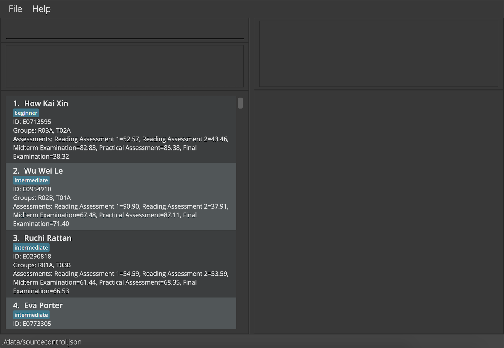

Welcome to **Source Control** User Guide!

Source Control is a **desktop app for CS1101S professors to manage the performance of their students**.

This application allows you to **store comprehensive data** of each student quickly, and allows you to search through them easily.
With Source Control, you will never have to worry about your large student cohort and tracking numerous assessments!

Source Control can also give you both a quick overview and a closer look of how your students are performing.
This application **provides in-depth data analysis** of the performance of your students in each assessment,
giving you timely feedback on the pace and difficulty level of the module.

Source Control is **optimised for use via a Command Line Interface** (CLI) while still having the benefits of a Graphical User Interface (GUI).
If you can type fast, Source Control can help you track your students' performance faster than traditional GUI apps!

This guide takes you through all the _latest features_ of Source Control. If you are a new user, this guide provides you
all the basic knowledge to [get started](#quick-start) with Source Control. If you are an experienced user,
feel free to skip to the [command summary](#command-summary) and experiment with our more [advanced features](#setting-customised-aliases-for-commands--alias)!

 

--------------------------------------------------------------------------------------------------------------------

## **Table of Contents**

* [**Overview**](#)
* [**Table of Contents**](#table-of-contents)
* [**Quick Start**](#quick-start)
* [**Features**](#features)
  * [Notes on Command Format](#features)
  * Adding Data
    * [Adding a student : `addstudent`](#adding-a-student--addstudent)
    * [Creating a new group : `addgroup`](#creating-a-new-group--addgroup)
    * [Adding a student into a group : `addalloc`](#adding-a-student-into-a-group--addalloc)
    * [Creating a new assessment : `addassessment`](#creating-a-new-assessment--addassessment)
    * [Adding a score : `addscore`](#adding-a-score--addscore)
  * Searching Data
    * [Listing all students : `list`](#listing-all-students--list)
    * [Searching for students : `search`](#searching-for-students--search)
  * Analysing Data
    * [Showing assessment result analysis : `show`](#showing-assessment-result-analysis--show)
  * Editing Data
    * [Editing a student : `edit`](#editing-a-student--edit)
    * [Deleting a student : `delete`](#deleting-a-student--delete)
  * Importing and Exporting Data
    * [Importing data : `import`](#importing-data--import)
    * [Exporting data : `export`](#exporting-data--export)
  * General Features
    * [Clearing all data : `clear`](#clearing-all-data--clear)
    * [Exiting the app : `exit`](#exiting-the-app--exit)
    * [Viewing help : `help`](#viewing-help--help)
    * [Accessing command history](#accessing-command-history)
  * Advanced Features
    * [Setting customised aliases for commands: `alias`](#setting-customised-aliases-for-commands--alias)
    * [Editing the data file](#editing-the-data-file)
* [**FAQ**](#faq)
* [**Glossary**](#glossary)
* [**Command Summary**](#command-summary)

 

--------------------------------------------------------------------------------------------------------------------

## **Quick Start**

1. Ensure you have Java `11` or above installed in your Computer.

1. Download the latest `sourceControl.jar` from [here](https://github.com/AY2122S1-CS2103T-W08-2/tp/releases).

1. Copy the file to the folder you want to use as the _home folder_ for Source Control.

1. Double-click the file to start the app. The GUI shown in the image below should appear in a few seconds. Note how the app contains some sample data. 
   

1. Type the command in the command box and press Enter to execute it. E.g. typing **`help`** and pressing Enter will open the help window. 
   Some example commands you can try:

    * **`addstudent`**`-n John Doe -i E0123456` : Adds a student named `John Doe` with NUSNET ID `E0123456` into the database.

    * **`addgroup`**`-g T01A -n John Doe` : Adds a group called `T01A` into the database and student `John Doe` into the group.

    * **`addscore`**`-a P01 -n John Doe -s 12`: Adds score for assessment `P01` as `12` for student `John Doe`.

    * **`search`**`-n John Doe` : Searches for student `John Doe`.

    * **`show`**`-n John Doe` : Displays information of student `John Doe`.

1. Refer to the [Features](#features) below for details of each command.

[Return to Table of Contents](#table-of-contents)

 

--------------------------------------------------------------------------------------------------------------------

## **Features**

**:information_source: Notes about the command format:** 

* `<angle brackets>`:  
  Words in `<angle brackets>` are the parameters to be supplied by the user. 
  E.g. in `addsudent -n <student_name>`, `<student_name>` is a placeholder which can be used as `addstudent -n John Doe`.

* `(round brackets)`:  
  Parameters in `(round brackets)` separated by `|` are mutually exclusive options for input. Only one input should to be supplied by the user. 
  E.g. `(-n <student_name> | -i <student_id> | -group <group_name>)` can be used as `-n John Doe`, or as `-i E0123456`, or as `-g T02A`

* `[square brackets]`:  
  Parameters in `[square brackets]` are optional.  
  E.g. `-n <student_name> [-g <group_name>]` can be used as `-n John Doe -g T01A`, or as `-n John Doe`.

* `...​`:  
  Items with `...​`  after them can be used multiple times, including zero times. 
  E.g. `[-g <group_name>]...` can be used as ` ` (i.e. 0 times), or `-g T01A -g R01A`.

* Parameters can be in any order. 
  E.g. if the command specifies `-n <student_name> -g <group_name>`, then `-g <group_name> -n <student_name>` is also acceptable.

* If a parameter is expected only once in the command, but you specify it multiple times, only the last occurrence of the parameter will be taken. 
  E.g. if you specify `-g T02A -g T03B` and the command only expects one group, only `-g T03B` will be taken.

* Extraneous parameters for commands that do not take in parameters (such as `clear`) will be ignored. 
  E.g. if the command specifies `clear 123`, it will be interpreted as `clear`.

[Return to Table of Contents](#table-of-contents)

### Adding a student : `addstudent`

Adds a student into the database.

Format: `addstudent -n <student_name> -i <student_id> [-g <group_name>]... [-t <tag_name>]...`

* Adds a new student into the database with the given name and NUSNET ID.
* Adds the student into the specified groups if applicable. If the group does not already exist, a new group would be created.
* Adds the tags to the student if applicable. Tag name has to be one alphanumeric word.
* There should not be an existing student with the same NUSNET ID. If there is, the student to be added is considered invalid.

Examples:
* `addstudent -n Jonas Chow -i E0123456`
  * adds the student Jonas Chow with the given NUSNET ID.
* `addstudent -n Jonas Chow -i E0123456 -g T01A -g R01A`
  * adds the student Jonas Chow and allocates him into groups `T01A` and `R01A`.
* `addstudent -n Jonas Chow -i E0123456 -t beginner`
  * adds the student Jonas Chow and tags him with `beginner`.

[Return to Table of Contents](#table-of-contents)

### Creating a new group : `addgroup`

Creates a new group and adds students into the group.

Format: `addgroup -g <group_name> [(-n <student_name> | -i <student_id>)]...`

* Creates a new group with the given group name. The group should not already exist.
* Group name can be any number of alphanumeric words.
* Students can be identified by their name or NUSNET ID.
Name is case-sensitive and only allows exact match. E.g. `Jonas` will not match `Jonas Chow`.
* If multiple students have the same name, NUSNET ID needs to be used to identify them.

**:information_source: Notes:** 

If duplicated students are found in the list of names and NUSNET IDs input, an error will be shown to inform you of
the clash, and the group will not be created.

Examples:
* `addgroup -g T01A`
  * creates group `T01A`.
* `addgroup -g T01A -n Hong Yao -n Hong Fai`
  * creates group `T01A` and adds `Hong Yao` and `Hong Fai` into the group.
* `addgroup -g T01A -n Hong Yao -i E0123456`
  * creates group `T01A` and adds `Hong Yao` and student with NUSNET ID `E0123456` into the group.

[Return to Table of Contents](#table-of-contents)

### Adding a student into a group : `addalloc`

Allocates an existing student into an existing group.

Format: `addalloc -g <group_name> (-n <student_name> | -i <student_id>)`
* Adds the student into an existing group specified by the group name. The group specified must already exist.
* Students can be identified by their name or NUSNET ID.
  Name is case-sensitive and only allows exact match. E.g. `Jonas` will not match `Jonas Chow`.
* If multiple students have the same name, NUSNET ID needs to be used to identify them.

Examples:
* `addalloc -g T01A -n Zhiying`
  * adds `Zhiying` into the tutorial group `T01A`.
* `addalloc -g T02A -i E0123456`
  * adds student with NUSNET ID `E0123456` into the tutorial group `T02A`.

[Return to Table of Contents](#table-of-contents)

### Creating a new assessment : `addassessment`

Creates a new assessment in the database.

Format: `addassessment -a <assessment_name>`
* The assessment should not already exist in database.
* Assessment name can be any number of alphanumeric words.

Examples:
* `addassessment -a P01`
  * creates a new assessment `P01`.
* `addassessment -a Midterm Assessment`
  * creates a new assessment `Midterm Assessment`.

[Return to Table of Contents](#table-of-contents)

### Adding a score : `addscore`

Adds students' score for an existing assessment into the database.

Format: `addscore -a <assessment_name> (-n <student_name> | -i <student_id>) -s <score>`
* The assessment must already exist in database.
* Updates the student's score if the student already has a score for the assessment.
* Scores given should be in percentage out of a 100, and can be accurate to 2 decimal places.
* Students can be identified by their name or NUSNET ID.
  Name is case-sensitive and only allows exact match. E.g. `Jonas` will not match `Jonas Chow`.
* If multiple students have the same name, NUSNET ID needs to be used to identify them.

Examples:
* `addscore -a Midterm -n Van Nhi -s 95`
  * records score for `Van Nhi` in `Midterm` to be `95.00` percent.
* `addscore -a P01 -i E0123456 -s 75.25`
  * records score for NUSNET ID `E0123456` in `P01` to be `75.25` percent.

[Return to Table of Contents](#table-of-contents)

### Listing all students : `list`

Displays a list of all students in the student list.

Format: `list`
 

[Return to Table of Contents](#table-of-contents)

### Searching for students : `search`

Finds students who match the input keywords.

Format: `search (-n <student_name> | -i <student_id> | -g <group_name> | -t <tag>)`

* Search for students by their name, NUSNET ID, tag, or the group they belong in.
Only one flag should be used for each search (e.g. having `-n` and `-g` arguments are not allowed.) .
* To search with multiple keywords, separate keywords with spaces. E.g. `search -g T02A R03C`.
* The search is case-insensitive. E.g. `jonas` will match `Jonas`.
* The order of the keywords does not matter. E.g. `Jonas Chow` will match `Chow Jonas`.
* Students matching at least one keyword will be returned. E.g. `Jonas Leong` will return `Jonas Chow`, `Leong Hong Fai`.
* For search with name,
  * only full words will be matched. E.g. `Jon` will not match `Jonas`.
* For search with NUSNET ID, group name or tag, 
  * partial search is supported. E.g. `T02` will match `T02A` and `T02B`. `beginner` will match `beginners`.

Examples:
* `search -n Jonas Chow`
  * returns a list of students with part of names that matches `Jonas` and `Chow`.
* `search -i E0123456`
  * returns the student with NUSNET ID `E0123456`, if found in database.
* `search -g T02B R03C`
  * returns a list of students in the groups `T02B` and `R03C`.
* `search -g T02`
  * returns a list of students in all tutorial groups with names containing `T02`, e.g. `T02A` and `T02B`.
* `search -t beginner`
  * returns a list of students tagged as `beginner`.

[Return to Table of Contents](#table-of-contents)

### Showing assessment result analysis : `show`

Shows the in-depth data analysis of individual, group, or the cohort's performance for assessments.

Format: `show (<index> | -n <student_name> | -i <student_id> | -g <group_name> | -a <assessment_name> ) [-f]`

* Using `<index>`, `-n <student_name>` or `-i <student_id>` displays the information of the particular student's performance in all his graded assessments.
  * The student's score in each assessment, as well as the cohort mean and median score, will be shown as a line graph.
  * The `<index>` refers to the index number shown in the displayed student list. The `<index>` must be a positive integer 1, 2, 3, …
  * If multiple students have the same name, NUSNET ID needs to be used to identify them.
* Using `-g <group_name>` displays the information of the group's performance in all their graded assessments.
  * The group's mean score in each assessment, as well as the cohort mean and median score, will be shown as a line graph.
* Using `-a <assessment_name>` displays the information of the cohort's performance in the particular assessment.
  * The cohort's score distribution will be shown as a histogram.
* Keywords are case-sensitive and only allows exact match. E.g. `T01` does not match `T01A`, `jonas` will not match `Jonas`.
* Entering `-f` exports the graph produced from the command to a `.png` file in the same directory as your JAR file.

Examples:
* `show -n Hong Fai`
  * displays the following line chart of `Hong Fai`'s performance in all his assessments.  
    
  
* `show -n Hong Fai -f`
  * exports the following line chart of `Hong Fai`'s performance in all his assessments.  
    
  
* `show -g T02A`
  * displays line chart of group `T02A`'s performance in their assessments.  
    

* `show -a Midterm Examination`
  * displays histogram of the distribution of scores in the `Midterm Examination` assessment. 
    

[Return to Table of Contents](#table-of-contents)

### Editing a student : `edit`

Edits the information of an existing student.

Format: `edit <index> [-n <student_name>] [-i <student_id>] [-g <group_name>]... [-t <tag>]...`

* Edits the student at the specified `<index>`. Search can be used before this to identify the student in need.
* The `<index>` refers to the index number shown in the displayed student list. The `<index>` must be a positive integer 1, 2, 3, …
* At least one of the optional fields must be provided.
* Existing values will be updated to the input values.
* When editing tags and groups, all existing tags and groups of the student will be removed, i.e. adding of tags and groups are not cumulative.
* You can remove all the student’s tags or groups by typing `-t` or `-g` without specifying any values after it.

Examples:
* `edit 1 -n Hong Yao -i E1234567`
  * edits the name of the 1st student on the displayed list to `Hong Yao` and his NUSNET ID to `E1234567`.
* `edit 3 -g T01C -g R01A`
  * edits the group of the 3rd student on the displayed list to `T01C` and `R01A`.
* `search -n Hong Yao` followed by `edit 1 -t`
  * removes all tags of the 1st student on the displayed list after searching for `Hong Yao`.

[Return to Table of Contents](#table-of-contents)

### Deleting a student : `delete`

Deletes the specified student from the student list.

Format: `delete <index>`

* Deletes the student at the specified `<index>`.
* The `<index>` refers to the index number shown in the displayed student list. The `<index>` **must be a positive integer** 1, 2, 3, …

Examples:
* `list` followed by `delete 2`
  * deletes the 2nd student in the student list.
* `search -n Van Nhi` followed by `delete 1`
  * deletes the 1st student in the results of the `search` command.

[Return to Table of Contents](#table-of-contents)

### Importing data : `import`

Loads data as specified in the provided CSV file.

Format: `import -f <file_path> [-g <number_of_group_columns>] [-a <number_of_assessment_columns>] [-t <number_of_tag_columns>]`

* The file path can be either the absolute path or the relative path. The relative path will be relative to the folder your JAR file is located.
* The first row of the CSV file needs to be headers for the respective columns.
* The header for the assessment columns should the name of the assessment. For example, `Rune Trials`. The header for every other column does not matter.
* Every row apart from the first represents a student.
* The first two columns should contain the student’s name and NUSNET ID.
* The next `<number_of_group_columns>` columns, should contain the student’s groups.
* The next `<number_of_assessment_columns>` columns, should contain the student’s grade in the respective assessments.
* The next `<number_of_tag_columns>` columns, should contain the student's tags.
* The number of group columns, assessment columns, and tag columns are assumed to be 0 if they are not specified.

**:information_source: Notes:** 

* `<number_of_group_columns>` refers to the number of **columns** the groups occupy in the CSV file, not the number of **types** of groups.
The similar applies for `<number_of_tag_columns>`.

* If the student does not have as many groups as the number of group columns, you should leave several group columns blank.

* If the student does not have a grade for some assessment, you should leave the corresponding assessment column blank.

An example of how the CSV should be formatted is shown below:

The command to import this file would be `import -f student_data.csv -g 2 -a 2 -t 2`.
(There are 2 group columns, 2 assessments columns, and 2 tag columns.)

Examples:
* `import -f /home/prof/CS1101S/student_data.csv -g 2 -a 10 -t 1`
  * imports from the absolute path, and database has 2 group columns, 10 assessments columns, and 1 tag column.
* `import -f student_data.csv -g 5 -a 20`
  * imports from the relative path, and database has 5 group columns and 20 assessments.

[Return to Table of Contents](#table-of-contents)

### Exporting data : `export`

Exports data into a CSV file. Can be used to back up the data, or to share the data to others for them to load into their copy of Source Control.

Format: `export`

* The CSV file will be saved to `sourceControl.csv` in the same directory as your JAR file.
* The format of the CSV file saved matches exactly the CSV format used by the `import` command.

:bulb: **Tips:** 

* The exported CSV file can be imported again to restore the state of the application when the data was exported.

[Return to Table of Contents](#table-of-contents)

### Clearing all data : `clear`

Clears all existing data.

:exclamation: **Caution:**
You can't undo this command! You can use the `export` command to get a backup of the data before clearing.

Format: `clear`

[Return to Table of Contents](#table-of-contents)

### Exiting the app : `exit`

Exits the application.

Format: `exit`

[Return to Table of Contents](#table-of-contents)

### Viewing help : `help`

Shows a message explaining how to access the help page.

Format: `help`

[Return to Table of Contents](#table-of-contents)

### Accessing command history

Retrieves past command lines input.

* This can be done using the up and down arrow keys.
* Only successful command input would be recorded. Unsuccessful inputs which shows an error will not be saved.
* Using the up arrow key retrieves the previous input. 
* Using the down arrow key retrieves the next input.

[Return to Table of Contents](#table-of-contents)

### Setting customised aliases for commands : `alias`

Sets up an alias that can be used instead of a command.

Format: `alias -c <existing_command> -as <alias>`

* `<existing_command>` refers to any command keywords e.g. `search`, `addalloc`, `addstudent`.
* The `<alias>` can only be a single alphanumeric word.
* Multiple aliases can be set for each command.
* Default and existing aliases can still be used after new alias is added. E.g. after `alias -c addstudent -as student`, both `student` and `addstudent` can be used.
* The `<existing_command>` can also take any existing alias as an input. The new alias will be added as an alternative to the default command.
* If you find that you have too many aliases, you can remove an alias by using `alias -c <alias> -as <same_alias>`.

**:information_source: Notes:** 

* The aliases created will persist between Source Control sessions, as long as the application is in the same directory as it was previously.
* Default commands cannot be overwritten to perform different functionalities, and cannot be deleted.

Examples:
* `alias -c addstudent -as example`
  * adds a new alias to `addstudent` command.
  * `example -n Zhiying -i E1234567` will add student `Zhiying` to the database.
* `alias -c addgroup -as example`
  * replaces the mapping of the alias `example` to the `addgroup` command, i.e. `example` no longer function as `addstudent`.
  * `example -g T02A` will create a new group `T02A`.
* `alias -c example -as example2`
  * adds the alias `example2` to the command that `example` currently maps to, i.e. `example2` functions as `addgroup`.
* `alias -c example -as example`
  * removes the alias `example`. `example` will no longer be recognised as a command.

[Return to Table of Contents](#table-of-contents)

### Editing the data file

Source Control data are saved as a JSON file `[JAR file location]/data/sourcecontrol.json`. Advanced users are welcome to update data directly by editing that data file.

If you are adding groups or assessments to a student, make sure you also add the groups to the groupList, and the assessments to the assessmentList. Otherwise, the changes you made could be lost!

:exclamation: **Caution:**
If your changes to the data file makes its format invalid, Source Control will discard all data and start with an empty data file at the next run.

[Return to Table of Contents](#table-of-contents)

 

--------------------------------------------------------------------------------------------------------------------

## **FAQ**

### Double-clicking isn't opening the app! What can I do?
Open your Command Prompt (Windows) or your Terminal (MacOS, Linux) and navigate to the folder your JAR file resides in.

Run the JAR file by using the command `java -jar sourceControl.jar`.

On an OS based off of Linux, it might be necessary to run `chmod +x sourceControl.jar` on Terminal to allow opening of the application via double-clicking.

[Return to Table of Contents](#table-of-contents)

### How can I back up my data?
Source Control data are saved in the hard disk automatically after any command that changes the data. There is no need to save manually.

If you wish to back up the data, you can use the `export` command to retrieve a CSV file containing the data. The `import` command can then load the data back into Source Control.

[Return to Table of Contents](#table-of-contents)

### Why is my data is gone when I reopen the app?
Please ensure that the JAR file is in the same directory as it was before. Our application stores the data in external files,
and data would be lost if either these files are deleted, or if the JAR file is removed from the directory.

Some of these data stored externally include students and their particulars (e.g. NUSNET IDs, groups, assessments and scores),
as well as you alias preferences.

[Return to Table of Contents](#table-of-contents)

 

--------------------------------------------------------------------------------------------------------------------

## **Glossary**

Below is a table of the argument flags used in our document.

Flag | Full Form | Usage
-------|--------|----------
-n | name | `-n <student_name>`
-i | id | `-i <student_id>`
-g | group | `-g <group_name>`
-a | assessment | `-a <assessment_name>`
-s | score | `-s <score>`
-t | tag | `-t <tag>`
-f | file | `-f <file_path>`
-c | command | `-c <existing_command>`
-as | as alias | `-as <alias>`

**:information_source: Notes:** 

In `import` command, `-g`, `-a`, `-t` are used differently from other commands. More information can be found in the
Import command description.

[Return to Table of Contents](#table-of-contents)

 

Below is a table of the restrictions of data fields used in our application.

Fields | Restrictions | Examples
-------|--------|----
Name | Name can be any alphanumeric words. | `David Roger the 2nd`
NUSNET ID | ID has to start with the letter E followed by 7 numerical numbers. | `E1234567`
Group | Group name can be any alphanumeric words. | `Tutorial Group 2`
Assessment | Assessment name can be any alphanumeric words. | `Practical Assessment 2`
Score | Score is in percentage, recorded up to 2 decimal places. | `67.75`
Tag | Tag can be a single alphanumeric word. | `Beginner1`
Alias | Command alias can be a single alphanumeric word. | `addstu1`

[Return to Table of Contents](#table-of-contents)

 

Below is a table explaining some terms used in this document.

Word | Meaning
-------|--------
Alphanumeric | A character that is either an alphabet (capitalised and non-capitalised) or a numerical number.
Command | Instruction entered by the user e.g. `list`, `exit`.
Command Line Interface (CLI) | A text-based interface that is used to operate software, allowing the user to respond to visual prompts via typing commands.
Graphic User Interface (GUI) | A system of interactive visual components for computer software, which allows users to interact via many visual components.
CSV | A comma-separated values (CSV) file is a delimited text file that uses a comma to separate values. It is generally used to move data to and from programs such as Microsoft Excel and Google Sheets.
JAR | A package file format to combine many Java class files and resources (e.g. text and images) into one file for distribution. Source Control can be opened from the JAR file `sourceControl.jar` retrieved from our website.
Java | A computing platform for application development. Source Control runs on Java.
JSON | JavaScript Object Notation (JSON) is an open standard file format and data interchange format that uses human-readable text to store and transmit data objects consisting of attribute–value pairs and arrays (or other serializable values).
Directory | It is where files in the computer are stored, or commonly known as folder.
Path | A string of characters to uniquely identify the location in the computer. Absolute path starts from the root directory and relative path starts from the current working directory.

[Return to Table of Contents](#table-of-contents)

 

--------------------------------------------------------------------------------------------------------------------

## **Command Summary**

Action | Format | Examples
--------|--------|----------
**Add Student** | `addstudent -n <student_name> -i <student_id> [-g <group_name>]... [-t <tag>]...` | `addstudent -n Jonas Chow -i E0123456 -g T01A -g R01A -t beginner`
**Add Group** | `addgroup -g <group_name> [(-n <student_name> | -i <student_id>)]...` | `addgroup -g FG1`, `addgroup -g FG1 -n Hong Fai -i E0123456`
**Add Allocation** | `addalloc -g <group_name> (-n <student_name> | -i <student_id>)` | `addalloc -g T01A -n Hong Yao`, `addalloc -g T02A -i E0123456`
**Add Assessment** | `addassessment -a <assessment_name>` | `addassessment -a Midterm Examination`
**Add Score** | `addscore -a <assessment_name> (-n <student_name> | -i <student_id>) -s <score>` | `addscore -a Midterm -n Van Nhi -s 75`, `addscore -a Finals -i E0123456 -s 87.65`
**List** | `list` |
**Search** | `search (-n <student_name> | -i <student_id> | -g <group_name> | -t <tag>)` | `search -n Zhiying`, `search -g T02B R04D`
**Show Analysis** | `show (<index> | -n <student_name> | -i <student_id> | -g <group_name> | -a <assessment_name>) [-f]` | `show -n Jonas Chow`, `show -a Midterm Examination -f`
**Edit Student** | `edit <index> [-n <student_name>] [-i <student_id>] [-g <group_name>]... [-t <tag>]...` | `edit 1 -n Hong Fai -i E1234567 -g T01 -g R01`
**Delete Student** | `delete <index>` | `delete 2`
**Import Data** | `import -f <file_path> [-g <number_of_group_columns>] [-a <number_of_assessment_columns>] [-t <number_of_tag_columns>]` | `import -f student_data.csv -g 2 -a 10 -t 1`
**Export Data** | `export` |
**Clear Data** | `clear` |
**Exit App** | `exit` |
**Help** | `help` |
**Set Alias** | `alias -c <existing_command> -as <new_alias>` | `alias -c addstudent -as addstu`

[Return to Table of Contents](#table-of-contents)
