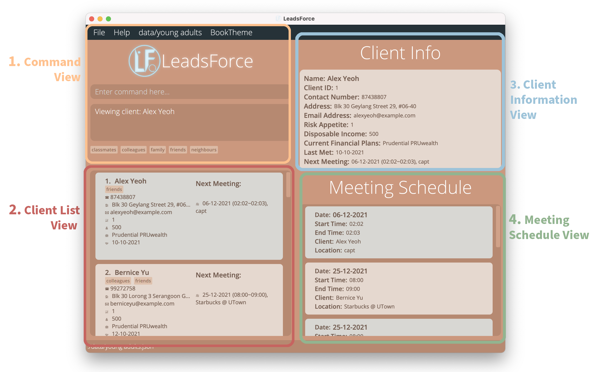
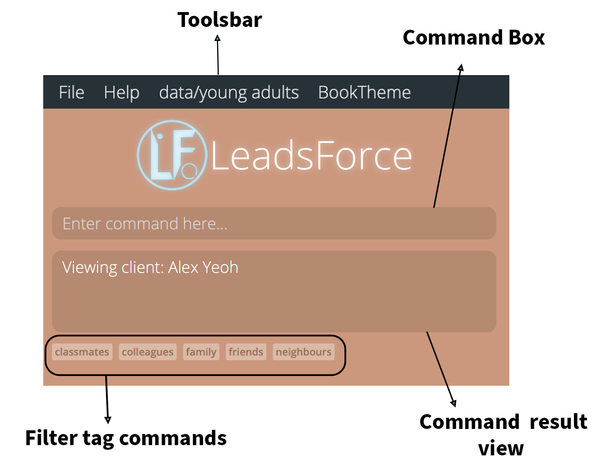
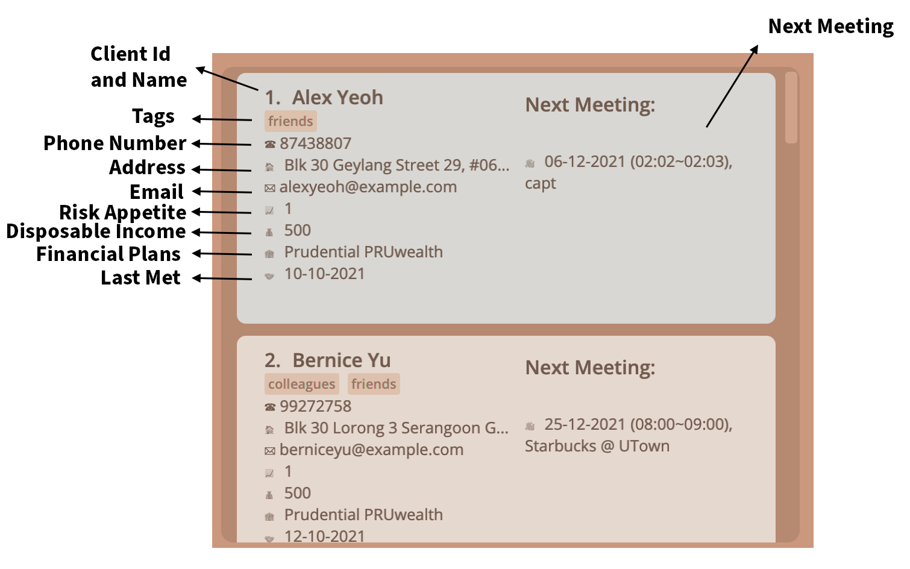
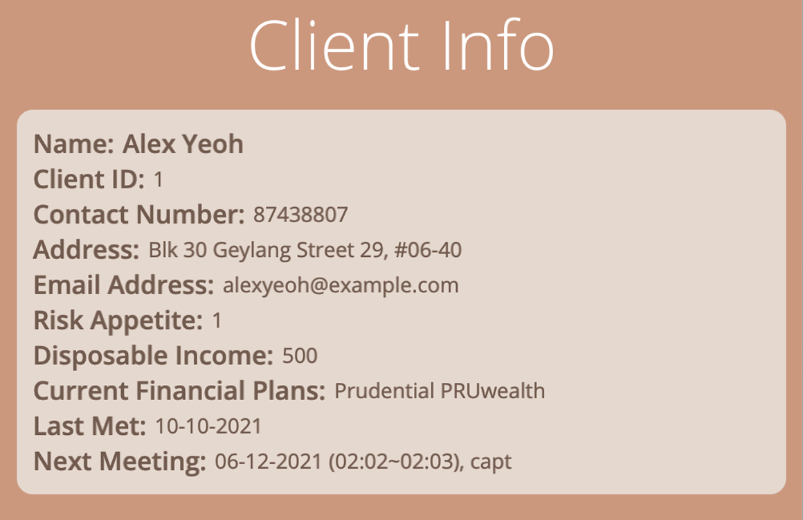
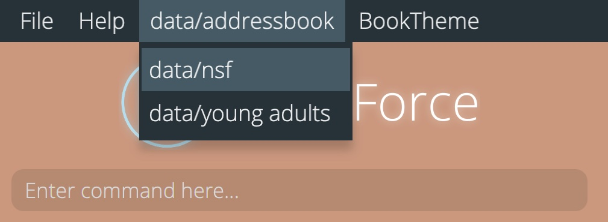

<h1 align="center"> LeadsForce User Guide </h1>

 

Welcome to LeadsForce's User Guide! Find answers and step-by-step instructions to the features in LeadsForce, scroll down the table of contents below to get started ☺️

## Table of Contents

* [**1. Introduction**](#1-introduction)
    * [1.1 Reading this User Guide](#11-reading-this-user-guide)
* [**2. Quick Start**](#2-quick-start)
* [**3. Client Information**](#3-client-information)
    * [3.1 Duplicate Clients](#31-duplicate-clients)
    * [3.2 Next Meeting Attribute](#32-next-meeting-attribute)
    * [3.3 Last Met Attribute](#33-last-met-attribute)
* [**4. Navigating LeadsForce**](#4-navigating-leadsforce)
* [**5. Features**](#5-features)
    * [5.1 Create new contact: add](#51-create-new-contact--add)
    * [5.2 Retrieve particular contact: view](#52-retrieve-particular-contact--view)
    * [5.3 Update existing contact: edit](#53-update-existing-contact--edit)
    * [5.4 Delete particular contact: delete](#54-delete-particular-contact--delete)
    * [5.5 List all contacts: list](#55-list-all-contacts--list)
    * [5.6 Sort Contacts: sort](#56-sort-contacts--sort)
    * [5.7 Find meeting schedule: schedule](#57-find-meeting-schedule--schedule)
    * [5.8 Locating clients by keywords: search](#58-locating-clients-by-keywords--search)
    * [5.9 Filter current list: filter](#59-filter-current-list-by-keywords--filter)
    * [5.10 Clearing all entries: clear](#510-clearing-all-entries--clear)
    * [5.11 Getting help](#511-getting-help--help)
    * [5.12 Exiting the program: exit](#512-exiting-the-program--exit)
    * [5.13 Saving data](#513-saving-the-data)
    * [5.14 Edit data file](#514-edit-data-file)
* [**6. Multiple Address Books Features**](#6-multiple-address-books-feature)
    * [6.1 Create new address book: ab create](#61-create-new-address-book--ab-create)
    * [6.2 Delete existing address book: ab delete](#62-delete-existing-address-book-ab-delete--ab-delete)
    * [6.3 Switch to different address book: ab switch](#63-switch-to-different-address-book--ab-switch)
    * [6.4 List all address book: ab list](#64-list-all-address-book--ab-list)
* [**7. FAQ**](#7-faq)
* [**8. Troubleshooting**](#8-troubleshooting)
* [**9. Bugs Reporting**](#9-bugs-reporting)
* [**10. Command Summary**](#10-command-summary)
    * [10.1 Client Management Commands](#101-client-management-commands)
    * [10.2 Multiple Address Book Commands](#102-multiple-address-book-commands)

--------------------------------------------------------------------------------------------------------------------

## 1. Introduction

Are you a student financial advisor (FA) who finds it difficult to **manage client information**, and would like a
software that could help to **keep track of meetings**? If so, LeadsForce might just be the app for you!

LeadsForce is a client management software that helps entry-level and student financial advisors to effortlessly keep
track of essential client information and meetings. It is optimized for use via a Command Line Interface (CLI) while
still having the benefits of a Graphical User Interface (GUI).

Managing your leads has never been easier.

### 1.1 Reading this User Guide

When reading our User Guide, here are some important information to take note of.

### 1.1.1 Icons and its meaning

**Icon** | **Meaning of icons**
:---: | :---
 | Notes: specific conditions or behaviours of a feature.
 | Tips: suggestions that can help LeadsForce run faster.
 | Warnings: important information to take note of when using LeadsForce. When these warnings are not followed, this can result in LeadsForce crashing or have corrupted data files.

## 2. Quick start

1. Ensure you have Java `11` or above installed in your computer.

2. Download the latest `LeadsForce.jar` from [here](https://github.com/AY2122S1-CS2103T-T17-3/tp/releases).

3. Copy the file to the folder you want to use as the _home folder_ for your LeadsForce.

4. Double-click the file to start the app. The GUI similar to the below should appear in a few seconds. Note how the app
   contains some sample data. 
   

5. Type the command in the command box and press Enter to execute it. Here are some example commands you can try:

    * **`list`** : Lists all contacts.

    * **`add n/John Doe p/98765432 e/johnd@example.com a/John street, block 123, #01-01`** : Creates a contact
      named `John Doe` to the Address Book.

    * **`delete 3`** : Deletes the contact with the client ID 3.

    * **`clear`** : Deletes all contacts.

    * **`exit`** : Exits the app.

6. Refer to the [Features](#5-features) below for details of each command.

--------------------------------------------------------------------------------------------------------------------

## 3. Client Information

This section details the client information that financial advisors can keep track of with LeadsForce. Every client that
is registered in LeadsForce have the following attributes that has the corresponding attribute prefix and value(s). The
attribute prefixes specified here will be used in the commands of several [features](#4-features).

Attribute | Prefix | Value
-----------------|-----------------|-----------------
ID | i/ | `CLIENT_ID`  • `CLIENT_ID`: A non-negative integer `e.g. 0, 1, 2, 3, …​`.
Name | n/ | `NAME`  • `NAME`: should only contains alphanumeric characters and spaces, and it should not be blank (Character limit: 30) `e.g. John Doe`.
Email | e/ | `EMAIL`  • `Email`: should be of the format `local-part@domain` `e.g. johnd@example.com`.
Address | a/ | `ADDRESS`  • `ADDRESS`: can take any value, and it can be blank (Character limit: 100) `e.g. John street, block 123, #01-01`.
Current financial plans | c/ | `CURRENT_PLAN`  • `CURRENT_PLAN`: can take any value, and it can be blank (Character limit: 100) `e.g. Prudential PRUwealth`.
Disposable Income | d/ | `INCOME`  • `INCOME`: A non-negative number (Character limit: 15) `e.g. 0.00, 1000.00, 3500.50, …​`.
Next Meeting | m/ | `DATE (START_TIME~END_TIME), LOCATION`  • `DATE`: is in the format `dd-MM-yyyy`, where day, month and year are numerical values.  • `START_TIME` and `END_TIME`: are in `hh:mm` (24 hour format).  • `LOCATION`: can take any value, but it cannot be blank. • More information [below](#32-next-meeting-attribute)
Last met | l/ | `DATE`  • `DATE`: should be of the format `dd-MM-yyyy` `e.g. 24-10-2021`.
Contact number | p/ | `PHONE_NUMBER`  • `PHONE_NUMBER`: should only contain numbers, and it should be at least 3 digits long `e.g. 8743 8807`.
Risk appetite | r/ | `RISK_APPETITE`  • `RISK_APPETITE`: An integer from 1-5, where 1 is very low risk tolerance and 5 is very high risk tolerance.
Tag | t/ | `TAG_NAME`  • `TAG_NAME`: Tag name should be alphanumeric `e.g. friends`.

### 3.1 Duplicate Clients

A client is considered to be the same as another client if they share the same **name** and **email**.

LeadsForce has checks that prevent users from creating duplicated contacts.

 
<b>Notes about having the same client information for various attributes:</b>

* Users have the flexibility to give the same name, email, phone number or any other attributes to multiple users, as
  long as 2 separate clients do not end up with the same name and email.

### 3.2 Next Meeting Attribute

The `Next Meeting` attribute refers to the next meeting that the financial advisor using has with the client.
Each `Next Meeting` consists of a `DATE`, `START_TIME`, `END_TIME` and a `LOCATION`.

| Format | `m/DATE (START_TIME~END_TIME), LOCATION` |
:---: | ---
| Example | `m/25-12-2021 (00:00~23:59), Santa's Workshop` |
|  | • `DATE` is in the format `dd-MM-yyyy`, where day, month and year are numerical values.  • `START_TIME` and `END_TIME` are in `hh:mm` (24 hour format).  • `LOCATION` can take any value, but it cannot be blank. • `Next Meeting` will automatically be updated to null when the current time passes the date and end time of the meeting and this happens whenever the application is booted up. At the same time, the `Last Met` attribute will be updated to take on the current date. |

### 3.3 Last Met Attribute

The `Last Met` attribute refers to the last date the user have met the client.

| Example | `l/25-10-2021`|
:---: | ---
|  | • `Last Met` cannot take dates in the future, but any other past dates up to today's date is OK. |

--------------------------------------------------------------------------------------------------------------------

## 4. Navigating LeadsForce

This section details the various components of LeadsForce's interface and how you could go about navigating our
application. An overview of LeadsForce's interface is shown below.

### 4.1 Command View

  
The command view is where you will be able to input commands into LeadsForce. The command view consist of the following components:   

1. **Toolbar**  
   • help bar that directs users to LeadsForce's user guide  
   • File bar where users can exit the app  
   • Address Book bar which allows users to switch between address books  
   • Themes bar which allows users to switch between different themes  
2. **Command Box**  
   • This is where users can input their commands into LeadsForce  

3. **Command Result Display**  
   • This is where LeadsForce will display details of the commands from the app  

4. **Filter tag**  
   • For tags that clients have, they will show up here in the filter tag. By clicking on one of these tags and
   pressing `enter`, LeadsForce can filter out clients with based on the tag that is chosen. Further details of
   the `filter` command can be found [here](#59-filter-current-list-by-keywords--filter)

### 4.2 Client List View

The client list view consist of the list of clients from the user's address book,and provides an overview of their clients' information.

• This list will change according to the commands used such as `list` and `search`.  
• When opening the application, all clients in an address book will be shown.  

### 4.3 Client Info View

The client information view provides in-depth information about the client's attributes. Using
the [`View`](#52-retrieve-particular-contact--view) command, users can view the client information in the client info
view.

### 4.3 Meeting Schedule View

The meeting schedule view showcases the upcoming meetings that the client has, and they are sorted from the earliest to
the latest meeting that the client has. When first booting up the application, all meetings will be shown. Using
the [`Schedule`](#57-find-meeting-schedule--schedule) command can change the list of meetings shown to the user.

## 5. Features

This section details the various features available in a single address book in LeadsForce. These features are generally
used in the management of client information and client meetings.

 
<b>Notes about the command format:</b>

* In the format for the commands provided, words which are in `UPPERCASE` refers to the `input` that the user must key
  in
* Items in square brackets are optional.
  e.g. `n/NAME [t/TAG]` can be used as `n/John Doe t/friend` or as `n/John Doe`.
* Items with `...` after them can be used multiple times including zero times.
e.g. `[t/TAG]...` can be used as ` `(i.e. 0 times), `t/friend`, `t/friend t/family`, etc.
* Items with `...*` after them can be used multiple times excluding zero times. (i.e. at least one time)
e.g. `edit CLIENT_ID...*` can be used as `edit 1`, `edit 1 2`, `edit 1 2 3`, etc.
* `<attribute>` refers to an arbitrary attribute prefix. (i.e. any attribute can be substituted unless otherwise stated) For a comprehensive list of client's attributes available, please refer to this [section](#3-client-information). 

### 5.1 Create New Contact : `add`

Adds a new client to the address book.

| Format | `add n/CLIENT_NAME e/EMAIL [<attribute>/VALUE]...`|
| :---: | --- |
| **Example** | • `add n/Benedict Chua e/benchua@hotmail.com`   • `add n/Keith e/keithtan@ymail.com p/12345678 d/10000 r/4`|
|  | • A client must have minimally the name and email prefix filled during creation   • Any other prefixes are optional, except for Client ID as Client ID cannot be given to the client.    • Prefixes that can be added are as seen in the client information in the Client Info Section |

### 5.2 Retrieve Particular Contact : `view`

View client's information in detail.

| Format | `view CLIENT_ID` |
| :---: | :--- |
| **Example** | • `view 1` would be used to view client 1's information|

**Expected Outcome:**  
For instance, if `Alex Yeoh` is the client with Client ID 1, the following will be shown in the client info view of
LeadsForce.  

### 5.3 Update Existing Contact : `edit`

Update the attributes of existing users using the prefix of the client’s attribute, and set/edit meetings with clients.

* Multiple attributes could be changed with one command.
* Multiple clients can be edited at the same time with the provided attributes by indicating their ids separated by a
  space.

| Format | `edit CLIENT_ID... [<attribute>/CHANGED_VALUE]...`|
| :---: | :--- |
| **Example** | • `edit 3 p/12345678 r/5` command changes client 3's contact number to “12345678” and the risk appetite to 5.   • `edit 15 13 r/3` command changes the risk appetite of client 13 & 15 to “3”.   • `edit 3 4 5 m/21-09-2021 (09:00~10:00), McDonald's` sets a meeting for clients 3, 4 and 5 to be on 21st September 2021 from 9am to 10 am at McDonald's |
|  | • Client ID cannot be changed. |
|  | • multiple clients and their attributes can be updated with one `edit` command! For instance, if you're planning to organise a meeting with several clients, you could simply use this feature to do so. |

### 5.4 Delete particular contact : `delete`

Deletes an existing client from the address book using their client id.

| Format | `delete CLIENT_ID...`|
| :---: | :--- |
| **Example** | • `delete 7` will deletes client with client id 7   • `delete 4 8 6` will deletes the clients whose client id is 4, 6 and 8 |
|  | • Multiple clients can be deleted with one `delete` command |
|  | • This action is irreversible. Once you have deleted a client, the client and his/her corresponding information will be removed from the storage file. |

### 5.5 List all contacts : `list`

Shows the full list of all clients in the address book.

| Format | `list` |
| :---: | :--- |
|  | • As long as the first word in the command is `list`, the command will still work regardless of the additional inputs.   eg. the command `list asdknkjsaf` will still work | 

### 5.6 Sort Contacts : `sort`

Sorts clients in order based on the inputted attribute. Clients can be sorted in ascending or descending order, and is
based on the given `SORT DIRECTION`.

| Format | `sort [<attribute>/SORT_DIRECTION]...`     • `SORT DIRECTION` can take on the values `asc` or `dsc`, and will sort the clients based on the given attribute in an ascending and descending order respectively. |
| :---: | :--- |
| **Examples** | • `sort r/ASC` will sort the list by ascending risk-appetite   • `sort i/dsc` will sort the list by descending client id |
|  | • If multiple attributes are provided, then the clients will be sorted by the attributes sequentially.   e.g. `sort d/asc m/dsc`, this will sort the clients by disposable income in ascending order first, then for those clients whose disposable income are the same, they will be sorted by next meeting in descending order.   • Sorting by the attribute Tag (t/) is not supported.   • The tags are case-insensitive. (ASC and asc are both okay.) |

### 5.7 Find meeting schedule : `schedule`

Finds the meeting schedule on a specified date.

| Format | `schedule [DATE]`|
| :---: | :--- |
| **Examples** | • `schedule 22-09-2021` allows the user to view the schedule that the user has on the 22nd September 2021.    • `schedule` displays all meetings|
|  | • `DATE` has to be in the format of dd-MM-yyyy.   • if the `DATE` is not specified, all meetings will be displayed.|

### 5.8 Locating clients by keywords : `search`

Finds clients whose contacts match with the given keywords.

| Format | `search KEYWORD... [<attribute>/ATTRIBUTE_KEYWORD]...`    • `KEYWORD` will be used to match with all attribute of the client.   • `{ATTRIBUTE_KEYWORD` refers to the keyword that is to be matched with the corresponding client attribute.|
| :---: | :--- |
| **Examples** | • `search John` returns *john* and *John Doe*   • `search alex david` returns *Alex Yeoh*, *David Li* |
|  | • If no `KEYWORD` is provided, search will be based on `<attribute>/ATTRIBUTE_KEYWORD` only.   • The search is case-insensitive. e.g `keith` will match `Keith`.   • The order of the keywords does not matter. e.g. `John Doe` will match `Doe John`.  • Clients matching at least one keyword will be returned).   e.g. `Hans Bo` will return `Hans Gruber`, `Bo Yang`.   • If attribute keyword is provided, only clients whose attribute matches with the attribute keyword will be returned.   e.g. `Tom Tim e/@gmail.com` will return `Tom Lee e/Tom@gmail.com` and not `Tim Shum e/Tim@yahoo.com`. |

### 5.9 Filter current list by keywords : `filter`

Filters the current list by the given keywords.

| Format | `filter KEYWORD... [<attribute>/ATTRIBUTE_KEYWORD]...`    • `KEYWORD` will be used to match with all attribute of the client.   • `{ATTRIBUTE_KEYWORD` refers to the keyword that is to be matched with the corresponding client attribute.|
| :---: | :--- |
| **Examples** | • `filter John` returns `john` and `John Doe`   • `filter alex david` returns `Alex Yeoh`, `David Li` |
|  | • Works similar to `search` but `filter` works based on the current list shown as opposed to entire lists of contacts.   • If no `KEYWORD` is provided, then filter will be based on `<attribute>/ATTRIBUTE_KEYWORD`   • The filter is case-insensitive. e.g `keith` will match `Keith`.   • The order of the keywords does not matter. e.g. `John Doe` will match `Doe John`.   • Clients matching at least one keyword will be returned).   e.g. `Hans Bo` will return `Hans Gruber`, `Bo Yang`.   • If attribute keyword is provided, only clients whose attribute matches with the attribute keyword will be returned.   e.g. `Tom Tim e/@gmail.com` will return `Tom Lee e/Tom@gmail.com` and not `Tim Shum e/Tim@yahoo.com`.|
|  | • Use the tags found under the command box to quickly filter clients by their tags. Simply click on a tag and press enter to filter clients with the specific tag.   eg. Pressing the `classmate` button allows you to filter clients with the `classmate` tag.   | 

### 5.10 Clearing all entries : `clear`

Clears all entries from the address book.

| Format | `clear`|
| :---: | :--- |
|  | • As long as the first word in the command is `clear`, the command will still work regardless of the additional inputs.   eg. the command `clear asdknkjsaf` will still work.   • This command clears all clients in the **current** address book   • After inputting `clear`, another prompt will appear requesting for confirmation to clear the address book. The input required for the confirmation will either be:      • `yes`: to confirm and proceed with the clear command.      •`no`: to cancel the clear command.|
|  | • This action is irreversible. Once you have clear all client information from the current address book, this information will be removed from the storage file and will not be retrievable.|

### 5.11 Getting help : `help`

Opens a popup displaying the URL for our User Guide. Users can copy the URL to visit this User Guide.

| Format | `help` |
| :---: | --- |
|  | • As long as the first word in the command is `help`, the command will still work regardless of the additional inputs.   eg. the command `help asdknkjsaf` will still work |

### 5.12 Exiting the program : `exit`

Exits LeadsForce.

| Format | `exit` |
| :---: | --- |
|  | • As long as the first word in the command is `exit`, the command will still work regardless of the additional inputs.   eg. the command `exit asdknkjsaf` will still work | 

### 5.13 Saving the data

LeadsForce's data are saved in the hard disk automatically after any command that changes the data. There is no need to
save manually.

### 5.14 Edit data file

LeadsForce's data are saved as a JSON file `[JAR file location]/data/addressbook.json`. Advanced users are welcome to
update data directly by editing that data file.

 
<b>If your changes to the data file makes its format invalid, LeadsForce will discard all data and start with an empty data file at the next run.</b>

## 6. Multiple Address Books Feature

This section details the multiple address book feature in LeadsForce. Separate your clients into different address books
to better manage your clients!

### 6.1 Create new address book : `ab create`

Create a new address book by the name provided and switches to it.

| Format | `ab create ADDRESSBOOK_NAME`     • `ADDRESSBOOK_NAME` refers to the name to be given to the new address book.|
| :---: | :--- |
| **Example** | `ab create vip clients` will create a new address book named `vip clients` |
|  | • The name of the addressbook cannot be the same as an existing address book.|

### 6.2 Delete existing address book: ab delete : `ab delete`

Delete an address book that currently exists.

| Format | `ab delete ADDRESSBOOK_NAME`    • `ADDRESSBOOK_NAME` refers to the name of the address book to be deleted.|
| :---: | :--- |
| **Example** | `ab delete test` will delete the address book named `test` |
|  | • The current address book cannot be deleted, switch to another address book first before deleting the address book.|

### 6.3 Switch to different address book : `ab switch`

Switch to a different address book that currently exists.

| Format | `ab switch ADDRESSBOOK_NAME`     • `ADDRESSBOOK_NAME` refers to the name of the address book to switched to .|
| :---: | :--- |
| **Example** | `ab switch other` will switch over to the address book named `other` |
|  | • Switch between different address books by toggling the address book tab (which is the 3rd tab from the left)    |

### 6.4 List all address book : `ab list`

List all the name of all the existing address books

| Format | `ab list` |
| --- | --- |
|  | • As long as the first two word in the command is `ab list`, the command will still work regardless of the additional inputs.   eg. the command `ab list asdknkjsaf` will still work |

--------------------------------------------------------------------------------------------------------------------

## 7. FAQ

**Q**: Is LeadsForce free to use?  
**A**: Yes, LeadsForce is free for use as long as you have a computer with you.  

**Q**: Does LeadsForce require internet connection?  
**A**: No, LeadsForce doesn't require any internet connection. This is great because you can use LeadsForce without
having to worry about having adequate internet connection!

**Q**: Is LeadsForce safe to use?  
**A**: Yes, LeadsForce is 100% safe for use! Our team regularly reviews our code to ensure that there isn't any security
vulnerabilities.

**Q**: Will LeadsForce be consistently updated?  
**A**: Yes, our team is consistently updating LeadsForce to better meet the needs of our user.

**Q**: Can I use LeadsForce on a mobile device?  
**A**: Unfortunately, LeadsForce is only available for use on computers. The team is thinking of implementing a mobile
version of LeadsForce in the near future so do tuned in to our updates. 🙂

**Q**: I have downloaded the `LeadsForce.jar` and is unable to open the application. Is there anything I could do?  
**A**: Yes, there is another way to open up LeadsForce. Open the command prompt on your computer, navigate to the
directory where you have stored the `LeadsForce.jar` file, and type `java -jar LeadsForce.jar`.

**Q**: How do I transfer my data to another computer? 
**A**: Install LeadsForce on the other computer and overwrite the empty data file it creates with the file that contains
the data of your previous LeadsForce home folder.

--------------------------------------------------------------------------------------------------------------------

## 8. Troubleshooting

### Unable to launch LeadsForce

* Do check that you indeed have Java 11 or above installed in your computer.

**For Mac users,**

1. Open the terminal and type `java -version`, and press `enter`.
2. If you get the version information, and have made sure that the java version is `11` and above. You have downloaded
   the correct java version, and can skip the rest of this tutorial.
3. Otherwise, head to the Oracle website [here](https://www.oracle.com/java/technologies/downloads/#java11-mac) to
   download the mac version of the java JDK.

**For Windows users,**

1. Open the command prompt, and type `java -version`, and press `enter`.
2. If you get the version information, and have made sure that the java version is `11` and above. You have downloaded
   the correct java version, and can skip the rest of this tutorial.
3. Go to `start menu` → `System` → `Advanced` → `Environment Variable`. Set the `JAVA_HOME` to the path of your JDK, and
   press `update`. For more details, the link to a more in-depth guide can be
   found [here](https://javatutorial.net/set-java-home-windows-10).
4. If none of the above worked, do search your system for the `javac.exe` file. If it cannot be found, head to the
   Oracle website [here](https://www.oracle.com/java/technologies/downloads/#java11-mac) to download the PC version of
   the java JDK.

## 9. Bugs Reporting

The latest version of LeadsForce (version 1.4) is currently undergoing rigorous testing. This version would serve as the
public beta testing of LeadsForce. We have done comprehensive tests on the application, including integration and unit
testing. In addition, several students from NUS School of Computing have also contributed towards the rigorous testing
of LeadsForce.

However, if you do happen to encounter any bugs while using LeadsForce, please go to
LeadsForce's [issue page](https://github.com/AY2122S1-CS2103T-T17-3/tp/issues) to issue the bug with the steps to
recreate the bug.

## 10. Command summary

This section details all commands in using the features in LeadsForce.

### 10.1 Client Management Commands

Action | Format | Examples
--------|---------|---------
**Create** | `add n/CLIENT_NAME e/EMAIL [<attribute>/VALUE]...`| add n/benedict e/benedict@gmail.com p/90909898 r/3
**View** | `view CLIENT_ID` | view 123
**Edit** | `edit CLIENT_ID... [<attribute>/CHANGED_VALUE]...` | edit 12 n/Dominic p/12345678
**Delete** | `delete CLIENT_ID...` | delete 4
**List** | `list` | -
**Sort** | `sort [<attribute>/SORT_DIRECTION]...` | sort r/asc
**Schedule** | `schedule [DATE]` | schedule 25-12-2021
**Search** | `search KEYWORD... [<attribute>/KEYWORD]...` | search e/doe@gmail.com r/5
**Filter** | `filter KEYWORD... [<attribute>/VALUE]...` | filter e/doe@gmail.com p/9
**Clear** | `clear` | -
**Help** | `help` | -
**Exit** | `exit` | -

### 10.2 Multiple Address Book Commands

Action | Format | Examples
--------|---------|---------
**Create Address Book** | `ab create ADDRESSBOOK_NAME` | ab create vip
**Delete Address Book** | `ab delete ADDRESSBOOK_NAME` | ab delete book
**Switch Address Book** | `ab switch ADDRESSBOOK_NAME` | ab switch another
**List Address Book** | `ab list` | -
