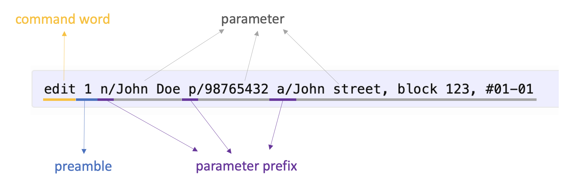
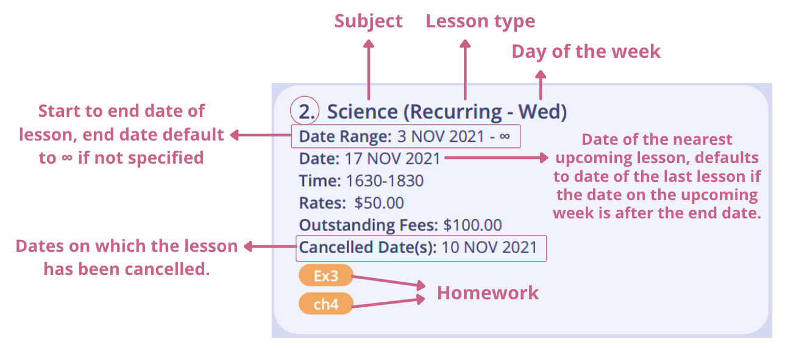
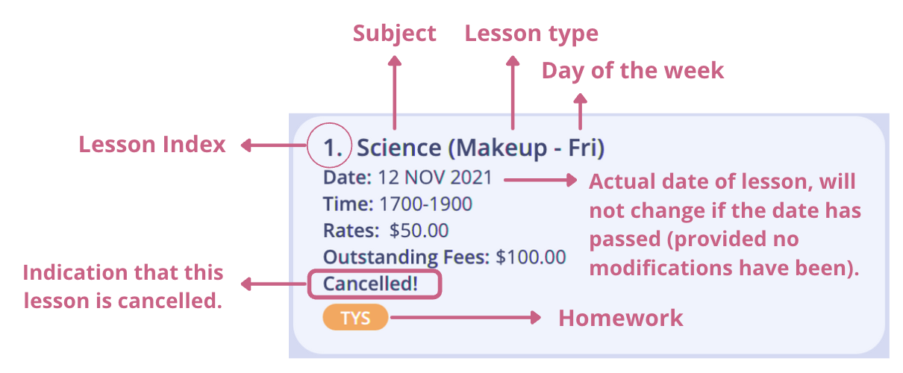
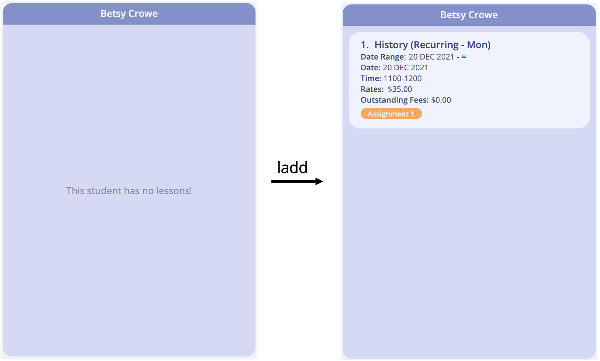
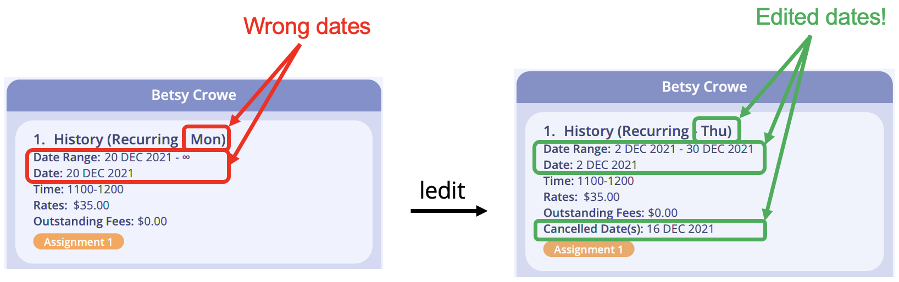
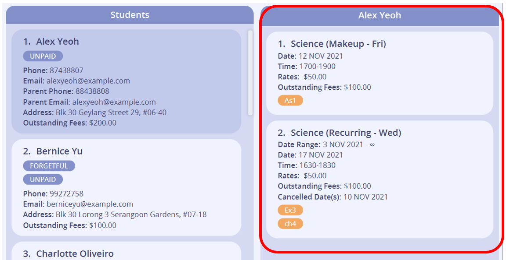
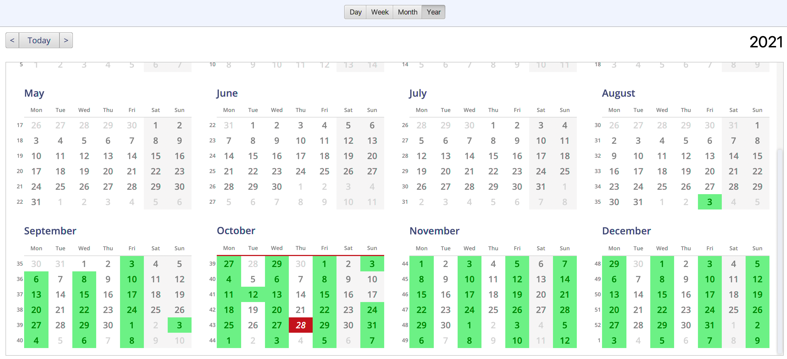
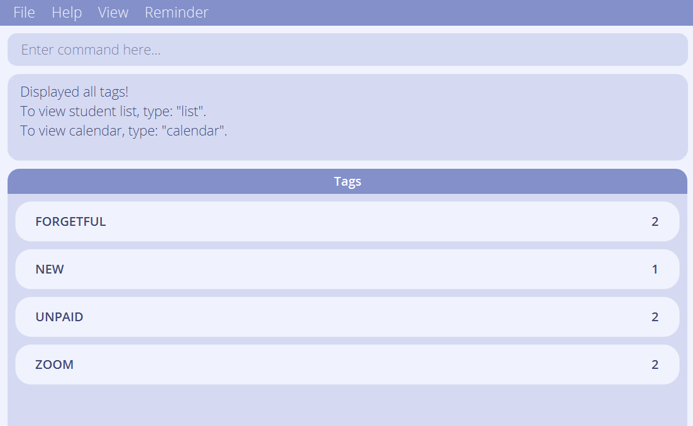

<span id="toc"/>
* Table of Contents
{:toc}

--------------------------------------------------------------------------------------------------------------------

## Introduction

**Tuition Address Book (TAB)** is an all-in-one desktop application that helps private 1-to-1 home tutors like you keep track of the large number of students and your respective lesson information, and empower you to provide the best quality home tuition service.

TAB is a Command Line Interface (CLI) application which allows you to interact with it with just text inputs. On top of that, TAB also comes with a clean and aesthetic Graphical User Interface (GUI), allowing you to view your data easily.

With TAB, you can effortlessly manage your students' contact details faster than a typical mouse/GUI driven app.

--------------------------------------------------------------------------------------------------------------------

## About This Guide

This user guide aims to help new users become familiar with TAB. If this is your first time using TAB, we recommend reading this User Guide in order.

It provides [installation instructions](#quick-start) to help get you started with using TAB, and describes in detail the [features](#features) available in TAB. 

If there are any terms used in this user guide which you are unfamiliar with, their definitions may be found in the [Glossary](#glossary).

**Navigation**

In the [Table of Contents](#toc), each item listed is a link which you can click on to go directly to that section in the guide. At the end of every section, there will be a link which says [back to table of contents](#toc) which you can click on to return to the Table of Contents.

**Conventions Used**

As you read this user guide, you may also encounter these syntax and symbols. 

Syntax | Meaning
--------|------------------
`text` | A command to be entered into the command box in TAB.
<kbd>text</kbd> | A keyboard input, or a button to be clicked on.
[text](#about-this-guide) | Links to other parts of the document, or links to be opened in the browser.
_text_ | Caption for images.
<div markdown="block" class="alert alert-info"> :information_source: </div> | Indication that the following text is a note, which is useful in helping you understand how TAB works.
<div markdown="block" class="alert alert-primary"> :bulb: </div> | Indication that the following text is a tip, which allows you to interact with TAB more effectively and quickly. 
<div markdown="block" class="alert alert-warning"> :exclamation: </div> | Indication that the following text is important. Missing it out may impair your user experience and may potentially cause TAB to misbehave!

--------------------------------------------------------------------------------------------------------------------

## Quick Start

1. Ensure you have **Java 11** or above installed on your computer. If you need help with installation, you can visit this [website](https://docs.oracle.com/en/java/javase/17/install/overview-jdk-installation.html#GUID-8677A77F-231A-40F7-98B9-1FD0B48C346A) for more details.

2. Download the latest **TAB.jar** from [here](https://github.com/AY2122S1-CS2103T-F13-3/tp/releases).

3. Copy the file to the folder you want to use as the _home folder_ for your TAB.

4. Double-click the file to start the app. The window similar to the one below should appear in a few seconds. Note how the app contains some sample data.<br>
    <br> _Example screenshot of the full screen interface on a Mac. Note the icon beside "Quick Tips" may vary slightly for Windows users._

5. Type the command in the command box and press <kbd>ENTER</kbd> to execute it. e.g. typing **`help`** and pressing <kbd>ENTER</kbd> will open the help window.<br>
   
   Some example commands you can try:

   * **`list`** : Lists all students.

   * **`add`**`n/John Doe p/98765432 e/johnd@example.com a/John street, block 123, #01-01` : Adds a student named `John Doe` to TAB.

   * **`delete`**`3` : Deletes the 3rd student shown in the current list.

   * **`clear`** : Deletes all students.

   * **`exit`** : Exits the app.

6. Refer to the [Features](#features) section for details of each command.

--------------------------------------------------------------------------------------------------------------------

<div style="page-break-after: always;"></div>

## Overview of the Graphical User Interface (GUI)

This section briefly explains the various section of TAB's GUI.


<div class="caption">Basic layout of TAB's user interface.</div>

Section | Representation
---------|---------
Menu Bar | The area where you can click to navigate and view some of TAB's features (e.g. help, reminder and calendar). See [Menu Bar Shortcuts](#menu-bar-shortcuts) for more details.
Menu Item | A button that you can click to view the stated feature, or to quit TAB (for <kbd>Exit</kbd>).
Command Box | The text field where you key in commands that are meant to be processed by TAB. TAB will execute the command after you press <kbd>Enter</kbd>.
Result Display | The area that shows the result of the execution of the command. If the command entered has been executed successfully, it will display the relevant success message. Otherwise, it will show an error message indicating the cause of the error.
Student List | The panel that shows the list of students you have in TAB.
Student Card | The area that shows the details of a student. See [Managing Students](#managing-students) for more details.
Lesson List | The panel that shows the name of the student you have selected together with a list of lessons that the student has.
Lesson Card | The area that shows the details of a lesson. See [Managing Lessons](#managing-lessons) for more details.
Center Panel | The region that displays the lists of students and lessons, calendar or the list of tags depending on the command you have entered. See [Features](#features) for more details.
Footer | The area which shows where TAB saves your student details to. <br> e.g. **./data/addressbook.json** means that TAB saves your data to the sub-folder **data** in the home folder (where TAB located in) with file name **addressbook.json** as shown in the following screenshot: <br> 

--------------------------------------------------------------------------------------------------------------------

<div style="page-break-after: always;"></div>

## Features
This section describes the available features in TAB. 
The features are categorised into the different categories as follows:

* [Getting Help](#getting-help)
* [Managing Students](#managing-students)
* [Finding Students](#finding-students)
* [Managing Lessons](#managing-lessons)
* [Managing Lesson Fees](#managing-lesson-fees)
* [Managing Your Schedule](#managing-your-schedule)
* [Managing Data](#managing-data)
* [Miscellaneous Commands](#miscellaneous-commands)

--------------------------------------------------------------------------------------------------------------------

### Overview of the Command Format
This section explains the command format used for TAB's commands.<br/>

Commands are text that you can enter into TAB's command box to tell TAB which operation you would like to perform. Commands in TAB have several components and follow a general format as follows:<br/>

```COMMAND_WORD PREAMBLE PARAMETER_PREFIX/PARAMETER…​```

|Component|Description|
|---------|-----------|
|Command word|The word that specifies which action you want TAB to execute.|
|Preamble| The text before the first valid parameter prefix in the command. The preamble is where you would specify the student or lesson indices for commands that require them. The preamble may or may not be empty depending on the command.|
|Parameter prefix| The specific prefix that identifies the start of the parameter. Each parameter has a unique prefix, but all prefixes end with a `/`.|
|Parameter| An input provided by the user for the execution of the command.|

<div markdown="block" class="alert alert-warning"> :exclamation: **Important** <br>

* **Prefixes** are **case-sensitive**<br>
  e.g. `n/` is the prefix for student name but `N/` is invalid.

* **Command words** are **case-insensitive** <br>
  e.g. `LIST` is equivalent to `list`.
</div>

An example of a command in TAB:


#### Command format notation

* Words in `UPPER_CASE` are the parameters to be supplied by the user.<br>
  e.g. in `add n/NAME`, `NAME` is a parameter which can be used as `add n/John Doe`.

* Items in square brackets are optional.<br>
  e.g. `n/NAME [t/TAG]` can be used as `n/John Doe t/friend` or as `n/John Doe`.

* Items in curly brackets separated by the pipe character `|` indicates that you must select exactly one parameter from the list of choices.<br>
  e.g. `cond/{all | any | none}` can be used as `cond/all` or `cond/any` or `cond/none`.

* Items with `…` after them can be used multiple times including zero times.<br>
  e.g. `[t/TAG]…​` can be used as ` ` (i.e. 0 times), `t/friend`, `t/friend t/family` etc.

#### Notes about parameters

* Parameters can be in any order.<br>
  e.g. if the command specifies `n/NAME p/PHONE_NUMBER`, `p/PHONE_NUMBER n/NAME` is also acceptable.

* Each parameter and its prefix are separated from the others with a **space**.<br/>

* If a parameter is expected only once in the command, but you specified it multiple times, only the last occurrence of the parameter will be taken.<br>
  e.g. if you specify `p/12341234 p/56785678`, only `p/56785678` will be taken.
  
* Extraneous parameters for commands that do not take in parameters (such as `help`, `list`, `calendar`, `exit`, `clear` etc.) are not valid.<br>
  e.g. `help 123` is not a valid command.

* Chaining commands is not supported.<br>
  e.g. A chain of commands such as `next next back next` or `list calendar day` are not valid commands.

* There are constraints in place to determine whether the value you provided for a field is valid. 
  TAB will inform you if you gave an invalid input for a field.

<br />

[back to table of contents](#toc)

--------------------------------------------------------------------------------------------------------------------
<div style="page-break-after: always;"></div>

### Getting Help 
This section tells you what to do if you require help while using TAB.

--------------------------------------------------------------------------------------------------------------------

#### Viewing help: `help`

Shows a command summary table as well as a link to access this user guide page.

Format: `help`

- You can select a cell and press <kbd>CONTROL</kbd> + <kbd>C</kbd> or <kbd>COMMAND</kbd> + <kbd>C</kbd> on your keyboard to copy the selected cell value.
- You can click <kbd>Copy URL</kbd> button to copy the link to this user guide.
- You can click the right end to each column to sort the rows alphabetically.


<div class="caption">Help window interface.</div>

<br />

[back to table of contents](#toc)

--------------------------------------------------------------------------------------------------------------------

<div style="page-break-after: always;"></div>

### Managing Students
This section guides you on how to use the commands for managing students in TAB.
Executing any of the commands in this section will bring you to the students interface. Any command from other sections, such as `day` or `tag`, will bring you right out.

1. [Adding a student: `add`](#adding-a-student-add)
2. [Editing a student: `edit`](#editing-a-student-edit)
3. [Deleting a student: `delete`](#deleting-a-student-delete)
4. [Listing all students: `list`](#listing-all-students-list)

<br>

<div class="caption">Layout of a student card.</div>

<div markdown="block" class="alert alert-info">
**:information_source: Note:**<br>
  <ul>
    <li>A student can be identified by the student index number shown in the displayed list of students.</li>
    <li><strong>At least one</strong> of the <a href="#student-contact">contact fields</a> must be present.</li>
    <li>Fields that are empty will not be displayed.</li>
  </ul>
</div>

#### Student parameters

<table id="student-param-table">
    <thead>
        <tr>
            <th style="text-align:center; padding: 10px 0 10px 0">Category</th>
            <th style="text-align:center">Field</th>
            <th style="text-align:center">Prefix</th>
            <th style="text-align:center">Constraints</th>
            <th style="text-align:center">Examples</th>
        </tr>
    </thead>
    <tbody>
        <tr>
            <td rowspan=2>Essential</td>
            <td>Name</td>
            <td><code>n/</code></td>
            <td>
              <ul> 
                <li>Case-sensitive.</li>
                <li>TAB does not allow adding students with the same case-sensitive name.</li>
              </ul>
            </td>
            <td><code>n/Jane Tan</code></td>
        </tr>
        <tr>
            <td>Address</td>
            <td><code>a/</code></td>
            <td>Not Applicable</td>
            <td><code>a/Blk 123A, Serangoon Ave 3, #04-56</code></td>
        </tr>
        <tr>
            <td rowspan=4 id="student-contact">Contact</td>
            <td id="phone-field">Phone</td>
            <td><code>p/</code></td>
            <td>
              Minimum 3 numeric characters.
            </td>
            <td><ul>
              <li><code>p/91234567</code></li>
              <li><code>p/</code> sets the phone field to empty.</li>
            </ul></td>
        </tr>
        <tr>
            <td id="email-field">Email</td>
            <td><code>e/</code></td>
            <td>Must be of the format <em>xxx@yyy</em>.</td>
            <td><ul>
              <li><code>e/jane@gmail.com</code></li>
              <li><code>e/</code> set the email field to empty.</li>
            </ul></td>
        </tr>
        <tr>
            <td>Parent Phone</td>
            <td><code>pp/</code></td>
            <td>Refer to the constraints for <a href="#phone-field">Phone</a> above.</td>
            <td><ul>
              <li><code>pp/81234567</code></li>
              <li><code>pp/</code> sets the parent phone field to empty.</li>
            </ul></td>
        </tr>
        <tr>
            <td>Parent Email</td>
            <td><code>pe/</code></td>
            <td>Refer to the constraints for <a href="#email-field">Email</a> above.</td>
            <td><ul>
              <li><code>pe/john@gmail.com</code></li>
              <li><code>pe/</code> sets the parent email field to empty.</li>
            </ul></td>
        </tr>
        <tr>
        <td rowspan=5>Optional</td>
            <td>School</td>
            <td><code>sch/</code></td>
            <td>Not Applicable</td>
            <td><ul>
              <li><code>sch/Serangoon JC</code></li>
              <li><code>sch/</code> sets the school field to empty.</li>
            </ul></td>
        </tr>
        <tr>
            <td>Academic Stream</td>
            <td><code>stream/</code></td>
            <td>Not Applicable</td>
            <td><ul>
              <li><code>stream/A-Level</code></li>
              <li><code>stream/</code> sets the academic stream field to empty.</li>
            </ul></td>
        </tr>
        <tr>
            <td>Academic Level</td>
            <td><code>lvl/</code></td>
            <td><ul>
              <li>Maximum 15 characters, including space(s).</li>
            </ul></td>
            <td><ul>
              <li><code>lvl/J1</code></li>
              <li><code>lvl/</code> sets the academic level field to empty.</li>
            </ul></td>
        </tr>
        <tr>
            <td>Remark</td>
            <td><code>r/</code></td>
            <td>Not Applicable</td>
            <td><ul>
              <li><code>r/She is weak at maclaurin series.</code></li>
              <li><code>r/</code> sets the remark field to empty.</li>
            </ul></td>
        </tr>
        <tr>
            <td>Tags</td>
            <td><code>t/</code></td>
            <td><ul>
              <li>Must be alphanumeric characters.</li>
              <li>Case-insensitive</li>
              <li>To add multiple tags to a student, you need to add <code>t/</code> before every tag name.</li>
            </ul></td>
            <td><ul>
              <li><code>t/unpaid</code> is valid.</li>
              <li><code>t/unpaid retained</code> is invalid.</li>
              <li><code>t/unpaid t/</code> replaces existing tags with the <code>unpaid</code> tag.</li>
              <li><code>t/</code> clears <strong>all</strong> tags.</li>
            </ul></td>
        </tr>
        <tr>
            <td rowspan="2">View Only</td>
            <td>Student Index</td>
            <td>Not Applicable</td>
            <td>Changes according to the position of the student in the displayed list.</td>
            <td>Not Applicable</td>
        </tr>
        <tr>
            <td>Outstanding Fees</td>
            <td>Not Applicable</td>
            <td>Can only be changed with valid executions of <code>ladd</code>, <code>ledit</code>, <code>ldelete</code> commands. See <a href="#managing-lesson-fees">Managing Fees</a> for more details.</td>
            <td>Not Applicable</td>
        </tr>
    </tbody>
</table>

--------------------------------------------------------------------------------------------------------------------

#### Adding a student: `add`

Adds a student to TAB.

Format: `add n/NAME a/ADDRESS [p/PHONE_NUMBER] [e/EMAIL] [pp/PARENT_PHONE_NUMBER] [pe/PARENT_EMAIL] [sch/SCHOOL] [stream/ACAD_STREAM] [lvl/ACAD_LEVEL] [r/REMARK] [t/TAG]…​`

<div markdown="span" class="alert alert-primary">:bulb: **Tip:**
A student can have any number of tags (including 0).
</div>

* **At least one** [contact field](#student-contact) is required.<br>
* `lvl/ACADEMIC_LEVEL` field allows only a maximum of 15 characters (including spaces).

Examples:
* `add n/John Doe p/98765432 e/johnd@example.com a/John street, block 123, #01-01 pp/92345678 pe/jackdoe@example.com sch/John's School stream/John stream lvl/J1`
* `add n/Betsy Crowe t/cousin a/Newgate p/91234567 r/hasnt pay tuition fee for Aug t/retainee`

#### Editing a student: `edit`

Edits an existing student in TAB.

Format: `edit INDEX [n/NAME] [a/ADDRESS] [p/PHONE] [e/EMAIL] [pp/PARENT_PHONE_NUMBER] [pe/PARENT_EMAIL] [sch/SCHOOL] [stream/ACAD_STREAM] [lvl/ACAD_LEVEL] [r/REMARK] [t/TAG]…​`

* Edits the student at the specified `INDEX`. <br>
  e.g. `edit 2` means that you wish to edit the 2nd student in the displayed list.

* You must provide at least one field.<br>
  e.g. entering just `edit 2` alone is not a valid command. You need to include the field you wish to edit.

* Existing values will be updated to the entered values.<br>
  e.g. `edit 2 pp/81234567` will override the parent phone of the 2nd student in the displayed list to `81234567`.

* You can delete the data in optional fields by supplying a parameter with no arguments.<br>
  e.g. `edit 2 r/` will remove the remarks for the 2nd student in the displayed list.

* You cannot remove a contact field if it is the only remaining means of contact you have with a student.<br>
  e.g. no student should have all contact fields empty. `edit 2 pp/` will not work if the student does not have
  any `PHONE_NUMBER`, `EMAIL`, or `PARENT_EMAIL`.

* When editing tags, all existing tags of the student will be removed and replaced with the tags specified.<br>
  e.g. `edit 2 t/SEC2 t/IP` will erase the student's original tags and replace it with the new tags `SEC2` and `IP`.

Examples:
* `edit 1 p/91234567 e/johndoe@example.com` Edits the phone number and email address of the 1st student to be `91234567` and `johndoe@example.com` respectively.
* `edit 2 n/Betsy Crower t/` Edits the name of the 2nd student to be `Betsy Crower` and clears all existing tags.
* `edit 3 sch/NJC stream/` Edits the school of the 3rd student to be `NJC` and clears academic stream data.

#### Deleting a student: `delete`

Deletes the specified student from TAB.

Format: `delete INDEX`

* Deletes the student at the specified `INDEX`.

Examples:
* `list` followed by `delete 2` deletes the 2nd student in TAB.
* `find n/Betsy` followed by `delete 1` deletes the 1st student in the results of the `find` command.

#### Listing all students: `list`

Shows a list of all students in TAB.

Format: `list`

<br />

[back to table of contents](#toc)

--------------------------------------------------------------------------------------------------------------------

<div style="page-break-after: always;"></div>

### Finding Students
This section guides you on how to find or filter students of your choice in TAB.

--------------------------------------------------------------------------------------------------------------------

#### Finding students by fields: `find`

Finds all students whose fields match the given keyword(s), based on the specified find condition.
You can find students by tags, student fields and lesson fields.

Format: `find [cond/{all | any | none}] [t/TAG_KEYWORD]…​ [n/NAME_KEYWORDS] [a/ADDRESS_KEYWORDS] [p/PHONE_KEYWORDS] [e/EMAIL_KEYWORDS] [pp/PARENT_PHONE_KEYWORDS] [pe/PARENT_EMAIL_KEYWORDS] [sch/SCHOOL_KEYWORDS] [stream/ACAD_STREAM_KEYWORDS] [lvl/ACAD_LEVEL_KEYWORDS] [r/REMARK_KEYWORDS] [subject/SUBJECT_KEYWORDS] [date/START_DATE] [time/TIME_RANGE] [cancel/CANCELLED_DATE] [rates/LESSON_RATES_KEYWORDS] [hw/HOMEWORK_KEYWORDS]`

* You must specify at least one field to search for, and provide at least one keyword.<br>
  e.g. `find cond/any` or `find n/` are invalid commands.

##### Search by tags
* You can search by multiple tags. e.g. `t/paid t/new`.
* One tag parameter can only have one keyword. e.g. `t/paid new` is invalid.
* Only whole words will be matched. e.g. keyword `paid` will not match `unpaid`.
* The search is case-insensitive. e.g. keyword `new` will match `NEW`.

Example:
* `find t/unpaid t/New` will return all students with both of the tags `UNPAID` and `NEW`.

##### Search by other student fields
* You can specify one or more keywords for each parameter. e.g. `find n/Amad Ali`.
* A field needs to contain all specified keywords to be matched.<br>
  e.g. keywords `Amad Ali` will not match `Amad`, but it will match `Amad bin Ali`.
* If you specify multiple keywords with the same prefix, only the last prefix will be used to search that field.
* A keyword can match a word partially. e.g. keyword `uni` will match `university`.
* The search is case-insensitive.

Example:
* `find n/John a/west coast` will return students with name that contains `John`, and address that contains `west` and `coast`.

##### Search by lesson fields
* Finds all students with at least one lesson that matches the lesson parameters.
* The find behaviour of lesson fields are specified in the table below.

<table id="find-param-table">
    <thead>
        <tr>
            <th style="text-align:center">Fields</th>
            <th style="text-align:center">Find behaviour</th>
        </tr>
    </thead>
    <tbody>
        <tr>
            <td>Subject <br> Lesson Rates</td>
            <td>
              <ul>
                <li>The same constraints for student fields apply.</li>
              </ul>
            </td>
        </tr>
        <tr>
            <td>Homework</td>
            <td>
              <ul>
                <li>Finds students with lessons that have at least one piece of homework matching all the keywords.</li>
                <li>The same constraints for student fields apply.</li>
              </ul>
            </td>
        </tr>
        <tr>
            <td>Start Date</td>
            <td>
              <ul>
                <li>Accepts one keyword that must follow the <a href="#lesson-date">Date</a> format</li>
                <li>Finds students with lessons that fall on the specified date.</li>
              </ul>
            </td>
        </tr>
        <tr>
            <td>Cancelled Date</td>
            <td>
              <ul>
                <li>Accepts one keyword that must follow the <a href="#lesson-date">Date</a> format</li>
                <li>Finds students with lessons that are cancelled on the specified date.</li>
              </ul>
            </td>
        </tr>
        <tr>
            <td>Time Range</td>
            <td>
              <ul>
                <li>Accepts one keyword that must follow the <a href="#lesson-time-range">Time Range</a> format</li>
                <li>Finds students with lessons that overlaps with the time range, excluding the start and end time.<br>
                    e.g. <code>time/1200-1400</code> matches lesson with time <code>1300-1500</code>, but not <code>1400-1500</code></li>
              </ul>
            </td>
        </tr>
    </tbody>
</table>

* In the future, we will allow search by lesson fees and end date.

Example:
* `find date/12 Oct 2021 time/1200-1400 subject/Math` will match a student with lesson on `12 OCT 2021`, at `1130-1230`, with the subject `Mathematics`.

##### Search with match condition

* You can specify an optional match condition which indicates the type of matching to be applied. 
  A student is considered a match only when `all`, `any` or `none` of the fields which you are searching for match the student.
* The match condition is optional and defaults to `all` if not specified.

Examples:
  * `find n/John t/zoom cond/all` returns students with both the name `John` and the tag `zoom`.
  * `find n/John t/zoom cond/any` returns students with only the name `John`, or only the tag `zoom`, or both.
  * `find n/John t/zoom cond/none` returns students without the name `John` and the tag `zoom`.

<br>
**Example of finding by different types of fields**

To find students with the tag `new` or with lessons between `1100-1300`, you may type the command `find cond/any t/new time/1100-1300`. The figure below shows the list after this find command is executed.


<div class="caption">TAB displays two students after the find command.</div>

<br />

[back to table of contents](#toc)

--------------------------------------------------------------------------------------------------------------------

<div style="page-break-after: always;"></div>

### Managing Lessons

This section guides you on how to use the commands for managing the lessons of your students in TAB.

1. [Adding a lesson: `ladd`](#adding-a-lesson-ladd)
2. [Editing a lesson: `ledit`](#editing-a-lesson-ledit)
3. [Deleting a lesson: `ldelete`](#deleting-a-lesson-ldelete)
4. [Viewing a student's lessons: `view`](#viewing-lessons-view)
5. [Viewing upcoming lessons: `remind`](#viewing-upcoming-lessons-remind)

<br>

A lesson can be categorised into 2 types:
1. A **weekly** recurring lesson
2. A one-off makeup lesson.

<br>



<div class="caption">Layout of a recurring lesson card.</div>



<div class="caption">Layout of a cancelled makeup lesson card.</div>

<div markdown="block" class="alert alert-info">
**:information_source: Note:**<br>

A lesson can be identified by the index number shown in the lesson list of the student. The lesson index specified for commands must be a valid index number shown in the lesson list of the student.
</div>

<div style="page-break-after: always;"></div>

#### Lesson parameters

<table id="lesson-param-table">
    <thead>
        <tr>
            <th style="text-align:center; padding: 10px">Category</th>
            <th style="text-align:center">Field</th>
            <th style="text-align:center">Prefix</th>
            <th style="text-align:center">Constraints</th>
            <th style="text-align:center">Examples</th>
        </tr>
    </thead>
    <tbody>
        <tr>
            <td rowspan=4>Essential</td>
            <td id="lesson-date">Start Date</td>
            <td><code>date/</code></td>
            <td>
              <ul>
                <li>Case-insensitive</li>
                <li>Formatted as <code>dd MMM yyyy</code></li>
              </ul>
            </td>
            <td><code>date/12 jul 2020</code></td>
        </tr>
        <tr>
            <td>Subject</td>
            <td><code>subject/</code></td>
            <td>Should only contain alphanumeric characters and spaces</td>
            <td><code>subject/Social studies</code></td>
        </tr>
        <tr>
            <td id="lesson-time-range">Time Range</td>
            <td><code>time/</code></td>
            <td><ul>
            <li>Formatted as <code>HHmm-HHmm</code></li>
            <li>Must be between 8am and 10pm, inclusive</li>
            </ul></td>
            <td><code>time/1730-1830</code></td>
        </tr>
        <tr>
            <td>Lesson Rates</td>
            <td><code>rates/</code></td>
            <td><ul>
              <li>Fee of the lesson per hour</li>
              <li>Used in the calculation of fees due after each lesson</li>
              <li>Refer to <a href="#monetary-fields">Monetary fields</a> for more details.</li>
            </ul></td>
            <td><code>rates/50</code></td>
        </tr>
        <tr>
        <td rowspan=5>Optional</td>
            <td>Recurrence Flag</td>
            <td><code>recurring/</code></td>
            <td><ul>
              <li>Indicates whether the lesson is recurring</li>
              <li>Optional parameter: end date of the recurrence</li>
            </ul></td>
            <td><ul>
              <li><code>recurring/</code></li>
              <li><code>recurring/30 Nov 2100</code></li>
            </ul></td>
        </tr>
        <tr>
            <td>Outstanding Fees</td>
            <td><code>f/</code></td>
            <td>Refer to <a href="#monetary-fields">Monetary fields</a> for more details.</td>
            <td><code>lvl/J1</code></td>
        </tr>
        <tr>
            <td>Homework</td>
            <td><code>hw/</code></td>
            <td>Maximum of 50 characters</td>
            <td><ul>
              <li><code>hw/Test 2</code> is valid</li>
              <li><code>hw/</code> clears <strong>all</strong> existing pieces of homework.</li>
            <li><code>hw/ hw/Worksheet 1</code> removes the existing pieces of homework and adds <code>Worksheet 1</code> to the homework set.</li>
            </ul></td>
        </tr>
    </tbody>
</table>

* Additional fields of a lesson aside from those stated in the table are used for recording cancelled dates of a lesson. More details can be found in [Editing a lesson](#editing-a-lesson-ledit).<br>

<div markdown="block" class="alert alert-info" id="monetary-fields">**:information_source: Monetary Fields:**<br>

For all monetary fields (lesson rates and outstanding fees), we follow the [Singapore convention](https://www.dfa.cornell.edu/treasurer/cash-management/processinginternational/intl-currency) of using a decimal point '.' to separate dollars and cents, The values of these fields should only contain numbers, with at most one decimal point, and two decimal places and should not start or end with a decimal point.

</div>

TAB has features to help to prevent scheduling mistakes.
For example, we help you avoid mistakes such as scheduling two lessons at the same slots by ensuring that lessons never overlap.
Additionally, we help to avoid accidentally scheduling lessons outside working hours (before 0800 and after 2200 hours).

In the future, we intend to add some nice-to-have features that will allow you to customise your working hours,
as well as specify minimum/maximum lesson durations so that accidents like mistyping a 10-minute lesson won't happen.
Additionally, we will allow you to toggle these checks on and off, just in case you don't want them. You would also be able to customise your own recurrence rule for your recurring lessons.
Do look forward to these features!

--------------------------------------------------------------------------------------------------------------------

#### Adding a lesson: `ladd`

Adds a lesson to the specified student in TAB, provided you do not have any other lessons scheduled at that time.

Format: `ladd INDEX [recurring/END_DATE] date/START_DATE time/TIME_RANGE subject/SUBJECT rates/LESSON_RATES [f/OUTSTANDING_FEES] [hw/HOMEWORK]…​`

<div markdown="span" class="alert alert-primary">:bulb: **Tip:**
You can add multiple pieces of homework to a lesson in TAB.
</div>

Example: 

You have a student named Alex Yeoh with index number 1. You have a lesson with him every Monday at 11am to 12pm, starting from 20 December 2020, and you want to add it in TAB. The end date is not known, and you are getting paid $35 per hour. For the first lesson, you want to assign assignment 1 as homework. 

1. Type the command `ladd 1 recurring/ date/20 Dec 2020 time/1100-1200 subject/History rates/35 hw/Assignment 1` into the command box.
2. Press <kbd>Enter</kbd> – You should see the lesson being added to the first student in the displayed list!
   
   
3. If you mistakenly keyed in invalid parameters or prefixes, the command would be highlighted red, and an error message will be displayed in the command result box. In the following example, `rate/` is an invalid prefix. The correct prefix is `rates/`.
   
   

Other examples:

* `ladd 1 recurring/23 Nov 2022 date/30 jan 2022 time/0900-1100 subject/Math rates/37.50` adds a recurring lesson that starts on 30 Jan 2022 and ends on 23 Nov 2022 to the 1st student in the displayed student list.

* `list` followed by `ladd 1 recurring/ date/30 jan 2022 time/0900-1100 subject/Math rates/37.50`
  adds the recurring lesson to the 1st student in the displayed student list.

* `list` followed by `ladd 4 date/16 Sep 2021 time/1530-1730 subject/Science hw/TYS p2 Q2 hw/Exercise 3 hw/Lab report rates/40`
  adds the makeup lesson to the 4th student in the displayed student list.

* `find n/john` followed by `ladd 1 date/30 MAR 2021 time/1630-1745 subject/Physics hw/Worksheet 1 rates/25.00`
  adds the makeup lesson to the 1st student in the results of the `find` command.

<div style="page-break-after: always;"></div>

#### Editing a lesson: `ledit`

Edits the specified lesson of the specified student in TAB with the indicated changes for specified fields.

Format: `ledit INDEX LESSON_INDEX [recurring/END_DATE] [date/START_DATE] [time/TIME_RANGE] [subject/SUBJECT] [rates/LESSON_RATES] [f/OUTSTANDING_FEES] [hw/HOMEWORK]… [cancel/CANCEL_DATE]… [uncancel/UNCANCEL_DATE]…​`

Additional fields to the ones in [Lesson parameters](#lesson-parameters) are listed below.<br>

Field | Prefix | Constraints | Examples |
------------------|-------|-----------| --------|
Cancelled Date |`cancel/`| Follows the <a href="#lesson-date">Date</a> format.<br/> The date to be cancelled must be a valid lesson date, that has not already been cancelled, and cannot be left blank.<br>e.g. If the start date of a recurring lesson is `1 Oct 2021`, you can cancel `8 Oct 2021` but not `2 Oct 2021`.|`cancel/20 jan 2022`|
Uncancelled Date |`uncancel/` | Follows the <a href="#lesson-date">Date</a> format.<br/>The date to be uncancelled must be a date that has already been cancelled and cannot be left blank.| `uncancel/20 jan 2022`|

* Edits the lesson of specified `LESSON_INDEX` for the student at the specified `INDEX`.

* Editing the homework set of a lesson will clear all existing pieces of homework and add the newly specified pieces of homework.<br>
  e.g. `ledit 2 1 hw/As2` will erase the lesson's original pieces of homework and replace it with the new homework `As2`.

* You cannot change the lesson's type (i.e. recurring and makeup).

<div markdown="span" class="alert alert-warning">:exclamation: **Caution:**

If you change the start date of the lesson, the cancelled dates that become invalid will be removed.

</div>

Example:

You have a student named Alex Yeoh with index number 1. You mistakenly added the wrong start and end date for his lesson with index number 1. The lesson should start on 2 December 2020 and end on 30 December 2020. Furthermore, he has a school event on the third lesson for this recurring lesson which means the third lesson has to be cancelled.

1. Type the command `ledit 1 1 recurring/30 Dec 2020 date/2 Dec 2020 cancel/16 dec 2020` into the command box.
2. Press <kbd>Enter</kbd> – You should see the first lesson of the first student being edited to start on `2 Dec 2020` and ends on `30 Dec 2020`. The lesson happening on `16 Dec 2020` will also be cancelled!
   

3. Let's say you got confused with the dates and decided to cancel `15 Dec 2020` instead. However, the lesson occurs every Thursday and `15 Dec 2020` is a Wednesday! TAB will highlight the command in red and display an error message in the command result box.
   
   

Other examples:
* `ledit 1 1 time/1100-1200` Edits the time range of the 1st lesson of the 1st student to be `1100-1200`.
* `ledit 1 1 recurring/30 Nov 2021` Edits the end date of the 1st lesson (assumed to be recurring with start date before 30 Nov 2021) of the 1st student to be `30 Nov 2021`.
* `ledit 2 3 rates/35.85 subject/Chinese hw/` Edits the subject of the 3rd lesson of the 2nd student to be `Chinese` and clears all existing homework.
* `ledit 3 1 hw/Textbook hw/Exercise 5` Edits the homework list of 1st lesson of the 3rd student to contain `Textbook` and `Exercise 5` only.
* `ledit 1 2 date/1 Oct 2021 cancel/15 Oct 2021 cancel/03 Dec 2021`. Cancels the specific lessons on `15 Oct 2021` and `03 Dec 2021` for the 2nd lesson (recurring) of the 1st student.
* `ledit 2 2 uncancel/10 Oct 2021` Uncancels the specific lesson on `10 Oct 2021`, which was previously cancelled, for the 2nd lesson of the 2nd student.


#### Deleting a lesson: `ldelete`

Deletes the specified lesson of the specified student in TAB.

Format: `ldelete INDEX LESSON_INDEX`

* Deletes the lesson of specified `LESSON_INDEX` for the student at the specified `INDEX`.

Examples:
* `list` followed by `ldelete 2 1` deletes the 1st lesson for the 2nd student in TAB.

* `find n/Betsy` followed by `ldelete 1 1` deletes the 1st lesson for the 1st student in the results of the `find` command.


#### Viewing a student's lessons: `view`

Views all the lessons for the specified student in TAB.

Format: `view INDEX`

* Views the list of lessons belonging to the student of the specified `INDEX`.

Examples:
* `view 1` displays the list of lessons for the 1st student in the displayed student list.
  

<div class="caption">A list of lessons for the 1st student is shown on the lesson panel.</div>

* `find n/Betsy` followed by `view 1` displays the list of lessons for the 1st student in the results of the `find` command.

#### Viewing upcoming lessons: `remind`

Displays a list of upcoming lessons that ends within the next 48 hours.
- Lesson cards in the reminder list do not display the date range and the cancelled dates, if any.

Format: `remind`

<div align="center">
  
</div>

<div class="caption">Reminder window interface.</div>

Example: Suppose the date today is 1 Nov 2021 and current time is 1500h, 
- lessons with the following dates and time are considered upcoming:
  - 1 Nov 2021 with end time at or after 1500h, 
  - 2 Nov 2021 with any valid time range, 
  - 3 Nov 2021 with start time before or at 1500h.
- lessons with the following dates and time are not considered upcoming:
  - dates before 1 Nov 2021 (has passed),
  - 1 Nov 2021 with end time before 1500h (has passed),
  - 3 Nov 2021 with start time after 1500h (beyond 48 hours).

<div markdown="block" class="alert alert-info">
**:information_source: Note:**<br>
  <ul>
    <li>Reminder does not refresh the list of upcoming lessons automatically.</li>
    <li>Type <code>remind</code>, click <kbd>Reminder</kbd> on the menu bar or press <kbd>F5</kbd> (see <a href="#menu-bar-shortcuts">Menu Bar Shortcuts</a> for more available shortcuts) to refresh the list of upcoming lessons.</li>
    <li>Reminder also updates when valid <code>ladd</code>, <code>ledit</code>, <code>ldelete</code> commands are executed. 
      <ul>
        <li>See <a href="#managing-lessons">Managing Lessons</a> for more details regarding these commands.</li>
      </ul>
    </li>
  </ul>
</div>

<br />

[back to table of contents](#toc)

--------------------------------------------------------------------------------------------------------------------

<div style="page-break-after: always;"></div>

### Managing Lesson Fees

This section guides you on how to use the commands for managing the lesson fees of your students in TAB and the behaviour of the Fees Calculator feature of TAB.

1. [Adding a lesson's outstanding fees: `ladd`](#adding-a-lessons-outstanding-fees-ladd)
2. [Editing a Lesson's outstanding fees: `ledit`](#editing-a-lessons-outstanding-fees-ledit)
3. [Paying a lesson's outstanding fees: `paid`](#paying-a-lessons-outstanding-fees-paid)
4. [Behaviour of the Fees Calculator](#behaviour-of-the-fees-calculator)

<div markdown="block" class="alert alert-info">
**:information_source: Note:**<br>
* Outstanding fees can only be added and edited using Lesson Commands.
* Outstanding fee displayed in Student details is the sum of all the student's lesson's outstanding fees.
</div>

--------------------------------------------------------------------------------------------------------------------

#### Adding a lesson's outstanding fees: `ladd`

Adds outstanding fees to specific lesson. Uses the Lesson Add command as seen in [Adding a lesson](#adding-a-lesson-ladd).

In the event that you have existing outstanding fees for the lesson prior to adding the lesson, you can add outstanding fees as a field when adding lesson.
Outstanding fee is an optional field and if not added with lesson, TAB will assume outstanding fees for the newly added lesson as $0.00.

Format: `ladd 1 COMPULSORY_FIELDS f/OUTSTANDING_AMOUNT`

Examples:

* `ladd 1 recurring/23 Nov 2022 date/30 jan 2022 time/0900-1100 subject/Math rates/37.50` adds the recurring lesson with the specified details and outstanding fees is assumed to be `$0.00`.

* `ladd 1 recurring/ date/30 jan 2022 time/0900-1100 subject/Math rates/37.50 f/250`
  adds the recurring lesson with an outstanding fee of `$250.00`.

#### Editing a lesson's outstanding fees: `ledit`

Edits the outstanding fees to specific lesson. Uses the Lesson Edit command as seen in [Editing a lesson](#editing-a-lesson-ledit).

In the event that you disagree with the outcomes of the Fees Calculator, you can edit outstanding fees using `ledit` command.
Refer to [Behaviour of the Fees Calculator](#behaviour-of-the-fees-calculator) for cases the Fees Calculator will not account for.

Format: `ledit INDEX LESSON_INDEX OTHER_FIElDS_TO_EDIT f/OUTSTANDING_AMOUNT`

Examples:
* `ledit 2 1 f/250` Edits the outstanding fees to `$100.00`.
* `ledit 1 1 time/1100-1200 f/100` Edits the time range to `1100-1200` and outstanding fees to `$100.00`.
* `ledit 1 1 rates/50 f/0` Edits the rates to be `$50.00` and outstanding fees to be `$0.00`.

#### Paying a lesson's outstanding fees: `paid`

Pays for a specific lesson.

The amount paid would be deducted from the outstanding fees field. The amount paid should be greater than 0 and should not be greater than the current outstanding fees.

Format: `paid INDEX LESSON_INDEX amt/AMOUNT_PAID`

Examples:
* `paid 1 1 amt/70` The 1st student has paid `$70.00` for his or her 1st lesson.
* `paid 3 2 amt/480.50` The 3rd student has paid `$480.50` for his or her 2nd lesson.

#### Behaviour of the Fees Calculator

TAB will update your lesson's outstanding fees upon launching TAB after the lesson has ended using the Fees Calculator feature. Fees will not be updated while TAB is open, it will only update fees upon launch.
The Fees Calculator will account for cancelled dates and ensure that lesson fees on these dates will not be added.

However, the Fees Calculator will not account for any changes to lessons that have passed. 

Note that outstanding fees will not change with the following cases:

* Changing the lesson's rates. The change in lesson rates will only take effect from the date and time of change.
* Cancelling or uncancelling a lesson date that has passed.
* Changing the start or end date of the lesson.
* Changing the lesson's timing.

#### Upcoming features for Fees Calculator

1. **Flag out overdue lesson fees.** In the future, we would like to allow users to specify the number of lessons per payment, and if not specified the default would be 4 lessons per payment. 
This value would be used to calculate and flag out which lesson's fees are due by automatically tagging a red `DUE` tag to that lesson.
2. **Account for cancelled and uncancelled lessons.** In the future, we would also like to make the Fees Calculator smarter such that when lessons in the past has been cancelled, fees will be deducted accordingly. Vice versa for uncancelled dates in the past.

<br />

[back to table of contents](#toc)

--------------------------------------------------------------------------------------------------------------------

<div style="page-break-after: always;"></div>

### Managing Your Schedule

This section guides you on how to use TAB's calendar interface. Typing any of the commands in this section will bring you to the calendar interface. Any command from other sections, such as `list` or `tag`, will bring you right out.

1. [Switching to the calendar interface: `calendar`](#switching-to-the-calendar-interface-calendar)
2. [Viewing your daily calendar: `day`](#viewing-your-daily-calendar-day)
3. [Viewing your weekly calendar: `week`](#viewing-your-weekly-calendar-week)
4. [Viewing your monthly calendar: `month`](#viewing-your-monthly-calendar-month)
5. [Viewing your yearly calendar: `year`](#viewing-your-yearly-calendar-year)
6. [Navigating forward in the calendar: `next`](#navigating-forward-in-the-calendar-next)
7. [Navigating backwards in the calendar: `back`](#navigating-backwards-in-the-calendar-back)
8. [Navigate to today in the calendar: `today`](#navigate-to-today-in-the-calendar-today)

[Coming soon... jump to a specific date in the calendar]

--------------------------------------------------------------------------------------------------------------------

#### Switching to the calendar interface: `calendar`

Brings you to TAB's calendar interface for you to see all your scheduled lessons.

Format: `calendar`

<div markdown="span" class="alert alert-primary">:bulb: **Tip:**

All the other commands in this [Managing Your Schedule](#managing-your-schedule) section act as a shortcut that opens the calendar as well!
For example, the `day` command below opens the calendar, **and** goes to the day page. You can skip typing `calendar`! 
</div>

#### Viewing your daily calendar: `day`

Displays the daily calendar, which shows your scheduled lessons for the day.

Format: `day`


<div class="caption">Day view for calendar interface.</div>

#### Viewing your weekly calendar: `week`

Shows the weekly calendar for you to see all the lessons you have for the week

Format: `week`


<div class="caption">Week view for calendar interface.</div>

#### Viewing your monthly calendar: `month`

Displays the monthly calendar, allowing you to visualise your lessons for the month.

Format: `month`


<div class="caption">Month view for calendar interface.</div>

#### Viewing your yearly calendar: `year`

Shows the yearly calendar. You can see which days of the year you have lessons in this view.

Format: `year`



<div class="caption">Year view for calendar interface.</div>

#### Navigating forward in the calendar: `next`

Goes to the next day/week/month/year in the calendar interface.

Format: `next`

#### Navigating backwards in the calendar: `back`

Goes to the previous day/week/month/year in the calendar.

Format: `back`

#### Navigate to today in the calendar: `today`

Jumps to the current day in the calendar.

Format: `today`

<br />

[back to table of contents](#toc)

--------------------------------------------------------------------------------------------------------------------

<div style="page-break-after: always;"></div>

### Miscellaneous Commands

This section describes the other miscellaneous commands available in TAB.

1. [Clearing all entries: `clear`](#clearing-all-entries-clear)
2. [Viewing all tags: `tag`](#viewing-all-tags-tag)
3. [Undoing previous commands: `undo`](#undoing-previous-commands-undo)
4. [Redoing undone commands: `redo`](#redoing-undone-commands-redo)
5. [Exiting the program: `exit`](#exiting-the-program-exit)

--------------------------------------------------------------------------------------------------------------------

#### Clearing all entries: `clear`

Clears all entries from TAB.

Format: `clear`

#### Viewing all tags: `tag`

Shows all the tags that you have created together with the number of students labelled with each tag.

Format: `tag`



<div class="caption">The text on the left shows the tag names created and the number on the right indicates the number of students labelled with each tag.</div>

<div style="page-break-after: always;"></div>

#### Undoing previous commands: `undo`

Undo the previous command that modified the data.

Format: `undo`

#### Redoing undone commands: `redo`

Redo the previous command that has been undone. 
The undone command can only be redone if
1. `redo` is executed immediately after `undo`
2. Between the execution of `undo` and `redo`, only commands that do not modify any data were executed.<br>
e.g. `view`, `day`, `calendar`, `tags` etc.

Format: `redo`

Example:
1. Valid Redo command
   1. `edit 1 n/Joe Doe` modifies name of the first student.
   2. `undo` undoes the modification. Name of first student returns to original name before `edit` command.
   3. `day` displays the calendar for today. This command **does not modify any data**.
   4. `redo` redoes the edit command. The name of the first student will be `Joe Doe` now.
   
2. Invalid Redo command
   1. `edit 1 n/Joe Doe` modifies name of the first student.
   2. `undo` undoes the modification. Name of first student returns to original name before `edit` command.
   3. `ledit 2 1 date/3 Nov 2021` modifies the start date of the first lesson of the second student. This command **modifies data**.
   4. `redo` is invalid. TAB shows that there are no commands to be redone.
   

#### Exiting the program: `exit`

Exits the program.

Format: `exit`

<br />

[back to table of contents](#toc)

--------------------------------------------------------------------------------------------------------------------

<div style="page-break-after: always;"></div>

### Managing Data

This section informs you on how data is handled in TAB.

1. [Saving the data](#saving-the-data)
2. [Editing the data file](#editing-the-data-file)

--------------------------------------------------------------------------------------------------------------------

#### Saving the data

TAB data are saved in the hard disk automatically after any command that changes the data. There is no need to save manually.

#### Editing the data file

TAB data are saved as a JSON file **[JAR file location]/data/addressbook.json**. Advanced users are welcome to update data directly by editing that data file.

<div markdown="span" class="alert alert-warning">:exclamation: **Caution:**
If your changes to the data file makes its format invalid, TAB will discard all data and start with an empty data file at the next run.
</div>

<br />

[back to table of contents](#toc)

--------------------------------------------------------------------------------------------------------------------

<div style="page-break-after: always;"></div>

### Menu Bar Shortcuts

TAB has a menu bar which you can click to easily navigate between its various views. Additionally, TAB provides keyboard shortcuts for these menu items to help you stay more productive by keeping your hands on the keyboard.

Menu Item | Shortcut | Action | Description
----------|--------|---------|---------
<kbd>Help</kbd> | <kbd>F1</kbd> | View Help | Opens the help window.
<kbd>View</kbd> → <kbd>Students</kbd> | <kbd>F2</kbd> | <span id="view-students">View Students </span> | Brings you to the last displayed list of students. <br> e.g. if you used `find` to filter the list of students, and then switched to the calendar view, clicking <kbd>View</kbd> → <kbd>Students</kbd> or pressing <kbd>F2</kbd> brings you back to the filtered list.
<kbd>View</kbd> → <kbd>Calendar</kbd> | <kbd>F3</kbd> | View Calendar | Brings you to the calendar interface.
<kbd>View</kbd> → <kbd>Tags</kbd> | <kbd>F4</kbd> | View Tags | Brings you to your list of tags.
<kbd>Reminder</kbd> | <kbd>F5</kbd> | View Reminder | Opens or updates the reminder window with the list of upcoming lessons that ends within the next 48 hours.
<kbd>File</kbd> → <kbd>Exit</kbd> | N.A. | Exit | Quits TAB.

<div markdown="span" class="alert alert-primary">:bulb: **Tip:**
You can immediately go back to typing commands from anywhere in TAB even if your cursor is not in the Command Box.
This means that after clicking any button in the GUI, you do not have to click in the Command Box again to continue. Just type away!
</div>

<br />

[back to table of contents](#toc)

--------------------------------------------------------------------------------------------------------------------
<div style="page-break-after: always;"></div>

## FAQ

This section records frequently asked questions from users of TAB.

**Q**: How do I transfer my data to another Computer?<br>
**A**: Install the app in the other computer and overwrite the empty data file it creates with the file that contains the data of your previous Tuition Address Book.

**Q**: I am using a Mac and when I tried to open **TAB.jar**, Mac shows “TAB.jar cannot be opened because it is from an unidentified developer". How do I resolve this issue? <br>
**A**: Go to <kbd>System Preferences</kbd> → <kbd>Security & Privacy</kbd> → <kbd>General</kbd> and click <kbd>Open Anyway</kbd> at the bottom as shown in the following screenshot.


<div style="text-align:center"><i>The arrow indicates where you should click to open the app.</i></div>

<br />

[back to table of contents](#toc)

--------------------------------------------------------------------------------------------------------------------
<div style="page-break-after: always;"></div>

## Glossary
This section shows a list of technical and TAB-related terms used in this user guide with their respective definitions.

Term | Meaning
--------|------------------
Academic level | Mainstream academic years from primary to tertiary education in Singapore (i.e. Primary 1-6, Secondary 1-5, Junior College 1-2 and Year 1-6).
Academic stream | Mainstream tracks in Singapore (i.e. Express, NA, NT, IP, IB) as well as other common exam streams (e.g. IELTS, SAT, ACT).
CLI | Command Line Interface - a type of user interface through which users interact with the app in the form of text inputs only. New users may find it difficult to use but fast typist may find it faster to use upon familiarization.
GUI | Graphical User Interface - a type of user interface through which users interact with the app via visual representations.
JAR | Java Archive - a file format used for aggregating multiple Java class files and their associated components (e.g. images) into a single file for distribution.
Lesson rates | Amount charged per hour for lessons.
Makeup lesson | A lesson that occurs only once, for a student who has missed a previous lesson.
Mainstream OS | Windows, Linux, Unix, OS-X.
Parameter | User input required to specify the data to be saved into the application.
Recurring lesson | A lesson that will occur more than once in patterned intervals.
UI | User Interface - the means by which the user and the app interact.
UTC+8 | The UTC offset used by Singapore Standard Time (SST), 8 hours ahead of UTC. Historically also referred to as GMT+8. UTC, or Coordinated Universal Time, is the primary time standard by which the world regulates clocks and time.
UX | User Experience - The experience a user has when using the app.

<br />

[back to table of contents](#toc)

--------------------------------------------------------------------------------------------------------------------

<div style="page-break-after: always;"></div>

## Command Summary
This section lists all the available commands in TAB, along with examples on how you can use them.
The commands are categorised into 4 different categories:
* [Students](#students)
* [Lessons](#lessons)
* [Navigating the UI](#navigating-the-ui)
* [General](#general)

<br/>

### Students

Action | Format & Examples
--------|------------------
[**Add Student**](#adding-a-student-add) | `add n/NAME a/ADDRESS [p/PHONE_NUMBER] [e/EMAIL] [pp/PARENT_PHONE_NUMBER] [pe/PARENT_EMAIL] [sch/SCHOOL] [stream/ACAD_STREAM] [lvl/ACAD_LEVEL] [r/REMARKS] [t/TAG]…`<br><br> e.g. `add n/James Ho a/123, Clementi Rd, 1234665 p/22224444 e/jamesho@example.com pp/33335555 pe/danielho@example.com sch/DHS lvl/Y1 r/retainee t/cousin`
[**Edit Student**](#editing-a-student-edit) | `edit INDEX [n/NAME] [a/ADDRESS] [p/PHONE] [e/EMAIL] [pp/PARENT_PHONE_NUMBER] [pe/PARENT_EMAIL] [sch/SCHOOL] [stream/ACAD_STREAM] [lvl/ACAD_LEVEL] [r/REMARK] [t/TAG]…`<br><br> e.g. `edit 2 n/James Lee e/jameslee@example.com`
[**Delete Student**](#deleting-a-student-delete) | `delete INDEX`<br><br> e.g. `delete 3`
[**Find Students**](#finding-students) | `find [cond/{all &#124; any &#124; none}] [t/TAG_KEYWORD]…​ [n/NAME_KEYWORDS] [a/ADDRESS_KEYWORDS] [p/PHONE_KEYWORDS] [e/EMAIL_KEYWORDS] [pp/PARENT_PHONE_KEYWORDS] [pe/PARENT_EMAIL_KEYWORDS] [sch/SCHOOL_KEYWORDS] [stream/ACAD_STREAM_KEYWORDS] [lvl/ACAD_LEVEL_KEYWORDS] [subject/SUBJECT_KEYWORDS] [time/TIME_RANGE] [date/START_DATE] [cancel/CANCELLED_DATE] [rates/LESSON_RATES_KEYWORDS] [hw/HOMEWORK_KEYWORDS]`<br><br> e.g. `find cond/any n/Alex Yeo t/unpaid time/1500-1600`

### Lessons

Action | Format & Examples
--------|------------------
[**Add Lesson**](#adding-a-lesson-ladd) | `ladd INDEX [recurring/[END_DATE]] date/dd MMM yyyy time/HHmm-HHmm subject/SUBJECT rates/LESSON_RATES [f/OUTSTANDING_FEES] [hw/HOMEWORK]…​`<br><br> e.g. `ladd 1 recurring/ date/10 Nov 2021 time/1000-1200 subject/Math rates/50`
[**Edit Lesson**](#editing-a-lesson-ledit) | `ledit INDEX LESSON_INDEX [recurring/[END_DATE]] [date/dd MMM yyyy] [time/HHmm-HHmm] [subject/SUBJECT] [rates/LESSON_RATES] [f/OUTSTANDING_FEES] [hw/HOMEWORK]… [cancel/CANCEL_DATE]… [uncancel/UNCANCEL_DATE]…​`
[**Delete Lesson**](#deleting-a-lesson-ldelete) | `ldelete INDEX LESSON_INDEX`<br><br> e.g.`ldelete 2 1`
[**Pay Lesson**](#paying-a-lessons-outstanding-fees-paid) | `paid INDEX LESSON_INDEX amt/AMOUNT_PAID`
[**View Lessons**](#viewing-a-students-lessons-view) | `view INDEX`

### Navigating the UI

Action | Format
--------|------------------
[**List Students**](#listing-all-students-list) | `list`
[**View Tags**](#viewing-all-tags-tag) | `tag`
[**View Calendar**](#switching-to-the-calendar-interface-calendar) | `calendar`
[**View Daily Calendar**](#viewing-your-daily-calendar-day) | `day`
[**View Weekly Calendar**](#viewing-your-weekly-calendar-week) | `week`
[**View Monthly Calendar**](#viewing-your-monthly-calendar-month) | `month`
[**View Yearly Calendar**](#viewing-your-yearly-calendar-year) | `year`
[**Navigate to Today in Calendar**](#navigate-to-today-in-the-calendar-today) | `today`
[**Navigate Forward in Calendar**](#navigating-forward-in-the-calendar-next) | `next`
[**Navigate Backward in Calendar**](#navigating-backwards-in-the-calendar-back) | `back`
[**View Reminders**](#viewing-upcoming-lessons-remind) | `remind`

### General

Action | Format
--------|------------------
[**Help**](#viewing-help-help) | `help`
[**Clear**](#clearing-all-entries-clear) |`clear`
[**Undo**](#undoing-previous-commands-undo) | `undo`
[**Redo**](#redoing-undone-commands-redo) | `redo`
[**Exit**](#exiting-the-program-exit) | `exit`

<br />

[back to table of contents](#toc)

--------------------------------------------------------------------------------------------------------------------

