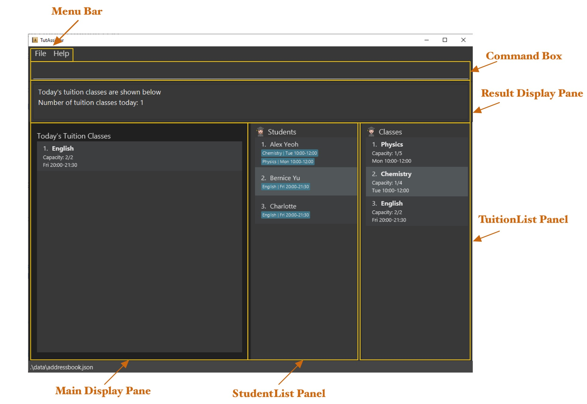
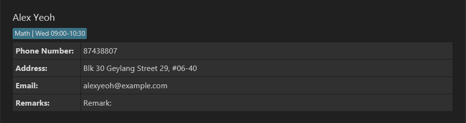

<p align="center">
  
</p>

Welcome to the _TutAssistor User Guide_! Simply choose a topic below to find answers, learn about the features, and manage tutoring better.

<div style="page-break-after: always;"></div>

# Table of Contents
1. [Introduction](#1-introduction)

   1.1 [What is TutAssistor?](#11-what-is-tutassistor)

   1.2 [What can TutAssistor do for you?](#12-what-can-tutassistor-do-for-you)
   
   1.3 [How to use this guide?](13-how-to-use-this-guide)

2. [Get started](#2-get-started)

   2.1 [Installation guide](#21-installation-guide)
  
   2.2 [Try it yourself!](#22-try-it-yourself)

3. <details open><summary><a href="#3-features">Features</a></summary><br>
   3.1 <a href="#31-add-studenttuition-class">Add student/class</a><br><br>
   3.2 <a href="#32-view-studenttuition-class">View student/class</a><br><br>
   3.3 <a href="#33-edit-studenttuition-class">Edit student/class</a><br><br>
   3.4 <a href="#34-delete-studenttuition-class">Delete student/class</a><br><br>
   3.5 <a href="#35-addremove-student-from-class">Move student</a><br><br>
   3.6 <a href="36-add-remark-to-studenttuition-class">Add remark</a><br><br>
   3.7 <a href="#37-find-studenttuition-class">Find students/classes</a><br><br>
   3.8 <a href="#38-list-all-studentstuition-classes">List students/classes</a><br><br>
   3.9 <a href="#39-sort-tuition-classes-sort--s">Sort classes</a><br><br>
   3.10 <a href="#310-view-timetable-timetable--tt">View timetable</a><br><br>
   3.11 <a href="#311-view-todays-classes-today--td">View today's classes</a><br><br>
   3.12 <a href="#312-view-help-help--h">View help</a><br><br>
   3.13 <a href="#313-navigate-input-history">Navigate Input History</a><br><br>
   3.14 <a href="#314-clear-data-clear">Clear data</a><br><br>
   3.15 <a href="#315-exit-the-app-exit">Exit the program</a><br><br>
   3.16 <a href="#316-track-payment-coming-in-v20" markdown="1">Track payment `coming in v2.0`</a><br></details><br>

4. <details open><summary><a href="#4-additional-command-format-information">Additional Command Format Information</a></summary><br>
   4.1 <a href="#41-name">Name</a><br><br>
   4.2 <a href="#42-phone-number">Phone Number</a><br><br>
   4.3 <a href="#43-email">Email</a><br><br>
   4.4 <a href="#44-timeslot">Timeslot</a><br><br>
   4.5 <a href="#45-index">Index</a><br></details><br>

5. [FAQ](#5-faq)

6. [Command Summary](#6-command-summary)

--------------------------------------------------------------------------------------------------------------------
<div style="page-break-after: always;"></div>

## 1 Introduction

### 1.1 What is TutAssistor?
Welcome to the user guide of TutAssistor!

Are you a private tutor struggling to keep track of all your classes and students? Do you spend 
countless hours on administrative duties such as scheduling classes and updating numerous students' records?

If the above situation sounds familiar to you, fret not, **TutAssistor** is here to save the day!

**TutAssistor** is a ***desktop app intended for private tutors like yourself to 
manage their students and classes, and it is optimized for use via a Command Line Interface (CLI)***.

**TutAssistor** uses Command Line Interface (CLI); this means that you operate the application by typing commands into a Command Box. 
If you are a fast typer, you can operate the application more easily and faster than
Graphical User Interface (GUI) applications; GUI applications allow users to interact 
with the application via graphical icons such as buttons.

You do not have to worry at all even if you are new to CLI applications as 
this user guide will take you through step by step on how various 
features of the **TutAssistor** can be utilised, all directed towards 
providing the best possible experience to the user.

### 1.2 What can TutAssistor do for you?

TutAssistor provides an all-in-one platform for you to manage information 
regarding your students and lessons stress-free and efficiently. In the latest version, we offer you the ability to: 

* Track student details
* Keep student details up-to-date
* Resolve conflicting tuition timeslots
* Efficiently create notes for each class/student
* View scheduled lessons in a timetable

### 1.3 How to use this guide?

#### Step-by-step guide for each feature

The features in this guide are formatted with the following conventions:

* **Command Keyword** - Each feature is executed by a command keyword. The shortcut for each command is shown together with its full command keyword separated by the <code>&#124;</code> symbol. You can use the command shortcuts to reduce typing. 
* **Command Format** - Each command is accompanied by a set of information that you provide. Refer to the [Features](#3-features) below for details of each command.
* **Examples** - Possible usage of each features are provided. You may follow these examples when familiarising with the app. 
* **Screenshots** - A visualisation of the expected outcome is provided for some features.


#### General symbols and syntax used in this guide

For additional information accompanying each segment, look for the following symbols:

Syntax | What it means 
-------|--------
&emsp; :information_source: | Precedes information that are useful to remember.
&emsp; :bulb: | Precedes information that serve as tips for a feature.
&emsp; :warning: | Precedes information as an important warning.


Jump right in to the next section: [2 Get Started](#2-get-started) to get you started!

--------------------------------------------------------------------------------------------------------------------
<div style="page-break-after: always;"></div>

## 2 Get Started

### 2.1 Installation guide

#### For Windows
1. Ensure you have Java 11 or above installed in your Computer. You may install it [here](https://www.oracle.com/java/technologies/downloads/).
2. Download the latest TutAssistor release from [our github site](https://github.com/AY2122S1-CS2103T-T12-4/tp/releases).
3. Double click the downloaded TutAssistor.jar file to launch TutAssistor.

#### For Mac
1. Ensure you have Java 11 or above installed in your Computer. You may install it [here](https://www.oracle.com/java/technologies/downloads/).
2. Download the latest TutAssistor release from [our github site](https://github.com/AY2122S1-CS2103T-T12-4/tp/releases).
3. Open Terminal.
4. Change the active directory to the location of TutAssistor.jar.

   For example,
    
   ```
   cd Downloads
   ```
4. Run the following command.
  
   ```
   java -jar TutAssistor.jar
   ```

After launching the app, the GUI similar to the one shown below should appear in a few seconds. Note how the app contains some sample data.

<p align="center"><i>Figure 1: GUI of TutAssistor</i></p>

Component | What it does
-------|--------
Help Window | Exits TutAssistor or views help.
Command Box | Keys in command.
Result Display Pane | Displays feedback of command to user.
TuitionList Panel | Displays all tuition classes.
StudentList Panel | Displays all students.
Main Display Pane | Displays today's lessons, tuition class's or student's details, or a timetable.


### 2.2 Try it yourself!

Once you have installed the latest TutAssistor, why not give it a try?

Type the command in the command box and press Enter to execute it. e.g. typing help and pressing **Enter** will open the help window.

Some example commands you can try:

* `student 1`: Views the first student shown in the student list.
* `add n/John Doe p/98765432 e/johnd@example.com a/John street, block 123, #01-01`: Adds a student named `John Doe` to the TutAssistor.
* `addtoclass si/3 tc/1`: Adds the 3rd student in the student list to the 1st class in the tuition class list.
* `deleteclass 2`: Deletes the 2nd class shown in the tuition class list.
* `clear`: Deletes all students and classes. Note that this action is irreversible.
* `exit`: Exits the app.

Now that you are more familiar with our app, make it yours! Head over to section [3 Features](#3-features) to learn more about the features TutAssistor can offer you!  

--------------------------------------------------------------------------------------------------------------------
<div style="page-break-after: always;"></div>

## 3 Features
<div markdown="block" class="alert alert-info">

**:information_source: Notes about the command format:**<br>

* Words in `UPPER_CASE` are the parameters to be supplied by the user.<br>
  e.g. in `add n/NAME`, `NAME` is a parameter which can be used as `add n/John Doe`.

* Items in square brackets are optional.<br>
  e.g `n/NAME [r/REMARK]` can be used as `n/John Doe r/student` or as `n/John Doe`.

* Items with `…`​ after them can be used zero or more times.<br>
  e.g. `si/STUDENT_INDEX [STUDENT_INDEX]…​` can be used as ` ` (i.e. 0 times), `si/1`, `si/1 2 3` etc.

* Parameters can be in any order.<br>
  e.g. if the command specifies `n/NAME p/PHONE_NUMBER`, `p/PHONE_NUMBER n/NAME` is also acceptable.

* If a parameter is expected only once in the command but you specified it multiple times, only the last occurrence of the parameter will be taken.<br>
  e.g. if you specify `p/12341234 p/56785678`, only `p/56785678` will be taken.

* Extraneous parameters for commands that do not take in parameters (such as `help`, `list`, `exit` and `clear`) will be ignored.<br>
  e.g. if the command specifies `help 123`, it will be interpreted as `help`.
   
Refer to the [Additional Command Format Information](#4-additional-command-format-information) under section 4 to learn the requirements of the various parameters used.
   
</div>

### 3.1 Add student/tuition class
#### Adding a student: `add` | `a`
Adds a student with the specified information such as name, phone number, etc. 
> [Read more on the requirements of the various parameters used.](#4-additional-command-format-information)

Format: `add n/NAME p/PHONE_NUMBER e/EMAIL a/ADDRESS [r/REMARK]`

Examples:

```
add n/John Doe p/98765432 e/johnd@example.com a/John street, block 123, #01-01
```
```
a n/Richard Ng p/97865342 e/richardng@example.com a/Yishun Ave 1 block 60, #07-12 r/Can only attend on even weeks
```

<div markdown="span" class="alert alert-primary">
:information_source: Note: `James Yeoh` and  <code>james &nbsp; yeoh</code> are considered the same person, namely `Name` is case-insensitive and the differences in whitespaces would not be considered.
</div>

#### Adding a tuition class: `addclass` | `ac`
Adds a tuition class with a set limit of students at a specified [timeslot](#44-timeslot). TutAssistor will notify you if there are any conflicting timeslots.

Format: `addclass n/NAME l/LIMIT ts/TIMESLOT [s/NAME,NAME,NAME...] [r/REMARK]`

* It is optional to add students into the class when creating a tuition class.
* The [timeslot](#44-timeslot) should follow the format "Ddd HH:mm-HH:mm".
* The limit of a class should not exceed 1000.

<div markdown="span" class="alert alert-primary">:bulb: **Tip:**
There should not be a space after each comma when listing multiple students.
</div>

Examples:
```
addclass n/Chemistry l/16 ts/Thu 15:00-17:00 s/Bernice Yu,Richard Ng
```
```
ac n/Math l/8 ts/Mon 11:00-14:00 r/Quiz on final lesson
```

### 3.2 View student/tuition class
Displays the details the specified student or class in the information page.

#### 3.2.1 Viewing a student: `student` | `vs`
Format: `student INDEX`

Example:
```
student 2
```
or
```
vs 2
```

<p align="center"><i>Figure 2: Displaying a student's details in the information page</i></p>

#### 3.2.2 Viewing a tuition class: `class` | `vc`
Format: `class INDEX`

Example:
```
class 3
```
or
```
vc 3
```

<p align="center"><i>Figure 3: Displaying details of a class in the information page</i></p>

### 3.3 Edit student/tuition class
Edits an existing student or tuition class.

<div markdown="span" class="alert alert-primary">
:information_source: Note: At least one parameter must be provided.
</div>

#### Editing a student: `edit` | `e`
Format: `edit INDEX [n/NAME] [p/PHONE] [e/EMAIL] [a/ADDRESS]`

Examples:
```
edit 1 n/Jason Tan a/221b Baker Street
```
or
```
e 1 n/Jason Tan a/221b Baker Street
```

<div markdown="span" class="alert alert-primary">
:information_source: Note: The edited name must be unique and should not be the same name of another existing student.
</div>


#### Editing a class: `editclass` | `ec`
Format: `editclass INDEX [n/NAME] [l/LIMIT] [ts/TIMESLOT]`

Examples:
```
editclass 3 n/Trigonometry ts/Sun 10:00-11:00
```
or

```
ec 3 n/Trigonometry ts/Sun 10:00-11:00
```
<div markdown="span" class="alert alert-primary">
:information_source: Note: The edited timeslot cannot conflict with an en existing timeslot of another class.
</div>

### 3.4 Delete student/tuition class
Deletes a student or a tuition class from TutAssistor.

* At least one student or class index must be provided.
   
* Provide multiple indices to delete multiple students or classes at once.

<div markdown="span" class="alert alert-primary">
:warning: THIS COMMAND IS IRREVERSIBLE. IT WILL DELETE ALL DATA OF THE IDENTIFIED STUDENT OR CLASS.
</div>

#### Deleting students: `delete` | `del`

Format: `delete STUDENT_INDEX [STUDENT_INDEX]...`

Example:
```
delete 1 2
```
or

```
del 1 2
```
An example output is shown below: <br>

<p align="center"><i>Figure 4: Example of executing `delete 1 2` command</i></p>

#### Deleting tuition classes: `deleteclass` | `delc`

Format: `deleteclass CLASS_INDEX [CLASS_INDEX]...`

Example:
```
deleteclass 1 2
```
or

```
delc 1 2
```

### 3.5 Add/Remove student from class

Moves a student to/from a class.

#### Adding existing students to a class: `addtoclass` | `atc`

Adds one or more existing students to an existing class.

<div markdown="block" class="alert alert-primary"> 
  
:information_source: Note: When adding multiple students at once:<br>
  
  * use commas(`,`) to separate names, with no spaces after each comma.
  
  * use spaces to separate indices.
  
</div>

Format:

`addtoclass si/STUDENT_INDEX [STUDENT_INDEX]... tc/CLASS_INDEX`

or

`addtoclass s/NAME[,NAME,NAME...] tc/CLASS_INDEX`

Examples:
```
addtoclass si/1 tc/1
```
```
atc si/1 2 3 4 tc/1
```
```
addtoclass s/James,Felicia tc/2
```
```
atc s/James tc/3
```

#### Removing existing students from a class: `remove` | `rm`

Removes an existing student from a tuition class.

Format: `remove si/STUDENT_INDEX [STUDENT_INDEX]... tc/CLASS_INDEX`

Examples:
```
remove si/1 tc/1
```
```
rm si/1 2 3 4 tc/2
```

### 3.6 Add remark to student/tuition class
Upon entering the command, a pop-up window with a text box is displayed for you to edit remarks.

<div markdown="span" class="alert alert-primary">:bulb: **Tip:**
Users can add, remove, or edit remarks through the editor window.
</div>


<p align="center"><i>Figure 5: Editing remarks with editor window</i></p>

<div markdown="span" class="alert alert-primary">
:warning: For MacOS users, the remarks editor may open as a new tab instead of a window, which can cause a UI bug where the buttons are not displayed correctly. To open as a new window instead, go to System preferences > General > Prefer tabs and choose never. 
</div>

#### Adding remark to a student: `remark` | `re`

Adds a remark for a student. 

Format: `remark STUDENT_INDEX`

Example:
```
remark 2
```
or
```
re 2
```

#### Adding remark to a tuition class: `remarkclass` | `rec`

Adds a remark for a tuition class.

Format: `remarkclass CLASS_INDEX`

Example:
```
remarkclass 2
```
or
```
rec 1
```

<div markdown="span" class="alert alert-primary">
:information_source: Note: When creating a new student or tuition class with the `add` command, you can use the optional `r/REMARK` parameter to add remarks  directly.
</div>

### 3.7 Find student/tuition class
Filters the list based on the given keywords. The keywords are case-insensitive.
<div markdown="span" class="alert alert-primary">
:information_source: Note: Keywords will be matched entirely. 
Example: A command `findclass phys` will not filter physics classes. 
</div>

#### Finding students by name: `find` | `f`
Displays a list of students whose name matches the given keywords.

Format: `find KEYWORD [KEYWORD]...`

Example: 
```
find alice tan
```
or
```
f alice tan
```
TutAssistor will display a list of all students with `alice` or `tan` in their name.

#### Finding classes by name: `findclass` | `fc`

Displays a list of classes whose name matches the given keywords.

Format: `findclass KEYWORD [KEYWORD]...`

Example: 
```
findclass physics chemistry
```
or
```
fc physics chemistry
```
TutAssistor will display a list of all classes with `physics` or `chemistry` in their name.


The filtered list should look similar to the example shown below: <br>

<p align="center"><i>Figure 6: Example of executing `find alice tan` command</i></p>

### 3.8 List all students/tuition classes
Shows the full list of students or classes.

#### Listing all students: `list` | `l`

Displays a list of all students.

Format: `list`

#### Listing all classes: `listclass` | `lc`

Displays list of all classes.

Format: `listclass`

### 3.9 Sort tuition classes: `sort` | `s`

Sorts tuition class list according to time or alphabetical order.

<div markdown="block" class="alert alert-primary"> 
  
:information_source: Note: <br>
  
  * After the user executes the `sort` command, the list will continue to remain sorted even after adding or editing classes.
  
  * The list will not be automatically sorted upon restarting TutAssistor, i.e., the user will have to execute the `sort` command again.

  * For alphabetical order, the sorting is case-insensitive. For example, `chem` is considered the same as `Chem`.

  * For time order, the sorting assumes Gregorian calendar format. i.e. Sunday is considered the start of a week and 
    Saturday is considered the end of a week.


</div>

The possible usages of `sort` are given below:
* `sort` sorts by time
* `sort o/asc` sorts by ascending alphabetical order
* `sort o/desc` sorts by descending alphabetical order
* `sort o/time` sorts by time

### 3.10 View timetable: `timetable` | `tt`
Shows classes scheduled in this week in a timetable.

Format:
```
timetable
```
<div markdown="block" class="alert alert-primary"> 
  
:information_source: Note: <br>
  
  If a lesson is shorter than one hour, the timetable may not display its details properly, such as using smaller font size or omitting the details completely due to limited space in the time block.
  
  For example, in Figure 7 below, the class on Monday, 15:00-15:15 is only 15 minutes and thus not displayed with details.
</div>


<p align="center"><i>Figure 7: A timetable view of all tuition classes in a week</i></p>

### 3.11 View today's classes: `today` | `td`
Displays an overview of all classes happening today. <br>
Also, a reminder of classes happening today will be displayed
when the TutAssistor is reopened.


<p align="center"><i>Figure 8: List view of all the classes scheduled today</i></p>

### 3.12 View help: `help` | `h`

Shows a command summary, as well as a link to the user guide. <br>

Format: `help`


<p align="center"><i>Figure 9: The help window</i></p>

### 3.13 Navigate input history

When typing in the command box, use the **up** and **down** arrow keys to access and navigate through previously entered inputs.

### 3.14 Clear data: `clear`
Clears all current student and tuition class data.

Format: `clear`

<div markdown="span" class="alert alert-primary">
:warning: THIS COMMAND IS IRREVERSIBLE. IT WILL DELETE ALL EXISTING STUDENT AND CLASS DATA.
</div>

### 3.15 Exit the app: `exit`

Exits the program.

Format: `exit`

### 3.16 Track payment `coming in v2.0`
_Details coming soon..._

--------------------------------------------------------------------------------------------------------------------
<div style="page-break-after: always;"></div>

## 4 Additional Command Format Information

The requirements of the various parameters used are explained below. Head back to [Features](#3-features) to refer to general notes on the command format.

### 4.1 Name

Student name is unique, i.e., there cannot be 2 or more students registered with the same name. TutAssistor ignores
letter case and trivial whitespaces when it checks for duplicate names.

Note that if you successfully add a student, the name will appear exactly as what you typed, including trivial whitespaces.

For example, when adding a new student, given an existing student named `John Doe`, 

- Valid: `John Doe the Great` 
- Invalid: `john doe`, <code>John &ensp; Doe</code>

Names for tuition classes may be reused.

For example, given an existing class named `Biology`, you may add a new class also named `Biology`.

### 4.2 Phone Number
Phone number should only contain digits, and should be at least 3 digits long.

### 4.3 Email
Email should be of the format `local-part@domain` and adhere to the following constraints:
1. The `local-part` should only contain alphanumeric characters and these special characters, `+` `_` `.` `-`. The `local-part` may not start or end with any special characters.
2. This is followed by a `@` and then a `domain` name. The domain name is made up of domain labels separated by periods.
   The domain name must:
    - end with a domain label at least 2 characters long
    - have each domain label start and end with alphanumeric characters
    - have each domain label consist of alphanumeric characters, separated only by hyphens, if any

### 4.4 Timeslot
Timeslot for classes follows the format:
```
Ddd HH:mm-HH:mm
```
where
- `Ddd` is the day of the week, **abbreviated to the first three letters, with only the first letter capitalised**.

    Examples:
    - Correct: `Mon`, `Tue`, `Wed`, `Thu`, `Fri`, `Sat`, `Sun`
    - Incorrect: `mon`, `tuesday`, `WED`, `Thurs`, `Friday`, etc
- `HH:mm` is the time with 2 digits for the hour and 2 digits for the minute. The first time must be earlier in the day than the second time.

    Examples:
    - Correct: `09:00-14:30`
    - Incorrect: `9:00-14:00`, `9am-2pm`, `9-2`, `09:00-08:00`

### 4.5 Index
Index for a student or tuition class must be a positive integer, starting from `1`. It must not exceed the size of the list.

For example, if the list consists of `5` students/tuition classes:
- Correct: `1`, `2`, `3`, `4`, `5`
- Incorrect: `0`, `1.5`, `a`, `6`, etc.

--------------------------------------------------------------------------------------------------------------------
<div style="page-break-after: always;"></div>

## 5 FAQ

**Q**: How do I transfer my data to another Computer?<br>
**A**: Install the app in the other computer and overwrite the empty data file it creates with the file that contains the data of your previous TutAssistor home folder.<br>

**Q**: Do I lose all the details of classes and students when I close the application?<br>
**A**: All of your data is stored locally in a file under the data folder and will be loaded upon the next entry,
hence you do not lose any data.<br>

**Q**: What should I do if I am unsure of the command formats?<br>
**A**: Please type `help` to learn the command formats.<br>

--------------------------------------------------------------------------------------------------------------------
<div style="page-break-after: always;"></div>

## 6 Command Summary

Head back up to section [3 Features](#3-features) to refer to notes about the command format.

Action | Format | Shortcut
-------|--------|---------
[***Add Student***](#31-add-studenttuition-class) | `add n/NAME p/PHONE_NUMBER e/EMAIL a/ADDRESS [r/REMARK]` | `a`
[***Add Class***](#31-add-studenttuition-class) |`addclass n/NAME l/LIMIT ts/TIMESLOT [s/NAME,...] [r/REMARK]` | `ac`
[***View Student***](#32-view-studenttuition-class) | `student INDEX` | `vs`
[***View Class***](#32-view-studenttuition-class) | `class INDEX` | `vc`
[***Edit Student***](#33-edit-studenttuition-class) | `edit INDEX [n/NAME] [p/PHONE] [e/EMAIL] [a/ADDRESS]` | `e`
[***Edit Class***](#33-edit-studenttuition-class) | `editclass INDEX [n/NAME] [l/LIMIT] [ts/TIMESLOT]` | `ec`
[***Delete Student***](#34-delete-studenttuition-class) | `delete STUDENT_INDEX [STUDENT_INDEX]...` | `del`
[***Delete Class***](#34-delete-studenttuition-class) | `deleteclass CLASS_INDEX [CLASS_INDEX]...` | `delc`
[***Add Student to Class***](#35-addremove-student-from-class) | `addtoclass si/STUDENT_INDEX [STUDENT_INDEX]... tc/CLASS_INDEX`<br>or<br>`addtoclass s/NAME[,NAME...] tc/CLASS_INDEX` | `atc`
[***Remove Students from Class***](#35-addremove-student-from-class) | `remove si/STUDENT_INDEX [STUDENT_INDEX]... tc/CLASS_INDEX` | `rm`
[***Add Remarks to Student***](#36-add-remark-to-studenttuition-class) | `remark STUDENT_INDEX` | `re`
[***Add Remarks to Class***](#36-add-remark-to-studenttuition-class) | `remarkclass CLASS_INDEX` | `rec`
[***Find Student by Name***](#37-find-studenttuition-class) | `find KEYWORD [KEYWORD]...` | `f`
[***Find Class by Name***](#37-find-studenttuition-class) | `findclass KEYWORD [KEYWORD]...` | `fc`
[***List all Students***](#38-list-all-studentstuition-classes) | `list` | `l`
[***List all Classes***](#38-list-all-studentstuition-classes) | `listclass` | `lc`
[***Sort Tuition Class***](#39-sort-tuition-classes-sort--s) | `sort [o/ORDER]` | `s`
[***View Timetable***](#310-view-timetable-timetable--tt) | `timetable` | `tt`
[***View Today's Classes***](#311-view-todays-classes-today--td) | `today` | `td`
[***Help***](#312-view-help-help--h) | `help` | `h`
[***Clear all data***](#314-clear-data-clear) | `clear` | -
[***Exit***](#315-exit-the-app-exit) | `exit` | -

