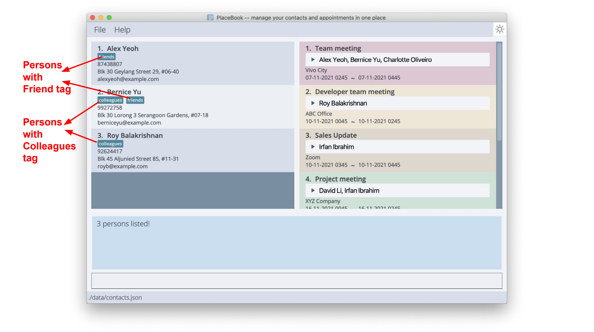
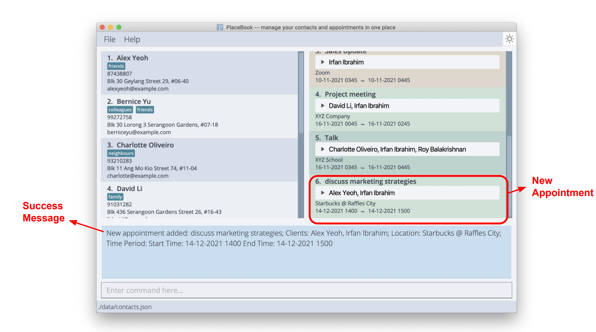
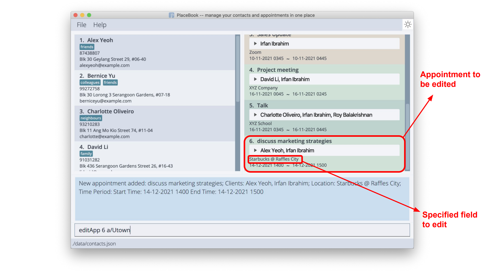
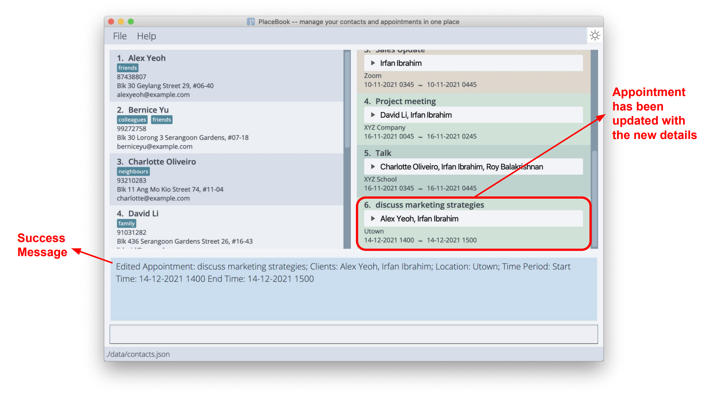
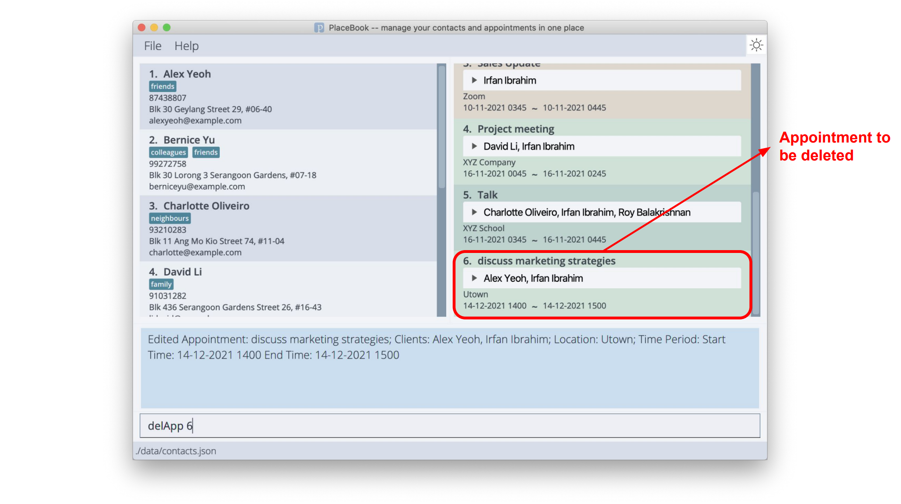
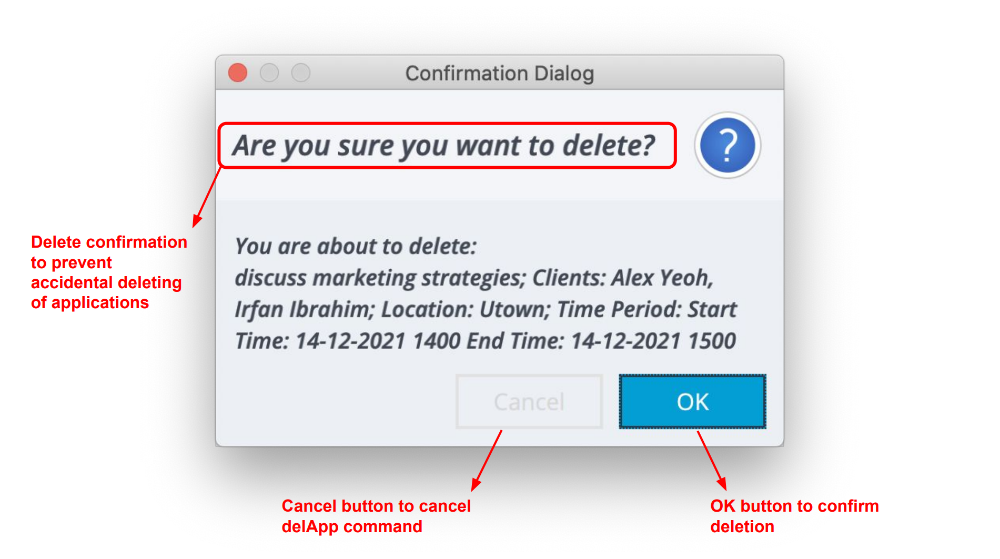
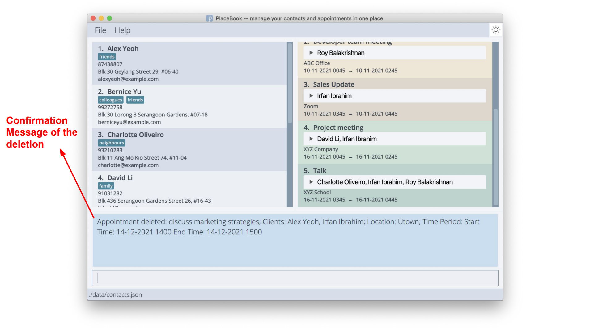
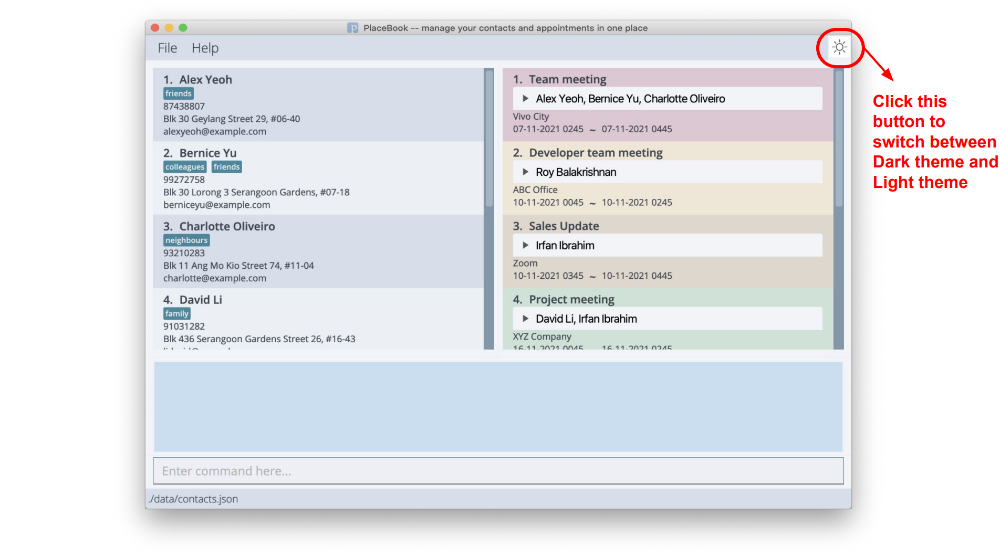
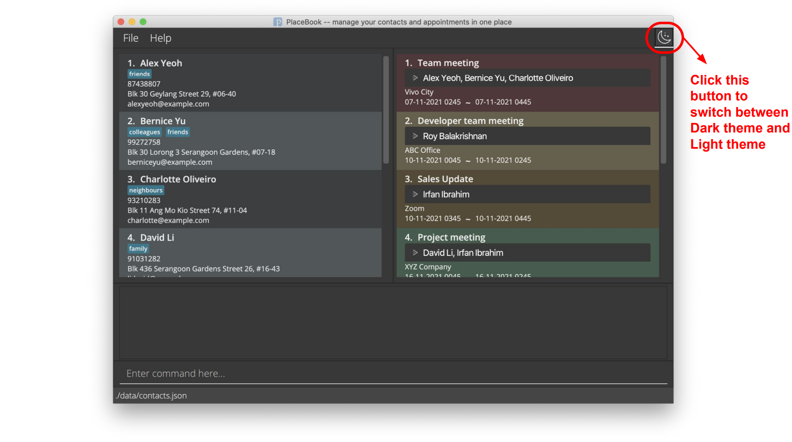

**PlaceBook (PB) is a desktop app for managing contacts and appointments, optimized for use via a Command Line Interface (CLI) while still having the benefits of a Graphical User Interface (GUI).** If you can type fast, PB can get your contact management tasks done faster than traditional GUI apps.

It is most beneficial to Sales or Marketing staff who have to manage various appointments with potential clients and customers on a daily basis.

* Table of Contents
{:toc}

--------------------------------------------------------------------------------------------------------------------

## Quick start

1. Ensure you have Java `11` or above installed in your Computer.

1. Download the latest `placebook.jar` from [here](https://github.com/AY2122S1-CS2103T-T12-3/tp/releases).

1. Copy the file to the folder you want to use as the _home folder_ for your PlaceBook.

1. Double-click the file to start the app. The GUI similar to the below should appear in a few seconds. Note how the app contains some sample data. 
   

1. Type the command in the command box and press Enter to execute it. e.g. typing **`help`** and pressing Enter will open the help window. 
   Some example commands you can try:

   * **`list`** : Lists all contacts.

   * **`add`**`n/John Doe p/98765432 e/johnd@example.com a/John street, block 123, #01-01` : Adds a contact named `John Doe` to the PlaceBook.

   * **`delete`**`3` : Deletes the 3rd contact shown in the current list.

   * **`clear`** : Deletes all contacts.

   * **`exit`** : Exits the app.

1. Refer to the [Features](#features) below for details of each command.

--------------------------------------------------------------------------------------------------------------------

## Reading the document

This purpose of this section is to provide you with definitions of syntax, data formats that would be used in 
the next section [Features](#features) which contains detailed information on all the commands provided in PlaceBook.

### Syntax and symbols

The table below contains definitions of syntax used in the command format.

Syntax | Definition
-------|-----------
`n/, p/, etc...` | Words or letters followed by a slash refer to parameter tags.   e.g. `n/` refers to the name parameter.
`UPPER_CASE` | Words in `UPPER_CASE` are the parameters to be supplied by the user.   e.g. in `add n/NAME`, `NAME` is a parameter which can be used as `add n/John Doe`.
`[]` | Words in square brackets are optional.    e.g `n/NAME [t/TAG]` can be used as `n/John Doe t/friend` or as `n/John Doe`.
`...` | Items with `…`​ after them can be used multiple times including zero times.  e.g. `[t/TAG]…​` does not need to be present and can be omitted (i.e. 0 times), `t/friend`, `t/friend t/family` etc.

### Data format

The table below contains definitions of data formats used in various parameters in the command format.

Parameter | Data format
----------|------------
`INDEX` | Positive integers, e.g. 1,2,3, ...
`DATETIME` | dd-MM-yyyy HHmm, e.g. 03-11-2021 1730 represents 3 November 2021 5.30 pm   **Notes:** The format uses the 24 hour clock formats. Don't forget that there are only 12 months in a year
`EMAIL` | Emails should be of the format local-part@domain. e.g. Johnny@gmail.com
`Others` | All other parameters will take any alphanumeric characters and special characters as input. 

### Additional notes

* Parameters can be in any order. 
  e.g. if the command specifies `n/NAME p/PHONE_NUMBER`, `p/PHONE_NUMBER n/NAME` is also acceptable.

* If a parameter is expected only once in the command, but you specified it multiple times, only the last occurrence of the parameter will be taken. 
  e.g. if you specify `p/12341234 p/56785678`, only `p/56785678` will be taken.

* Extraneous parameters for commands that do not take in parameters (such as `help`, `list`, `exit` and `clear`) will be ignored. 
  e.g. if the command specifies `help 123`, it will be interpreted as `help`.
  
* If there is any error in command format, PlaceBook will notify you and show you the correct format, and provide an example.

* Some commands will have some command specific errors, which will be elaborated on in [Features](#features), to help you troubleshoot.
  
--------------------------------------------------------------------------------------------------------------------

## Features

### **Contact Features**
This section contains information on features related to adding contacts to the contact list.

#### Adding a person: `add`

Adds a person to the PlaceBook.

Format: `add n/NAME p/PHONE_NUMBER e/EMAIL a/ADDRESS [t/TAG]…​`

:bulb: **Tip:**
A person can have any number of tags (including 0)

Examples:
* `add n/John Doe p/98765432 e/johnd@example.com a/John street, block 123, #01-01`
* `add n/Betsy Crowe t/friend e/betsycrowe@example.com a/Newgate Prison p/1234567 t/criminal`

Error Messages:
* Emails should be of the format local-part@domain...
    * This error occurs when an invalid email format is entered. 
    * Please enter the correct email format, e.g. Johnny@gmail.com.
    
* Tag names should be alphanumeric
    * There may be some special characters in the tag input, e.g.!@#*
    * There should be no spaces in tags, e.g. close friend, is invalid.

#### Listing all persons : `list`

Shows a list of all persons in the PlaceBook.

Format: `list`

#### Editing a person : `edit`

Edits an existing person in the PlaceBook.

Format: `edit INDEX [n/NAME] [p/PHONE] [e/EMAIL] [a/ADDRESS] [t/TAG]…​`

* Edits the person at the specified `INDEX`. The index refers to the index number shown in the displayed person list. The index **must be a positive integer** 1, 2, 3, …​
* At least one of the optional fields must be provided.
* Existing values will be updated to the input values.
* When editing tags, the existing tags of the person will be removed i.e. adding of tags is not cumulative.
* You can remove all the person’s tags by typing `t/` without
    specifying any tags after it.

Examples:
*  `edit 1 p/91234567 e/johndoe@example.com` Edits the phone number and email address of the 1st person to be `91234567` and `johndoe@example.com` respectively.
*  `edit 2 n/Betsy Crower t/` Edits the name of the 2nd person to be `Betsy Crower` and clears all existing tags.

Error Messages:
* Emails should be of the format local-part@domain...
    * This error occurs when an invalid email format is entered.
    * Please enter the correct email format, e.g. Johnny@gmail.com.

* Tag names should be alphanumeric
    * There may be some special characters in the tag input, e.g.!@#*
    * There should be no spaces in tags, e.g. close friend, is invalid.
    
* The person index provided is invalid.
    * The index inputted may be out of the range of the displayed list indexes.

#### Locating persons by name: `find`

Finds persons whose names contain any of the given keywords.

Format: `find KEYWORD [MORE_KEYWORDS]`

* The search is case-insensitive. e.g. `hans` will match `Hans`
* The order of the keywords does not matter. e.g. `Hans Bo` will match `Bo Hans`
* Only the name is searched.
* Only full words will be matched e.g. `Han` will not match `Hans`
* Persons matching at least one keyword will be returned (i.e. `OR` search).
  e.g. `Hans Bo` will return `Hans Gruber`, `Bo Yang`

Examples:
* `find alex` returns `Alex Yeoh` 
  

#### Locating persons by tags: `findTags`

Finds persons whose tags contain any of the given keywords.

Format: `findTags KEYWORD [MORE_KEYWORDS]…​`

* The search is case-insensitive. e.g. `fRieNds` will match `friends`
* Only the tags are searched.
* Only full words will be matched e.g. `colleague` will not match `colleagues`
* Persons matching at least one tag keyword will be returned (i.e. `OR` search).
  e.g. `friends colleagues` will return persons with either `friends`, `colleagues` or both tags

Examples:
* `findTags friends` returns `Alex Yeoh` and `Bernice Yu`, who both have the `friends` tag

* `findTags friends colleagues` returns `Alex Yeoh`, `Bernice Yu` and `Roy Balakrishnan`, who all have either
one or both of the `friends` and `colleagues` tags

#### Deleting a person : `delete`

Deletes the specified person from the PlaceBook.

Format: `delete INDEX`

* Deletes the person at the specified `INDEX`.
* The index **must be a positive integer** 1, 2, 3, …​

Error messages:
* The person index provided is invalid.
    * The index inputted may be out of the range of the displayed list indexes.

> **Note:** The index refers to the index number shown in the displayed person list.

Examples:
* `list` followed by `delete 2` deletes the 2nd person in the PlaceBook.
* `find Betsy` followed by `delete 1` deletes the 1st person in the results of the `find` command.

### **Appointment Features**
This section contains information on features related to adding appointments to the appointment list.

#### Adding an appointment: `addApp`

Adds an appointment for the specified person or persons identified using a list of index(es) with 
the datetime field(dd-MM-yyyy HHmm), with time being in the 24-hour format e.g. 1530, 
and description to the appointment list.

Format: `addApp id/INDEX[INDEX,INDEX,INDEX…​] a/ADDRESS start/DATETIME end/DATETIME ds/DESCRIPTION`

Examples:
* `addApp id/1,5 a/Starbucks @ Raffles City start/14-12-2021 1400 end/14-12-2021 1500 ds/discuss marketing strategies`
creates an appointment with Alex Yeoh and Irfan Ibrahim on 14-12-2021 at 1400 hrs to discuss marketing strategies

Error messages:
* The person index provided is invalid.
    * The index inputted may be out of the range of the displayed list indexes.
* DateTime format should be "dd-MM-yyyy HHmm"
    * A common error would be not putting a 0 before numbers less than 10, e.g. 3rd March 2022 9.05 am should be represented as 03-03-2022 0905.
    * Ensure there is a space between the date section and the time section.
* Clashing appointment Timings
    * The appointment you are trying to add clashes with an existing appointment.

#### Editing an appointment: `editApp`

Edits an appointment in PlaceBook.

Format: `editApp INDEX [a/ADDRESS] [start/DATETIME] [end/DATETIME] [ds/DESCRIPTION]`

* Edits the appointment at the specified `INDEX`.
* At least one of the optional fields must be provided.
* Existing values will be updated to the input values.
* The persons in the appointment will remain the same.

Examples:
* `editApp 6 a/Utown` edits the details of a prior created group appointment, changing it to meet at UTown, while the other fields remain
the same

Before:

After:

Error messages:
* The appointment index provided is invalid.
    * The index inputted may be out of the range of the displayed list indexes.
* DateTime format should be "dd-MM-yyyy HHmm"
    * A common error would be not putting a 0 before numbers less than 10, e.g. 3rd March 2022 9.05 am should be represented as 03-03-2022 0905.
    * Ensure there is a space between the date section and the time section.
* Clashing appointment Timings
    * The appointment timing you are trying to edit clashes with an existing appointment.
* End time before Start time
    * The appointment timing you are trying to edit has an End time which is earlier than the Start time.

#### Deleting an appointment: `delApp`

* Deletes an appointment at the specified `INDEX`
* A popup will appear asking for confirmation before actually deleting the appointment.
* If the user chooses to cancel the deletion, the appointment will not be deleted.
* The index refers to the index number shown in the displayed person list.
* The index **must be a positive integer** 1, 2, 3, …​

Format: delApp INDEX

Examples:
* `delApp 6` and the user selects 'OK' in the popup

Error messages:
* The appointment index provided is invalid.
    * The index inputted may be out of the range of the displayed list indexes.

Before:

Confirmation:

After:

#### Locating appointments by description: `findApp`

Finds appointments whose descriptions contain any of the given keywords.

Format: `findApp KEYWORD [MORE_KEYWORDS]`

* The search is case-insensitive. e.g. `meeting` will match `Meeting`
* The order of the keywords does not matter. e.g. `Meeting online` will match `online meeting`
* Only the description is searched.
* Only full words will be matched e.g. `meet` will not match `meeting`
* Appointments matching at least one keyword will be returned (i.e. `OR` search).
  e.g. `Zoom meeting` will return `Zoom talk`, `offline meeting`

Examples:
* `findApp zoom` returns `Zoom` and `Zoom meeting`
* `findApp meeting talk` returns `sales talk`, `urgent meeting` 

#### Listing all appointments : `listApp` 

Show all the appointments in the appointment list currently.
List is sorted by Date, Time and Description baseline. Can optionally add a condition
to sort List by, if an invalid condition is input, it will sort by baseline conditions

Format: `listApp` Optional: `listApp Time` or `listApp Description`

### **Other Features**

#### Clearing all entries : `clear`

Clears all contacts and appointments from PlaceBook.

Format: `clear`

#### Undo the previous command : `undo`

If you execute a command by mistake, such as accidentally deleting a person or an appointment,
you can easily undo this command and go back to where you were before executing that command
by typing `undo` in the text box and pressing enter.

Format: `undo`

Error messages:
* No history states.
    * It means there are no more commands to undo, and you are at the initial state.

Before:

After:

#### Command history navigation

Using the keyboard `UP` and `DOWN` arrow buttons, you can easily navigate through the command that you previously entered.
This can be very helpful when you are doing repetitive task such as adding multiple person or appointment.

:bulb: **Tip:**
Please note that the command history will not be saved in the data file. 
So you will not be able to get your command history if you exit PlaceBook and open it again.

#### Viewing help : `help`

Shows a message explaining how to access the help page.

Format: `help`

#### Changing Dark and Light Theme

You may notice the 'sun' or 'moon' button located at the top right of PlaceBook.
Simply click that to toggle PlaceBook between Dark and Light Theme.
PlaceBook aims to support your work in different lighting environments and boost your productivity.

 Light Theme
 
 Dark Theme
 

#### Exiting the program : `exit`

Exits the program.

Format: `exit`

#### Saving the data

PlaceBook data will be saved in the hard disk automatically after any command that changes the data. There is no need to save manually.

#### Editing the data file

Advanced users are welcome to update data directly by editing that data file.
PlaceBook Person and Appointment data will be saved in two separate JSON files, locations in the table below.

Data | File Location
-----|--------------
Person | `[JAR file location]/data/contacts.json`
Appointment | `[JAR file location]/data/schedule.json`

**Take Note:** If you delete a person which is still contained in appointments, PlaceBook will add that person back to the contacts upon start-up.

:exclamation: **Caution:**
If your changes to the data file makes its format invalid, PlaceBook will discard all data and start with an empty data file at the next run. 
Invalid changes include creating duplicate entries in any of the JSON files, or creating Appointments with time conflicts in the `schedule.json` file

:exclamation: **Caution:**
In the case that PlaceBook cannot find any data files, PlaceBook will attempt to create Sample data for the user. 
If the schedule.json file is missing but the contacts.json file is correctly read, there will not be any Sample schedule made. 
In all other cases (i.e. both files missing, or only contacts.json missing), both Sample contacts and Sample schedule will be created.

--------------------------------------------------------------------------------------------------------------------

## FAQ

**Q**: How do I transfer my data to another Computer? 
**A**: Install the app in the other computer and overwrite the empty data file it creates with the file that contains 
the data of your previous PlaceBook home folder.

**Q**: Will I be notified if I edit an appointment and the timing clashes with another appointment? 
**A**: Yes, there will be a message saying that there is an existing conflicting appointment.

**Q**: Can I still use my mouse when using PlaceBook? 
**A**: Yes, you are still able to use your mouse for certain functionalities such as scrolling lists.

**Q**: Is there a way for me to share my PlaceBook data with other people? 
**A**: Yes, similarly to how you transfer data from one computer to another, you can simply send the data file to 
others, and then get them to download another PlaceBook jar file, then replace the data file with the one you sent.

**Q**: Is there a way we can see all our appointments in a calendar grid view? 
**A**: We do not currently have a calendar view function, but we are looking into implementing it in the future. 
However, we remain adamant that Listview is better than Calenderview because it allows all appointments to be seen 
clearly at one centralized place.

--------------------------------------------------------------------------------------------------------------------

## Command summary

Action | Format, Examples
--------|------------------
**Add** | `add n/NAME p/PHONE_NUMBER e/EMAIL a/ADDRESS [t/TAG]…​`   e.g., `add n/James Ho p/22224444 e/jamesho@example.com a/123, Clementi Rd, 1234665 t/friend t/colleague`
**AddApp** | `addApp id/INDEX[INDEX,INDEX,INDEX...] a/ADDRESS start/DATETIME ti/DATETIME ds/DESCRIPTION`   e.g., `addApp id/1,2,3 a/Starbucks @ Raffles City start/01-01-2021 1400 end/01-01-2021 1500 ds/discuss marketing strategies`
**Clear** | `clear`
**Delete** | `delete INDEX`  e.g., `delete 3`
**DelApp** | `delApp INDEX`   e.g., `delApp 1`
**Edit** | `edit INDEX [n/NAME] [p/PHONE_NUMBER] [e/EMAIL] [a/ADDRESS] [t/TAG]…​`  e.g.,`edit 2 n/James Lee e/jameslee@example.com`
**EditApp** | `editApp INDEX [a/ADDRESS] [start/DATETIME] [end/DATETIME] [ds/DESCRIPTION]`   e.g., `editApp 1 a/UTown start/10-11-2021 1400 ds/discuss UG and DG stuff`
**Find** | `find KEYWORD [MORE_KEYWORDS]`  e.g., `find James Jake`
**FindTags** | `findTags KEYWORD [MORE_KEYWORDS]`   e.g., `findTags friends`
**FindApp** | `findApp KEYWORD [MORE KEYWORDS`  e.g., `findApp Zoom Meeting`
**List** | `list`
**ListApp** | `listapp [Date / Duration]`
**Help** | `help`

