
Welcome to the SportsPA User Guide!

SportsPA is a desktop application targeted for use among NUS sports CCA Leaders. It manages membership and
training sessions for NUS sports CCAs. SportsPA allows you to keep track of details of your members as well as
facilities to hold training sessions at. With SportsPA, you will be able to quickly organise training sessions as we
help you allocate available members into the various facilities according to their specified capacity.

SportsPA mainly uses a CLI (Command Line Interface), meaning that you simply have to type in commands to use it. This user
guide provides an in-depth documentation on all the commands available. If this is your first time using SportsPA,
we also provide a [quick start guide](#quick-start) that demonstrates the end-to-end setup process to get you started.

_____________________________________________________________________________________________________________

Table of Contents

* Table of Contents
{:toc}
_____________________________________________________________________________________________________________
## How to use the User Guide

You can click on the links in the [Table of Contents](#table-of-contents) to quickly navigate to your desired location in
this User Guide. A link to return to the [Table of Contents](#table-of-contents) is also provided at the end of every section.
 
The table below summarizes the meaning of the icons and text styles used throughout this User Guide.
 

Icon / Text Style | Description
----------------- | ------------------
**bold**        | Highlights important information such as components of SportsPA or constraints of command parameters
`inline code`          | Represents commands in the format that you should follow when typing them
UPPER_CASE     | Represents parameters to be supplied by you for commands
[link](#table-of-contents) | Represents links that can be clicked on to navigate to a relevant section of the User Guide or a different website
**:information_source: Notes:** | Represents important information regarding commands such as their format and constraints
**:exclamation: Caution:**| Represents warnings for actions that can result in the unintentional and irreversible removal of data or affect the result of a previously executed command
**:bulb: Tip:**| Represents useful tips that we would like to share
:camera: | Signifies that a screenshot of the outcome of the command is provided below

[Back to Table of Contents](#table-of-contents)

_____________________________________________________________________________________________________________
## Quick Start

1. Ensure you have Java `11` or above installed on your Computer. If you are unsure of how to do so, refer to the [FAQ](#faq).

2. Download the latest `SportsPA.jar` from [here](https://github.com/AY2122S1-CS2103T-W12-1/tp/releases/tag/v1.3.1).

3. Copy the file to the folder you want to use as the _home folder_ for SportsPA.

4. Double-click the file to start the app. You should see a graphical interface similar to the image below appear in a few seconds. SportsPA
   provides some sample data for you to play around with and familiarize yourself with the commands.

   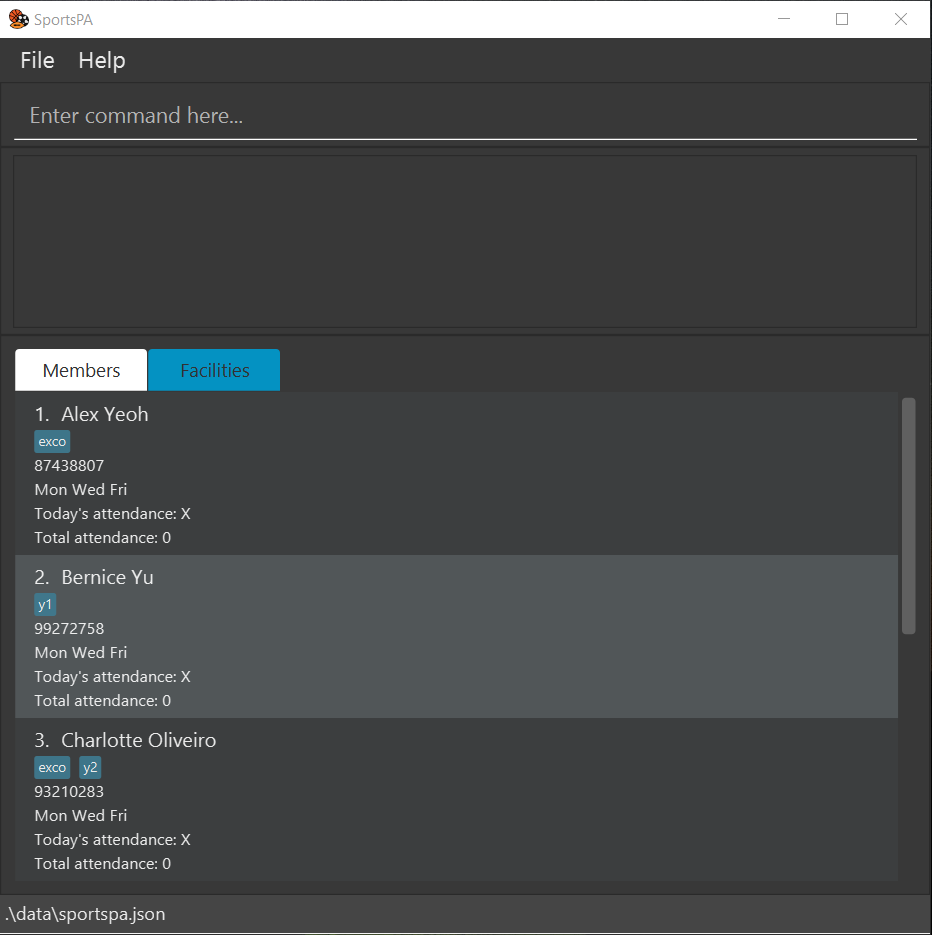

[Back to Table of Contents](#table-of-contents)

_____________________________________________________________________________________________________________

## Using SportsPA's Interface

While SportsPA has a GUI (Graphical User Interface) to display data and messages, you interact with it mainly
by typing. The figure below provides an overview of the key components in our interface.   

Typically, to execute a command, this is how you interact with the interface:

1. Type the desired command into the **Command Window** and press **Enter** on your keyboard.
2. The results of the command (or any warning messages generated) are displayed in the **Result Window**.
3. Any changes made to the data will be reflected accordingly in the **List Window**.

SportsPA stores two lists - **Members** and **Facilities**, which you can freely switch between by clicking on the respective **Tabs**. Alternatively, whenever you execute a member-specific or facility-specific command, SportsPA automatically switches to the relevant tab for you.

Here are some example commands you can try:

* **`help`** : Displays help window.

* **`listm`** : Lists all members.

* **`listf`** : Lists all facilities.

* **`addf n/Court 1 l/University Sports Centre t/1700 c/10`** : Adds the facility named `Court 1` to the facilities
  list.

* **`deletem 3`** : Deletes 3rd member in the members list.

* **`exit`** : Exits the app.

[Back to Table of Contents](#table-of-contents)

--------------------------------------------------------------------------------------------------------------------

## Features

This section documents all the commands available in SportsPA, guiding you through its function, format, example usages
and any other noteworthy tips. **Note that examples ending with :camera: means that a screenshot of the outcome is provided below.**

For a summary of all the commands, refer to the [Command Summary](#command-summary). If this
is your first read, do go through the following notes about the command format to help you better understand the
documentation.

**:information_source: Notes about the command format:** 

* Characters with the slash symbols are used to indicate the type of parameter supplied by the user.
    e.g. in `addm n/NAME p/PHONE_NUMBER`, `n/` and `p/` are the symbols used before entering a parameter for `NAME`
  and `PHONE_NUMBER` respectively.

* Words in `UPPER_CASE` are the parameters to be supplied by the user. 
  e.g. in `deletem INDEX`, `INDEX` is a parameter which can be used as `deletem 1`.

* Items in square brackets are optional. 
  e.g. `n/NAME p/PHONE_NUMBER [d/DAY(S)] [t/TAG]...` can be used as `n/Ben p/91111111 d/1` or as `n/John p/91111111` or
  as `n/John p/91111111 t/exco`.

* Items with `...` after them can be used multiple times including zero times, by repeating the character with slash symbol,
  if present, and the parameter. 
  e.g. `[t/TAG]...` can be used as ` `(i.e. 0 times), `t/exco`, `t/exco t/y2`etc.

* Parameters with `(S)` at the end, can be supplied one or more times without repeating the characters with slash
  symbols. 
  e.g. `d/DAY(S)` can be used as `d/1`, `d/1 2`, etc.

* Parameters with the slash symbols can be in any order. 
  e.g. if the command specifies `n/NAME l/LOCATION`, `l/LOCATION n/NAME` is also acceptable.

* If a parameter is expected only once in the command but you specified it multiple times, only the last occurrence of
  the parameter wll be taken. 
  e.g. if you specify `p/12341234 p/56785678`, only `p/56785678` will be taken.

* Extraneous parameters for commands that do not take in parameters (such as `help`, `listf`, `clearm` and `exit`) will
  be ignored. 
  e.g. if the command specifies `help 123`, it will be interpreted as `help`.

### Member-Specific Features

#### Adding a member: `addm`

Adds a member to your members list.

Format: `addm n/NAME p/PHONE_NUMBER [d/DAY(S)] [t/TAG]...`

* `DAY(S)` specifies the days when the member is available for that week
* `DAY(S)` should be provided as a numerical index, where `1` represents Monday, `2` represents Tuesday … and `7` represents
  Sunday and **must be separated by a single space** e.g. `d/1 2 3`
* Members added without `DAY(S)` will have no available days by default

**:information_source: Note:** You will not be able to add members with the same `NAME` or `PHONE_NUMBER` into the member list as they are
considered duplicates.

Examples:

* `addm n/Bob Chia p/91228372` adds Bob Chia to the member list with zero available days by default
* `addm n/John Tan p/91234567 d/1 3 5` adds John Tan to the member list and indicates his availability on Monday, Tuesday and
  Friday
* `addm n/Harry Li p/91234567 d/1 t/exco t/y2` adds Harry Li to the member list, indicates his availability on Monday and tags him as 'exco' and 'y2' :camera:

   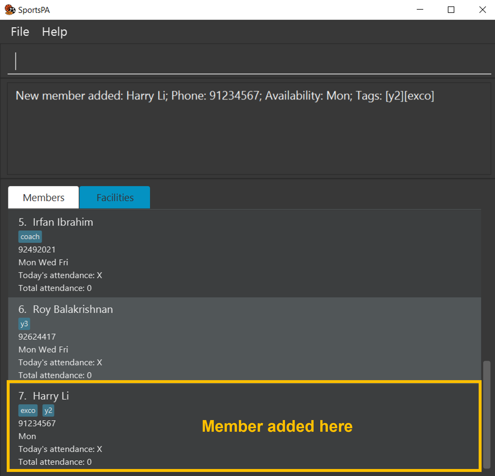

[Back to Table of Contents](#table-of-contents)

#### Listing all members: `listm`

Shows a list of your members.

Format: `listm`

[Back to Table of Contents](#table-of-contents)

#### Deleting a member: `deletem`

Deletes a member from your member list.

Format: `deletem INDEX`

* Deletes the member at the specified `INDEX`
* The index refers to the index number shown in the displayed member list
* The index **must be a positive integer** 1, 2, 3, …​

**:information_source: Note:** Deleting a member will automatically remove them from any facilities they were allocated to.

Examples:

* `listm` followed by `deletem 2` deletes the member at index 2 of the member list
* `findm n/John` followed by `deletem 1` deletes the 1st member in the results of the `findm` command

[Back to Table of Contents](#table-of-contents)

#### Editing a member: `editm`

Edits an existing member from your member list.

Format: `editm INDEX [n/NAME] [p/PHONE_NUMBER] [t/TAG]...`

* Edits the member at the specified `INDEX`
* `INDEX` refers to the index number shown in the displayed member list
* `INDEX` **must be a positive integer** 1, 2, 3…
* At least one of the optional fields must be provided
* Existing values will be updated to the input values

:exclamation: **Caution:**
Editing any fields of a member will automatically remove them from any facilities they were allocated to. If necessary, you can manually allocate the edited member
back to the facility (see [Allocating a member to a facility](#allocating-a-member-to-a-facility-allocate)) or perform the `split` command again (see [Splitting members into facilities](#splitting-members-into-facilities-split))

**:bulb: Tip 1:** Didn't tag a member when you added them? It's not too late, just tag them using this command!
Similarly, use `t/` (nothing supplied) to remove all tags from a member.

**:bulb: Tip 2:** If you are looking to edit a member's availability, see [Setting member availability](#setting-member-availability-setm).

Examples:

* `editm 1 n/Jonathan t/` edits the name of the 1st member to be `Jonathan` and removes all its tags
* `editm 2 n/Jonathan p/93837283` edits the name and phone number of the 2nd member to be `Jonathan` and `93837283`
  respectively
* `editm 2 t/exco t/y1` edits the 2nd member to have tags `exco` and `y1` :camera:

   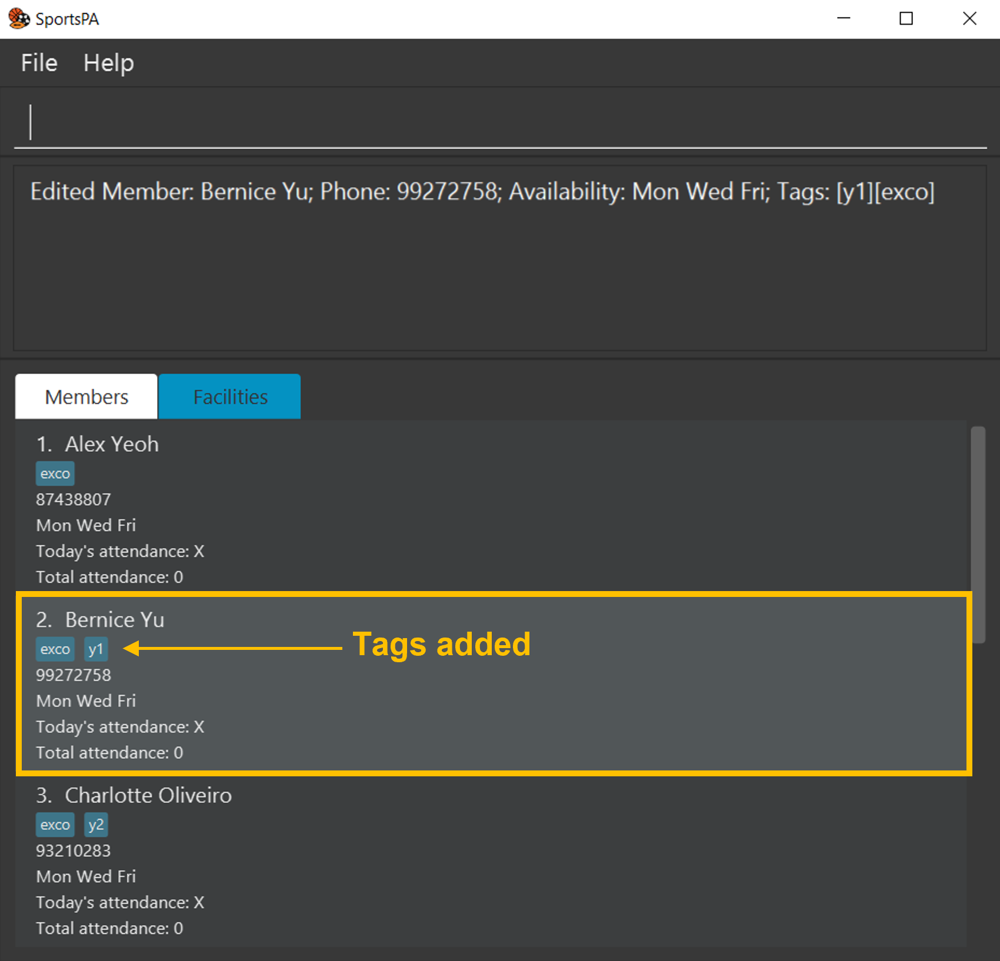

[Back to Table of Contents](#table-of-contents)

#### Finding a member: `findm`
If you are looking for specific members, `findm` lets you find and filter members based on any of the
specified field keywords.

Format: `findm [n/NAME] [p/PHONE] [d/DAY(S)] [tda/TODAY_ATTENDANCE] [tta/TOTAL_ATTENDANCE] [t/TAG]...`

* At least one of the optional fields must be provided
* `findm` is case-insensitive. e.g. `n/john` will match `John`
* Only full words will be matched e.g. `n/Johnny` will not match `John`
* `TODAY_ATTENDANCE` refers to a member's attendance for today and must be either `true` or `false`, true being present and false being absent
* `TOTAL_ATTENDANCE` refers to a member's attendance in total and must be a **non-negative integer** 0, 1, 2, 3...
* For `[t/TAG]...`, members matching at least one tag will be listed (i.e. OR search) 
  e.g. `findm t/exco t/y2` will list members with tags `exco` `y2`, and also members with only one matching tag `y2` or `exco`
* If multiple field keywords are supplied, only members that match all the given field keywords will be listed (i.e. AND search) 
  e.g. `findm n/Amy t/exco` will match `Amy` with the tag `exco` but not `John` with the tag `exco`

**:information_source: Note:** For the parameter `d/DAY(S)`, if the member is not available on any one of the specified days,
they will not be shown in the filtered list (i.e members have to be available on all specified days in order for them to be 
shown in the list).

Examples:

* `findm n/John` returns `john` and `John Doe`
* `findm t/exco t/y2` returns members with either tags `exco` `y2`, or both :camera:

   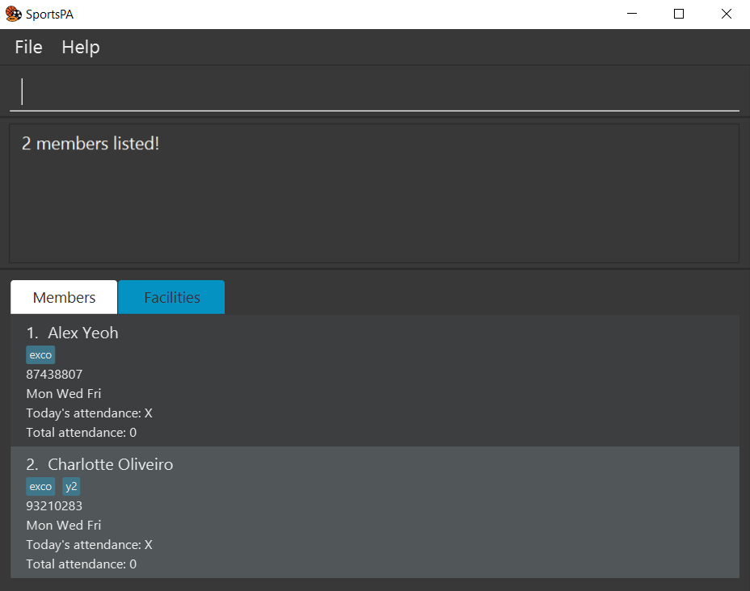

[Back to Table of Contents](#table-of-contents)

#### Sorting member list: `sortm`

Shows a list of all members, sorted alphabetically by either their names or their tags.

Format: `sortm by/SORT_ORDER`
* `SORT_ORDER` must either be `name` or `tag`
* When sorting by tags, members with more tags are displayed first

Examples:
* `sortm by/name` returns a member list sorted alphabetically by their names
* `sortm by/tag` returns a member list sorted alphabetically by their tags

[Back to Table of Contents](#table-of-contents)

#### Setting member availability: `setm`

The availability of your members can change frequently. Thus, instead of having to individually edit your members' availability, use
`setm` to set the availability of given member(s) at one go.

Format: `setm INDEX [MORE_INDICES]... d/DAY(S)`

* Sets the availability of the member(s) at the specified `INDEX` and `MORE_INDICES` to be the specified `DAY(S)`
* `DAY(s)` **must be a positive integer from 1 to 7**, whereby 1 represents Monday and 7 represents Sunday.
* `DAY(s)` **must be separated by a single space** e.g. `d/1 2 3`
* `INDEX` and `MORE_INDICES` refer to the index number(s) shown in the displayed member list
* `INDEX` and `MORE_INDICES` **must be positive integers** 1, 2, 3, …​
* `MORE_INDICES` **must be separated by a single space** e.g. `1 2 3`

:exclamation: **Caution:**
Setting the availability of a member will automatically remove them from any facilities they were allocated to. 
This action is **irreversible**.

**:information_source: Note:** All indices provided must be in the range of the displayed member list. Otherwise,
the command will be considered invalid and none of the member's availability will be set.

Examples:

* `findm n/John` followed by `setm 2 d/1` sets the availability of the member at index 2 in the results of the `findm`
  command to be Monday
* `listm` followed by `setm 5 d/1 2` sets the availability of the member at index 5 in the member list to be Monday and
  Tuesday
* `listm` followed by `setm 1 2 3 d/3 4` sets the availability of the first three members in the member list to be Wednesday and Thursday :camera:

   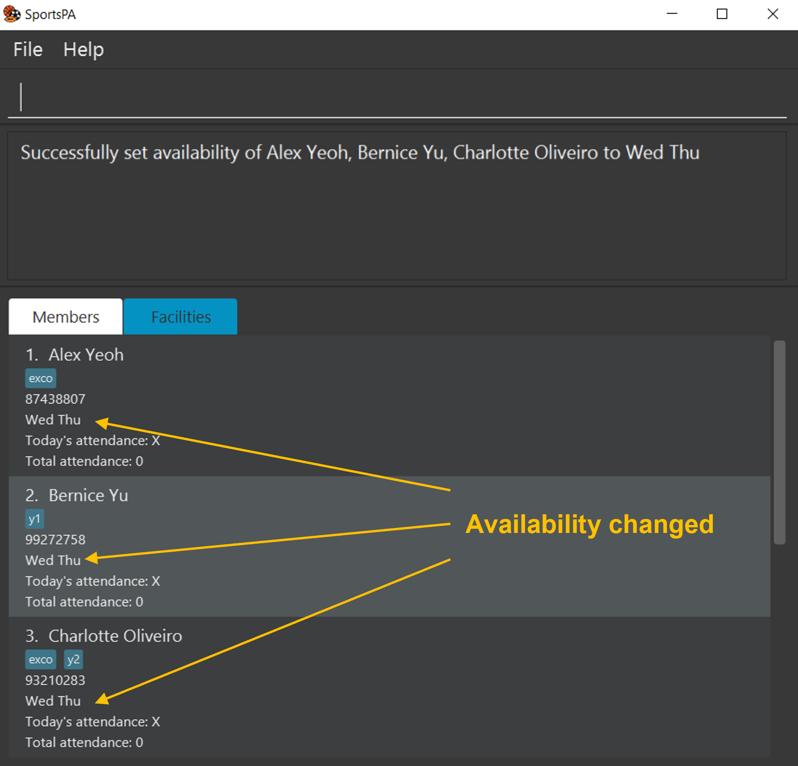

[Back to Table of Contents](#table-of-contents)

#### Marking attendance of members: `mark`

During a training session, you can mark the attendance of members present (represented by a tick) with this command.

Format: `mark INDEX [MORE_INDICES]...`

* Marks the member(s) at the specified `INDEX` and `MORE_INDICES` in the members list as present
* `INDEX` and `MORE_INDICES` refers to the index number of the member in the displayed members list
* `INDEX` and `MORE_INDICES` **must be positive integers** 1, 2, 3 …​
* `MORE_INDICES` **must be separated by a single space** e.g. `1 2 3`

**:bulb: Tip:** After you have marked attendance for today, use the `cleara` command 
(see [Clearing all attendance for today](#clearing-all-attendance-for-today-cleara)) to reset everyone's attendance today and save
their total attendance so that you can use the mark command again to take attendance for another day.

Examples:

* `mark 1 2` marks the attendance of the members at indices 1 and 2 in the displayed list as present :camera:

   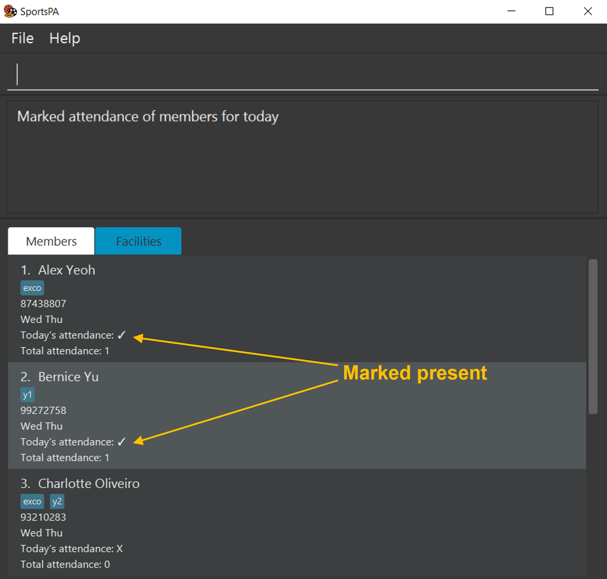

[Back to Table of Contents](#table-of-contents)

#### Unmarking attendance of members: `unmark`

Unmarks attendance of members marked as present, represented by a cross.

Format `unmark INDEX [MORE_INDICES]...`

* Unmarks the member(s) at the specified `INDEX` and `MORE_INDICES` in the members list as not present
* `INDEX` and `MORE_INDICES` refers to the index number of the member in the displayed members list
* `INDEX` and `MORE_INDICES` **must be positive integers** 1, 2, 3 …​
* `MORE_INDICES` **must be separated by a single space** e.g. `1 2 3`

Examples:
* `unmark 1 2` unmarks the attendance of members at indices 1 and 2 as not present

[Back to Table of Contents](#table-of-contents)

#### Clearing all attendance for today: `cleara`

At the end of a training session, you can use this command to finalise and update the member's attendance records, then unmark all member's attendance to prepare for the next training session.

Format: `cleara`

:exclamation: **Caution:**
All attendance data will be unmarked immediately and total attendance of those who were present will be incremented after this command is executed. This action is **irreversible**.

[Back to Table of Contents](#table-of-contents)

#### Importing multiple members using a CSV file: `import`

When you want to add or update the details of multiple members in one go, you can import data from
a CSV (comma-separated values) file using `import`.

Format: `import CSV_FILE_PATH`

* Data imported from the CSV file **must** have 4 headers in this order:
  1. Name
  2. Phone number
  3. Availability
  4. Tags
* In the CSV file, parameters' formats follows that of the `addm` command 
(see [Adding a Member](#adding-a-member-addm))
* `CSV_FILE_PATH` should be relative to the JAR file location

:exclamation: **Caution:**
If there are duplicate members (i.e. members with the same name or same phone number) being imported using the CSV file, 
the details from the CSV file will overwrite the existing details, except for the attendance data. 
This action is **irreversible**.

Examples:

* `import myFile.csv` imports member data from the CSV file in `[JAR_file_location]/myFile.csv` :camera:

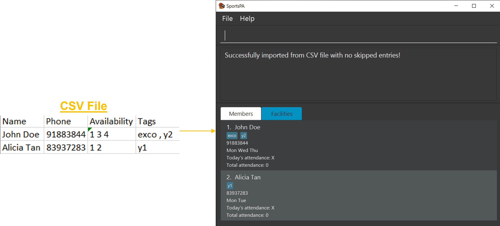

[Back to Table of Contents](#table-of-contents)

#### Clearing all entries in member list: `clearm`

Clears all members from your member list.

Format: `clearm`

:exclamation: **Caution:**
All member data will be removed immediately after this command is executed. This action is **irreversible**.

[Back to Table of Contents](#table-of-contents)

### Facility-Specific Features

#### Adding a facility: `addf`

Adds a facility to your facility list.

Format: `addf n/NAME l/LOCATION t/TIME c/CAPACITY`

* `TIME` specifies the start time of the training session at the facility and **must be in the 24-hour format** `HHmm`
* `CAPACITY` specifies the maximum number of people allowed at the facility and **must be a positive integer from 1 to 50**

**:information_source: Note:** You will not be able to add facilities with the same `NAME` and `LOCATION` into the list
as they are considered duplicates.

Examples:

* `addf n/Court 1 l/University Sports Hall t/1500 c/5` adds Court 1 at University Sports Hall at 3pm with a capacity of
  5
* `addf n/Court 19 l/Tampines Hub Badminton Hall t/1700 c/5` adds Court 19 at Tampines Hub Badminton Hall at 5pm with a capacity of 5 :camera:

   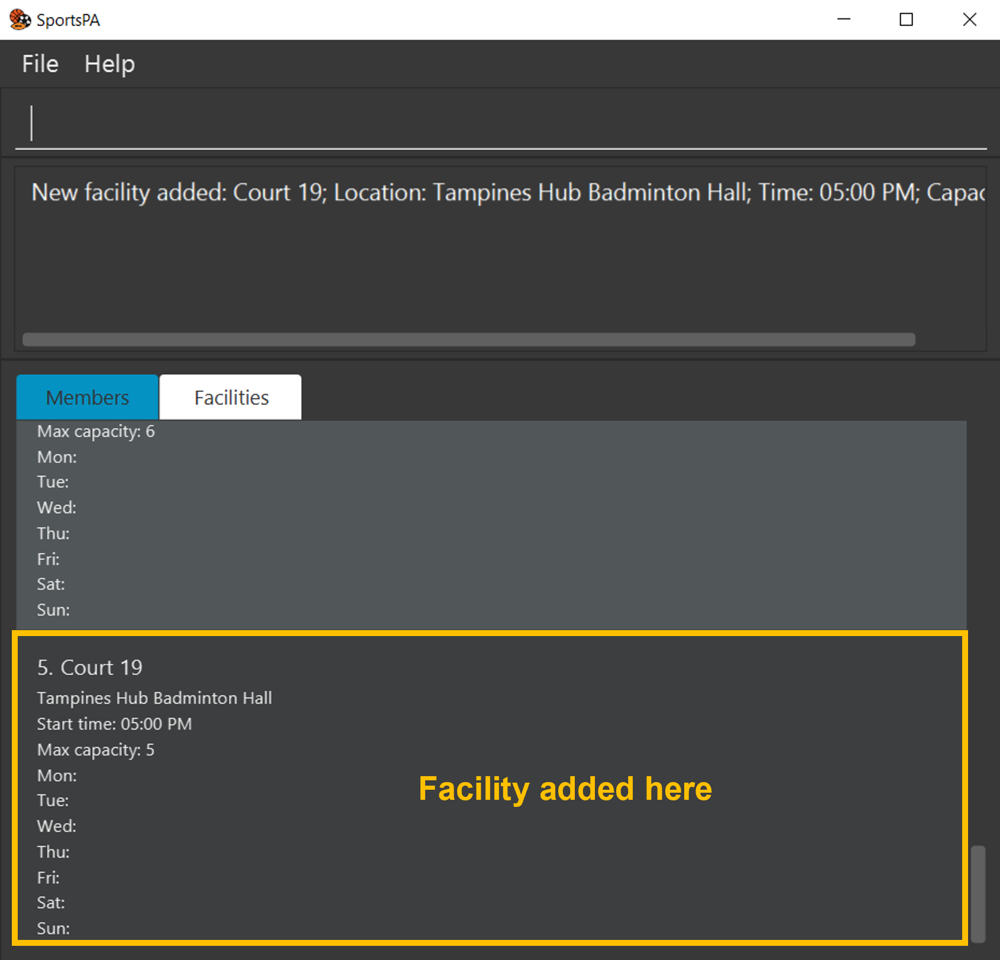

[Back to Table of Contents](#table-of-contents)

#### Listing all facilities: `listf`

Shows a list of all your facilities.

Format: `listf`

[Back to Table of Contents](#table-of-contents)

#### Deleting a facility: `deletef`

Removes a facility from your facility list.

Format: `deletef INDEX`

* Deletes the facility at the specified `INDEX`
* `INDEX` refers to the index number shown in the currently displayed facility list
* `INDEX` **must be a positive integer** 1, 2, 3…

Examples:

* `listf` followed by `deletef 2` deletes the 2nd facility in the facility list
* `findf Court 1` followed by `deletef 1` deletes the 1st facility in the results of the `findf` command

[Back to Table of Contents](#table-of-contents)

#### Editing a facility: `editf`

Edits an existing facility in your facility list.

Format: `editf INDEX [n/NAME] [l/LOCATION] [t/TIME] [c/CAPACITY]`

* Edits the facility at the specified `INDEX`
* `INDEX` refers to the index number shown in the displayed facility list
* `INDEX` **must be a positive integer** 1, 2, 3…
* At least one of the optional fields must be provided
* Existing values will be updated to the input values

:exclamation: **Caution:**
All members allocated to the facility will be unallocated if you edit its `CAPACITY` to be below the number of allocated
members. This action is **irreversible**.

**:information_source: Note:** You will not be able to edit the facility if it has the same `NAME` and `LOCATION` as
another existing facility as they are considered duplicates.

Examples:

* `editf 1 n/Court 5` edits the name of the 1st facility to be `Court 5`
* `editf 2 n/Court 20 l/University Sports Hall` edits the name and location of the 2nd facility to be `Court 20`
  and `University Sports Hall` respectively

[Back to Table of Contents](#table-of-contents)

#### Finding a facility: `findf`

If you are looking for specific facilities, `findf` lets you find and filter facilities whose location contains
any of the given keywords.

Format: `findf KEYWORD [MORE_KEYWORDS]...`

* `KEYWORD` and `MORE_KEYWORDS` are case-insensitive. e.g. `Utown` will match `utown`
* Only the location is searched
* Only full words will be matched e.g. `Utown` will not match `town`
* Facilities matching at least one keyword will be returned (i.e. OR search) e.g `Utown Redhill` will
  return `Utown Field` and `Redhill Sports Complex`

Examples:

* `findf redhill` returns `Redhill Sports Complex` and `Redhill Field`
* `findf opp tampines` returns `Opp University Hall` and `Tampines Hub Badminton Hall` :camera:

   

[Back to Table of Contents](#table-of-contents)

#### Splitting members into facilities: `split`

Organise your next training session seamlessly by splitting members into the facilities based on its capacity and
members' availability using `split`.

Format: `split DAY`

* Allocate members available on the specified `DAY` to each facility
* `DAY` **must be a positive integer from 1 to 7**, whereby 1 represents Monday and 7 represents Sunday
* All facilities are assumed to be available and have the same capacity on every day of the week

:exclamation: **Caution:**
Executing this command will overwrite all existing allocations you have made for the given day. This action is **irreversible**.
You can use the `export` command 
(see [Exporting facility details and member allocation](#exporting-facility-details-and-member-allocations-export))
to save your previous allocations before using the `split` command again.

**:information_source: Note:** SportsPA will warn you when there are no members available on the specified day or insufficient facilities
to accommodate all available members and the allocation will not be executed.

Examples:
* `split 1` splits members into groups for training on Monday of that week and displays the list of allocations to the user :camera:

   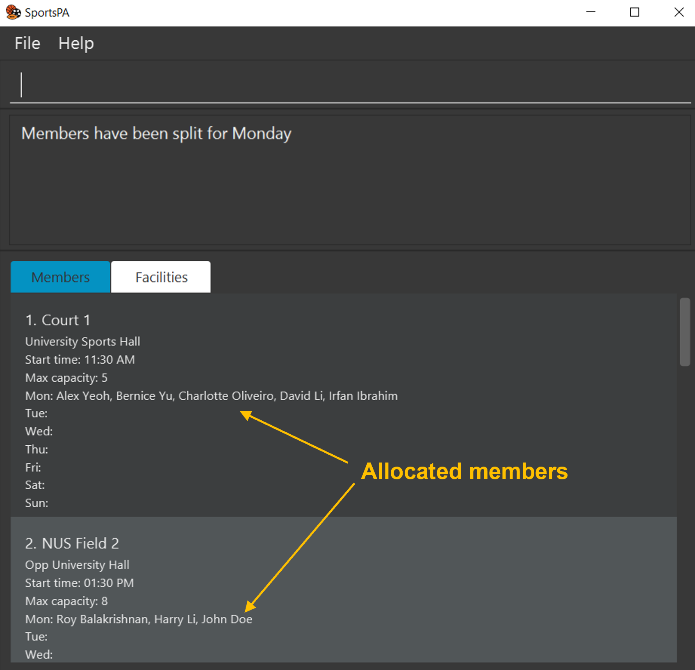

[Back to Table of Contents](#table-of-contents)

#### Deallocating a member from a facility: `deallocate`

You can easily accommodate changes in member's availability by deallocating a member from a facility they were
previously allocated to on a specified day, using `deallocate`.

Format: `deallocate MEMBER_INDEX FACILITY_INDEX DAY`

* `MEMBER_INDEX` refers to the index shown in the displayed member list
* `FACILITY_INDEX` refers to the index shown in the displayed facility list
* Both `MEMBER_INDEX` and `FACILITY_INDEX` **must be positive integers** 1, 2, 3…
* `DAY` **must be a positive integer from 1 to 7**, whereby 1 represents Monday and 7 represents Sunday

Examples:
* `deallocate 2 4 5` removes the member at index 2 in the displayed member list from the allocation list of the facility
  at index 4 in the displayed facility list on Friday

[Back to Table of Contents](#table-of-contents)

#### Allocating a member to a facility: `allocate`

If the allocations of the `split` command are undesirable, you can manually allocate a member to a facility
using `allocate`

Format: `allocate MEMBER_INDEX FACILITY_INDEX DAY`

* `MEMBER_INDEX` refers to the index shown in the displayed member list
* `FACILITY_INDEX` refers to the index shown in the displayed facility list
* Both `MEMBER_INDEX` and `FACILITY_INDEX` **must be positive integers** 1, 2, 3…
* `DAY` **must be a positive integer from 1 to 7**, whereby 1 represents Monday and 7 represents Sunday

**:information_source: Note:**
Members you choose to allocate must be available on the specified day and cannot be allocated to facilities which are at maximum capacity.

Examples:
* `allocate 1 2 5` adds the member at index 1 in the displayed member list to the allocation list   of the facility
  at index 2 in the displayed facility list on Friday :camera:

   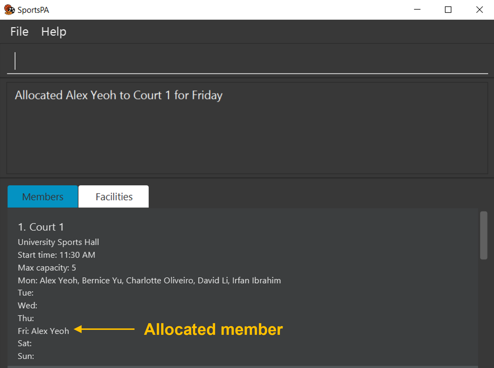

[Back to Table of Contents](#table-of-contents)

#### Exporting facility details and member allocations: `export`

Export all facilities’ details and their allocation list to a CSV (comma-separated values) file so that
you can share them with your members.

Format: `export`

* The exported CSV file will be created in `[JAR file location]/data/exportedData.csv`
* The CSV file will contain 5 headers: Facility Name, Location, Time, Capacity and Member Allocation

**:information_source: Note:** If exportedData.csv already exists before this command is executed,
the existing CSV file will be overwritten. So, make sure to change the file name of the existing
CSV file before running the export command if you want to save it.

#### Clearing all entries in facility list: `clearf`

Clears all facilities from your facility list.

Format: `clearf`

:exclamation: **Caution:**
All facility data will be removed immediately after this command is executed. This action is **irreversible**.

[Back to Table of Contents](#table-of-contents)

### General Features

#### Getting help: `help`

Shows a message explaining how you can access our help page.

Format: `help`

[Back to Table of Contents](#table-of-contents)

#### Creating an alias: `alias`

Some of our commands' names may be not be to your liking. Hence, SportsPA offers you the flexibility of personalising
the commands you use. With `alias`, you can create a shortcut name for any command.

Format: `alias s/SHORTCUT cw/COMMAND_WORD`

* Creates an alias that allows the specified `COMMAND_WORD` to be executed with the specified `SHORTCUT`
* `SHORTCUT` **must be one word and not an existing command**
* `COMMAND_WORD` **must be an existing command**

**:information_source: Note:** If you create an alias whose given `SHORTCUT` already exists, the newly created alias
will replace that existing one.

Examples:

* `alias s/lf cw/listf` creates an alias for `listf` command. Entering `lf` will execute the `listf` command and a list
  of all facilities will be shown :camera:

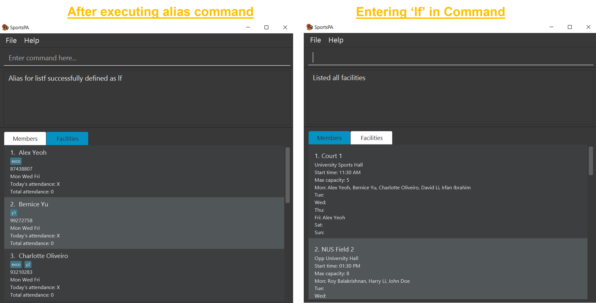

[Back to Table of Contents](#table-of-contents)

#### Listing all aliases: `aliases`

Shows a list of your created aliases in the Result Window.

Format: `aliases`

[Back to Table of Contents](#table-of-contents)

#### Deleting an alias: `unalias`

Deletes an alias you have created.

Format: `unalias SHORTCUT`

* Deletes the alias associated with the specified `SHORTCUT`

Examples:

* `unalias lf` deletes the alias with shortcut name `lf`

[Back to Table of Contents](#table-of-contents)

#### Saving the data

Your SportsPA data is saved in the hard disk automatically after any command that changes the data. They are saved as a
JSON file `[JAR file location]/data/sportspa.json`. Though **not recommended**, if you are familiar with JSON, you can
directly change the contents, *e.g a member's name*, in the data file, which will be reflected in SportsPA.

:exclamation: **Caution:**
If changes made to the data file makes its format invalid, SportsPA will start with an empty data file at the next run.

[Back to Table of Contents](#table-of-contents)

#### Exiting the program: `exit`

Exits the program.

Format: `exit`

[Back to Table of Contents](#table-of-contents)

--------------------------------------------------------------------------------------------------------------------

## FAQ

**Q**: How do I check if Java 11 is installed on my Computer? 
**A**: Open your Operating System's command prompt and enter `java -version`. Java 11 is installed if the output shows Java
11.  
**Q**: How do I install Java 11 on my Computer? 
**A**: Visit [this site](https://docs.oracle.com/en/java/javase/11/install/overview-jdk-installation.html#GUID-8677A77F-231A-40F7-98B9-1FD0B48C346A)
and follow the instructions specific to your operating system. You may have to download and run an installer to install Java 11 on your computer.  
**Q**: How do I transfer my data in SportsPA to another Computer? 
**A**:
1. On your current computer, navigate to `[JAR file location]/data/sportspa.json`. Make a copy of the `sportspa.json` file and transfer it to your other computer.
2. On the other computer, navigate to
`[JAR file location]/data/sportspa.json` and replace the empty data file it creates with the data file you have just copied.

[Back to Table of Contents](#table-of-contents)

--------------------------------------------------------------------------------------------------------------------

## Command summary

### Member-Specific Commands

Action | Format, Examples
--------|------------------
**Add member**| `addm n/NAME p/PHONE_NUMBER [d/DAY(S)] [t/TAG]...`   e.g. `addm n/John Doe p/91111111`, `addm n/John Doe p/91111111 d/1 3 5`, `addm n/John Doe p/91111111 d/1 3 5 t/exco`
**List members**| `listm`
**Delete member**| `deletem INDEX`   e.g. `deletem 1`
**Edit member**| `editm INDEX [n/NAME] [p/PHONE_NUMBER] [t/TAG]...`   e.g. `editm 1 n/Jonathan p/93837283`
**Find member**| `findm [n/NAME] [p/PHONE] [d/DAY(S)] [tda/TODAY_ATTENDANCE] [tta/TOTAL_ATTENDANCE] [t/TAG]...`   e.g. `findm n/John`, `findm t/exco t/y2`
**Sort members**| `sortm by/SORT_ORDER`   e.g. `sortm by/name`, `sortm by/tag`
**Set member availability**| `setm INDEX [MORE_INDICES]... d/DAY(S)`   e.g.`setm 1 2 3 d/2 3 5`
**Mark member attendance**| `mark INDEX [MORE_INDICES]...`   e.g. `mark 1 2`
**Unmark member attendance**| `unmark INDEX [MORE_INDICES]...`   e.g. `unmark 1 2`
**Clear membber attendance**| `cleara`
**Import multiple members**| `import CSV_FILE_PATH`   e.g.`import myFile.csv`
**Clear member**| `clearm`

[Back to Table of Contents](#table-of-contents)

### Facility-Specific Commands

Action | Format, Examples
--------|------------------
**Add facility**| `addf n/NAME l/LOCATION t/TIME c/CAPACITY`   e.g. `addf n/Court 1 l/University Sports Hall t/1500 c/5`
**List facilities**| `listf`
**Delete facility**| `deletef INDEX`   e.g. `deletef 4`
**Edit facility**| `editf INDEX [n/NAME] [l/LOCATION] [t/TIME] [c/CAPACITY]`   e.g. `editf 2 n/Court 20 l/University Sports Hall`
**Find facility**| `findf KEYWORD [MORE_KEYWORDS]...`   e.g. `findf Clementi`, `findf Utown`
**Split members into facilities**| `split DAY`   e.g. `split 1`
**Deallocate member from a facility**|`deallocate MEMBER_INDEX FACILITY_INDEX DAY`   e.g. `deallocate 2 3 4`
**Allocate member to a facility**|`allocate MEMBER_INDEX FACILITY_INDEX DAY`   e.g. `allocate 1 2 5`
**Export facility details and member allocation**| `export`
**Clear facilities**|`clearf`

[Back to Table of Contents](#table-of-contents)

### General Commands

Action | Format, Examples
--------|------------------
**Help**| `help`
**Creates alias**| `alias s/SHORTCUT cw/COMMAND_WORD`   e.g. `alias s/lf cw/listf`
**List aliases**| `aliases`
**Deletes alias**| `unalias SHORTCUT`   e.g. `unalias lf`
**Exit**| `exit`

[Back to Table of Contents](#table-of-contents)
