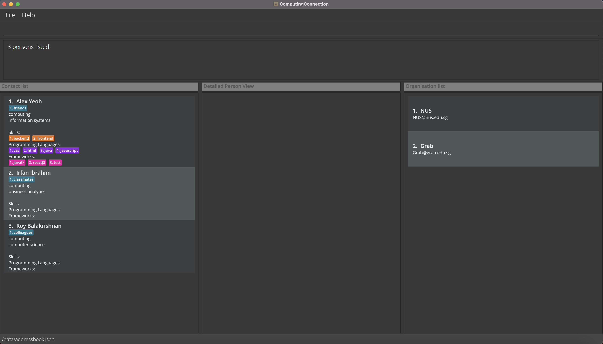
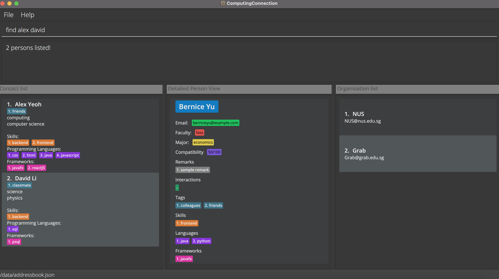

## Product overview

*ComputingConnection* is for entrepreneurial students in NUS Computing who want to **keep track of other students’ skill sets so that they can easily look for suitable people to work with on future projects.** *ComputingConnection* is optimized for Command Line Interface (CLI) over a Graphical User Interface (GUI) for efficiency with a keyboard.

You can use *ComputingConnection* to efficiently record information such as faculty, major, skills, programming languages, and remarks (and more!) of peers that you have encountered throughout university. *ComputingConnection* will allow you to remember and document your network of potential student partners for projects in the future.

* Table of Contents
{:toc}

--------------------------------------------------------------------------------------------------------------------
## About (using this user guide)
In this section, you will learn how to use the *ComputingConnection* user guide efficiently and effectively.

### Navigating this guide
1. Chronological navigation by scrolling 
- If this is your first time using ComputingConnection, we recommend this for a comprehensive walkthrough.
  
2. Targeted search by jumping 
- If you know what you're looking for and want to be efficient. 
- Skip to specific sections via the Table of Contents or navigable texts.
- CTRL + F to find specific keywords. 

### Text conventions
This user guide is formatted using the following conventions:

Syntax          | Interpretation
----------------|-------------
*Italic text*   | The name of the application, *ComputingConnection*
**Bold text**   | Keywords for **emphasis** 
`Block text`    | `command syntax` or `technical references` 
Orange text     | Headings and subheadings of various size
------          | Dividers for section breaks

### Meaning of icons and symbols
:information_source: : Additional information  
:bulb: : Tip  
:exclamation: : Important message  

:information_source: Call out bar 
* These blocks of text are here to aid the readability of this user guide! 
* They can be tagged with different icons for different purposes. 

> Quotes are used to explain examples of commands and features!

--------------------------------------------------------------------------------------------------------------------

## Quick start

1. Ensure you have Java `11` or above installed in your Computer.

1. Download the latest `computingconnection.jar` from [here](https://github.com/AY2122S1-CS2103T-W10-3/tp/releases).

1. Copy the file to the folder you want to use as the _home folder_ for your ComputingConnection.

1. Double-click the file to start the app. The GUI similar to the below should appear in a few seconds. Note how the app contains some sample data. 
   

1. Type the command in the command box and press Enter to execute it. e.g. typing **`help`** and pressing Enter will open the help window. 
   Some example commands you can try:

   * **`list`** : Lists all contacts.

   * **`add`**`n/Dion Neo e/dion@example.com f/computing m/computer science` : Adds a contact named `Dion Neo` to the ComputingConnection, with the respective email, faculty and major fields.

   * **`delete`**`3` : Deletes the 3rd contact shown in the current list.

   * **`clear`** : Deletes all contacts.

   * **`exit`** : Exits the app.

1. Refer to the [Features](#features) below for details of each command.

:exclamation: Try not to edit the **data file** directly!  
* This may lead to invalid values for data fields. 
* In the event of this, *ComputingConnection* will restart with an empty database! 

--------------------------------------------------------------------------------------------------------------------

## Understanding the 'Features' section
In this section, you will learn how to utilise the features and commands available in *ComputingConnection*, as seen in the [Features](#features) section. 

### Terminologies used
Unique terms specific to *ComputingConnection*

Term            | Meaning
----------------|-----------------
Contact         | Represents a person in *ComputingConnection*
Organisation    | Represents an organisation in *ComputingConnection*
Data field      | Categorised data that you can assign to a contact   See [Structure of a contact](#structure-of-a-contact) for the full list of data fields
Item            | An element of a specific data field

### Structure of a contact
Understanding the structure of a **contact** in *ComputingConnection* is important in enabling you to be more productive.

Category        | Specific fields | Valid items | Requirement
----------------|-----------------|-----------------|-----------------
Personal data fields  | 1. `n/` : Name    2. `e/` : Email |1. Alphanumeric    2. Email Regex | Compulsory
University data fields   | 3. `f/` : Faculty     4. `m/` : Major | 3. NUS Faculties:   fass   business   computing   dentistry   sde   engineering   medicine   science   law    4. Alphanumeric |Compulsory
Skill data fields | 5. `s/` : Skill    6. `l/` : Programming Language    7. `fr/` : Framework | 5. Alphanumeric    6. Alphanumeric and the '+' and '#' characters    7. Alphanumeric and the '.' character| Optional
Miscellaneous data fields| 8. `t/` : Tag    9. `r/` : Remark    10. `int/` : Interaction    11. `compat/` : Compatibility | 8. Alphanumeric, less than or equal to 30 characters    9. Alphanumeric    10. Alphanumeric, Date    11. 0 - 100 | Optional

:information_source: Elaboration on valid items
* Valid items of the **faculty** field must be entered in lower case. A future patch will allow case-insensitive valid entries. 
* The **major** field currently takes any alphanumeric item. A future patch will ensure major is tied to a valid faculty.
* Items in *ComputingConnection* are sorted alphanumerically, from **upper case** to **lower case**.

### Structure of an Organisation
Understanding the structure of a **organisation** in *ComputingConnection* is also important in enabling you to be more productive and keep contacts together in the one organisation. E.g. a group, CCA or company

Category        | Specific fields | Valid items | Requirement
----------------|-----------------|-----------------|-----------------
Organisation data fields  | 1. `n/`: Name    2. `e/`: Email |1. Alphanumeric    2. Email Regex | Compulsory

:information_source: Compulsory vs Optional data fields
* Compulsory data fields cannot be left empty! 
* Optional data fields can have 0 or more values.

### ComputingConnection command formats

**:information_source: Notes about the command format:** 

* Words in `UPPER_CASE` are the parameters to be supplied by the user. 
  e.g. in `add n/NAME`, `NAME` is a parameter which can be used as `add n/Jason Ang`.

* Items in square brackets are optional for the command. 
  e.g. `n/NAME [t/TAG]` can be used as `n/Shivam Tiwari t/friend` or as `n/Shivam Tiwari`.

* Items with `…`​ after them can be used multiple times including zero times. 
  e.g. `[s/SKILL]…​` can be used as ` ` (i.e. 0 times), `s/frontend`, `s/frontend s/backend` etc.

* Parameters can be in any order. 
  e.g. if the command specifies `n/NAME e/EMAIL`, `e/EMAIL n/NAME` is also acceptable.

* If a parameter is expected only once in the command, but you specified it multiple times, only the last occurrence of the parameter will be taken. 
  e.g. if you specify `p/12341234 p/56785678`, only `p/56785678` will be taken.
  
* When an `INDEX` is specified after a command word, it refers to the index number of the contact shown in the displayed contact list, unless specified otherwise. The index **must be a positive integer** 1, 2, 3…​"
 
* Extraneous parameters for commands that do not take in parameters (such as `help`, `list`, `sort`, `exit` and `clear`) will be ignored. 
  e.g. if the command specifies `help 123`, it will be interpreted as `help`.

--------------------------------------------------------------------------------------------------------------------

## Features
Features and commands are categorised based on 
1. System commands
2. Contact-specific commands
3. Organisation-specific commands

### System commands
Commands that are related to the whole ComputingConnection system or database. 

##### Viewing help : `help`
Shows a message explaining how to access the help page.  

Format: `help`

##### Listing all contacts : `list`
Shows a list of all contacts in the address book.  

##### Sorting contacts : `sort`
Sorts all contacts permanently and shows the list in alphabetical order.  

Format: `sort`

##### Filtering contacts : `filter`
Filters the contacts by data fields of the person including faculty, major, skill, framework, language and tag.

Format: `filter [f/FACULTY]…​ [m/MAJOR]…​ [s/SKILL]…​ [l/LANGUAGE]…​ [fr/FRAMEWORK]…​ [t/TAG]…​`

Examples:
* `filter f/computing`
>  returns all users who have been assigned the f/computing tag.
* `filter t/staff f/computing`
>  returns all users who have been assigned the t/staff tag and f/computing tag.

  

:bulb: Tips
*  You can add multiple fields in one command to see all filters together.

##### Clearing all entries : `clear`
Clears all contacts from ComputingConnection.

Format: `clear`

:exclamation: Be **careful**
* The confirmation for clearing data will be implemented in future releases. 

### Contact-specific commands
Commands that are related to a specific contact.

##### Adding a contact : `add`
Adds a contact to the address book.

Format: `add n/NAME e/EMAIL f/FACULTY m/MAJOR [compat/COMPATIBILITY] [s/SKILL]…​ [l/LANGUAGE]…​ [fr/FRAMEWORK]…​ [t/TAG]…​ [r/REMARK]…​`

Examples: 

* `add n/Timothy Wong e/timothy@nus.edu.sg f/computing m/computer science` 
  > Adds a person named 'Timothy Wong', with an email of 'timothy@nus.edu.sg', faculty of 'computing', and major of 'computer science'. 
* `add n/Timothy Wong e/timothy@nus.edu.sg f/computing m/computer science compat/80 s/frontend l/javascript r/interest in web development`
  > Adds a person named 'Timothy Wong', with an email of 'timothy@nus.edu.sg', faculty of 'computing', and major of 'computer science', with a compatibility of 80/100, with skills 'frontend', languages 'javascript', and a remark of 'interest in web development'.

:bulb: :information_source: Start with the essentials!
* A contact must have one and only one name, email, faculty and major.
* You can always add items to optional data fields later on! 

##### Editing a contact : `edit`
Edits an existing contact at the specified `INDEX`.

Format: `edit INDEX [n/NAME] [e/EMAIL] [f/FACULTY] [m/MAJOR] [compat/COMPATIBILITY] [s/SKILL]…​ [l/LANGUAGE]…​ [fr/FRAMEWORK]…​ [t/TAG]…​ [r/REMARK]…​`

:bulb: Easy editing!
* At least one of the optional fields in [square brackets] must be provided.
* Existing items will be updated to the input items.

:exclamation: Editing is not cumulative!
* When editing data fields, the existing items of the data field of the contact will be removed i.e adding of items is not cumulative (see [append](#appending-items-to-data-fields--append)).
* You can remove all the contact’s optional data fields by typing `s/`, `l/`, `fr/`, `t/`, `r`, or `int/` without
  specifying any tags after it.
* However, you can't do this for compulsory data fields!

##### Appending items to data fields : `append`
Appends a new item to an optional data field of the existing contact at the specified `INDEX`.

Format: `append INDEX [s/SKILL]…​ [l/LANGUAGE]…​ [fr/FRAMEWORK]…​ [t/TAG]…​ [r/REMARK]…​`

Examples:
* `append 3 s/web devevelopment l/python t/classmate` 
  > Appends 'web development' to the skill data field, 'python' to the programming language data field, and 'classmate' to the tag data field of the Person at index 3 in the displayed list.

:bulb: Appending is cumulative! 
* Items in data fields are not numbered chronologically after an `append`, but alphanumerically - this should help you see contacts more consistently.
* Sorting order follows **digit** first, then **upper case letter** and finally, **lower case letter**.

##### Removing data fields : `rm`
Removes an item from an optional data field of the existing contact at a specified `INDEX`.

Format: `rm INDEX [s/INDEX]…​ [l/INDEX]…​ [fr/INDEX]…​ [t/INDEX]…​ [r/REMARK]…​ [int/INDEX]…​ `

Examples: 
* `rm 6 l/2`  
> Removes the **2nd item from the language** data field of the 6th contact displayed.
  
* `rm 5 s/1 s/3 fr/3 r/1`  
> Removes the **1st and 3rd item from the skill** data field, the **3rd item from the framework** data field, and the **1st item from the remark** data field of the 5th contact displayed.

:bulb: Remove items quickly!
* The `INDEX` specified for each optional data field is the index of the item displayed in the contact list.
* You cannot remove from compulsory data fields.

##### Adding an interaction with a contact : `interaction`
Adds an interaction record to a specific contact in the address book.

Format: `interaction INDEX int/DESCRIPTION on/DATE`

Examples: 
* `interaction 1 int/We talked. on/1990-01-20`  
> Adds an interaction with description 'We talked.' and date '1990-01-20' to the Person at index 1 of the displayed list.
  
* `interaction 2 int/We chat. on/1990-01-20`  
> Adds an interaction with description 'We chat.' and date '1990-01-20' to the Person at index 2 of the displayed list.

:information_source: Do not specify duplicate delimiters!
* If you specify duplicate delimiters, the program will take the first one out of the duplicates
* For eg: `interaction 2 int/We chat. on/1990-01-20 on/1990-01-21` 
* The program will save `1990-01-20` as the date.
* Date must be in the format of `YYYY-MM-DD`

##### Viewing a specific contact in detail : `view`
Displays a detailed view of a existing contact at a specified `INDEX`.

Format: `view INDEX`

Examples:
*  `view 1` 
> Displays the details of contact indexed at 1 in the currently displayed list.
*  `view 2`
> Displays the details of contact indexed at 2 in the currently displayed list.

:information_source: Different columns
* Details of specific contact shown on right side of screen.
* Index is based on current list displayed on left side of screen. 

##### Locating contacts by name : `find`
Finds contacts whose names contain any of the given keywords.

Format: `find KEYWORD [MORE_KEYWORDS]`

* The search is case-insensitive. e.g `hans` will match `Hans`
* The order of the keywords does not matter. e.g. `Hans Bo` will match `Bo Hans`
* Only the name is searched.
* Partial matches will work e.g. `Han` will match `Hans`
* Contacts matching at least one keyword will be returned (i.e. `OR` search).
  e.g. `Hans Bo` will return `Hans Gruber`, `Bo Yang`

Examples:
* `find John` returns `john` and `John Doe`
* `find alex david` returns `Alex Yeoh`, `David Li` 
  

:information_source: How to 'find'
* The search is case-insensitive. e.g `hans` will match `Hans`
* The order of the keywords does not matter. e.g. `Hans Bo` will match `Bo Hans`
* Only the name is searched.
* Partial matches will work e.g. `Han` will match `Hans`
* Contacts matching at least one keyword will be returned (i.e. `OR` search).
  e.g. `Hans Bo` will return `Hans Gruber`, `Bo Yang`

##### Deleting a contact : `delete`
Deletes a contact at the specified `INDEX`.

Format: `delete INDEX`

Examples:
* `list` followed by `delete 2`  
> Deletes the 2nd contact in the address book.

* `find Betsy` followed by `delete 1`  
> Deletes the 1st contact in the results of the `find` command.

:exclamation: Be **careful!**
* The confirmation for deleting a contact will be implemented in future releases.

### Organisation-specific commands
Commands that are related to organisations.

##### Showing the list of all organisations: `listorg`
Shows the list of organisations in the organisation list.

Format: `listorg`

##### Adding an organisation: `addorg`
Adds an organisation to *ComputingConnection*.

Format: `addorg n/NAME e/EMAIL`

Examples:
* `addorg n/Shopee e/shopee.org@gmail.com`
> Adds an organisation with the name 'Shopee' and email 'shopee.org@gmail.com'.

:bulb: Persons and organisations
* Use organisations to help you link contact together!
* An organisation can have any number of persons within it (including 0). However, an organisation must have a name and email.
* Remember to add the member persons separately before adding them.
* Organisation names must be unique, emails can be repeated.

##### Deleting an organisation: `deleteorg`
Deletes an organisation at the specified `INDEX` of the organisation list.

Format: `deleteorg INDEX`

Examples:
* `deleteorg 1`
> Deletes the 1st organisation from the organisation list.

##### Adding person to an organisation: `addtoorg`
Adds the person at the specified index in the displayed list to an organisation with the specified name.

Format: `addtoorg INDEX n/NAME`

Examples:
* `addtoorg 1 n/Facebook`
> Adds the 1st person in the displayed list to the Facebook organisation.

:information_source: Add a person to an organisation one at a time! 
* A person can belong to more than one Organisation.
* Multiple addition will be implemented in future versions.

##### Removing person from an organisation: `deletefromorg`
Deletes the person at the specified index in the person list of an organisation with the specified name.

Format: `deletefromorg INDEX NAME`

Examples:
* `deletefromorg 1 n/Facebook`
> Deletes the 1st person in the person list of the Facebook organisation.

:information_source: The person and organisation will not be deleted, just the relation.

### Future commands
Commands to be implemented in future versions.

##### Updates to data fields
Data fields of a contact will be updated to meet the following specifications in future updates of *ComputingConnection*.

Data field | Future updates
-----------|---------------
`f/` : Faculty | Case insensitive items, wider scope of NUS faculties
`m/` : Major | Valid items to correspond with valid faculties

##### Archiving data files
_Details coming soon ..._

--------------------------------------------------------------------------------------------------------------------

## FAQ

**Q**: How do I transfer my data to another Computer? 
**A**: Install the app in the other computer and overwrite the empty data file it creates with the file that contains the data of your previous AddressBook home folder.

**Q**: What does the compatibility field represent? 
**A**: Compatibility field as the name suggests records down how compatible you think you are with the contact of interest. This information can be used in a versatile way. A common use case is to filter by compatibility when one is looking for a suitable partner for a project.

--------------------------------------------------------------------------------------------------------------------

## Command summary

System Command | Format, Examples
--------|------------------
**Help** | `help`
**List** | `list`
**Sort** | `sort`
**Filter** | `filter`
**Clear** | `clear`|

Contact-specific Command | Format, Examples
--------|------------------
**Add** | `add n/NAME e/EMAIL f/FACULTY m/MAJOR [compat/COMPATIBILITY] [s/SKILL]…​ [l/LANGUAGE]…​ [fr/FRAMEWORK]…​ [t/TAG]…​ [r/REMARK]…​`    e.g., `add n/James Ho e/jamesho@example.com f/fass m/communications s/marketing t/colleague`
**Edit** | `edit INDEX [n/NAME] [e/EMAIL] [f/FACULTY] [m/MAJOR] [compat/COMPATIBILITY] [s/SKILL]…​ [l/LANGUAGE]…​ [fr/FRAMEWORK]…​ [t/TAG]…​ [r/REMARK]…​`   e.g.,`edit 2 n/James Lee e/jameslee@example.com`
**Append** | `append INDEX [s/SKILL]…​ [l/LANGUAGE]…​ [fr/FRAMEWORK]…​ [t/TAG]…​ [r/REMARK]…​`    e.g., `append 3 s/web devevelopment l/python t/classmate`
**Remove** | `rm INDEX [s/INDEX]…​ [l/INDEX]…​ [fr/INDEX]…​ [t/INDEX]…​ [r/REMARK]…​ [int/INDEX]…​`    e.g., `rm 5 s/1 s/3 fr/3 r/1`
**Interaction** | `interaction INDEX int/DESCRIPTION on/DATE`
**View** | `view INDEX`    e.g. `view 2`
**Find** | `find KEYWORD [MORE_KEYWORDS]…​`   e.g., `find James Jake`
**Filter** | `filter [f/FACULTY]…​ [m/MAJOR]…​ [s/SKILL]…​ [l/LANGUAGE]…​ [fr/FRAMEWORK]…​ [t/TAG]…​`   e.g., `filter f/computing`
**Delete** | `delete INDEX`   e.g., `delete 3`

Organisation-specific Command | Format, Examples
--------|------------------
**Add Org** | `addorg n/NAME e/EMAIL`   e.g., `addorg n/Shopee e/shopee.org@gmail.com`
**List Org** | `listorg`
**Delete Org** | `deleteorg INDEX`   e.g., `deleteorg 1`
**Add to Org** | `addtoorg INDEX NAME`   e.g., `addtoorg 1 n/Facebook`
**Delete from Org** | `deletefromorg INDEX NAME`   e.g., `deletefromorg 1 n/Facebook`
