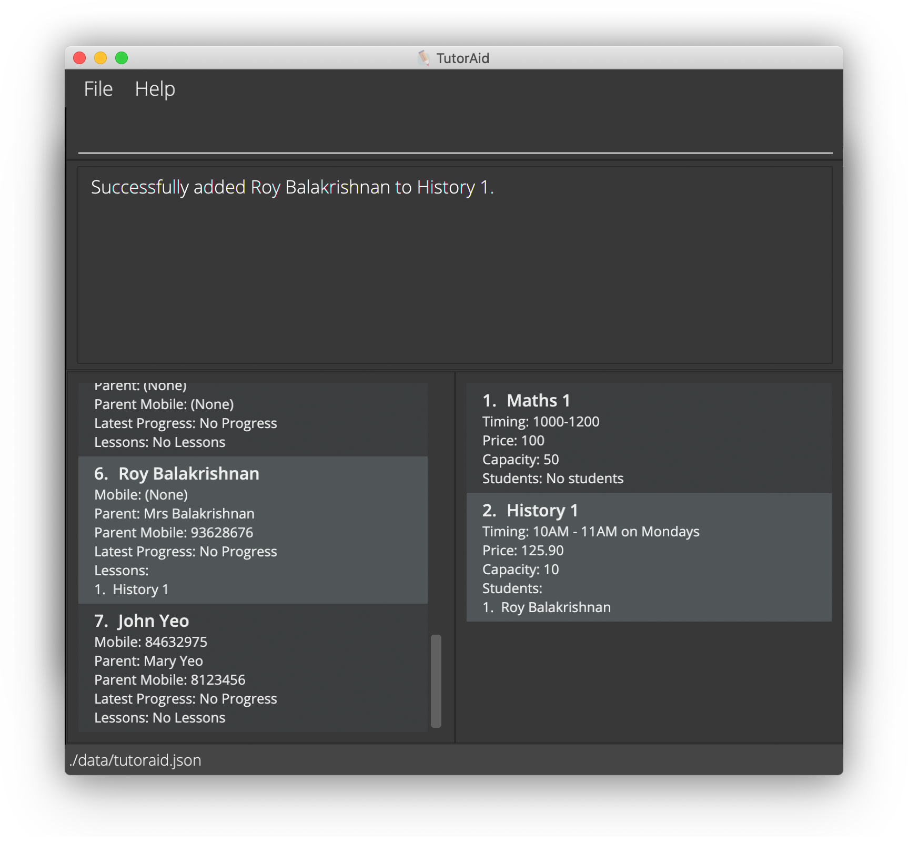

# Table of Contents
{:.no_toc}
<!-- @@author wpinrui-reused
Table of Contents from AY2021S1-CS2103T-W16-3/tp
https://github.com/AY2021S1-CS2103T-W16-3/tp/pull/179/commits/aec461182c194c9ca2c67d7c407fcabb376191ff
-->
<div class="toc-no-bullet-points">
  * Table of Contents
  {:toc}
</div>
<!--@@author
-->

# 1. Introduction

Welcome to the TutorAid User Guide, the one-stop manual where you will find everything that you need to know about how to use the app!

TutorAid is a desktop app for **private tutors to keep track of the details of their students and lessons**.

Some main ways in which TutorAid can help you with your tutoring responsibilities include:
1. Storing of your students' and their parents' contacts 
1. Storing and managing of your lesson details 
1. Tracking of your students' progress

TutorAid is also a unique app that is optimised for use via a **Command Line Interface** (CLI) while retaining the benefits of a visually-appealing Graphical User Interface (GUI). 
If you can type fast, TutorAid can help you to manage your tutoring tasks more efficiently than traditional GUI apps!

We hope that TutorAid will be helpful in adding more organisation to your tutoring career :blush:

***

Just downloaded TutorAid? Check out the [About](#2-about) and [Quick Start](#3-quick-start) sections to see how you can get started!

***

# 2. About

This section contains information and terms that may help you to understand the user guide.

## 2.1 User Guide Formatting

Formats discussed in this section may be used in relevant areas of this user guide.

**Tips**

Tips are helpful suggestions that may improve your experience using TutorAid.

> :bulb: This is helpful.

**Warnings**

Warnings can inform you of things that should be followed carefully to prevent any undesirable behaviour of TutorAid.

> :exclamation: **This is important!**

**Commands**

Commands in these highlighted boxes are typically used to show exactly what you should enter into TutorAid (including spaces).

`command`

***

## 2.2 TutorAid Visual Components

This section details the various components in TutorAid and how they will be referred to throughout the guide.


#### Menu Bar
{:.no_toc}
This is an area where some features, such as the offline help guide, can be found. However, as you will primarily interact with TutorAid through the command box, this area is infrequently used.

#### Console
{:.no_toc}
The Console is used by TutorAid to communicate with you. Whenever a command is carried out, TutorAid will display a message here to let you know whether the operation was successful. This message usually provides you with details about the changes made during the operation.

#### Command Box
{:.no_toc}
The Command Box is a field in which you can type instructions (also referred to as _commands_) to TutorAid. Commands in this user guide should typically be copied into this Command Box exactly as they are. After you have typed a command into this box, you can press  ENTER :leftwards_arrow_with_hook:  on your keyboard to let TutorAid execute your command.

If your command is of the wrong [format](#23-command-format), TutorAid will try to show you the correct format in the Console if it is able to infer the command you had intended to key in.

#### Student Panel
{:.no_toc}
The Student Panel is where your students are listed. There are two modes for this panel: **Full** and **Minimal**. 

* Full mode: All the details about each student is displayed in the panel. 
  
* Minimal mode: Only the names and index numbers of the students are shown in the panel. 
  
These modes can be set via [the list command](#listing-all-students-and-lessons-list). In the labelled screenshot, the Student Panel is in Minimal mode.

#### Lesson Panel
{:.no_toc}
The Lesson Panel is where your lessons are listed. Just like the Student Panel, you can choose between the **Full** and **Minimal** modes to determine how much information is displayed. In the labelled screenshot, the Lesson Panel is in Full mode.


> :bulb: A Minimal mode is offered as most commands in TutorAid only require the **index number** of a students/lessons!

#### Status Bar
{:.no_toc}
The Status Bar shows the path where you can find the saved file for TutorAid.

***

## 2.3 Command Format

Commands are text that you can enter into the Command Box to tell TutorAid to perform an operation. Some commands can be divided into a few components, each of which serve different a purpose. The following diagram depicts the components of a command:


In this section, we will be using this as an example to study and understand the various components of a command in TutorAid.

#### Command Word
{:.no_toc}
The Command Word is how you can tell TutorAid what kind of operation you want to do. These command words can also be found here [here](#8-command-summary). All commands must contain a Command Word.

In the example above, `edit` tells TutorAid to perform an _edit_ operation.

#### Command Flag
{:.no_toc}
The flag is used to differentiate between commands with the same command word. For example, the `edit` command word can be used to edit the details of a student or a lesson. 
To differentiate between these usages, you need to additionally pass in a Command Flag to TutorAid. 

In most commands, the `-s` and `-l` command flags are used to denote operations that are to be performed on students and lessons respectively.

In the example above, the command flag `-s` tells TutorAid to perform the edit operation on _students_.

#### Index Number
{:.no_toc}
Some commands perform operations on a specific student or lesson. In such case, you need give TutorAid an index number to specify a student or a lesson. The index number can be found by looking at the left margin of the respective panels - the [Student Panel](#student-panel) or the [Lesson Panel](#lesson-panel).

In the example above, `3` tells TutorAid to perform the edit operation on the _third student_ in the Student Panel.

#### Parameter
{:.no_toc}
Parameter typically refers to additional details that you need to provide in order to successfully execute a command. There can be **multiple** parameters for a single command, depending on the type of command that you wish to perform. 
A Parameter can be further divided into 2 components:

* Prefix: Prefix refers to the starting few characters of a parameter (up till and including the `/`). These prefixes act as labels for you and for TutorAid to differentiate between various details that you add in a command.<br><br> 
  In the example above, `sn/` and `sp` help to distinguish between the _student name_ and the _student phone number_ respectively. 
  
* Argument: Argument refers to the sequence of character that follow immediately after the `/` and before the start of the next prefix (if any). They are the information that you pass into a command and act as values for Prefixes.<br><br>
  In the example above, `Matthew Judge` is the value for the _student name_.

Putting together both the prefix and the argument, `sn/Matthew Judge` tells TutorAid that the name of the third student should updated to _Matthew Judge_. Similarly, `sp/91263740` tells TutorAid that the phone number of the third student should be updated to _91263740_.

### 2.3.1 Command Syntax in this Guide
In this guide, the syntax / format of a command is shown like this:

```
edit -s INDEX_NUMBER [sn/STUDENT_NAME] [sp/STUDENT_PHONE] [pn/PARENT_NAME] [pp/PARENT_PHONE]

add -sl s/STUDENT_INDEX... n/LESSON_INDEX...
```

* Words in `UPPER_CASE` are the parameters that you need to supply. They can contain spaces.
* Items in square brackets are optional.
* Parameters can be in any order.
* If a parameter is expected only once in the command, and you specify it multiple times, only the last occurrence of the parameter will be taken.
* `...` signals that multiple parameters of this type can be accepted(separated by a space), but there must be at least one parameter present.
  e.g. If the format of a command has `s/STUDENT_INDEX...` then both `s/1 2 3` and `s/1` are acceptable inputs, but not `s/ `.
* Extraneous parameters for commands that do not take in parameters will be ignored.
  e.g. If the command specifies `help 123`, it will be interpreted as `help`.

***

# 3. Quick Start

1. Ensure that you have Java `11` or above installed in your computer.

1. Download the latest `tutoraid.jar` from [here](https://github.com/AY2122S1-CS2103T-W16-3/tp/releases).

1. Copy the file to the folder you want to use as the _home folder_ for your TutorAid.

1. You can then launch TutorAid on your computer in 2 different ways:

* Launch by doing a double-click: 
  
  * Double-click the `tutoraid.jar` to start the app. An application window similar to the one below should appear in a few seconds. Note how the app contains some sample data.
  
* Launch using Terminal:
  
  * Find the _Terminal_ application in your computer and open it. 
    
  * In the terminal, first navigate to the _home folder_ that contains `tutoraid.jar`. 
    For example, if you had added `tutoraid.jar` to a folder labeled _TutorAid_ in your _Desktop_ folder, you can use the command `cd Desktop/TutorAid` to navigate to the folder. After navigating, you can key in the `ls` command into the terminal. If you are in the right folder, the `tutoraid.jar` file will appear in the list.

  * Lastly, key in the following command to launch `tutoraid.jar`: `java -jar tutoraid.jar`. An application window similar to the one below should appear in a few seconds. Note how the app contains some sample data. <br><br>
    
    

> :bulb: If you are using the second approach, it is recommended to store `tutoraid.jar` in a folder in your _Desktop_ so that it is easier to navigate to it the next time you need to launch TutorAid!
   
5. If this is your first time using TutorAid, we highly encourage you to check out our [Beginner's Tutorial](#4-beginners-tutorial) so that you can practise using a few of the commands and familiarise yourself with the app!

6. After completing the tutorial, refer to the [Features](#8-command-summary) below to see all the commands available in TutorAid.

***

# 4. Beginner's Tutorial

Welcome to TutorAid's beginner's tutorial! Here, you will learn how you can use a few of our commands to manage the details of your students and lessons on a day-to-day basis :smile:

If this is your first time launching TutorAid, you will be able to see that some sample data has been provided to you.

### 4.0: Tips before you get started

* As you follow the tutorial, we also encourage you to further experiment with the various commands on your own to understand the ways in which TutorAid can help you!

* As you try out the different commands during the tutorial, the manner in which TutorAid displays information to you may change (e.g. At times, only the details of specific students and lessons will be shown). 
  In such cases, you can key in the `list -a` into the Command Box and press ENTER to revert back to the view that you are currently starting out with. 
  
  > :bulb: For more information on changing the viewing modes in TutorAid, you can refer to the detailed documentation for [List](#listing-all-students-and-lessons-list) commands.


### 4.1: Adding a student and editing his/her details
{:.no_toc}
Imagine that a new student, John Yeo, has just approached you for your tutoring services. He has also provided you with the following contact details for your own reference:
* John's phone number: 98765432
* John's parent's name: Mary Yeo
* John's parent's phone number: 81234567

You can then easily add his data to TutorAid by following the steps below:

1. Key in `add -s sn/John Yeo sp/98765432 pn/Mary Yeo pp/81234567` into the Command Box and press ENTER.
   
   > :bulb: You can also add John into TutorAid by keying in `add -s sn/John Yeo` into the Command Box. This is because all details other than the student's name are optional for you to note down.
   > For more information, you can refer to the detailed documentation of the [Add a Student](#adding-a-student-add--s) command.

1. Upon pressing ENTER, notice how the Student Panel will be updated accordingly with John's details, as show below:

    

If you do not see John's details on your screen, you can scroll down the Student Panel to find his details.

Now, John has just informed you that he has changed his contact number to 84632975. You can update his contact details on TutorAid by completing the steps below:

1. Type `edit -s 7 sp/84632975` and press ENTER.

    > :bulb: The `7` in the command above refers to the index number of John Yeo in the Student Panel. For more information, you can refer to the detailed documentation for [editing a student's details](#editing-a-student-edit--s).

1. You will now be able to see that John Yeo's phone number has been successfully changed to 84632975, as seen here:
   
    

    You can then key in the `list -a` into the Command Box and press ENTER to return back to your original view.

### 4.2: Adding a lesson and editing its details
{:.no_toc}
Now that you have added your first student (and perhaps a few others too), it is time to add a lesson to TutorAid. Let us add a lesson named _History 1_ into TutorAid with the following details:
* Lesson timing: 10AM - 11AM on Mondays
* Lesson capacity: 10 students

You can quickly add this information to TutorAid by performing the steps below:

1. Type `add -l n/History 1 c/10 t/10AM - 11AM on Mondays` into the Command Box and press ENTER.

1. Observe how all the details of _History 1_ is reflected in the Lesson Panel:

    

    > :bulb: All details other than the lesson name are optional for you to key in as well. You can check out the detailed documentation of the [Add a Lesson](#adding-a-lesson-add--l) command for more information.
   
Next, let us assume that you have decided to charge your students $125.90 per month for the lesson _History 1_. We can add this detail into TutorAid by doing the following steps:

1. Type the command `edit -l 2 p/125.90` and press ENTER.

    > :bulb: The `2` in the command above refers to the index number of _History 1_ in the Lesson Panel. For more information, you can refer to the detailed documentation for [editing a lesson's details](#editing-a-lesson-edit--l).

1. You will now be able to see how the lesson pricing has been updated to what you have requested, as seen below:

   
   
   You can then key in the `list -a` into the Command Box and hit ENTER if you wish to return back to your original view.

### 4.3: Adding a student to a lesson
Now that you have set up the lesson _History 1_, let us add one of your existing students who wishes to enrol in the class, Roy Balakrishnan. You can do this in TutorAid by following the steps below:

1. Key in `add -sl s/6 l/2` into the Command Box and press ENTER.

    > :bulb: The numbers `6` and `2` in the command above refer to the indexes of Roy and _History 1_ in the Student and Lesson Panels respectively. For more information, you can refer to the detailed documentation for [adding a student to a lesson](#adding-students-to-lessons-add--sl).

1. As shown in the image below, you should now be able to see that in the Student Panel, the lesson _History 1_ has been added to the list of lessons taken by Roy. Similarly, in the Lesson Panel, Roy has been added to the list of students attending _History 1_. 

   

### 4.4: Adding a progress note for a student
{:.no_toc}
Now, imagine you have ended your 'Maths 1' lesson. You realised that one of your students, Alex Yeoh, seems to struggle with the topic 'Vectors', and you wish to take 
note of it so that you can provide him with extra practice. To do so, you can easily add a progress note for Alex on TutorAid by following the steps below: 

1. Key in `add -p 1 Requires extra practice for Vectors` into the Command Box and press ENTER. 

    > :bulb: The `1` in the command above refers to the index number of Alex Yeoh in the Student Panel. For more information, you can refer to the detailed documentation for the [Add a Progress to a Student](#adding-progress-for-a-student-add--p) command.
   
1. Notice that Alex's details reflected in the Student Panel have updated to display the progress note you just added, as seen here:

    
   
   You can then key in the `list -a` into the Command Box and hit ENTER to if you wish to revert back to your original view.

Now, the next time you open TutorAid, you will be able to see Alex's latest progress note at a glance!

> :bulb: You will be able to add up to **10** such progress notes for each student. When you attempt to add an 11th note, your very first note will be automatically deleted, and your new note will be added in. <br>

### 4.5: Deleting a student
{:.no_toc}
Lastly, imagine that your student, Alex Yeoh, has graduated from secondary school and wishes to discontinue his lessons. Since he is no longer your student, you would like to remove his details from TutorAid. 
You can easily delete his data from TutorAid by following the steps below:
   
1. Type `del -s 1` into the command box. 
   
    > :bulb: The `1` in the command above refers to the index number of Alex in the Student Panel. For more information, you can refer to the detailed documentation for the [Delete a Student](#deleting-a-student-del--s) command.
   
1. Upon pressing ENTER, all of Alex's details will be removed from TutorAid. Observe how Alex's details are not found in the Student Panel and that his name has been removed from the student list for the _Maths 1_ in the Lesson Panel:

   

### End
{:.no_toc}
Congratulations on successfully completing TutorAid's beginner's tutorial :tada: <br>

But why quit now? Since you have completed the tutorial, you can go ahead and key in `clear` in the Command Box to remove all the sample data and to add in a few of your own students and lessons.<br>

You can also learn and experiment with a few other TutorAid commands that we have not covered in the tutorial.<br> 
You may find the following commands particularly handy:
* [Changing the viewing modes](#listing-all-students-and-lessons-list)
* [Deleting a student from a lesson](#deleting-students-from-lessons-del--sl)
* [Deleting a progress note from a student](#deleting-progress-from-a-student-del--p)
* [Finding a student](#finding-students-by-name-find--s)
* [Finding a lesson](#finding-lessons-by-name-find--l)

All the commands available in TutorAid are listed below in [Features](#5-features) section for your reference. Happy Learning! :smile:

***

# 5. Features

If you are new to TutorAid, we hope that you have gone through the [Beginner's Tutorial](#4-beginners-tutorial) to gain a better understanding on how TutorAid can help to ease your tutoring tasks! This section lists all the available commands in TutorAid for your reference. 

The commands can be split into 4 main categories: _Student_ commands, _Lesson_ commands, _Student and Lesson_ commands and _Other_ commands. This section will also be split into these 4 sub-sections for easier navigation.

For more information about how to interpret any of the commands, you check out the [Command Format](#23-command-format) and [Command Syntax](#231-command-syntax-in-this-guide) sections.

> :bulb: This section provides a detailed documentation of all the commands in TutorAid. Thus, it is best for users to visit this after gaining familiarity with the command format, command syntax and a few of the frequently used commands in TutorAid.

## 5.1 Student Commands

### Adding a student: `add -s`
{:.no_toc}
Adds a new student.

Format: `add -s sn/STUDENT_NAME [sp/STUDENT_PHONE] [pn/PARENT_NAME] [pp/PARENT_PHONE]`

Examples:
* `add -s sn/John Does sp/81234567 pn/Mrs Doe pp/91234567` adds a student with name `John Does`, student phone number `81234567`, parent's name `Mrs Doe` and parent's phone number `91234567`.

* The student's phone number, parent's name and parent's phone number are optional details for you to include.

> :bulb: TutorAid does not allow you to add duplicate students. A student is considered as a duplicate if he/she has the exact same name (case-insensitive) as an existing student in the app.
> For example, TutorAid will consider 'John Doe' and 'john doe' as the same student, but not 'John Doe' and 'John'.

### Deleting a student: `del -s`
{:.no_toc}
Deletes the student at the specified student index.

Format: `del -s STUDENT_INDEX`

* Deletes the student at the specified STUDENT_INDEX.
* The index refers to the index number shown in the Student Panel.
* The index must be a positive integer 1,2,3, …​

Example:
* `del -s 2` deletes the 2nd student displayed in the Student Panel from TutorAid.

### Editing a student: `edit -s`
{:.no_toc}
Updates the field(s) of the student at the specified student index.

Format: `edit -s STUDENT_INDEX [sn/STUDENT_NAME] [sp/STUDENT_PHONE] [pn/PARENT_NAME] [pp/PARENT_PHONE]`

* Edits the student at the specified STUDENT_INDEX.
* The index refers to the index number shown in the Student Panel.
* The index must be a positive integer 1,2,3, …​
* At least 1 of the 4 optional fields must be present.

Example:
* `edit -s 2 pp/91112222` updates the parent contact number of the 2nd student displayed in the Student Panel to 91112222.

### Viewing a student: `view -s`
{:.no_toc}
Displays the specified student’s name, phone number, parent's name, parent's phone number, progress and lessons.

Format: `view -s STUDENT_INDEX`

* Display details of the student at the specified STUDENT_INDEX.
* Display details of the lessons the student at the specified STUDENT_INDEX has.
* The index refers to the index number shown in the Student Panel.
* The index **must be a positive integer** 1, 2, 3, …​

Example:
* `view -s 2` shows the details associated with the 2nd student displayed in the Student Panel.

### Finding students by name: `find -s`
{:.no_toc}
Finds students whose names contain any of the given keywords.

Format: `find -s KEYWORD [MORE_KEYWORDS]`

* The search is case-insensitive. e.g. `hans` will match `Hans`
* The order of the keywords does not matter. e.g. `Hans Bo` will match `Bo Hans`
* Only the name is searched.
* Partial keywords will be matched e.g. `Han` will match `Hans`
* Persons matching at least one keyword will be returned (i.e. `OR` search).
  e.g. `Hans Bo` will return `Hans Gruber`, `Bo Yang`

Examples:
* `find -s John` returns `john`, `John Doe` and `Johnny Liu`
* `find -s alex david` returns `Alex Yeoh` and `David Li`<br>

### Adding progress for a student: `add -p`
{:.no_toc}
Adds a progress note to the student at the specified student index.

Format: `add -p STUDENT_INDEX PROGRESS`

* Adds `PROGRESS` for the student at the specified `STUDENT_INDEX`.
* The index refers to the index number shown in the Student Panel.
* The index **must be a positive integer** 1, 2, 3, …​
* Up to 10 progress notes can be added for each student. If a 11th progress note is added, the oldest note will be deleted before adding the new note to the student.

> :bulb: We support up to just 10 notes to ensure that the progress notes for each student are easy to view and manage.

Examples:
* `list` followed by `add -p 2 completed homework` adds `completed homework` to the 2nd student displayed in the Student Panel.

> :bulb: Using this command will update the Student Panel to only display the edited student.


### Deleting progress from a student: `del -p`
{:.no_toc}
Removes a progress note from the student at the specified student index.

Format: `del -p STUDENT_INDEX`

* Deletes the `PROGRESS` for the student at the specified `STUDENT_INDEX`.
* The index refers to the index number shown in the Student Panel.
* The index **must be a positive integer** 1, 2, 3, …​

Examples:
* `list` followed by `del -p 2` deletes the progress of the 2nd student displayed in the Student Panel.

> :bulb: Using this command will update the Student Panel to only display the edited student.

## 5.2 Lesson Commands

### Adding a lesson: `add -l`
{:.no_toc}
Adds a new lesson.

Format: `add -l n/LESSON_NAME [c/LESSON_CAPACITY] [p/LESSON_PRICE] [t/LESSON_TIMING]`

* The lesson's capacity, price and timing are optional details for you to include.
* The lesson name should only contain alphanumeric characters and spaces.
* If provided, the lesson's capacity must be a **positive integer** 1, 2, 3, …
* If provided, the lesson's price must be a **non-negative number** with either 0 or 2 decimal places. Examples of a valid price are `80` and `85.50`.
* The lesson's timing can be anything you want - you could use it to remind yourself what time your lesson is, but you can use this space for any remarks or reminders you may have.

Examples:
* `add -l n/P6 Maths c/20 p/80 t/Monday 1200-1400` adds a lesson with name `P6 Maths`, capacity of `20 students`, price of `$80` and timing `Monday 1200-1400`.

> :bulb: TutorAid does not allow you to add duplicate lessons. A lesson is considered as a duplicate if it has the exact same name (case-insensitive) as an existing lesson in the app.
> For example, TutorAid will consider 'Maths 1' and 'maths 1' as the same lesson, but not 'Maths 1' and 'Maths'.

### Deleting a lesson: `del -l`
{:.no_toc}
Deletes the lesson at the specified index.

Format: `del -l LESSON_INDEX`

* Deletes the lesson at the specified `LESSON_INDEX`.
* `LESSON_INDEX` refers to the index number shown in the Lesson Panel.
* `LESSON_INDEX` must be a **positive integer** 1,2,3, …​

Examples:
* `del -l 3` deletes the 3rd lesson displayed in the Lesson Panel from TutorAid.

### Editing a lesson: `edit -l`
{:.no_toc}
Updates the field(s) of the lesson at the specified index.

Format: `edit -l LESSON_INDEX [n/LESSON_NAME] [c/LESSON_CAPACITY] [p/LESSON_PRICE] [t/LESSON_TIMING]`

* If provided, the lesson name should only contain alphanumeric characters and spaces.
* If provided, the lesson's capacity must be a **positive integer** 1, 2, 3, …
* If provided, the lesson's price must be a **non-negative number** with either 0 or 2 decimal places. Examples of a valid price are `80` and `85.50`.
* The lesson's timing can be anything you want - you could use it to remind yourself what time your lesson is, but you can use this space for any remarks or reminders you may have.
* At least 1 out of 4 optional fields must be provided.

> :bulb: After you run this command, the Student Panel will only show students who are taking this lesson. Don't worry: you can easily find your students again using the [`list -a`](#listing-all-students-and-lessons-list) command.

Examples:
* `edit -l 1 c/20 p/80` updates the 1st lesson's capacity to `20 students` and price to `$80`

### Viewing a lesson: `view -l`
{:.no_toc}
Displays the specified lesson’s name, capacity, price and timing, along with names of students who have the specified lesson.

Format: `view -l LESSON_INDEX`

* Display details of the lesson at the specified LESSON_INDEX.
* Display details of the students that have the lesson at the specified LESSON_INDEX.
* The index refers to the index number shown in the Lesson Panel.
* The index **must be a positive integer** 1, 2, 3, …​

Example:
* `view -l 2` shows the details associated with the 2nd lesson displayed in the Lesson Panel.

### Finding lessons by name: `find -l`
{:.no_toc}
Finds lessons whose names contain any of the given keywords.

Format: `find -l KEYWORD [MORE_KEYWORDS]`

* The search is case-insensitive. e.g. `math` will match `Math`
* The order of the keywords does not matter. e.g. `Math Upper` will match `Upper Math`
* Only the name is searched.
* Partial keywords will be matched e.g. `Sci` will match `Science`
* Lessons matching at least one keyword will be returned (i.e. `OR` search).
  e.g. `Mathematics Upper` will return `Mathematics Lower`, `Math Upper`

Examples:
* `find -l maths` returns `maths`, `Maths 1` and `Mathematics`

## 5.3 Student and Lesson Commands

### Listing all students and lessons: `list`
{:.no_toc}
Shows a list of all students and lessons in TutorAid in the order that they were added. Use the `-a` flag to display all fields, otherwise most fields are hidden by default.

Format: `list [-a]`

Examples:
* `list` displays all students and lessons in TutorAid by only showing their names and list indexes.
* `list -a` displays all students and lessons in TutorAid while showing all of their fields' data.


### Adding student(s) to lesson(s): `add -sl`
{:.no_toc}
Adds student(s) into the lesson(s) they are enrolled in.

Format: `add -sl s/STUDENT_INDEX... l/LESSON_INDEX...`

* Adds every specified student to every specified lesson.
* The index refers to the index number shown in the displayed student list and lesson list.
* The index must be a **positive integer** 1, 2, 3, ...
* Minimally the indexes of 1 student and 1 lesson must be provided.

Examples:
* `add -sl s/1 2 3 l/2` adds the students with indexes 1, 2 and 3 into the lesson with index 2.

> :bulb: Some lessons have capacities - and the command won't work if any of the lessons cannot accommodate all the students. (Lessons without capacity information will have no restriction on their capacity.)

### Deleting student(s) from lesson(s): `del -sl`
{:.no_toc}
Removes student(s) from the lesson(s) they are no longer enrolled in.

Format: `del -sl s/STUDENT_INDEX... l/LESSON_INDEX...`

* Removes every specified student from every specified lesson.
* The index refers to the index number shown in the displayed student list and lesson list.
* The index must be a **positive integer** 1, 2, 3, ...
* Multiple indexes are allowed for both students and lessons if you would like to remove multiple students from multiple lessons at one go.

Examples:
* `del -sl s/1 2 3 l/1` deletes the students with indexes 1, 2 and 3 from the lesson with index 1.

## 5.4 Other Commands

### Viewing help: `help`
{:.no_toc}
Open a new pop-up window that displays an offline help guide. This guide contains all the commands available in TutorAid.


Format: `help`

### Clearing all entries: `clear`
{:.no_toc}
Clears all entries from TutorAid.

Format: `clear`

### Exiting the program: `exit`
{:.no_toc}
Exits the program.

Format: `exit`

## 5.5 Saving and Editing Data

### Saving the data
{:.no_toc}
TutorAid data are saved in the hard disk automatically after any command that changes the data. There is no need to save manually.

### Editing the data file
{:.no_toc}
TutorAid student data are saved as a JSON file `[JAR file location]/data/tutorAidStudents.json`, while TutorAid lesson data are saved as a JSON file `[JAR file location]/data/tutorAidLessons.json`. Advanced users are welcome to update data directly by editing any of the two data files.

> :exclamation: **If your changes to the data file makes its format invalid, TutorAid will discard all data and start with an empty data file at the next run.**

***

# 6. Glossary

**CLI**: CLI (also known as a _Command Line Interface_) refers to a form of interface that processes a user's input in the form of text.<br>
**GUI**: GUI (also known as a _Graphical User Interface_) refers to a form of user interface that allows user to interact with the application through graphical icons, such as buttons.<br>
**Progress**: Refers to any remark you may want to add for a specific student, such as their performance in class and their homework progression.

***

# 7. FAQ

**Q**: How do I transfer my data to another Computer?<br>
**A**: Install the app in the other computer and overwrite the empty data files it creates with the files that contains the data of your previous TutorAid home folder.

***

# 8. Command Summary

### 8.1 Student Commands

|---
Action | Format and Examples
--------|------------------
**[Add student](#adding-a-student-add--s)** | `add -s sn/STUDENT_NAME [sp/STUDENT_PHONE] [pn/PARENT_NAME] [pp/PARENT_PHONE]` <br> e.g., `add -s sn/John Does sp/81234567 pn/Mrs Doe pp/91234567`
**[Delete student](#deleting-a-student-del--s)** | `del -s STUDENT_INDEX`<br> e.g., `delete 3`
**[Edit student](#editing-a-student-edit--s)** | `edit -s STUDENT_INDEX [sn/STUDENT_NAME] [sp/STUDENT_PHONE] [pn/PARENT_NAME] [pp/PARENT_PHONE]`<br>e.g., `edit -s 2 pp/91112222`
**[View student](#viewing-a-student-view--s)** | `view -s STUDENT_INDEX`<br> e.g., `view -s 2`
**[Find student](#finding-students-by-name-find--s)** | `find -s KEYWORD [MORE_KEYWORDS]`<br>e.g., `find -s roy`
**[Add Progress](#adding-progress-for-a-student-add--p)** | `add -p STUDENT_INDEX PROGRESS` <br> e.g., `add -p 2 completed homework`
**[Delete Progress](#deleting-progress-from-a-student-del--p)** | `del -p STUDENT_INDEX` <br> e.g., `del -p 2`

### 8.2 Lesson Commands

|---
Action | Format and Examples
--------|------------------
**[Add lesson](#adding-a-lesson-add--l)** | `add n/LESSON_NAME [c/LESSON_CAPACITY] [p/LESSON_PRICE] [t/LESSON_TIMING]`<br>e.g.,`add -l n/P6 Maths c/20 p/80 t/Monday 1200-1400`
**[Delete lesson](#deleting-a-lesson-del--l)** | `del -l LESSON_INDEX` <br>e.g.,`del -l 3`
**[Edit lesson](#editing-a-lesson-edit--l)** | `edit -l LESSON_INDEX [n/LESSON_NAME] [c/LESSON_CAPACITY] [p/LESSON_PRICE] [t/LESSON_TIMING]`<br>e.g., `edit -l c/20 p/80`
**[View lesson](#viewing-a-lesson-view--l)** | `view -l LESSON_INDEX`<br> e.g., `view -l 2`
**[Find lesson](#finding-lessons-by-name-find--l)** | `find -l KEYWORD [MORE_KEYWORDS]`<br>e.g., `find -l maths`

### 8.3 Student and Lesson Commands

|---
Action | Format and Examples
--------|------------------
**[List](#listing-all-students-and-lessons-list)** | `list [-a]`<br>e.g., `list`, `list -a`
**[Add student(s) to lesson(s)](#adding-students-to-lessons-add--sl)** | `add -sl s/STUDENT_INDEX... l/LESSON_INDEX...`<br>e.g.,`add -sl s/1 2 3 l/1 2`
**[Delete student(s) from lesson(s)](#deleting-students-from-lessons-del--sl)** | `del -sl s/STUDENT_INDEX... l/LESSON_INDEX...`<br>e.g.,`del -sl s/2 3 l/1 2 3`

### 8.4 Other Commands

|---
Action | Format and Examples
--------|------------------
**[Help](#viewing-help-help)** | `help`
**[Clear](#clearing-all-entries-clear)** | `clear`
**[Exit](#exiting-the-program-exit)** | `exit`
