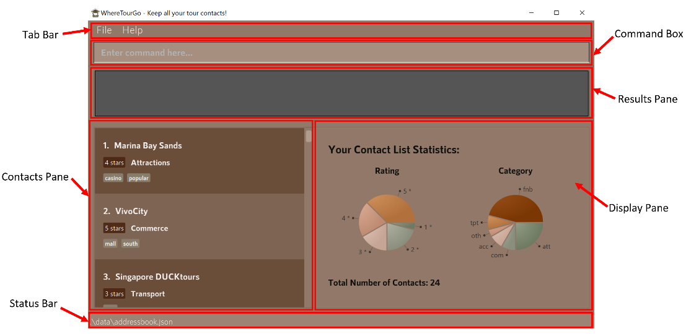
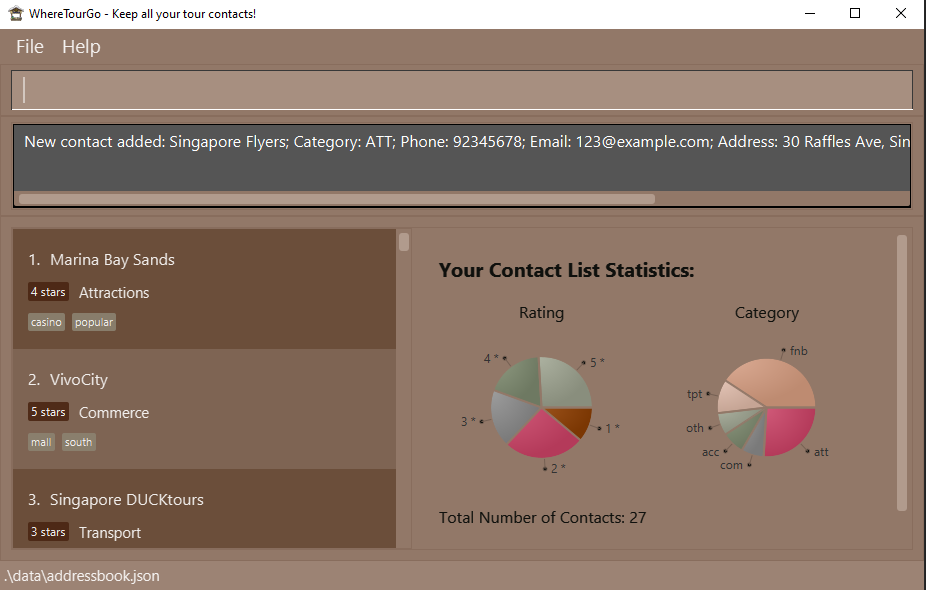
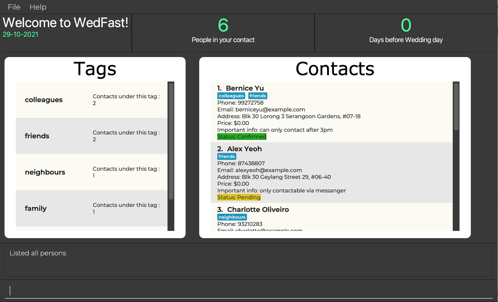
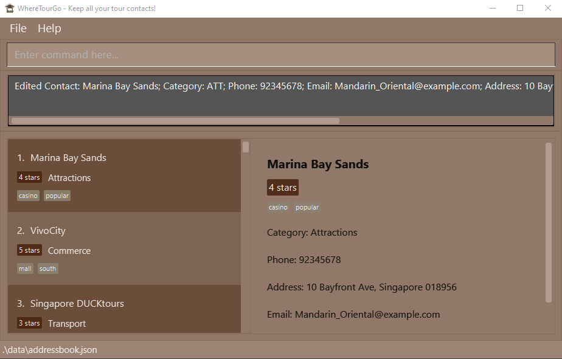
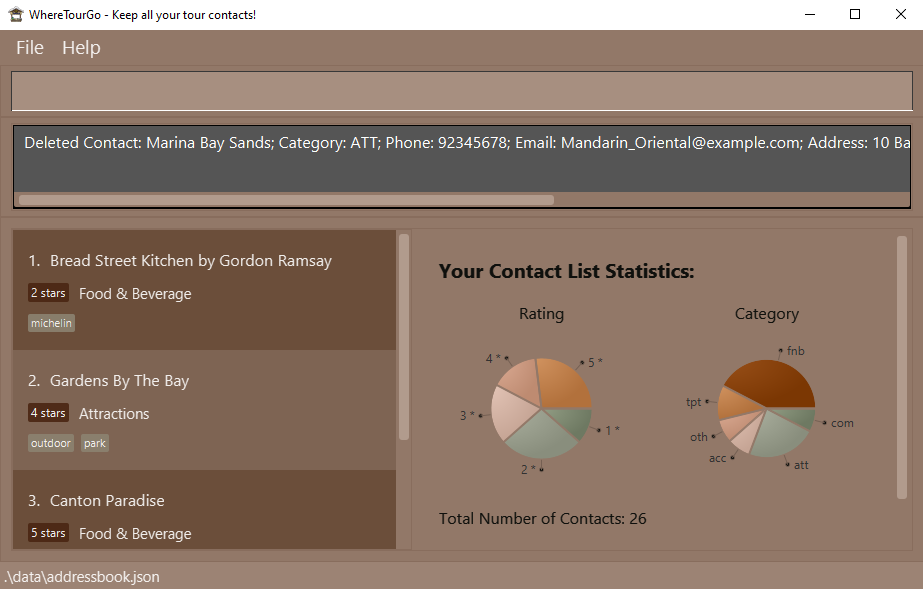
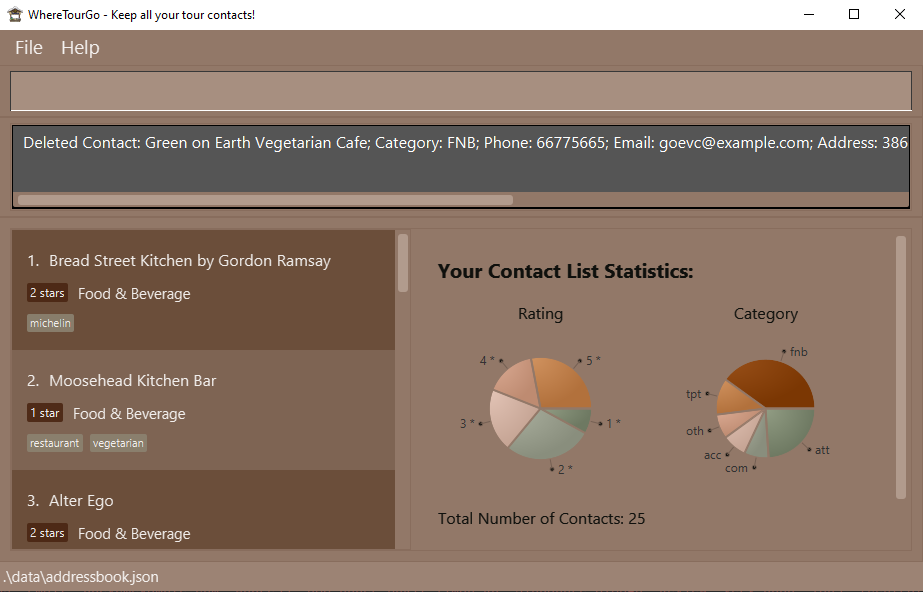
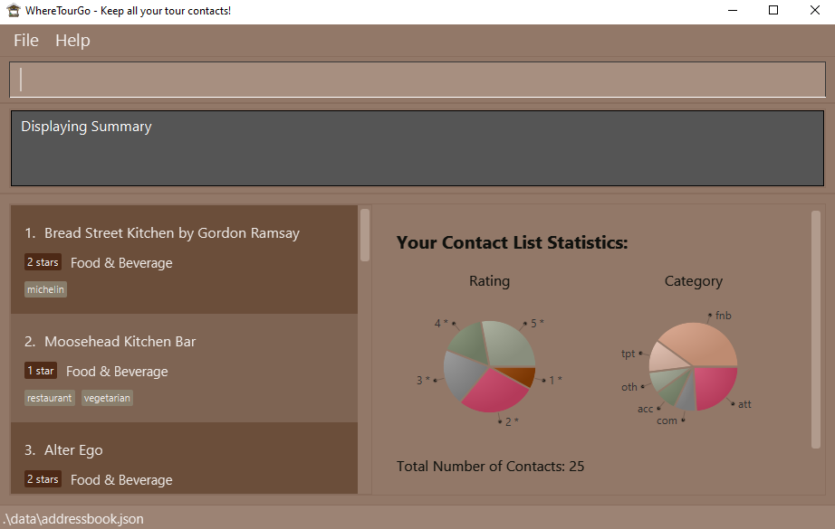

<p align = "center"></p>

<h2 align ="center"> WhereTourGo: A Tour Guide’s Best Friend! </h2>

**WhereTourGo (WTG)** is a desktop app for managing your tour contacts, optimized for use via a Command-Line Interface (CLI) while still having the benefits of a Graphical User Interface (GUI).

The app helps you easily collate and access contacts of a variety of several services such as F&B, accommodations, attractions etc. It is also enhanced with many functionalities to make modification and navigation a smooth experience.

A CLI processes your commands in the form of lines of text, while a GUI is another form of user interface that allows you to interact with our app through graphical icons.

Once you are familiar with our commands, typing fast in CLI allows you to get your contact management tasks done faster and more efficiently than traditional GUI apps. Handling repetitive tasks also becomes easier as we offer access to input history, allowing you to access past commands conveniently.

This User Guide will help you set up your contact list and familiarise yourself with the features of WhereTourGo.

Can't wait to get started? Check out the [Quick Start](#quick-start) to get going!


## Table of Contents

* [Quick Start](#quick-start)
* [About](#about)
  * [Structure of this document](#structure-of-this-document)
  * [Orienting to WhereTourGo](#orienting-to-wheretourgo)
  * [Reading this document](#reading-this-document)
    * [Technical Terms](#technical-terms)
    * [General Symbols and Syntax](#general-symbols-and-syntax)
    * [Format of commands](#format-of-commands)
    * [Restrictions for Commands](#restrictions-for-commands)
* [Features](#features)
  * [Modifying Contacts](#modifying-contacts)
    * [Adding a contact: `add`](#adding-a-contact-add)
    * [Editing a contact: `edit`](#editing-a-contact-edit)
    * [Deleting a contact: `delete`](#deleting-a-contact-delete)
  * [Retrieving Contacts](#retrieving-contacts)
    * [Listing all contacts: `list`](#listing-all-contacts-list)
    * [Locating contacts: `find`](#locating-contacts-find)
    * [Filtering contacts: `filter`](#filtering-contacts-filter)
    * [Sorting contacts: `sort`](#sorting-the-contacts-sort)
    * [Summarizing contacts: `sum`](#summarizing-contacts-sum)
    * [Viewing a contact : `view`](#viewing-a-contact-view)
  * [Navigating WhereTourGo](#navigating-wheretourgo)
    * [Navigating input history](#navigating-input-history)
    * [Clicking on contacts](#clicking-on-contacts)
  * [Undoing and Redoing](#undoing-and-redoing)
    * [Undoing operations : `undo`](#undoing-operations-undo)
    * [Redoing operations : `redo`](#redoing-operations-redo)
  * [Managing Data](#managing-data)
    * [Exporting data: `export`](#exporting-data-export)
    * [Clearing all entries : `clear`](#clearing-all-entries-clear)
    * [Saving the data](#saving-the-data)
    * [Editing the data file](#editing-the-data-file)
    * [Exiting the program : `exit`](#exiting-the-program-exit)
  * [Help](#help)
    * [Viewing help: `help`](#viewing-help-help)
    * [Displaying commands: `cmd`](#displaying-commands-cmd)

* [FAQ](#faq)
* [Command Summary](#command-summary)

--------------------------------------------------------------------------------------------------------------------

# Quick Start
1. Ensure you have Java 11 or above installed in your Computer. You may install it
   [here](https://www.oracle.com/java/technologies/javase/jdk11-archive-downloads.html)

2. Download the latest `WhereTourGo.jar` from [here](update on final)

3. Copy the file to the folder you want to use as the _home folder_ for your WhereTourGo

**For Windows**
1. Simply double-click the file to start the app

**For Mac**
1. Open Terminal

2. Navigate to the home folder you have chosen for your WhereTourGo.<br>
For example, if you have moved the app to Desktop, simply run:

```
cd Desktop
```


3. Run the following command:

```
java -jar WhereTourGo.jar
```

<br>After launching the app, GUI similar to the below should appear in a few seconds. Note how the app contains some sample data.<br><br>
   
   <br><br>

Type the command in the command box and press Enter to execute it. e.g. typing **`help`** and pressing Enter will open the help window.
<br><br>
Some example commands you can try:

  * **`list`** : Lists all contacts

  * **`add`**`c/att n/Mandarin Oriental p/98765432 e/Mandarin_Oriental@example.com a/Marina Bay Sands, Singapore 123432` : Adds a contact named `Mandarin Oriental`

  * **`delete`**`3` : Deletes the 3rd contact shown in the current list

  * **`clear`** : Deletes all contacts

  * **`exit`** : Exits the app

You can refer to the [Features](#features) below for details of every command.

[Back to top](#table-of-contents)

--------------------------------------------------------------------------------------------------------------------

# About

### Structure of this document
This User Guide is crafted to assist you in finding what you need easily.

In the subsection [Reading this document](#reading-this-document), there are several tips on how to read this guide.

The following section, [Features](#features), details the features in WhereTourGo and how to use them.

To make your navigation easier, click [Back to top](#table-of-contents) located throughout this document to navigate back to the table of contents.

### Orienting to WhereTourGo

Below is the Home screen of WhereTourGo, with its key components marked out for easy reference:



| Component | Function |
|:-------:|----------|
| Tab Bar | Exit the app or view help |
| Command Box | Text box for you to key in your input |
| Results Pane | Returns the result of the last command you entered |
| Contacts Pane | A scrollable pane containing all the contacts you have listed/filtered |
| Display Pane | A pane which displays your app summary upon opening the app, or details of the contact which you are viewing |
| Status Bar | Shows the file path of the data file in which your contacts are saved |


### Reading this document
This section introduces some technical terms, symbols and syntax used in this guide. Do try to familiarize yourself with them before moving on to the subsequent sections.


#### Technical Terms
The table below explains some technical terms frequently used throughout this User Guide.

| Term |  What it means |
|:----------:|-------------|
| CLI |  The Command-Line Interface (or CLI for short) is the user interface in which WhereTourGo is based. Typically, users interact with the app by providing text input. Unlike traditional Graphical User Interface (GUI) base apps, it may be less intuitive to new users. However upon familiarisation, fast typists may find it faster to use. |
| Command word| The Command word refers to the keywords which WhereTourGo recognises to invoke specific commands. These command words will be indicated by `COMMAND WORD` in the various sections below. |
|Parameter|Parameter refers to the user input required after the user is prompted by WhereTourGo. |


#### General Symbols and Syntax
The table below explains the general notations used throughout the user guide.

| Syntax |  What it means |
|:----------:|-------------|
| `command` |  A grey highlighted block specifies an executable command, or parameters that can be entered into the command box.  |
| _italics_ | Italicised text indicates that the text has a definition specific to WhereTourGo, or it is a caption for a Figure in the guide. |
|<div markdown="block" class="alert alert-primary"> :bulb: </div>  | A light bulb indicates that the following text is a useful tip. |
|<div markdown="block" class="alert alert-danger"> :warning: </div> | A warning sign indicates that the following text is important. |


#### Format of Commands
The following points explain the format of a command.
More examples will be provided for each command in [Features](#features).

* Words in `UPPER_CASE` are the parameters to be supplied by the user<br>
  e.g. in `add n/NAME`, `NAME` is a parameter which can be used as `add n/Mandarin Oriental`.

* Items in **square brackets** are **optional**<br>
  e.g `n/NAME [t/TAG]` can be used as `n/Mandarin Oriental t/hotel` or as `n/Mandarin Oriental`.

* Items with `…​` after them can be used multiple times including none<br>
  e.g. `[t/TAG]…​` can be used as ` ` (i.e. 0 times) `t/food`, `t/wine t/food`  or not at all

* Parameters can be in any order<br>
  e.g. if the command specifies `n/NAME p/PHONE_NUMBER`, `p/PHONE_NUMBER n/NAME` is also acceptable.

* If a parameter is expected only once in the command, but you specify it multiple times, only the last occurrence of the parameter will be taken<br>
  e.g. if you specify `p/12341234 p/56785678`, only `p/56785678` will be taken.

* Duplicate contact names are not allowed
  e.g. if there exists a contact named ‘Marina Bay Sands’, adding or editing a contact with the name ‘Marina Bay Sands’ is not allowed.<br>

* Contact names are case-sensitive e.g. `VivoCity` is not the same as `vivocity`


#### Restrictions for Commands
* For each contact, there are maximum field sizes:
  * Name has a limit of 100 characters.
  * Address has a limit of 150 characters.
  * Emails must have a domain name i.e. @gmail.com, @yahoo.com etc.
  * Phone number has a limit of 15 digits.
  * Review has a limit of 500 characters.


* Category Codes only accept the following 6 inputs:
  * Attraction: `att`
  * F&B: `fnb`
  * Commerce: `com`
  * Accommodation: `acc`
  * Transport: `tpt`
  * Others: `oth`


* Ratings only accept the following 5 inputs:
  * 1-star : `ra/1`
  * 2-star : `ra/2`
  * 3-star : `ra/3`
  * 4-star : `ra/4`
  * 5-star : `ra/5`

<div markdown="block" class="alert alert-danger"> :warning:
 Only alphanumeric symbols are allowed in the contact fields. Characters like ‘&’, ‘!’, ‘?’ are not allowed.
</div>

[Back to top](#table-of-contents)

--------------------------------------------------------------------------------------------------------------------

# Features

## Modifying Contacts

### Adding a contact: `add`

Adds a contact to the contact list.

Category codes and ratings can be found [here](#restrictions-for-commands).

Usage scenario:
* You discover a new attraction to record.

Format: `add c/CATEGORY_CODE n/CONTACT_NAME p/PHONE_NUMBER e/EMAIL a/ADDRESS [rv/REVIEW] [ra/RATING] [t/TAG]…​​`

<div markdown="span" class="alert alert-primary">:bulb: Tip:
A contact can have any number of tags, or none at all!
Similarly, reviews and ratings are optional.
</div>

Examples:
* `add c/att n/Singapore Flyers p/92345678 e/123@example.com a/30 Raffles Ave, Singapore 039803 ra/4`

Expected Outcome for `add c/att n/Singapore Flyers p/92345678 e/123@example.com a/30 Raffles Ave, Singapore 039803 ra/4` :



[Back to top](#table-of-contents)

### Editing a contact: `edit`

Edits an existing contact in the contact list.

Category codes and ratings can be found [here](#restrictions-for-commands).

Usage scenario:
* You realise you entered the name of a restaurant wrongly, and want to rectify it.

Format: `edit INDEX [n/CONTACT_NAME] [p/PHONE] [e/EMAIL] [a/ADDRESS] [rv/REVIEW] [c/CATEGORY_CODE][ra/RATING]  [t/TAG]…​`

* Edits the contact at the specified `INDEX`. The index refers to the index number shown in the displayed contact list. The index **must be a positive integer** 1, 2, 3, …​
* At least one of the optional fields must be provided.
* Fields will be updated based on input values.
* When editing tags, the existing tags of the contact will be removed (i.e. adding of tags is not cumulative).

<div markdown="span" class="alert alert-primary">:bulb: Tip:
You can remove all of a contact’s tags by typing `t/` without specifying any tags after it.
</div>

Examples:
*  `edit 1 p/92345678 e/Mandarin_Oriental@example.com` Edits the phone number and email address of the 1st contact to be `92345678` and `Mandarin_Oriental@example.com` respectively.
*  `edit 2 n/Marina Bay Sands t/` Edits the name of the 2nd contact to be `Marina Bay Sands` and clears all existing tags.
* `edit 3 ra/3` Edits the rating of the 3rd contact to be `3`.

Expected Outcome for `edit 1 p/92345678 e/Mandarin_Oriental@example.com`:

Before:



After:



[Back to top](#table-of-contents)

### Deleting a contact: `delete`

Deletes the specified contact from the contact list, either by name or index.

Usage scenario:
* You want to remove a hotel's contact information from WhereTourGo, as it has closed down.

Format: `delete INDEX`

* Deletes the contact at the specified INDEX.
* The index refers to the index number shown in the displayed contact list.
* The index must be a positive integer 1, 2, 3, ...

Examples:
* `list` followed by `delete 2` deletes the 2nd contact in the contact list.
* `find Marina Bay Sands` followed by `delete 1` deletes the 1st contact in the results of the find command.

Expected Outcome for `find Marina Bay Sands` followed by `delete 1`:



-------------
Format: `delete n/CONTACT_NAME`

* Deletes the contact specified by CONTACT_NAME
* The name must refer to a contact’s full name in the displayed contact list.
* The name is case-sensitive and must match the contact's name exactly.

Examples:
* `list` followed by `delete n/Singapore DUCKTours` deletes the contact with name 'Singapore DUCKTours`.
* `filter c/fnb` followed by `delete n/Green on Earth Vegetarian Cafe` deletes the contact with name 'Earth Vegetarian Cafe'.

Expected Outcome for `filter c/fnb` followed by `delete n/Green on Earth Vegetarian Cafe`:




[Back to top](#table-of-contents)

## Retrieving Contacts

### Listing all contacts: `list`

Shows a list of all contacts in the contact list.

Usage scenario:
* You would like to have an overview of all your existing contacts in WhereTourGo.

Format: `list`

[Back to top](#table-of-contents)

### Locating contacts: `find`

Finds all contacts whose names, addresses, phone numbers, email addresses or reviews contain any of the given keywords.

Usage scenario:
* You would like to find any places of interest which are along Orchard Road (have 'Orchard Road' contained within their address field).
* You remember leaving a positive review on the room service of a particular hotel, but have forgotten which hotel it was for. You would like to find which contact this review was written for.


Format: `find KEYWORD [MORE_KEYWORDS]`

* The search is case-insensitive, e.g.,  `hotel` will match `Hotel`.
* The order of the keywords does not matter. e.g. `Park Hyatt` will match `Hyatt Park`.
* Fields searched are: name, phone, email, address and review.
* Contacts matching at least one keyword will be returned . e.g. `Park` will return `Park Hyatt Singapore`, `Park Royale`.

Examples:
* `find hotel` returns `D’ Hotel` and `The Fullerton Hotel`.
* `find bay` returns `Gardens by the Bay` and `Marina Bay Sands`.

Expected Outcome for `find bay`:


[Back to top](#table-of-contents)


### Filtering contacts: `filter`
Shows a list of all contacts in the specified category, with the specified rating and/or with the specified tag.

Usage scenario:
* You want to filter for all hotels (in category 'acc') which have a 5-star rating.
* You would like to filter all restaurants (in category 'fnb') which are affordable (with the tag 'cheap').

Format: `filter [c/CATEGORY] [ra/NUMBER] [t/TAGS] ... `

Category codes and ratings can be found [here](#restrictions-for-commands).
* Tags:
  * Any custom tags you've added into your contacts!


<div markdown="span" class="alert alert-primary">:bulb: Tip:
You can add multiple category and tag filters in a single command, but only a single rating filter!
</div>

Examples:
* `filter c/fnb` returns McDonald's, KFC, and Burger King (all F&B contacts).
* `filter c/acc c/fnb` returns Mandarin Oriental, and KFC (all accommodation and F&B contacts).
* `filter ra/3 t/outdoor` returns all contacts with 3-star rating and outdoor tag from all categories.
* `filter c/fnb ra/3 t/fun t/outdoor` returns all F&B contacts with 3-star rating, and with fun and/or outdoor tags.

Expected Outcome for `filter c/fnb`:


[Back to top](#table-of-contents)

### Sorting the contacts: `sort`
Sorts the list of contacts in a specified order. The sort feature sorts by Contact name (in lexicographical order) or by Rating (in descending order).

Usage scenario:
* You want to see all the highest rated contacts at one glance.
* You want to arrange a messy list of contacts by lexicographical order.

Format : `sort FIELD`

Examples :
* `sort name` returns the same list of contacts displayed in lexicographical order.
* `sort rating` returns the same list of contacts displayed, sorted from highest to lowest rating.

[Back to top](#table-of-contents)

### Summarizing contacts: `sum`
Shows a summary of the content of WhereTourGo. The data presented as a summary are as follows:
* total number of contacts in the contact list.
* the proportion of contacts for each rating (Does not include unrated contacts).
* the proportion of contacts for each category defined by [Category code](#restrictions-for-commands).

Usage scenario:
* You want to improve on the quality of your tours. You would like to review the database to see which category of tour contacts lacks diversity.
* You would like to assess the quality of your contacts by viewing the proportion of contacts with high ratings.

Format: `sum`

Expected Outcome for `sum`:



[Back to top](#table-of-contents)

### Viewing a contact: `view`

Displays the specified contact from the contact list.

Usage scenario:
* You want to zoom in on a particular contact to obtain all the information.

Format: `view INDEX`

* Displays the contact at the specified INDEX.
* The index refers to the index number shown in the displayed contact list.
* The index must be a positive integer 1, 2, 3, ...

Examples:
* `list` followed by `view 2` displays the 2nd contact in the contact list.
* `find Mandarin Oriental` followed by `view 1` displays the first contact in the results of the find command.

-------------
Format: `view n/CONTACT_NAME`

* Displays the contact specified by CONTACT_NAME.
* The name must refer to a contact’s full name in the displayed contact list.
* The name is case-sensitive and must match exactly.

Examples:
* `list` followed by `view n/Marina Bay Sands` displays the contact with name 'Marina Bay Sands'.
* `find Gardens By The Bay` followed by `view n/Gardens By The Bay` displays the contact with name 'Gardens By The Bay'.

[Back to top](#table-of-contents)

## Navigating WhereTourGo

### Navigating input history
When typing commands, you can use the up and down arrow keys to access previously entered inputs.

<div markdown="block" class="alert alert-danger"> :warning: Caution:
Input history will be reset whenever you exit the app.
</div>

[Back to top](#table-of-contents)

### Clicking on contacts
Click on any contact in the [Contacts Pane](#orienting-to-wheretourgo) to view more information about the contact.
This is equivalent to using a [`view`](#viewing-a-contact-view) command.

[Back to top](#table-of-contents)

## Undoing and Redoing
### Undoing operations: `undo`
Undoes the last change made to the list of contacts stored.

Usage scenario:
* You deleted an important contact by mistake and would like to restore this contact.

Format: `undo`

Examples :
* If you execute the command `delete Marina Bay Sands`, then execute the command `undo`, the Marina Bay Sands contact will be restored.

[Back to top](#table-of-contents)

### Redoing operations: `redo`
Redoes the last change undone on the list of contacts stored.

Usage scenario:
* You want to delete all contacts after the seventh contact. You can execute `delete 8` once, and then repeatedly execute `redo` until there are no more contacts after the seventh one.

Format: `redo`

Examples :
* If you execute the command `delete n/Marina Bay Sands`, then execute the command `undo` , the Marina Bay Sands contact will be restored.
  If you then execute `redo` , the Marina Bay Sands contact will be deleted again


<div markdown="span" class="alert alert-primary">:bulb: Tip:
Only commands that directly change the stored data can be redone and undone. These commands include add, delete, edit, sort and clear.
</div>

[Back to top](#table-of-contents)

## Managing Data
### Exporting data: `export`

Exports all the contacts from the contact list to a well-formatted `.txt` file.

Usage scenario:
* You need to forward tour information quickly to someone else (i.e. the tour bus driver, an anxious tour participant).

Format: `export`
* Exports the specified contact from the contact list.
* The text file will be written with the path `data/export.txt`.

-------------
Format: `export INDEX`

* Exports the contact at the specified INDEX.
* The index refers to the index number shown in the displayed contact list.
* The index must be a positive integer 1, 2, 3, ...

Examples:
* `list` followed by `export 2` exports the second contact in the contact list.
* `find Mandarin Oriental` followed by `export  1` exports the first contact in the results of the find command.

A sample of the exported text file:


[Back to top](#table-of-contents)

### Clearing all entries: `clear`

Clears all entries from the contact list.

Usage scenario:
* You want to wipe out the current database and start afresh.

Format: `clear`

[Back to top](#table-of-contents)

### Saving the data

WhereTourGo data is saved in the hard disk automatically after any command that changes the data. You do not need to save your changes manually!

[Back to top](#table-of-contents)

### Editing the data file

WhereTourGo data is saved as a JSON file at `[JAR file location]/data/addressbook.json`. Advanced users are welcome to update data directly by editing that data file.

<div markdown="block" class="alert alert-danger"> :warning: Caution:
If your changes to the data file make the format invalid, WhereTourGo will discard all data and start with an empty data file at the next run.
</div>

[Back to top](#table-of-contents)

## Help

### Viewing help: `help`

Open the User Guide in your default Browser.

Usage scenario:
* You are new to the app and want to find basic commands to get started with.

Format: `help`

<div markdown="span" class="alert alert-danger">
:warning: Caution: If the User Guide cannot be opened in the Browser, a link to the User Guide will be provided.
</div>

Please refer to the [FAQ](#faq) for more information.

[Back to top](#table-of-contents)

### Displaying commands: `cmd`

Open the command list in your default Browser.

Usage scenario:
* You want to view a command and its syntax as you have forgotten how it should be used.

Format: `cmd`

<div markdown="span" class="alert alert-danger">:warning: Caution:
If the command list cannot be opened in the Browser, a link to the User Guide will be provided.
</div>

Please refer to the [FAQ](#faq) for more information.

[Back to top](#table-of-contents)

### Exiting the program: `exit`

Exits the program.

Format: `exit`

[Back to top](#table-of-contents)

--------------------------------------------------------------------------------------------------------------------

# FAQ
**Q**: How do I save my data?<br>
**A**: Your contact list is saved in your hard disk automatically for each command that modifies the list.

**Q**: Where is my data saved?<br>
**A**: When our app is first opened, it will create a folder named data in the same folder where the JAR file is located.
This folder contains a file called `addressbook.json` which contains all of your contacts with the corresponding details.

**Q**: Where can I find my text file after executing the `export` command?
**A**: You can find the nicely-formatted text file called `export.txt` in the folder named data. (Path: `data/export.txt`)

**Q**: How do I transfer my data to another computer?<br>
**A**: Install the app in the other computer. Overwrite the empty data file it creates with the data file from your previous WhereTourGo home folder.

**Q**: What do I do if I forget the format of all the commands?<br>
**A**: You can type either `cmd` to show the command summary or `help` to open our User Guide.

**Q**: Why does cmd/help command open a backup window with a link instead of my browser?<br>
**A**: Check to ensure that your browser installed has been upgraded to the latest version. Restart the app and try again. If the issue still isn't resolved, please contact us at "WhereTourGo@gmail.com".

[Back to top](#table-of-contents)

--------------------------------------------------------------------------------------------------------------------

# Command summary

Action | Format, Examples
--------|------------------
**Add** | `add c/CATEGORY_CODE n/CONTACT_NAME p/PHONE_NUMBER e/EMAIL a/ADDRESS [t/TAG] [rv/REVIEW] [ra/RATING]…​` <br> e.g., `add c/att n/Singapore Flyers p/92345678 e/123@example.com a/30 Raffles Ave, Singapore 039803 t/friend t/colleague rv/Great place ra/4`
**Clear** | `clear`
**Delete** | `delete INDEX`<br> e.g., `delete 3`<br><br> `delete n/CONTACT_NAME`<br> e.g., `delete n/Marina Bay Sands`
**Edit** | `edit INDEX [n/NAME] [p/PHONE_NUMBER] [e/EMAIL] [a/ADDRESS] [t/TAG]…​`<br> e.g.,`edit 2 n/Adventure Cove e/adventurecove@example.com`
**Find** | `find KEYWORD [MORE_KEYWORDS]`<br> e.g., `find hotel sands`
**List** | `list`
**Filter** | `filter c/CATEGORY`<br> e.g.,`filter c/fnb`
**Sort** | `sort name`<br><br>`sort rating`
**View** | `view INDEX`<br>e.g., `view 1`  <br><br>`view n/CONTACT_NAME`<br> e.g., `view n/Marina Bay Sands`
**Undo** | `undo`
**Redo** | `redo`
**Export** | `export`<br><br>`export INDEX` <br> e.g., `export 2`
**Contact Summary** | `sum`
**Command Summary** | `cmd`
**Help** | `help`
**Exit** | `exit`

[Back to top](#table-of-contents)
