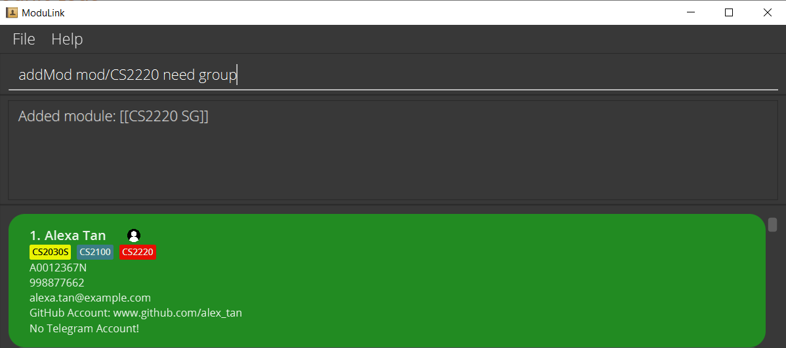
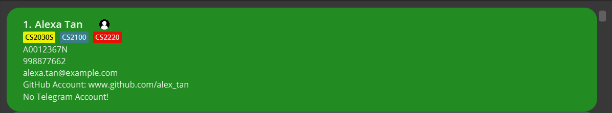
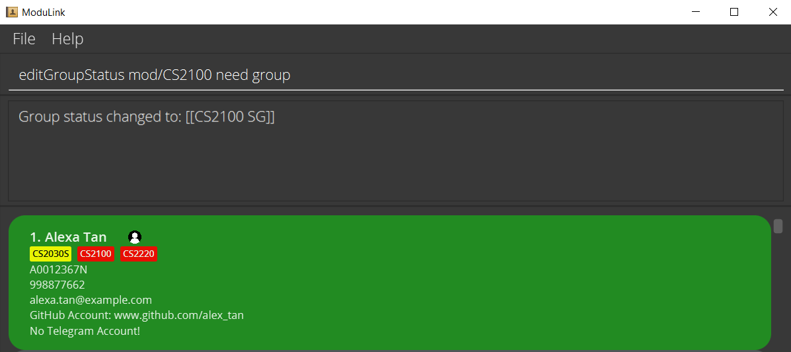
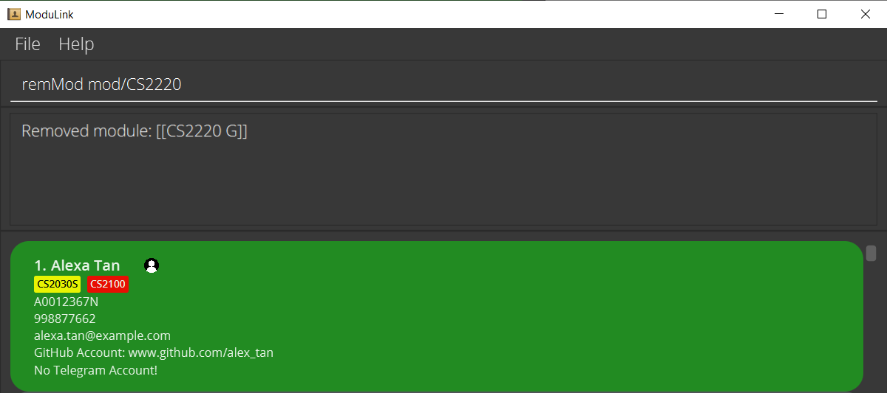
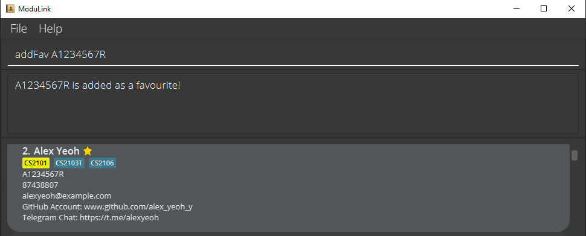
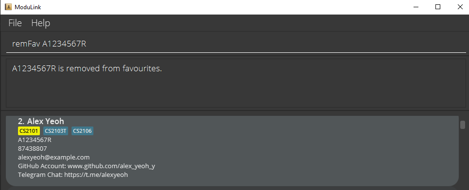
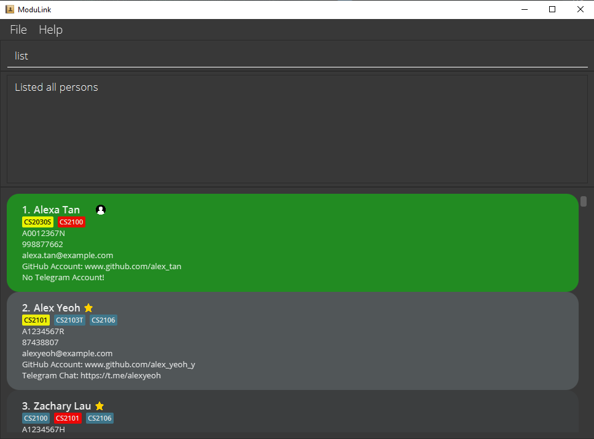

## Welcome to ModuLink!

ModuLink is a **desktop-based** application for **Computer Science (CS) students** at NUS to facilitate finding teammates for group-based modules. With a powerful integrated contact management platform, connecting with peers to form project groups has never been easier. ModuLink allows you to find students taking the modules you are interested in, search by their group status (to find students available to form or join groups), and much more.
 

The app is configured to use the **Command Line Interface (CLI)**, which means most of the commands you will interact with will be typed in a command box, rather than using a Graphical User Interface (GUI) with graphical tools and icons. If you are unaccustomed to the CLI, do not worry, as ModuLink still provides a lot of the benefits of a GUI to make working with text-based inputs easy to understand.
 

This User Guide will show you everything you need to know to optimize your experience with ModuLink, whether you are a new or proficient user. We recommend reading through **[Section 1: Using this User Guide](#section-1-using-this-user-guide)** if you are a first-time user. If you would like to skip to the features ModuLink provides, you can head to **[Section 3: Features - Understanding what ModuLink can do for you](#section-3-features---understanding-what-modulink-can-do-for-you)**.

--------------------------------------------------------------------------------------------------------------------

## Section 1: Using this User Guide
This guide has been designed to make sure you can quickly access any information you may need. At a glance, here is how it is structured:

1. [Quick Start - Getting started with ModuLink (Recommended for first-time users)](#section-2-quick-start---getting-started-with-modulink)
2. [Features - Understanding what ModuLink can do for you](#section-3-features---understanding-what-modulink-can-do-for-you)
3. [Managing Data](#section-4-data-storage-in-modulink)
4. [Summaries](#section-5-summaries)
5. [Frequently Asked Questions](#section-6-frequently-asked-questions)

We further recommend taking a glance at **[Section 1.1 Syntax and symbols](#section-11-syntax-and-symbols)** to familiarize yourself with the formats, icons and other terms this guide uses.

### Section 1.1: Syntax and Symbols
Here are the commonly used syntax and symbols throughout the UG:

`inline code` denotes a command for the application. 
`prefix/`   denotes a ModuLink-supported prefix.

:exclamation: Important
denotes an important information for the functioning of the app.
 

:warning: Caution
denotes a possible fault that could occur.
 

:information_source: Notes
denotes extra information to aid user in understanding the app.
 

--------------------------------------------------------------------------------------------------------------------

## Section 2: Quick Start - Getting Started with ModuLink

### Section 2.1 One-time Set-Up
If you are using ModuLink for the first time, we will first walk you through a one-time set-up to get started.

1. Ensure you have Java 11 or above installed on your computer. You can easily do this via the **Terminal** app for Mac users, or the **Command Prompt** app for Windows users, and simply type and enter `java -version`. 
 
Alternatively, if you prefer, you could also check the version via the GUI for both Mac and Windows systems, as mentioned in this [guide](https://phoenixnap.com/kb/check-java-version-on-mac-windows). 
    
    
   
:exclamation: Important:
   ModuLink will not run on older versions of Java! If you do not have Java 11 installed, please install it by following the instructions in the official [guide](https://www.oracle.com/java/technologies/javase/jdk11-archive-downloads.html).
   

    
2. Download the latest **ModuLink.jar** from our website [here](https://github.com/AY2122S1-CS2103T-W12-4/tp/releases).
3. Move the file to the folder you want to use as the home folder for ModuLink on your computer.

### Section 2.2 Working with ModuLink
To run the app, simply double click the file. 

Alternatively, you can open the app via the **Terminal** app for Mac users, or the **Command Prompt** app for Windows users. To do this,
1. `cd` into the directory you saved ModuLink in.
2. Type and enter `java -jar ModuLink.jar`.

You should see a GUI similar to the one shown below in a few seconds. The app will already contain data. Here’s a quick look at the different elements in the app.

As mentioned earlier, ModuLink works as a CLI, which means you will need to type and enter commands in the command box. To get accustomed to the interface, try the following commands (in the given the order).

* **`create n/John Doe id/A0123456A p/24680135 e/johndoe@example.com`** : Creates your ModuLink user profile with the name John Doe and the relevant student ID, phone number and email.
* **`addMod mod/CS2103T need group`**, followed by **`addMod mod/CS2101 need member`**: Adds CS2103T and CS2101 module tags to your profile and indicates that you need to form or join a group for CS2103T and that you need member(s) for your CS2101 group.
* **`list`**: Lists all the profiles on ModuLink.
* **`filter mod/CS2101`**: Filters all profiles who have CS2101 as one of their module tags.
* **`filter mod/CS2101 need group`**: Filters all profiles who have CS2101 as one of their module tags AND need to form or join a group for it.
* **`addFav A1234567R`**: Adds the profile with the student ID A1234567R to your favorites list.
* **`listFav`**: Lists all your favorite profiles.

--------------------------------------------------------------------------------------------------------------------

## Section 3: Features - Understanding what ModuLink can do for you

To know what you can do with ModuLink, and what ModuLink can do for you, refer to the table of contents below to quickly navigate between sections. 

:exclamation: Important:
If you are a first-time user, we recommend starting with [Create your own profile](#11-create-your-own-profile--create). This is because you can only use other commands in ModuLink after creating your own profile.

1. [Profiles](#1-profiles)  
   1.1. [Create your own profile](#11-create-your-own-profile--create)  
   1.2. [Edit your profile](#12-edit-your-profile--edit)  
2. [Manage module tags](#2-manage-module-tags)  
   2.1. [Add modules to your profile](#21-add-modules-to-your-profile--addmod)  
   2.2. [Edit the group status of existing modules on your profile](#22-edit-the-group-status-of-existing-modules-on-your-profile--editgroupstatus)  
   2.3. [Remove modules from your profile](#23-remove-modules-from-your-profile--remmod)  
3. [Manage favourites](#3-manage-favorites)  
   3.1. [Add a profile as a favourite](#31-add-a-profile-as-a-favorite--addfav)  
   3.2. [Remove a profile from favourites list](#32-remove-a-profile-from-favourites-list--remfav)  
4. [Viewing options](#4-viewing-options)  
   4.1. [List all profiles](#41-list-all-profiles--list)  
   4.2. [List all profiles marked as favorite](#42-list-all-profiles-marked-as-favorite--listfav)  
   4.3. [Find profiles by name](#43-find-profiles-by-name--find)  
   4.4. [Find profiles by Student ID](#44-find-profiles-by-student-id--findid)  
   4.5. [Filter profiles by module and group status](#45-filter-profiles-by-module-and-group-status--filter)  
5. [Utility commands](#5-utility-commands) 
   5.1 [Viewing help](#51-viewing-help--help) 
   5.2 [Exiting ModuLink](#52-exiting-modulink--exit) 

**:information_source: Notes about the command format:** 

* Words in `UPPER_CASE` are the parameters to be supplied by the user. 
  e.g. in `add n/NAME`, `NAME` is a parameter which can be used as `add n/John Doe`.
  
* Prefixes and commands are case-sensitive. 

* Items in square brackets are optional. 
  e.g `n/NAME [mod/MODULE]` can be used as `n/John Doe mod/CS2103T` or as `n/John Doe`.

* Items with `…`​ after them can be used multiple times including zero times. 
  e.g. `[mod/MODULE]…​` can be used as ` ` (i.e. 0 times), `mod/CS2100`, `mod/CS2100 mod/CS2103T` etc.

* Parameters can be in any order. 
  e.g. if the command specifies `n/NAME p/PHONE_NUMBER`, `p/PHONE_NUMBER n/NAME` is also acceptable.

* Extraneous parameters for commands that do not take in parameters (such as `help`, `list`, and `exit`) will be ignored. 
  e.g. if the command specifies `help 123`, it will be interpreted as `help`.

### 1. Profiles

#### 1.1 Create your own profile : `create`

Creates your user profile. You can also choose to add modules and indicate your group status for each module.

:exclamation: Important:
in order to start using ModuLink, you are **required** to create a new profile should you not have one.

Format: `create n/NAME id/STUDENT_ID p/PHONE_NUMBER e/EMAIL [github/GITHUB_USERNAME] [tele/TELEGRAM_HANDLE] [mod/MODULE [GROUP_STATUS]]...`

**:information_source: Notes:**
* Every STUDENT_ID in the database must be unique.
* You can choose to input your telegram handle as either starting with '@' (e.g.: @teleHandle), or just the handle itself (e.g.: teleHandle)
* The group statuses available are: Need member, Need group, Don't need group/Not looking for group.
* The default status when a module is added without a description is 'Don't need group/Not looking for group'. The respective module will be displayed as a blue tag.
* To indicate you need members for your group, you can include the description 'need member'. The respective module will be displayed as a yellow tag.
* To indicate you are looking for a group, you can include the description 'need group'. The respective module will be displayed as a red tag.

   
Examples:
* `create n/John Doe id/A0222594A p/12345678 e/john.doe@example.com github/johndoe mod/CS2103T`
* `create n/Jane Doe id/A0222594A p/87654321 e/jane_doe@example.com tele/@janedoe mod/CS2101 need group`
* `create n/Alexa Tan id/A0012367N p/998877662 e/alexa.tan@example.com mod/CS2030S need member mod/CS2100`
     
     

#### 1.2 Edit your profile : `edit`

Edits your own profile. You can choose to edit any attribute in your own profile, except for module tags which use separate commands. You can edit multiple attributes at once.

Format: `edit EDITED_ATTRIBUTE [MORE ATTRIBUTES]...`

Prefixes for editable attributes:
* NAME: `n/`
* STUDENT ID: `id/`
* PHONE: `p/`
* EMAIL: `e/`
* GITHUB: `github/`
* TELE: `tele/`

Examples:
* `edit p/123321432 e/changedemail@example.com`
* `edit github/alex_tan`  
     
   

### 2. Manage module tags
Module tags are colour coded.
* Blue tags indicate that the user is not looking for a group for that specific module.
* Yellow tags indicate that the user is looking for other students to join their group for that specific module.
* Red tags indicate that the user has no group and is looking to join one for that specific module.  

#### 2.1 Add modules to your profile : `addMod`

Adds the user-specified module to your own profile.

Format: `addMod mod/MODULE [GROUP_STATUS]`

Examples:
* `addMod mod/CS2103T`
* `addMod mod/CS2220 need group`
   
   
  
  

#### 2.2 Edit the group status of existing modules on your profile : `editGroupStatus`

Edits the group status of user-specified module in your module list.

Format: `editGroupStatus mod/MODULE [NEW_STATUS_DESCRIPTION]`

**:information_source: Notes:**
* If no updated status description is given, the group status is set to the default 'Don't need group/Not looking for group'.

   
Examples:
* `editGroupStatus mod/CS2220`
* `editGroupStatus mod/CS2030S need member`
* `editGroupStatus mod/CS2100 need group`
   
   
  Original profile:
  

  Updated profile:
  

#### 2.3 Remove modules from your profile : `remMod`

Removes the user-specified module from your own profile.

Format: `remMod mod/MODULE`

Examples:
* `remMod mod/CS2103T`
* `remMod mod/CS2220`
   
   
  
 
  

### 3. Manage favorites

#### 3.1 Add a profile as a favorite : `addFav`

Adds a profile to your favourites list. Favourited profiles will have a star beside their name.

Format: `addFav STUDENT_ID`

**:information_source: Notes:**
* You cannot add your own profile as a favourite.

Examples:
* `addFav A0222594A`
* `addFav A1234567R`
   
   
  

### 3.2 Remove a profile from favourites list : `remFav`

Removes a user-specified profile from your favourites list.

Format: `remFav STUDENT_ID`

Examples:
* `remFav A0212345X`
* `remFav A1234567R`
   
   
  

### 4. Viewing options

#### 4.1 List all profiles : `list`

Shows a list of all profiles in ModuLink.

Format: `list`
     
     

#### 4.2 List all profiles marked as favorite : `listFav`

Shows a list of all profiles that the user has added to their favourites list.

Format: `listFav`
 
 

#### 4.3 Find profiles by name : `find`

Finds profiles whose names contain any of the entered keywords.

Format: `find KEYWORD [MORE_KEYWORDS]...`

* The search is not case-sensitive. e.g hans will match Hans
* The order of the keywords does not matter. e.g. Hans Bo will match Bo Hans
* Only the name is searched.
* Only alphanumeric characters can be entered.
* Only full words will be matched e.g. Han will not match Hans
* Profiles matching at least one of the specified keywords will be returned.

Examples:
* `find John` returns `John` and `John Doe`
* `find bernice` returns `Bernice Yu`
* `find alex david` returns `Alex Berenson` and `David Li`
   
   
  

#### 4.4 Find profiles by student ID : `findId`

Finds profiles whose student ID number matches any of the entered keywords.

Format: `findId STUDENT_ID [MORE_STUDENT_IDS]...`

* The search is not case-sensitive. e.g a0123456a will match A023456A
* The order of the student IDs does not matter. e.g. `findId A0123456A A0654321A` will show the profiles whose student Id number matches either A0123456A or A0654321A.
* Only the student ID numbers are searched.
* Profiles matching any keywords will be returned.

Examples:
* `findId A1204567S` returns the person whose student ID number matches A1204567S exactly.
* `findId A1234567R A1234567H` returns the profiles whose student ID number matches either A1234567R or A1234567H exactly.
   
   
  

#### 4.5 Filter profiles by module and group status : `filter`

Show profiles filtered by module code and _optionally_ by group status.

Format: `filter mod/MODULE_CODE [GROUP_STATUS]`

* You can filter by profiles who need to join or form a group ('need group') or profiles who need members for their group ('need member').
* `MODULE_CODE` is required for filtering by group status. The filter will return the profiles with the specified group status of the specified module.

**:information_source: Notes:**
* Your own profile does not appear when filtering.

Examples
* `filter mod/CS2100`
* `filter mod/CS2100 need member`
* `filter mod/CS2100 need group`
   
   
  
   
   
  

### 5. Utility commands

#### 5.1 Viewing help : `help`

Shows a message explaning how to access the help page. Upon entering the command, a pop-up window will appear. Follow the link on the window to access the User Guide.

Format: `help`
 
 

#### 5.2 Exiting ModuLink : `exit`

Exits the program.

Format: `exit`

## Section 4: Data Storage in ModuLink

### Saving the data

ModuLink's data is saved in the hard disk automatically after any command that changes the data. There is no need to save manually.

### Editing the data file

ModuLink's data are saved as a JSON file `[JAR file location]/data/modulink.json`. Advanced users are welcome to update data directly by editing that data file.

:warning: Caution:
If your changes to the data file makes its format invalid, ModuLink will discard all data and start with an empty data file at the next run.
In this event, please locate the data file, delete it, and relaunch the app.

--------------------------------------------------------------------------------------------------------------------

## Section 5: Summaries

### Parameter summary

Prefix | Parameter
-------|-----------
**`n/`** | NAME
**`id/`** | STUDENT ID
**`p/`** | PHONE NUMBER
**`e/`** | EMAIL
**`github/`** | GITHUB USERNAME
**`tele/`** | TELEGRAM HANDLE
**`mod/`** | MODULE

### Command summary

Action | Format, Examples
-------|-----------------
**Create** | `create n/NAME id/STUDENT_ID p/PHONE_NUMBER e/EMAIL [github/GITHUB_USERNAME] [tele/TELEGRAM_HANDLE] [mod/MODULE [GROUP STATUS]]...`     e.g., `create n/John Doe id/A0222594A p/12345678 e/john.doe@example.com mod/CS2100`
**Edit** | `edit EDITED_ATTRIBUTE [MORE_ATTRIBUTES]...`     e.g., `edit p/123321432 e/changedemail@example.com`
**Add module** | `addMod mod/MODULE [GROUP_STATUS]`     e.g., `addMod mod/CS2103T need member`
**Edit module group status** | `editGroupStatus mod/MODULE [NEW_STATUS_DESCRIPTION]`     e.g., `editGroupStatus mod/CS2103T need group`
**Remove module** | `remMod mod/MODULE`     e.g., `remMod mod/CS2100`
**Add Favourite** | `addFav STUDENT_ID`      e.g., `addFav A0222594A`
**Remove Favourite** | `remFav STUDENT_ID`      e.g., `remFav A0222594A`
**List** | `list`
**List favorites** | `listFav`
**Find by name** | `find KEYWORD [MORE_KEYWORDS]...`   e.g., `find alex david` returns `Alex Yeoh, David Li`
**Find by student ID** | `findId STUDENT_ID [MORE_STUDENT_IDS]...`   e.g., `findId A0222594A` returns person with student Id matching A0222594A.
**Filter** | `filter mod/MODULE_CODE [group/GROUP_STATUS]`  e.g. no group filter: `filter mod/CS2030`   with group filter: `filter mod/CS2030 need group`
**Help** | `help`
**Exit** | `exit`

--------------------------------------------------------------------------------------------------------------------

## Section 6: Frequently Asked Questions

**Q**: How do I transfer my data to another Computer? 
**A**: Install the app in the other computer and overwrite the empty data file it creates with the file that contains the data of your previous ModuLink home folder.

--------------------------------------------------------------------------------------------------------------------
