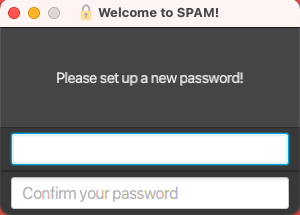

Welcome to the SPAM user guide. The main purpose of this guide is to provide our users with the knowledge required to
make full use of the application. 

To make your experience using the guide more enjoyable, we have prepared the following instructions based on 
the kind of user you may be.

| I am... | Instructions |
| ------- | ------------ |
| ... a new user          | You may want to take a look at the [introduction](#introduction) to SPAM to get a better understanding of what the application can do. After that, we suggest following our [quick start guide](#quick-start) to install and have a tour of the application. |
| ... an experienced user | You may want to take a look at the [navigation links](#navigation-links) below to jump straight to the content that you are looking for. You could also make use of the search bar by pressing the `ctrl` (on Windows/Linux) / `command ⌘` (on macOS) and `f` keys. Alternatively, search for a term in this entire site by using the [search](Search.html) feature.|

#### Navigation Links

Click on any link below to jump straight into that section.

<div class="card mb-3">
<div markdown="1" class="card-body pt-0 pb-0">
<h6 markdown="1" class="card-title">[Introduction](#introduction)</h6>
This section contains information that serves to introduce you to SPAM and some of its cool features.
</div>
</div>

<div class="card mb-3">
<div markdown="1" class="card-body pt-0 pb-0">
<h6 markdown="1" class="card-title">[Quick Start](#quick-start)</h6>
This section serves as a quick start guide that includes information on how to install, a tour of the graphical user
interface and a getting started tutorial.
</div>
</div>

<div class="card mb-3">
<div markdown="1" class="card-body pt-0 pb-0">
<h6 markdown="1" class="card-title">[Commands](#commands)</h6>
This section contains details about all the available commands that you can use to control the SPAM application. 
</div>
</div>

<div class="card mb-3">
<div markdown="1" class="card-body pt-0 pb-0">
<h6 markdown="1" class="card-title">[FAQ](#faq)</h6>
This section contains all the frequently asked questions about SPAM. 
</div>
</div>

---

<div style="page-break-after: always;"></div>

## Introduction

SPAM (Super Powerful App for Marketing) is a desktop app for managing contacts targeted at marketers who require fast 
manipulation and precise handling of contact data. It enables marketers to more easily manage and make use of email 
and phone leads, and minimise tedious and repetitive tasks such as data entry.

#### Features

Below is a list that highlights some of our special features.

| Feature | Description  |
| ------- | ------------ |
| Data Security <span class="badge badge-pill bg-success text-white">NEW</span> | The application data is protected by industry standard [AES-256](https://en.wikipedia.org/wiki/Advanced_Encryption_Standard) encryption. |
| Spreadsheets Support <span class="badge badge-pill bg-success text-white">NEW</span> | SPAM supports imports from and exports to _.csv_ files, which are compatible with Microsoft Excel and most modern-day marketing software. |
| Contacts Management | SPAM allows you to create, add, edit and delete contacts that are locally stored on your computer. | 

---

<div style="page-break-after: always;"></div>

## Quick start

This section includes all the necessary information that you will need to start using SPAM.

#### Setting Up

To set up a working version of SPAM on your device, follow the steps below.

1. Ensure you have [Java 11](https://www.oracle.com/java/technologies/downloads/#java11) or above installed on your device.
   
2. Download the latest `SPAM.jar` release from [here](https://github.com/AY2122S1-CS2103T-W13-2/tp/releases).
   
3. Copy `SPAM.jar` into the folder you want to use as the home folder for SPAM.
   
4. Double click `SPAM.jar` to start the application.

#### Graphical User Interface

SPAM has a graphical user interface built for you to enjoy easy interaction with the application. This section describes
each part of the graphical user interface in detail.

<figure class="figure">
   
</figure>

| Label | Description |
| ----- | ----------- |
| 1     | **Toolbar**. This is where the settings that allow you to switch between light mode and dark mode is located. There is also a button to exit the application and another button to open the help window. |
| 2     | **Command Input**. This is where you will type in the commands to be executed by the application. |
| 3     | **Command Result**. This text box displays the string response from the application after a command is entered. |
| 4     | **List of Contacts**. This is the list of contacts that are stored in the application. |

<div style="page-break-after: always;"></div>

##### Controls

In order to improve your experience when using the app, there are a few features that were added.

| Previous Command | Use the `↑` and `↓` arrow keys to navigate between previously entered commands in the input text box. |

#### Getting Started

Follow the getting started tutorial steps below to learn more about what SPAM provides. 

1. Open SPAM by double clicking `SPAM.jar` located in your SPAM home folder.
   
2. Since this is probably your first time interacting with the application, you will see a request by the application to
   set a password. Type in a password and press `enter` to continue.
   
   <figure class="figure">
       
       <figcaption class="figure-caption">Figure 1: Set Password Prompt Display</figcaption>
   </figure>

   <div class="d-flex alert alert-info">
   <div class="mr-2">
       <span class="badge badge-info">INFO</span>
   </div>
   <div>
       This password, which should be known only to you, will be used to encrypt all the information stored in the app.
   </div>
   </div>
Note that the password needs to follow the requirements stated in the [`password`](#password) section.

3. Once you have set up the password, you will be prompted to enter the same password for subsequent logins.

   <figure class="figure">
      
      <figcaption class="figure-caption">Figure 2: Enter Password Prompt Display</figcaption>
   </figure>
   
5. After a brief period of loading, the GUI similar to the picture below should appear. A sample data will be loaded.
   
   

6. Type the command in the command box and press Enter to execute it. e.g. typing **`help`** and pressing Enter will open the help window.<br>
   Some example commands you can try:

   - `list` : Lists all contacts.

   - `add -n John Doe -p +659875432 -e johnd@example.com` : Adds a contact named `John Doe` to the Address Book.

   - `delete 3` : Deletes the 3rd contact shown in the current list.

   - `clear` : Deletes all contacts.

   - `exit` : Exits the app.

7. Refer below for details of each command.

---

<div style="page-break-after: always;"></div>

## Commands

This section contains details about all the available commands that you can use to control the SPAM application. Click
on any command below to learn more about that particular command.

| Command | Description |
| ------- | ----------- |
| [`add`](#add)  | Adds a contact |
| [`import`](#import)  | Import a _.csv_ file of contacts |
| [`list`](#list)  | Lists all contacts |
| [`edit`](#edit)  | Edits a contact saved |
| [`delete`](#delete)  | Deletes a contact saved |
| [`clear`](#clear)  | Clears all the contacts saved |
| [`find`](#find)  | Searches for saved contacts that match the search criteria |
| [`select`](#select)  | Selects contacts |
| [`unselect`](#unselect)  | Unselects contacts |
| [`export`](#export)  | Exports a list of contacts into a _.csv_ file |
| [`exit`](#exit)  | Exits the application |
| [`password`](#password)  | Changes the password of the application |
| [`help`](#help)  | Opens up a window that contains this user guide |

<div style="page-break-after: always;"></div>

<div class="d-flex alert alert-info pb-0">
<div class="mr-2">
   <span class="badge badge-info">INFO</span>
</div>
<div markdown="1">
**Notes about the command format**

All commands used to control the application begins with a command keyword.
<div class="d-flex alert alert-secondary pb-0">
<div class="mr-2">
   <span class="badge badge-secondary">EXAMPLE</span>
</div>
<div markdown="1" class="w-100">
```text
edit
```
This is the command that tells the application to edit a saved contact. The command keyword here is `edit`.
</div>
</div>

The command keyword may be followed by the command's parameters based on the specifications of the command.
<div class="d-flex alert alert-secondary pb-0">
<div class="mr-2">
   <span class="badge badge-secondary">EXAMPLE</span>
</div>
<div markdown="1" class="w-100">
```text
edit 1
```
We want to edit the contact with the ID `1`. As such, we specify `1` as the command parameter.
</div>
</div>

Thereafter, the command may also consist of optional flags that specify certain details about the command entered. 
Both the long form and short form of the flags can be used.
<div class="d-flex alert alert-secondary pb-0">
<div class="mr-2">
   <span class="badge badge-secondary">EXAMPLE</span>
</div>
<div markdown="1" class="w-100">
```text
edit 1 --name John Doe
```
The command here specifies that we should change the name of the contact to `John Doe`. The flag used is `--name`. The
short form `-n` can also be used instead.
</div>
</div>

</div>
</div>

---

<div style="page-break-after: always;"></div>

### `add`

Adds a contact to the address book.

<div class="d-flex alert alert-secondary pb-0">
<div class="mr-2">
   <span class="badge badge-dark">KEYWORD</span>
</div>
<div markdown="1" class="w-100">
```text
add
```

<div class="d-flex alert alert-light pb-0">
<div class="mr-2">
   <span class="badge badge-dark">EXAMPLE</span>
</div>
<div markdown="1" class="w-100">
```text
add -n Jane Deer -t woman -t friend
```
Add a contact with the name of `Jane Deer` that consist of the tags `woman` and `friend`.
</div>
</div>

</div>
</div>

Below is the list of flags that can be used with the `add` command. 

| Flag | Long Form | Description |
| ---- | ---------- | ----------- |
| `-n` | `--name` | _Required_. The name associated with the contact. |
| `-p` | `--phone` | _Optional_. The phone number of the contact. |
| `-e` | `--email` | _Optional_. The email address of the contact. |
| `-a` | `--address` | _Optional_. The address of the contact. |
| `-t` | `--tag` | _Optional_. The tags that are associated with the contact. |

### `import`

Imports all contacts from a selected _csv_ file to ease the transition from excel or other marketing software. Calling the command will open a file browser to help select the file.

<div class="d-flex alert alert-secondary pb-0">
<div class="mr-2">
   <span class="badge badge-dark">KEYWORD</span>
</div>
<div markdown="1" class="w-100">
```text
import
```
</div>
</div>

Example:


1. Select the _csv_ file.
1. Click open to import contacts.

Note:  
- _Csv_ file should have corresponding **headers**:
  - name
  - phone(optional)
  - email(optional)
  - address(optional)
  - tags(optional)
- Multiple tags should be seperated via **semicolons (;)**.
- Make sure to save the spreadsheet data as **_csv_** and not **_csv UTF-8_**.
- A template _importTemplate.csv_ can be found in the default directory of the file browser.

Valid _csv_ file example:

| name | phone    | email                | address       | tag              |
| -----| -------- | -------------------- | ------------- | ---------------- |
| Adam | 81234567 | adam<span>@test.com  | ABC, Street   |                  |
| Beth | 620400   | beth123<span>@eg.edu | 123 Drive     | friends          |
| Cody | 90005000 | Cody<span>@test.org  | Oak Lane      | mentor;colleague |


<div markdown="span" class="alert alert-warning">:exclamation: **Caution:**
When editing the csv file with a text editor instead of excel, addresses containing commas (,) should be wrapped in "double quotes".
</div>

### `list`

Shows a list of all persons in the address book.

<div class="d-flex alert alert-secondary pb-0">
<div class="mr-2">
   <span class="badge badge-dark">KEYWORD</span>
</div>
<div markdown="1" class="w-100">
```text
list
```
</div>
</div>

### `edit`

Edits an existing person in the address book at the specified index on the displayed list. The `edit` command uses the 
same flags as [`add`](#add).

- The specified index refers to the index number shown in the displayed person list. The index **must be a valid 
  positive integer** 1, 2, 3, …​
- At least one of the optional fields must be provided.
- Existing values will be updated to the input values.
- When editing tags, the existing tags of the person will be removed i.e. adding of tags is not cumulative.
- You can remove all the person’s tags by typing `-t` without specifying any tags after it.

<div class="d-flex alert alert-secondary pb-0">
<div class="mr-2">
   <span class="badge badge-dark">KEYWORD</span>
</div>
<div markdown="1" class="w-100">
```text
edit
```

<div class="d-flex alert alert-light pb-0">
<div class="mr-2">
   <span class="badge badge-dark">EXAMPLE</span>
</div>
<div markdown="1" class="w-100">
```text
edit 1 -p 91234567 -e johndoe@example.com
```
Edits the phone number and email address of the 1st person to be `91234567` and `johndoe@example.com` respectively.
```text
edit 2 -n Betsy Crower -t
```
Edits the name of the 2nd person to be `Betsy Crower` and clears all existing tags.
</div>
</div>

</div>
</div>

Below is the list of flags that can be used with the `edit` command. At least one of the flags must be specified.

| Flag | Long Form | Description |
| ---- | ---------- | ----------- |
| `-n` | `--name` | The name associated with the contact. |
| `-p` | `--phone` | The phone number of the contact. |
| `-e` | `--email` | The email address of the contact. |
| `-a` | `--address` | The address of the contact. |
| `-t` | `--tag` | The tags that are associated with the contact. |

<div class="d-flex alert alert-info">
<div class="mr-2">
    <span class="badge badge-info">INFO</span>
</div>
<div>
    If a person is selected, editing the person's contact details will not update the person's information in the
    selected contacts list.
</div>
</div>

### `delete`

Deletes the person at the specified index. This index refers to the index number shown in the displayed person list. The
index must be a positive integer.

<div class="d-flex alert alert-secondary pb-0">
<div class="mr-2">
   <span class="badge badge-dark">KEYWORD</span>
</div>
<div markdown="1" class="w-100">
```text
delete
```

<div class="d-flex alert alert-light pb-0">
<div class="mr-2">
   <span class="badge badge-dark">EXAMPLE</span>
</div>
<div markdown="1" class="w-100">
```text
delete 1
```
Delete the person that is associated with the ID `1`.
</div>
</div>

</div>
</div>

<div class="d-flex alert alert-info">
<div class="mr-2">
    <span class="badge badge-info">INFO</span>
</div>
<div>
    If a person is selected, deleting the person's contact details will not delete the person's information from the
    selected contacts list.
</div>
</div>

### `clear`

Clears all contacts from the application.

<div class="d-flex alert alert-secondary pb-0">
<div class="mr-2">
   <span class="badge badge-dark">KEYWORD</span>
</div>
<div markdown="1" class="w-100">
```text
clear
```
</div>
</div>

### `find`

Finds persons whose respective fields (specified by the flags) contain the respective keywords. The `find` command uses the same flags as [`add`](#add).

- At least one of the optional fields must be provided.
- Only full words will be matched e.g. `Han` will not match `Hans`
- Persons matching **ALL** keywords in **ALL** options will be returned.

<div class="d-flex alert alert-secondary pb-0">
<div class="mr-2">
   <span class="badge badge-dark">KEYWORD</span>
</div>
<div markdown="1" class="w-100">
```text
find
```

<div class="d-flex alert alert-light pb-0">
<div class="mr-2">
   <span class="badge badge-dark">EXAMPLE</span>
</div>
<div markdown="1" class="w-100">
```text
find -n Alex Yeoh
```
Returns `Alex Yeoh` but not `Alex Teo`.
```text
find -n aleX yEOh
```
The search is case-insensitive, and will return the same result as the previous example.
```text
find -n Yeoh Alex
```
The order of the keywords does not matter.
```text
find -t friends colleagues
```
The above returns persons with both `friends` and `colleagues` tags.
```text
find -t friends -t colleagues
```
Optional fields can be repeated. The above returns the same result as the previous example.
</div>
</div>

</div>
</div>

### `select`

Selects contacts from the current list. The selected contacts stay in the selected list until they are unselected. Below
is the list of flags that can be used with the `select` command in the order of precedence. 

| Flag | Description |
| ---- | ----------- |
| `-e` | Select all indexes excluding the specified indexes. |
| `-a` | Select all indexes. |
| `-i` | Include the specified indexes when selecting. |

<figure class="figure">
   
   <figcaption class="figure-caption">Figure 3: Selection Display with Indexes 1, 2 and 3 Selected</figcaption>
</figure>

<div class="d-flex alert alert-secondary pb-0">
<div class="mr-2">
   <span class="badge badge-dark">KEYWORD</span>
</div>
<div markdown="1" class="w-100">
```text
select
```

<div class="d-flex alert alert-light pb-0">
<div class="mr-2">
   <span class="badge badge-dark">EXAMPLE</span>
</div>
<div markdown="1" class="w-100">
```text
select -i 1 2 3
```
Select contacts at indexes `1`, `2` and `3` of the list.
</div>
</div>

<div class="d-flex alert alert-light pb-0">
<div class="mr-2">
   <span class="badge badge-dark">EXAMPLE</span>
</div>
<div markdown="1" class="w-100">
```text
select -i 1 2 3 -e 2
```
Select all contacts except the second contact. Here, although both the `-i` flag and `-e` flag has been used, the `-e`
flag takes precedence. As a result, only the effects of the `-e` flag is applied.
</div>
</div>


</div>
</div>

<div class="d-flex alert alert-info">
<div class="mr-2">
    <span class="badge badge-info">INFO</span>
</div>
<div>
    If a person is selected, deleting, editing or clearing the original contact will not affect the contact details of
    the selected person.
</div>
</div>

### `unselect`

Unselects contacts from the selected list. The `unselect` command uses the same flags as [`select`](#select).

<div class="d-flex alert alert-secondary pb-0">
<div class="mr-2">
   <span class="badge badge-dark">KEYWORD</span>
</div>
<div markdown="1" class="w-100">
```text
unselect
```

<div class="d-flex alert alert-light pb-0">
<div class="mr-2">
   <span class="badge badge-dark">EXAMPLE</span>
</div>
<div markdown="1" class="w-100">
```text
unselect -i 1
```
Unselect contacts at indexes `1` of the selected list.
</div>
</div>

</div>
</div>

### `export`

Exports all selected contacts to a _csv_ file. The generated file can be found in a folder named _exports_ located in the _home folder_.

<div class="d-flex alert alert-secondary pb-0">
<div class="mr-2">
   <span class="badge badge-dark">KEYWORD</span>
</div>
<div markdown="1" class="w-100">
```text
export
```

<div class="d-flex alert alert-light pb-0">
<div class="mr-2">
   <span class="badge badge-dark">EXAMPLE</span>
</div>
<div markdown="1" class="w-100">
```text
export myContacts
```
Export all currently selected contacts to the file _myContacts.csv_.
</div>
</div>

</div>
</div>

### `password`

Changes the current password.

The flags used in `password` are as follows:

| Flag | Long Form | Description |
| ---- | --------- | ----------- |
| `-o` | `--old`   | **Compulsory** flag. The current password of the application. |
| `-n` | `--new`   | **Compulsory** flag. The new password that the user wishes to use. |

<div class="d-flex alert alert-secondary pb-0">
<div class="mr-2">
   <span class="badge badge-dark">KEYWORD</span>
</div>
<div markdown="1" class="w-100">
```text
password
```

Do note that the password needs to be between **8** and **32** (inclusive) ASCII characters.

The prohibited characters are : `/`, `-`. Note that password cannot contain blank space.

<div class="d-flex alert alert-light pb-0">
<div class="mr-2">
   <span class="badge badge-dark">EXAMPLE</span>
</div>
<div markdown="1" class="w-100">
```text
password -o oldPassword123! -n newPassword!321
```
</div>
</div>

</div>
</div>

### `exit`

Shuts down and exits the program.

<div class="d-flex alert alert-secondary pb-0">
<div class="mr-2">
   <span class="badge badge-dark">KEYWORD</span>
</div>
<div markdown="1" class="w-100">
```text
exit
```
</div>
</div>

### `help`

Opens up a window that contains this user guide.

<figure class="figure">
   
   <figcaption class="figure-caption">Figure 4: Help Window Display</figcaption>
</figure>

<div class="d-flex alert alert-secondary pb-0">
<div class="mr-2">
   <span class="badge badge-dark">KEYWORD</span>
</div>
<div markdown="1" class="w-100">
```text
help
```
</div>
</div>

---

<div style="page-break-after: always;"></div>

## FAQ

This section contains some frequently asked questions about SPAM.

<div class="card mb-3">
<div markdown="1" class="card-body pt-0 pb-0">
<h6 markdown="1" class="card-title">How do I transfer my data to another computer?</h6>

**Option 1:**
Export all the contacts on your current device into a _.csv_ file. Then, after installing the app in your new device,
import the _.csv_ file into the new list of contacts.

**Option 2 (with encryption):**
Move the encrypted file from the application's data folder in your current device to the application's data folder in 
your new device. Start the application and then enter the same password when prompted. 
</div>
</div>

<div class="card mb-3">
<div markdown="1" class="card-body pt-0 pb-0">
<h6 markdown="1" class="card-title">Help, I have forgotten my password!</h6>
Unfortunately, there is no way to reset the password. To continue using the application, you need to move the encrypted 
data file (located at `[location of SPAM.jar]/data/addressbook.enc`) to a different location or delete it. The 
application will create a fresh data set for you to start over with.

The good news is, the data file stays encrypted and secure regardless! If you suddenly remembered the password you used
to encrypt the data, just move the data file back to the original directory and restart the application.
</div>
</div>

---
