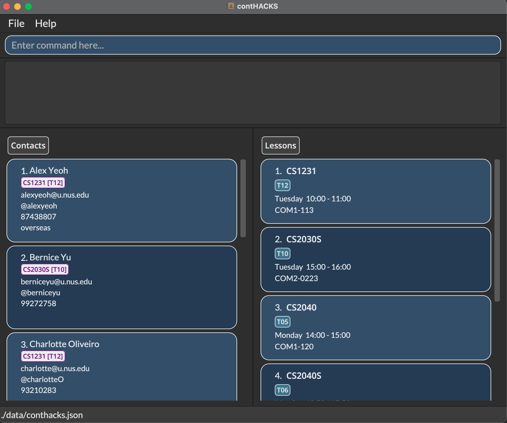

contHACKS is a **desktop app to help Teaching Assistants (TAs) in managing contacts. It is optimized for use via a Command Line Interface (CLI)** while still having the benefits of a Graphical User Interface (GUI). contHACKS **streamlines the creation, reading, updating and deleting operations of contacts** to make it fast and efficient for TAs, easing your workload to focus on the more important task - teaching.

## Table of Contents
* [How to use this User Guide](#how-to-use)
  * [How to navigate](#how-to-navigate)
  * [Meaning of icons](#meaning-of-icons)
  * [Formatting used](#formatting)

* [Quick start](#quick-start)

* [Walk-through](#walkthrough)

* [Features](#features)

  * [Managing contacts](#managing-contacts)
    * [Adding a contact: `add`](#add)
    * [Editing a contact: `edit`](#edit)
    * [Deleting a contact / contacts: `delete`](#delete)
    * [Finding a contact / contacts: `find`](#find)
    * [Listing all contacts: `list`](#list)
    * [Clearing all contacts: `clear`](#clear)

  * [Managing lessons](#manaaging-lessons)
    * [Adding a lesson: `addc`](#addc)
    * [Editing a lesson: `editc`](#editc)
    * [Deleting a lesson / lessons: `deletec`](#deletec)
    * [Finding a lesson / lessons: `findc`](#findc)
    * [Listing all lessons: `listc`](#listc)
    * [Clearing all lessons: `clearc`](#clearc)

  * [Accessing the help page: `help`](#help)
  * [Exiting the app: `exit`](#exit)

* [Saving the data](#saving-data)

* [Editing the data file](#editing-data)

* [Command Summary](#summary)

--------------------------------------------------------------------------------------------------------------------

## How to use this User Guide 

### How to navigate 

### Meaning of icons 

### Formatting used 

--------------------------------------------------------------------------------------------------------------------

## Quick start 

1. Ensure you have Java `11` or above installed in your computer

2. Download the latest `contHACKS.jar` from here

3. Copy the file to the folder you want to use as the home folder

4. Double-click the file to start the app. A GUI should appear in a few seconds

--------------------------------------------------------------------------------------------------------------------
## Walk-through 

Here are some of the things you will need to know before you get started! 

These are the key terms defined for usage of the commands:

- **Module Code**: Refers to the module code of a NUS module   e.g. CS2103, GEQ1000, ST2334

- **Lesson Code**: Refers to the code of the lesson: tutorials, labs, sectionals etc   e.g. T18, B30, E32

- **Telegram Handle**: Telegram username that should begin with an `@`   e.g. @BenIsHere, @Jerry321

- **Index**: Refers to the number displayed next to the name in the displayed contact list.   e.g. 1, 2, 3...

- **Alias**: These are alternative words that you can use to perform the same command 

Refer to the image below for more information on the different components of ContHACKS!

Notes about the command format: 

* Command words are case insensitive  
  e.g. `add`,`Add` and `ADD` can all be used to perform the same command

* Words in `UPPER_CASE` are the parameters to be supplied by you 
  e.g. in `add n/NAME`, `NAME` is a parameter which can be used as `add n/John Doe`

* Items in square brackets are optional 
  e.g `n/NAME [h/TELEGRAM_HANDLE]` can be used as `n/John Doe h/@johndoe` or as `n/John Doe`

* Parameters of all commands can be in any order 
  e.g. if the command specifies `n/NAME p/PHONE`, `p/PHONE n/NAME` is also acceptable

* If a parameter is expected only once in the command but you specified it multiple times, only the last occurrence of the parameter will be taken 
  e.g. if you specify `p/12341234 p/56785678`, only `p/56785678` will be taken

* Extraneous parameters for commands that do not take in parameters (such as `help`, `list`, `exit` and `clear`) will be ignored 
  e.g. if the command specifies `help 123`, it will be interpreted as `help` 

Some example commands you can try:

   * `list` : Lists all contacts

   * `add n/Ben p/91234567 e/ben123@gmail.com m/CS2103T` : Adds a contact named `Ben`

   * `delete 3` : Deletes the 3rd contact shown in the current list

   * `clear` : Deletes all contacts

   * `exit` : Exits the app

***

## Features 

### Managing contacts 

#### Adding a contact: `add` 

Adds a contact to contHACKS. 

Format: `add n/NAME e/EMAIL m/MODULE_CODE [LESSON_CODE(S)] [p/PHONE] [h/TELEGRAM_HANDLE] [r/REMARK]`

* Name, email and module code are **compulsory**
* Lesson code, phone number, telegram handle and remarks are **optional**
* You can add multiple module codes, and can have multiple lesson codes for a single module code

:information_source: **Note:**
Module code and lesson code are seperated by white spaces.

Examples:
* `add n/Ben e/ben123@gmail.com m/CS2103T T12 m/CS2100 T11 B05 p/91238456 h/@BenIsHere r/Overseas`: Adds a contact using all parameters, with multiple module code and multiple lesson code
* `add n/Mary e/mary123@gmail.com m/CS2103T`: Adds a contact using only the compulsory parameters
* `add n/Tim e/timothy@gmail.com m/CS2101 G09 h/@Teeeeeeeemo r/Needs more help for CS2103T`: Adds a contact using some optional parameters

Command alias: `a`

#### Editing a contact: `edit` 

Edits the contact at the specified index in the currently viewed list.

Format: `edit INDEX [n/NAME] [e/EMAIL] [m/MODULE_CODE LESSON_CODE(S)] [p/PHONE] [h/TELEGRAM_HANDLE] [r/REMARK]`

* At least one of the fields must be provided
* Existing values of the fields specified will be erased and updated to the input values

Examples:
* `edit 1 p/91234567 e/ben321@gmail.com`: Edits the phone number and email of the 1st contact to be `91234567` and `ben321@gmail.com` respectively
* `edit 2 n/Ben m/CS2100 T09 B09`: Edits the name and module of the 2nd contact to be `Ben` and `CS2100 T09 B09` respectively
* `edit 3 h/@BenWasHere r/Overseas`: Edits the telegram handle and remark of the 3rd contact to be `@BenWasHere` and `Overseas` respectively
* `edit 4 n/Ben m/CS2100 T09 B09 p/91234567 e/ben321@gmail.com h/@BenWasHere r/Overseas`: All fields present in one command

Command aliases: `update` `e`

#### Deleting a contact / contacts: `delete` 

Delete the specified contact(s) from contHACKS.

Format: `delete INDEX`/ `delete INDEX_START-INDEX_END`

* Deletes the specified contact(s) at the specified index(es) including `INDEX_END` and `INDEX_START`.
* `INDEX_END` should be a positive integer greater than or equal to `INDEX_START`.

Format: `delete m/MODULE_CODE`/`delete m/MODULE_CODE LESSONS_CODE`

* Delete all contacts associated with a module code using `m/MODULE_CODE`.
* Delete all contact associated with a lesson code under the module using `m/MODULE_CODE LESSONS_CODE`.

Examples:
* `delete 2`: Deletes the 2nd contact in the displayed list.
* `delete 2-5`: Deletes the 2nd, 3rd, 4th and 5th contacts in the displayed list.
* `delete m/CS2103T`: Deletes all the contacts with the module code CS2103T.
* `delete m/CS2103T T10`: Deletes all the contacts with both the module code CS2103T and lesson code T10.

Command aliases: `del` `rm` `d`

#### Finding contacts by name / module code: `find` 

Finds a contact by specifying either the name/module code(s).

Format: `find n/NAME`/`find m/MODULE_CODE(S)`
* Can only search by name or module code(s), but not both at once   i.e. You cannot perform `find n/Ben m/CS2040S`
* The search is case-insensitive   e.g `ben` will match `Ben`
* The order of the keywords does not matter   e.g. `Ben Tan` will match `Tan Ben`
* Partial words will also be matched   e.g. `Ben` will match `Benjamin`
* If multiple words are specified for the name search, only results matching all the words specified will be returned  
  e.g `find n/Bernice Yu` will only return contacts that have both words `Bernice` and `Yu`
* Similarly, if multiple module codes are specified, only results matching all the module codes specified will be returned   e.g. `find m/CS2030S CS2040S` will only return contacts that have both `CS2030S` and `CS2040S` module codes

Examples:
* `find n/Ben`: Search contacts with name containing `Ben`
* `find n/Ben Bernice Mary`: Search contacts with names containing either `Ben`, `Bernice` or `Mary`
* `find m/CS2103T CS2100`: Search contacts with the inputted module code

Command alias: `f`

#### Listing all contacts : `list` 

Shows a list of all contacts in contHACKS.

Format: `list`

Command alias: `ls`

#### Clearing all contacts: `clear` 

Purges **all** existing contacts from contHACKS. **Use with caution.**

Format: `clear`

Command aliases: `clr` `c`

***

### Managing lessons 

#### Adding a lesson: `addc` 

Adds a lesson to contHACKS.

Format: `addc m/MODULE_CODE LESSON_CODE d/DAY t/START_TIME END_TIME [r/REMARK]`

* All the parameters are **compulsory** except for remark

* Day is in ISO week format   e.g. 2 equals Tuesday, 5 equals Friday

* Start time and end time are in HH:MM format

:information_source: **Note:**
Module code and lesson code are seperated by white spaces. The lesson start time and end time are seperated by white spaces as well.

Examples:
* `addc m/CS2103T T12 d/4 t/09:00 10:00 r/Online`: Adds a lesson with remark
* `addc m/CS2100 B05 d/3 t/14:00 15:00`: Adds a lesson without remark

Command alias: `ac`

#### Editing a lesson: `editc` 

Updates the information of a lesson.

Edits the lesson at the specified index in the currently viewed list.
* At least one of the fields must be provided.
* Existing values of the fields specified will be erased and updated to the input values

Format: `editc INDEX [m/MODULE_CODE LESSON_CODE] [d/DAY] [t/START_TIME END_TIME] [r/REMARK]`

Examples:
* `editc 1 m/CS2100 B05`: Edits the module of the 1st lesson to be `CS2100 B05`
* `editc 2 d/3`: Edits the day of the 2nd lesson to be Wednesday
* `editc 3 t/10:00 12:00`: Edits the start time and end time of the 3rd lesson to be 10AM and 12PM respectively
* `editc 4 r/COM01-0120`: Edits the remark of the 4th lesson to `COM01-0120`
* `editc 5 m/CS2100 B05 d/3 t/10:00 12:00 r/COM01-0120`: All fields present in one command

Command aliases: `updatec` `ec`

#### Deleting a lesson / lessons: `deletec` 

Deletes the specified lesson(s) from contHACKS.

Format: `deletec INDEX`/`deletec INDEX_START-INDEX_END`

* Deletes the specified lesson(s) at the specified index(es) including the `INDEX_START` and `INDEX_END`.
* `INDEX_END` should be a positive integer greater than or equal to `INDEX_START`.

Format: `deletec m/MODULE_CODE`

* Deletes all contacts associated with a module code using `m/MODULE_CODE`.

Examples:
* `deletec 1`: Deletes the 1st lesson in the displayed list.
* `deletec 1-3`: Deletes 1st, 2nd and 3rd lesson in the displayed list.
* `deletec m/CS2103T`: Deletes all the lessons with CS2103T module code.

Command aliases: `delc` `rmc` `dc`

#### Finding a lesson / lessons: `findc` 

Finds a contact by specifying the module code(s)/lesson day(s)/lesson start time(s).

Format: `findc m/MODULE_CODE(S)`/`findc d/LESSON_DAY(S)`/`findc t/LESSON_START_TIME(S)`
* Can only search using one prefix at a time   i.e. You cannot perform `findc m/CS2040S d/2`
* The search is case-insensitive   e.g `cs2040` will match `CS2040`
* Lesson day input is only accepted in integer form   e.g. `1` for Monday, `7` for Sunday
* Lesson start time input is only accepted in the `HH:mm` format   e.g. `15:00` `09:00`
* If multiple keywords are specified for the search, any lesson that matches at least one of the keywords will be returned  
  e.g. `findc m/CS2030 CS2040` will return lessons that are of module `CS2030` or `CS2040`  
  e.g. `findc d/2 3` will return lessons that are on Tuesday or Wednesday  
  e.g. `findc t/10:00 15:00` will return lessons that start at either words `10:00` or `15:00`

Examples:
* `findc m/CS2030 CS2040`: Search lessons of modules `CS2030` or `CS2040`
* `findc d/2`: Search lessons that falls on Tuesdays
* `findc t/14:00`: Search lessons that starts at `14:00`

Command alias: `fc`

#### Listing all lessons: `listc` 

Shows a list of all lessons in contHACKS.

Format: `listc`

Command alias: `lc`

#### Clearing all lessons: `clearc` 

Purges **all** existing lesson from contHACKS. **Use with caution.**

Format: `clearc`

Command aliases: `clrc` `cc`

***

### Accessing the help page : `help` 

Shows a message explaining how to access the help page.

Format: `help`

Command aliases: `man` `h`

### Exiting the program : `exit` 

Exits the program.

Format: `exit`

Command aliases: `quit` `q`

***

### Saving the data 

Contact data are saved in the hard disk automatically after any command that changes the data. There is no need to save manually.

### Editing the data file 

contHACKS data are saved as a JSON file `[JAR file location]/data/contHACKS.json`. Advanced users are welcome to update data directly by editing that data file.

:exclamation: Caution:
If your changes to the data file makes its format invalid, contHACKS will discard all data and start with an empty data file at the next run.

## Command Summary 

| Command           | Format                                                                                                       | Example                   |
|-------------------|--------------------------------------------------------------------------------------------------------------| --------------------------|
| `help`  `man`   `h`   | `help`                                                                                             | `help`                    |
| `add`   `a`           | `add n/NAME e/EMAIL m/MODULE_CODE [LESSON_CODE(S)] [p/PHONE] [h/TELEGRAM_HANDLE] [r/REMARK]`          | `add n/Ben            e/ben123@gmail.com m/CS2103T T12 p/91238456 h/@BenIsHere r/Overseas`|
| `list`   `ls`         | `list`                                                                                                | `list`                |
| `find`   `f`          | `find n/NAME` `find m/MODULE_CODE(S)`                                                              | `find n/Ben` `find m/CS2103T` |
| `edit`   `update`  `e` | `edit INDEX [n/NAME] [e/EMAIL] [p/PHONE] [h/TELEGRAM_HANDLE] [m/MODULE_CODE LESSON_CODE(S)] [r/REMARK]`       | `edit 1 p/91234567 e/ben321@gmail.com`|
| `delete`  `del`   `rm`  `d`  | `delete INDEX` `delete INDEX_START-INDEX_END` `delete m/MODULE_CODE`               | `delete 2` `delete 2-5` `delete m/CS2103T`|
| `clear`   `clr`       | `clear`                                                                                               | `clear`                    |
| `exit`   `quit`   `q`   | `exit`                                                                                           | `exit`                     |
