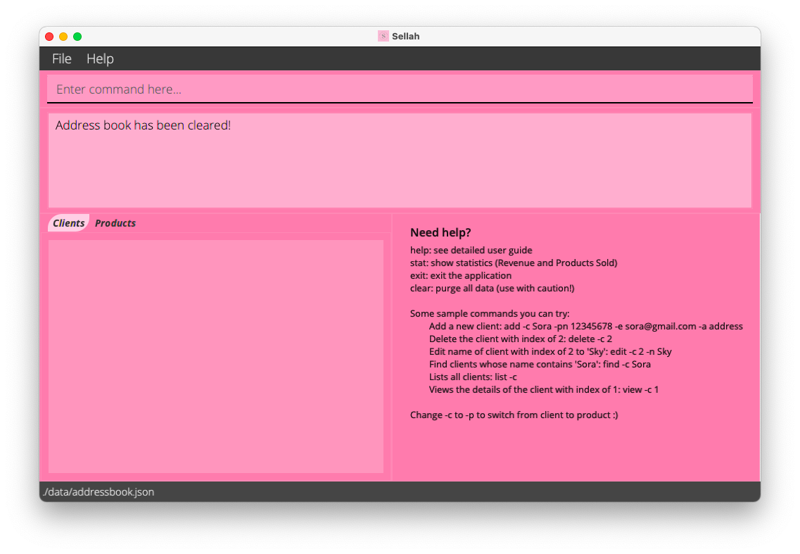

## Introduction
**Sellah** is a desktop application optimized for online individual sellers who prefer CLI over GUI. It is used to keep
track of the contact information of clients and details of the products in inventory.

* Table of Contents
    * [Quick Start](#quick-start)
    * 

<a href="#features">Features</a>

        <ul>
            <li><a href="#help-help">Help</a></li>
            <li><a href="#exit-exit">Exit</a></li>
            <li><a href="#adding-add">Add</a></li>
            <li><a href="#deleting-delete">Delete</a></li>
            <li><a href="#clear-everything-clear">Clear</a></li>
            <li><a href="#editing-edit">Edit</a></li>
            <li><a href="#finding-find">Find</a></li>
            <li><a href="#listing-list">List</a></li>
            <li><a href="#viewing-view">View</a></li>
            <li><a href="#command-history">Command History</a></li>
            <li><a href="#saving-the-data">Saving the data</a></li>
            <li><a href="#editing-the-data-file">Editing the data file</a></li>
            <li><a href="#statistics-stat-coming-soon">Statistics (Coming Soon)</a></li>
        </ul>

    * [FAQ](#faq)
    * [Command Summary](#command-summary)

--------------------------------------------------------------------------------------------------------------------

## Quick Start

1. Ensure you have `Java 11` or above installed in your Computer. You can download it from
   [here](https://www.oracle.com/java/technologies/javase/jdk11-archive-downloads.html).

1. Download the latest `sellah.jar` from [here](https://github.com/AY2122S1-CS2103T-T12-1/tp/releases).

1. Copy the file to the folder you want to use as the _home folder_ for your **Sellah**.

1. Double-click the file to start the app. The GUI similar to the below should appear in a few seconds. Note how the app
   contains some sample data. You can use the [`clear`](#clear-everything-clear) command to purge all data. 
   

1. Refer to the [Features](#features) below for details of each command.

--------------------------------------------------------------------------------------------------------------------

## Features

**:information_source: Notes about the command format:** 

* Words in `UPPER_CASE` are the parameters to be supplied by the user. 
  e.g. in `add NAME`, `NAME` is a parameter which can be used as `add Ben`.

* Items in square brackets are optional. 
  e.g `NAME [-e EMAIL]` can be used as `Ben -e ben@gmail.com` or as `Ben`.

* Items with `...` after them can be used multiple times including zero times. e.g. `[-o ORDER]...` can be used as ` ` (
  i.e. 0 times), `-o 0 1 10/21`, `-o 0 1 2021/10/21 -o 1 5 10/20`, etc.

* Parameters can be in any order. 
  e.g. if the command specifies `-pn PHONE_NUMBER -e EMAIL`, `-e EMAIL -pn PHONE_NUMBER` is also acceptable.

* If a parameter is expected only once in the command but you specified it multiple times, only the last occurrence of
  the parameter will be taken. 
  e.g. if you specify `-pn 12341234 -pn 56785678`, only `-pn 56785678` will be taken.

* Extraneous parameters for commands that do not take in parameters (such as `exit`) will be ignored. 
  e.g. if the command specifies `exit 123`, it will be interpreted as `exit`.

### Help: `help`

Displays a help message.

Format: `help`

Expected Output: 

### Exit: `exit`

Exits the program.

Format: `exit`

### Adding: `add`

Adds a new client or product to the application with an automatically generated ID.

Format:

* Add a client: `add -c NAME -pn PHONE_NUMBER [-e EMAIL] [-a ADDRESS] [-o ORDER]...`
* Add a product: `add -p NAME -$ UNIT_PRICE [-q QUANTITY]`

Examples:

* `add -c Ben -pn 98765432` adds a new `Client` `Ben`, whose `PHONE_NUMBER` is `98765432`.
* `add -p pen -$ 10.00 -q 150` adds a new `Product` `pen` with a `UNIT_PRICE` of `$10.00` and there are `150` pens in
  stock.

**:bulb: Notes:** 

* Adds a client with name, phone number and optional email, address and orders.
* Adds a product with name, unit price and optional quantity.
* An error message will be displayed if the format of a field is incorrect, e.g. input `ten dollars` for the
  field `UNIT_PRICE`.
* A message will be displayed if the client/product to be added already exits.

### Deleting: `delete`

Deletes the specified client/product from the application.

Format:

* Delete a client: `delete -c INDEX`
* Delete a product: `delete -p INDEX`

Examples:

* `delete -c 1` deletes the client with index 1 in the application.
* `delete -p 2` deletes the product with index 2 in the application.

**:bulb: Notes:** 

* Deletes the client/product based on the client/product’s `INDEX`.
    * The `INDEX` refers to the index shown in the displayed client/product list.
    * The `INDEX` **must be a positive integer** 1, 2, 3, ...
* An error message will be displayed if the client/product doesn't exist.

### Clear Everything: `clear`

Removes all client and product data from the application.

Format: `clear`

Expected Output: 

### Editing: `edit`

Edits an existing client or product in the application.

Format:

* Edit a client: `edit -c INDEX [-n NAME] [-pn PHONE_NUMBER] [-e EMAIL] [-a ADDRESS] [-o ORDER]...`
* Edit a product: `edit -p INDEX [-n NAME] [-$ UNIT_PRICE] [-q QUANTITY]`

Examples:

* `edit -c 1 -n Ben` Edits the name of the client with `INDEX` of `1` to `Ben`.
* `edit -p 3 -n Ben10 -q 20` Edits the name of the product with `INDEX` of `3` to `Ben10` and the quantity to `20`.

**:bulb: Notes:** 

* Edits the client/product at the specified `INDEX`.
    * The `INDEX` refers to the index shown in the displayed client/product list.
    * The `INDEX` **must be a positive integer** 1, 2, 3, ...
* An error message will be displayed if the client/product doesn't exist.
* At least one of the optional fields must be provided.
* Existing values will be updated to the input values.
* `ORDER`s are identified by their `ID`s.
    * If the client has an order with same `ID`, then that order's other information will be updated with the
      information in `ORDER`.
    * If the client does not have an order with same `ID`, then that `ORDER` will be added.
    * If the `ORDER`'s `QUANTITY` is 0, then that `ORDER` will be removed.
    * For example, assuming client already has an order `[ ID = 1, QUANTITY = 3, (other information)... ]`, and the
      input `ORDER`s are `[ ID = 1, QUANTITY = 0, ... ]` and `[ ID = 2, QUANTITY = 10, ... ]`:
        * `[ ID = 1, QUANTITY = 3, ... ]` will be updated to `[ ID = 1, QUANTITY = 0, ... ]` as they have the same `ID`,
          and since `QUANTITY` is now 0, this `ORDER` will be removed.
        * `[ ID = 2, QUANTITY = 10, ... ]` will be added as the client does not have an order with the same `ID`.

### Finding: `find`

Finds a client/product that is in the application

Format:

* Find clients: `find -c NAME`
* Find products: `find -p NAME`

Examples:

* `find -c john` Shows a list of all clients with the `NAME` `john` in the application.
* `find -c phone` Shows a list of all products with the `NAME` `phone` in the application.

**:bulb: Notes:** 

* Finds the client/product based on the `NAME` provided.
* `NAME` provided must fully match the `NAME` in the application and can be case-insensitive.
* If there are no matching `NAME` in the application, an error message will be displayed

### Listing: `list`

Shows a list of all clients/products in the application

Format:

* List clients: `list -c`
* List products: `list -p`

Examples:

* `list -c` Shows a list of all clients in the application.
* `list -p` Shows a list of all products in the application.

**:bulb: Notes:** 

* A message will be displayed if there are no clients/products in the application.

### Viewing: `view`

Views a current client/product from the application.

Format:

* View a client: `view -c INDEX`
* View a product: `view -p INDEX`

Examples:

* `view -c 20` Views all the details of the client with `INDEX` of `20` including id, name, phone number, email, address
  and orders.
* `view -p 5` Views all the details of the product with `INDEX` of `5` including id, name, unit price and quantity.

**:bulb: Notes:** 

* Views the client/product at the specified `INDEX`.
    * The `INDEX` refers to the index shown in the displayed client/product list.
    * The `INDEX` **must be a positive integer** 1, 2, 3, ...
* If the client/product doesn't exist, a display message is shown.

Expected Output: 

### Command History:

Allows navigation to previous commands using `↑` and `↓` keys.

Format:

* Previous command: `↑`
* Next command: `↓`

**:bulb: Notes:** 

* Pressing `↑` when the first command is currently displayed will do nothing.
* Pressing `↓` when the last command is currently displayed will clear the command input field.
    * Subsequent `↓` will do nothing.

### Saving the data

Sellah data are saved in the hard disk automatically after any command that changes the data. There is no need to save
manually.

### Editing the data file

Sellah data are saved as a JSON file `[JAR file location]/data/sellah.json`. Advanced users are welcome to update data
directly by editing that data file.

:exclamation: **Caution:**
If your changes to the data file makes its format invalid, Sellah will discard all data and start with an empty 
data file at the next run.

### Statistics: `stat` [coming soon]

_Details coming soon ..._

--------------------------------------------------------------------------------------------------------------------

## FAQ

**Q**: How do I transfer my data to another Computer? 
**A**: Install the app in the other computer and overwrite the empty data file it creates with the file that contains
the data of your previous Sellah home folder. 

--------------------------------------------------------------------------------------------------------------------

## Command Summary

<table>
    <tr>
        <th>Action</th>
        <th>Format, Examples</th>
    </tr>
    <tr>
        <td>
            <a href="#help-help">Help</a>
        </td>
        <td>
            Display help message: <code>help</code>
        </td>
    </tr>
    <tr>
        <td>
            <a href="#exit-exit">Exit</a>
        </td>
        <td>
            Exit the program: <code>exit</code>
        </td>
    </tr>
    <tr>
        <td>
            <a href="#adding-add">Add</a>
        </td>
        <td>
            Add a client: <code>add -c NAME -pn PHONE_NUMBER [-e EMAIL] [-a ADDRESS] [-o ORDER]...</code> 
            e.g., <code>add -c James Tan -pn 98765432 -e james.email@example.com -a 123, Clementi Rd</code> 
             
            Add a product: <code>add -p NAME -$ UNIT_PRICE [-q QUANTITY]</code> 
            e.g., <code>add -p pen -$ 10.00 -q 120</code>
        </td>
    </tr>
    <tr>
        <td>
            <a href="#deleting-delete">Delete</a>
        </td>
        <td>
            Delete a client: <code>delete -c INDEX</code> 
            e.g., <code>delete -c 20</code> Deletes all the details of the client with <code>INDEX</code> of
            <code>20</code> including id, name, phone number, email, address and orders. 
             
            Delete a product: <code>delete -p INDEX</code> 
            e.g., <code>delete -p 5</code> Deletes all the details of the product with <code>INDEX</code> of
            <code>5</code> including id, name, unit price and quantity.
             
        </td>
    </tr>
    <tr>
        <td>
            <a href="#clear-everything-clear">Clear</a>
        </td>
        <td>
            Removes all client and product data from the application: <code>clear</code>
        </td>
    </tr>
    <tr>
        <td>
            <a href="#editing-edit">Edit</a>
        </td>
        <td>
            Edit a client:
            <code>edit -c INDEX [-n NAME] [-pn PHONE_NUMBER] [-e EMAIL] [-a ADDRESS] [-o ORDER]...</code> 
            e.g., <code>edit -c 1 -n Ben</code> Edits the name of the client with <code>INDEX</code> of <code>1</code>
            to <code>Ben</code>. 
             
            Edit a product: <code>edit -p INDEX [-n NAME] [-$ UNIT_PRICE] [-q QUANTITY]</code> 
            e.g., <code>edit -p 3 -n Ben10 -q 20</code> Edits the name of the product with <code>INDEX</code> of
            <code>3</code> to <code>Ben10</code> and the quantity to <code>20</code>.
        </td>
    </tr>
    <tr>
        <td>
            <a href="#finding-find">Find</a>
        </td>
        <td>
            Find clients: <code>find -c NAME</code> 
            e.g., <code>find -c john</code> Shows a list of all clients with the <code>NAME</code> <code>john</code> in
            the application. 
             
            Find products: <code>find -p NAME</code>  
            e.g. <code>find -p phone</code> Shows a list of all products with the <code>NAME</code> <code>phone</code>
            in the application.
        </td>
    </tr>
    <tr>
        <td>
            <a href="#listing-list">List</a>
        </td>
        <td>
            List all clients: <code>list -c</code> 
            List all products: <code>list -p</code>
        </td>
    </tr>
    <tr>
        <td>
            <a href="#viewing-view">View</a>
        </td>
        <td>
            View a client: <code>view -c INDEX</code> 
            e.g., <code>view -c 20</code> Views all the details of the client with <code>INDEX</code> of <code>20</code>
            including id, name, phone number, email, address and orders. 
             
            View a product: <code>view -p INDEX</code> 
            e.g., <code>view -p 5</code> Views all the details of the product with <code>INDEX</code> of
            <code>5</code> including id, name, unit price and quantity.
        </td>
    </tr>
    <tr>
        <td>
            <a href="#command-history">Command History</a>
        </td>
        <td>
            Allows the user to navigate to previous commands using <code>↑</code> and <code>↓</code> keys. 
             
            Previous command: <code>↑</code> 
            Next command: <code>↓</code>
        </td>
    </tr>
</table>
