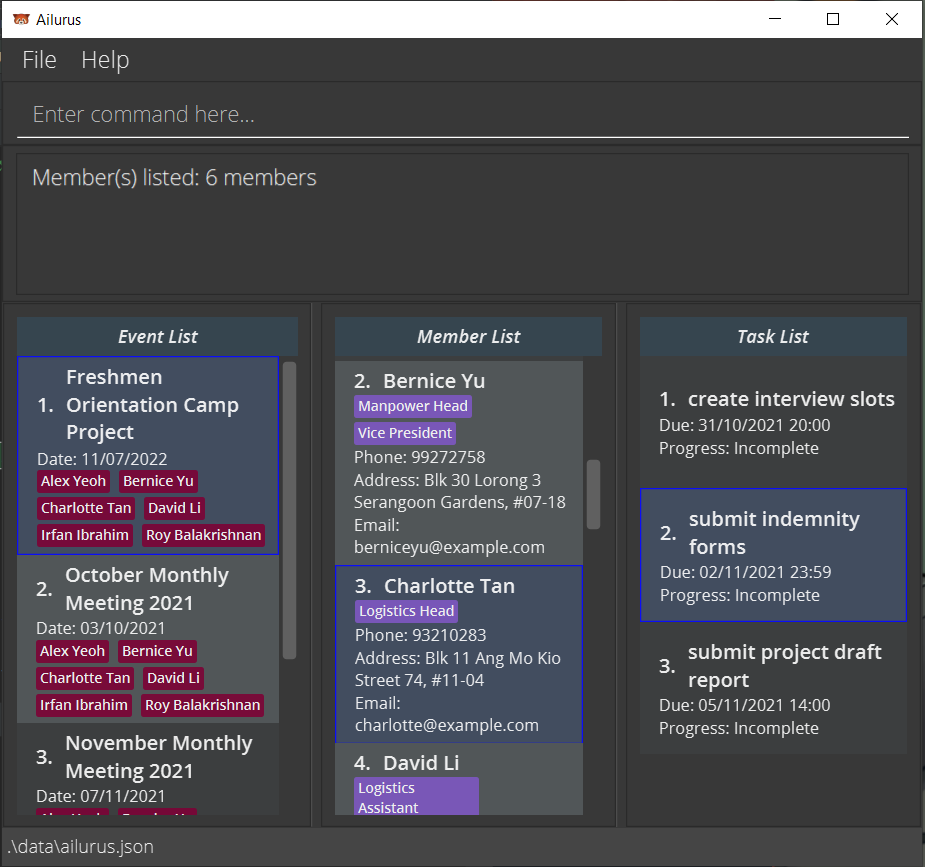
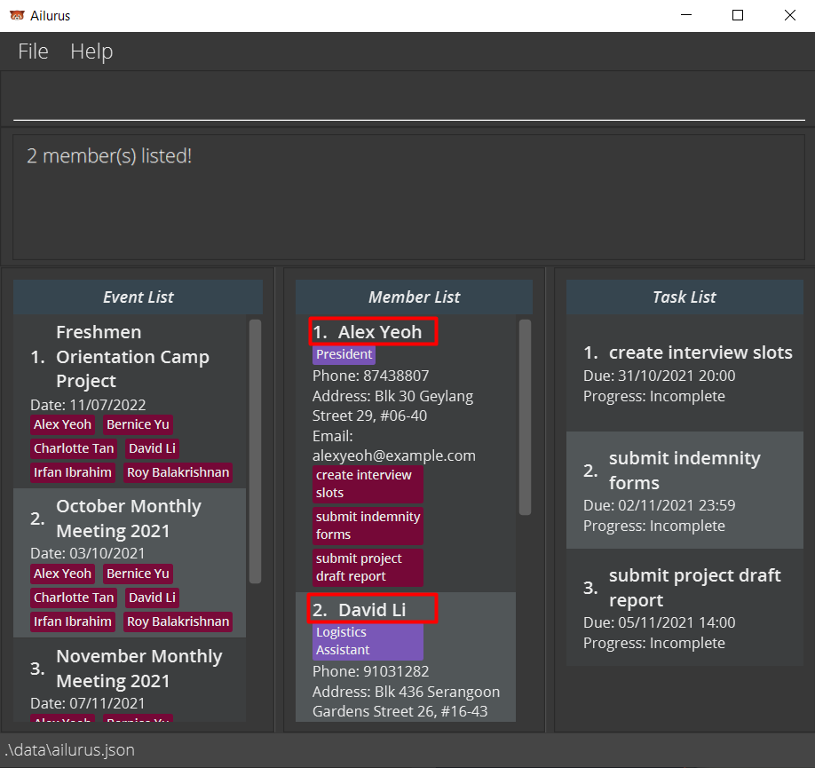
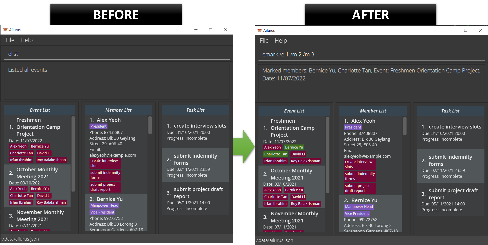

Ailurus is a **desktop application** designed to aid Organising Committees from the Computing Faculty in managing and accounting for their administrative concerns. It provides users with the ability to plan and manage events and tasks for their members.

Ailurus is catered for people that are familiar with [Command Line Interfaces](https://en.wikipedia.org/wiki/Command-line_interface) (CLI), and are able to type fast. It also preserves the benefits of a [Graphical User Interface](https://en.wikipedia.org/wiki/Graphical_user_interface) (GUI) via [JavaFX](https://en.wikipedia.org/wiki/JavaFX).

* Table of Contents
{:toc}

--------------------------------------------------------------------------------------------------------------------

## Welcome to the Ailurus User Guide
This User Guide aims to introduce new users to Ailurus, while also providing them with a comprehensive guide to all the commands in Ailurus.

Texts highlighted in light-blue such as [this](https://en.wikipedia.org/wiki/This_(computer_programming)) will direct the user to areas where more information about the highlighted text can be found. This is useful especially when you want to navigate to a certain section via the Table of Contents.

It is recommended to follow along and try out the commands listed in this User Guide. Ailurus is designed such that the commands will come as intuitive after a short period of use.

It is also <u>highly recommended</u> for first time users to read the `Notes about the command format` in [Features](#features), as well as the descriptions of each subsection, to understand what each group of command does.

## Quick start

1. Ensure you have [Java 11](https://www.oracle.com/java/technologies/downloads/) or above installed in your Computer.

2. Download the latest `ailurus.jar` from [here](https://github.com/AY2122S1-CS2103T-T15-2/tp/releases).

3. Copy the file to the folder you want to use as the _home folder_ for Ailurus.

4. Double-click the file to start the app. The GUI similar to the below should appear in a few seconds. Note how the app contains some sample data. 
   

5. Type the command in the command box and press Enter to execute it. e.g. typing **`help`** and pressing Enter will 
open the help window. 
   Some example commands you can try:

   * **`mlist`** : Lists all members in Ailurus.

   * **`madd /n John Doe /ph 98765432 /em johnd@example.com /a John street, block 123, #01-01`**: Adds a contact named `John Doe` to Ailurus.

   * **`mdel /m 3`** : Deletes the 3rd contact shown in the current list of people.

   * **`exit`** : Exits the app.

6. Refer to the [Features](#features) below for details of each command.

--------------------------------------------------------------------------------------------------------------------

## Navigating the User Interface

The User Interface consists of the following components, as shown in the numberings of the components in the image above, on the top left-hand corner of each component:
1. The `File` button, when clicked, shows the `Exit` button which exits the application when clicked. Alternatively, the `X` cross at the top right-hand corner of the application can be used as well to exit.
2. The `Help` button, which clicked, shows the `Help F1` button which pops up the [Help Window](#viewing-help--help). This can also be done using the `help` command or pressing the `F1` key on the keyboard.
3. This is the **command input box**, which is the primary component that you will be working with. You can type in any of the commands found in the [Features](#features) section, as long as they have the valid parameters as well.
4. This is the **result display box**, which will give you feedback on the success or failure in executing a command. 
   1. If there is a mistake or error in your parameters, what you have typed in will turn red, and it will provide you with the expected format or constraints of the parameter that was invalid. 
   2. Note that it _may not show all invalid parameters_, so you should change them one at a time to check their validity.
5. This is the **Event List**, which will list events based on the [event commands used](#event). Each event has a date, and can have members participating in them who can be marked present or absent in the event.
6. This is the **Member List**, which will list members based on the [member commands used](#member). Each member card also shows their relevant details and tasks.
7. This is the **Task List**, which will list tasks based on the [task commands used](#task). Each task has a due date and time, and can be marked completed or incomplete.

## Features

**:information_source: Notes about the command format:** 

* Commands are usually abbreviated to facilitate faster typing for your convenience. As a general rule of thumb, `m`, `e` and `t` are used to represent `Member`, `Event` and `Task` respectively.

* Words in `UPPER_CASE` are the parameters to be supplied. 
  e.g. in `madd /n NAME`, `NAME` is a parameter which can be used as `madd /n John Doe`.

* Items in square brackets are optional. 
  e.g. `/n NAME [/p POSITION]` can be used as `/n John Doe /p friend` or as `/n John Doe`.

* Items with `…`​ after them can be used multiple times including zero times. 
  e.g. `[/p POSITION]…​` can be completely absent (i.e. 0 times), `/p friend`, `/p friend /p family` etc.

* All prefixes that are provided must be followed by a space and a non-empty parameter.   There are exceptions to this rule: 
  * `/p ` prefix in `medit`
  * `/m ` prefix in `eedit`
  * `/att` and `/abs` in `mlist`
  * `/ovd` in `tlist`.

* Parameters can be in any order. 
  e.g. if the command specifies `/n NAME /ph PHONE`, `/ph PHONE /n NAME` is also acceptable.

* If a parameter is expected only once in the command, but you specified it multiple times, only the last occurrence of the parameter will be taken. 
  e.g. if you specify `/ph 12341234 /ph 56785678`, only `/ph 56785678` will be taken.

* Extraneous parameters for commands that do not take in parameters (such as `help`, `elist` and `exit`) will be ignored.
   
  e.g. if the command specifies `help 123`, it will be interpreted as `help`.

* If an invalid prefix is used in a command, it will be seen as part of the previous parameter and may throw an error.   e.g. if you specify `madd /n John Tan /w Street 52 /ph 91234556`, the name of member added will be `John Tan /w Street 52` which is invalid as `/` is not an alphabet or number.

* Some commands require you to enter the `EVENT_INDEX`, `MEMBER_INDEX` or `TASK_INDEX`. The `INDEX` refers to the order on 
  the display list. 
  e.g. `Freshmen Orientation Camp Project` has a `EVENT_INDEX` of `1`, `Charlotte Tan` has a `MEMBER_INDEX` 
  of `3`, and `submit indemnity forms` has a `TASK_INDEX` of `2` according to the diagram below.
  

### Member

The member list is in the centre column of the application, which lists all members and is scrollable. Each member has their own task list. Members have their own member card which consists of their relevant details, which include (from top to bottom):
* Name of member
* Positions of member
* Phone number
* Address
* Email Address
* Tasks belonging to member - red indicating undone, green indicating done. Note that the default is undone.

The member list and the members can be changed using the various commands listed below. Each command starts with `m` abbreviation of member. This is to indicate that the command is used for the manipulation of the member list or member data.

#### Member Glossary

Parameter | Description, Constraints
--------|------------------
**NAME** | _Name of member_   - Only alphabets, numbers and spaces allowed i.e. no special characters such as `.`, `'`, or `-`.   - No character limit.   - All names of members must be unique   - If there are 2 members of the same name, it is recommended to add a number behind to uniquely identify the member e.g. John Tan2.
**POSITIONS** | _Positions of member_   - Same as NAME.   - If `-` should be used, replace it with a space e.g. `Vice President`.
**PHONE** | _Phone number of member_   - Only numbers allowed.   - Minimum 3 digits, maximum 15 digits. ([Reason for 15 digits](https://en.wikipedia.org/wiki/Telephone_number#Concept_and_methodology))
**ADDRESS** | _Physical address of member_   - All characters allowed with no character limit.
**EMAIL** | _Email address of member_   - Should be of format local-part@domain. e.g. johndoe@example.com
**MEMBER_INDEX** | _Index of member in the displayed `Member List` column of the application_   - **Must be a positive integer** 1, 2, 3, …​   - Cannot exceed the number of members listed in the displayed `Member List`.
**EVENT_INDEX** | _Index of event in the displayed `Event List` column of the application_   - **Must be a positive integer** 1, 2, 3, …​   - Cannot exceed the number of events listed in the displayed `Event List`.

#### Adding a member: `madd`

Adds a member to Ailurus.

Format: `madd /n NAME /ph PHONE [/em EMAIL] [/a ADDRESS] [/p POSITION]…​`

 
:bulb: **Tip:** A member can have any number of positions (including 0). A member MUST have a name and phone number, but email address, mailing address and positions are optional.

* After executing the command, the entire list of members will also appear in Member List (same as `mlist`) to show the added member.

Examples:
* `madd /n John Doe /ph 98765432`
* `madd /n Betsy Crowe /p Programs Head /em betsycrowe@example.com /a Newgate Street 52 /ph 1234567 /p Finance Assistant`

#### Listing all members : `mlist`

Shows a list of all members (of an event optionally).

Format: `mlist [/e EVENT_INDEX] [/att] [/abs]`

* List everyone recorded in Ailurus if `EVENT_INDEX` is not given.
* If  `EVENT_INDEX` is provided, list everyone who is participating in the event.
* Only one of `/att` or `/abs` may be provided if EVENT_INDEX is present.
* `/att` filters the list to those that attended the event.
* `/abs` filters the list to those that were absent from the event.
* Both `/att` and `/abs` do not need any parameter afterwards. Any parameter after will be ignored.

Example:
* `mlist` lists everyone in Ailurus.
* `mlist /e 1` lists all members of the event with index number 1.
* `mlist /e 1 /att` lists all members who attended the event with index number 1.
* `mlist /e 1 /abs` lists all members who were absent from the event with index number 1.

#### Editing a member : `medit`

Edits an existing member in Ailurus. 

Format: `medit /m MEMBER_INDEX [/n NAME] [/ph PHONE] [/em EMAIL] [/a ADDRESS] [/p POSITION]…​`

* Edits the member at the specified `MEMBER_INDEX`.
* At least one of the optional fields must be provided.
* Existing values will be updated to the input values.
* When editing positions, the existing positions of the member will be removed i.e. adding of positions is not cumulative.
* You can remove all the member’s positions by typing `/p` without specifying any positions after it. In such a case, only one `/p` prefix is allowed, otherwise the second `/p` prefix will be considered an [invalid prefix](#invalid_prefix) and will throw an error.
* After executing the command, the entire list of members will also appear in Member List. (same as `mlist`)

Examples:
* `medit /m 1 /ph 91234567 /em johndoe@example.com` Edits the phone number and email address of the 1st member to be `91234567` and `johndoe@example.com` respectively.
* `medit /m 2 /n Betsy Crower /p` Edits the name of the 2nd member to be `Betsy Crower` and clears all existing positions.

#### Locating members by name: `mfind`

Finds members whose names contain any of the given keywords from all members.

Format: `mfind KEYWORD [MORE_KEYWORDS]…​`

* The search is case-insensitive. e.g. `hans` will match `Hans`
* The order of the keywords does not matter. e.g. `Hans Bo` will match `Bo Hans`
* Only the name is searched.
* Matching is not strict, and will find any name with word that contains `KEYWORD` e.g. `Han` keyword will match `Hans`
* Members matching at least one keyword will be returned (i.e. `OR` search).
  e.g. `Han Bo` will return `Hans Gruber`, `Bo Yang`

Examples:
* `mfind John` returns `john` and `John Doe`
* `mfind alex david` returns `Alex Yeoh`, `David Li` 
  

#### Locating members by their tasks : `mtfind`

Finds members whose tasks' names contain the given keyword.

Format: `mtfind KEY_WORD [MORE_KEYWORDS]…​`

* The search is case-insensitive. e.g. `form` will match `Form`
* Only the name of the task is searched.
* Matching is not strict, and will find any name with word that contains `KEYWORD` e.g. `subm` keyword will match `submit form`
* Members matching at least one keyword will be returned (i.e. `OR` search).
  e.g. `submit meeting` will return `team meeting`, `submit form`

Examples:
* `mtfind form` returns `Alex Yeoh`, `Charlotte Tan` and `David Li` because task `submit indemnity form` was assigned to them.
 

#### Deleting a member : `mdel`

Deletes the specified member from Ailurus.

Format: `mdel /m MEMBER_INDEX`

* Deletes the member at the specified `MEMBER_INDEX`.

Examples:
* `mdel /m 2` deletes the 2nd member in Ailurus.

### Task

The task list is the in the right-most column of the application, which lists all tasks of a member and their details, and is scrollable. Each task has their own task card which consists of their relevant details, which include (from top to bottom):
* Name of task
* Task due date and time
* Progress of task: `Complete` or `Incomplete`. (Note that the default is `Incomplete`)

The task list and the tasks can be changed using the various commands listed below. Each command starts with `t` abbreviation of task. This is to indicate that the command is used for the manipulation of the task list or task data.

 
:bulb: **Tip:** A task can have the same name <u>or</u> datetime as another task, but **not** the same name <u>and</u> same datetime. Tasks are unique, but it is still possible to have tasks with same name but of different datetime. This is to allow repetitive daily/weekly/monthly tasks to be assigned as well.

#### Task Glossary

Parameter | Description, Constraints
--------|------------------
**NAME** | _Name of task_   - Only alphabets, numbers and spaces allowed i.e. no special characters such as `.`, `'`, or `-`.   - No character limit.
**DATE_TIME** | _Date and time of a task_   - Must be of format: `dd/MM/yyyy HH:mm`   - `dd: date` is a 2 digit number from 01 to 31   - `MM: month` is a 2 digit number from 01 to 12   - `yyyy: year` is a 4 digit number from 1970 to 3000 ([Reason for 1970](https://en.wikipedia.org/wiki/Unix_time))   - `HH: hour(s)` is a 2 digit number from 00 to 24   - `mm: minute(s)` is a 2 digit number from 00 to 59   - **NOTE**: Invalid date and time that satisfy the above conditions will be rounded down to the nearest valid date and time.   1. if you specify date as `31/11/2021`, Ailurus will round it to `30/11/2021`, while `32/11/2021` will be considered as invalid date.   2. if you specify date as `29/02/2021`, Ailurus will round it to `28/02/2021` because 2021 is not a leap year.   3. if you specify a date and time as `10/11/2021 24:00`, Ailurus will round it to `11/11/2021 00:00` as it sees it as the next day.
**MEMBER_INDEX** | _Index of member in the displayed `Member List` column of the application_   - **Must be a positive integer** 1, 2, 3, …​   - Cannot exceed the number of members listed in the displayed `Member List`.
**TASK_INDEX** | _Index of task in the displayed `Task List` column of the application_   - **Must be a positive integer** 1, 2, 3, …​   - Cannot exceed the number of tasks listed in the displayed `Task List`.
**OPTION** | _Yes or No option_   - **must be either `y` or `n`** to indicate yes or no respectively.

#### Adding a task: `tadd`

Adds a task to the specified members in Ailurus.

Format: `tadd /n NAME /d DATE_TIME /m MEMBER_INDEX [/m MORE_MEMBER_INDEX]…​`

:bulb: Note: A task must be assigned to a member.

* Tasks can be added to multiple members if there is more than one `MEMBER_INDEX` provided.
* The full task list of the member is shown after the command is executed.
* Note that tasks that are overdue (i.e. dates in the past) can be added for accounting of tasks.

Examples:
* `tadd /n Collect payment from members /d 20/11/2021 11:30 /m 3` adds task `Collect payment from members` to the third member on the  member list.
* `tadd /n Collect dogtag /d 20/11/2021 11:30 /m 1 /m 2 /m 3` adds task `Collect dogtag` to the first three members on the member list.

#### Locating tasks by name: `tfind`

Find tasks whose names contain any of the given keywords for the currently selected member.

Format: `tfind KEYWORD [MORE_KEYWORDS]...`

* **It is recommended to use this command only when the task list has entries** (accessible via `tlist /m MEMBER_INDEX`)
    * Otherwise, `0 task(s) listed!` will be shown as the task list is empty, therefore no task is found.
* The search is case-insensitive. e.g `submit` will match `Submit`
* The order of the keywords does not matter. e.g. `submit form` will match `form submit`
* Only the name is searched.
* Matching is not strict, and will find any name with word that contains `KEYWORD` e.g. `subm` keyword will match `Submit form`
* Tasks matching at least one keyword will be returned (i.e. `OR` search).
  e.g. `Submit form` will return `Submit homework`, `Edit form`
* Note: list may change if tasks are added, deleted or edited for the selected member, if it affects the filter.

Examples:
* `tfind form` returns `form` and `submit form`
* `tfind Submit form` returns `Submit homework`, `Edit form` 

#### Listing all tasks of a member : `tlist`

Shows a list of tasks of a member with the specified `MEMBER_INDEX`. Optional fields are provided to further filter the list
to completed, uncompleted or overdue tasks.

Format: `tlist /m MEMBER_INDEX [/dn OPTION] [/ovd]`

* Only either `/dn` or `/ovd` prefix may be present when in use.
* `/dn` filters the list of tasks to either done tasks or undone tasks based on `OPTION`. (`/dn n` filters undone tasks, `/dn y` filters done tasks)
* `/ovd` filters the list to tasks that are overdue (i.e. `Due` date and time has passed or is equal to the current local date and time) and are incomplete.
* Note: list may change if tasks are added, deleted, marked or edited for the selected member, if it affects the filter.

Example:
* `tlist /m 2` lists all tasks of the member with index number 2.
* `tlist /m 2 /ovd` lists all tasks of the member with index number 2 that are overdue.
* `tlist /m 2 /dn y` lists all tasks of the member with index number 2 that are completed.

#### Mark a task as done : `tdone`
Marks the specified task(s) of the currently selected member as done.

Format: `tdone /t TASK_INDEX [/t MORE_TASK_INDEX]…​`

* **Only can be used when the task list has entries** (accessible via `tlist /m MEMBER_INDEX`)
  * Otherwise, an error message `Task X does not exist in the task list of the member` will be shown as the task list is empty.
* Multiple tasks can be marked as done when there is more than one `TASK_INDEX` provided.
* Marks the task specified by `TASK_INDEX` as complete.

Example:
* `tdone /t 1 /t 2` marks the 1st and 2nd task on the displayed task list as done in Ailurus. The task in the Member List will turn green, and `Progress` will change to `Complete`. 

#### Mark a task as undone : `tundone`
Marks the specified completed task(s) of the currently selected member as undone. 

Format: `tundone /t TASK_INDEX [/t MORE_TASK_INDEX]…​`

* **Only can be used when the task list has entries** (accessible via `tlist /m MEMBER_INDEX`).
    * Otherwise, an error message `Task X does not exist in the task list of the member` will be shown as the task list is empty.
* Multiple completed tasks can be marked as undone when there is more than one `TASK_INDEX` provided.
* Marks the task specified by `TASK_INDEX` as incomplete.

Example:
* `tundone /t 1 /t 2` marks the 1st and 2nd completed task on the displayed task list as undone in Ailurus.

#### Editing a task: `tedit`
Edits an existing task within Ailurus in `Task List`.

Format: `tedit /t TASK_INDEX [/n NAME] [/d DATE_TIME]`

* **Only can be used when the task list has entries** (accessible via `tlist /m MEMBER_INDEX`).
    * Otherwise, an error message `Task X does not exist in the task list of the member` will be shown as the task list is empty.
* Edits the task at the specified `TASK_INDEX`. 
* At least one of the optional fields must be provided.
* Existing values will be updated to the input values.

Examples:
* `tedit /t 1 /n Vaccinate Myself` Edits the task name of the 1st task on task list to be `Vaccinate Myself`.
* `tedit /t 2 /n Do OSA Quiz /d 21/10/2021 23:59` Edits the task name and deadline of the 2nd task on task list to be `Do OSA Quiz` and `21/10/2021 23:59` respectively.

#### Deleting a task belonging to a member : `tdel`

Deletes the specified task of the currently selected member from Ailurus. 

Format: `tdel /t TASK_INDEX`

* **Only can be used when the task list has entries** (accessible via `tlist /m MEMBER_INDEX`).
    * Otherwise, an error message `Task X does not exist in the task list of the member` will be shown as the task list is empty.
* Deletes the task according to the specified `TASK_INDEX`.

Examples:
* `tdel /t 1` deletes the 1st task on the displayed task list in Ailurus.

### Event

The event list is the in the left-most column of the application, which lists all events and their details, and is scrollable. Each event has a group of participating members. The events have their own event card which consists of their relevant details, which include (from top to bottom):
* Name of event
* Event date
* All participating members in the event - red indicating did not attend, green indicating attended event. Note that the default is not attend.

The event list and the events can be changed using the various commands listed below. Each command starts with `e` abbreviation of event. This is to indicate that the command is used for the manipulation of the event list or event data.

 
:bulb: **Tip:** A event can have the same name <u>or</u> date as another task, but **not** the same name <u>and</u> same date. Events are unique, but it is still possible to have event with same name but of different date. This is to allow repetitive daily/weekly/monthly events to be created as well.

#### Event Glossary

Parameter | Description, Constraints
--------|------------------
**NAME** | _Name of event_   - Only alphabets, numbers and spaces allowed i.e. no special characters such as `.`, `'`, or `-`.   - No character limit.
**DATE** | _Date of a task_   - Must be of format: `dd/MM/yyyy`   - `dd: date` is a 2 digit number from 01 to 31   - `MM: month` is a 2 digit number from 01 to 12   - `yyyy: year` is a 4 digit number from 1970 to 3000 ([Reason for 1970](https://en.wikipedia.org/wiki/Unix_time))   - **NOTE**: Invalid date and time that satisfy the above conditions will be rounded down to the nearest valid date and time.   1. if you specify date as `31/11/2021`, Ailurus will round it to `30/11/2021`, while `32/11/2021` will be considered as invalid date.   2. if you specify date as `29/02/2021`, Ailurus will round it to `28/02/2021` because 2021 is not a leap year.  
**MEMBER_INDEX** | _Index of member in the displayed `Member List` column of the application_   - **Must be a positive integer** 1, 2, 3, …​   - Cannot exceed the number of members listed in the displayed `Member List`.
**EVENT_INDEX** | _Index of event in the displayed `Event List` column of the application_   - **Must be a positive integer** 1, 2, 3, …​   - Cannot exceed the number of events listed in the displayed `Event List`.

#### Adding an event: `eadd`

Adds an event to the Ailurus.

Format: `eadd /n NAME /d DATE [/m MEMBER_INDEX]…​`

:bulb: Note:
You can add multiple members to an event e.g. /m 2 /m 3 /m 4...

* Multiple members can be added to an event when more than one `MEMBER_INDEX` is provided.
* Note that events that are in the past can be added for accounting of events.
* After executing the command, the entire list of events will also appear in Event List (same as elist) to show the added event.

Examples:
* `eadd /n Computing Freshmen Orientation Camp 2021 /d 22/11/2021 /m 4 /m 5 /m 6` adds a `Computing Freshmen Orientation Camp 2021` event dated `22/11/2021` and has the 4th, 5th and 6th members of the member list added to it.

#### Deleting an event : `edel`

Deletes the specified event from Ailurus.

Format: `edel /e EVENT_INDEX`

* Deletes the event at the specified `EVENT_INDEX`.

Examples:
* `edel /e 10` deletes the 10th event in Ailurus.

#### Listing all events : `elist`

Shows a list of all events.

Format: `elist`

Example:
* `elist` lists all events in Ailurus.

#### Marking participants as attended : `emark`

Marks the attendance of a participant in a specific event.

Format: `emark /e EVENT_INDEX /m MEMBER_INDEX [/m MORE_MEMBER_INDEX]…​`

* Multiple members under the event can be marked when more than one `MEMBER_INDEX` is provided.
* It is recommended for `emark` to be used when the member list shows all entries that are participating in the event (accessible via `mlist /e EVENT_INDEX`).
* If any of the specified member is not participating in the event, an error is thrown to the user, specifying the first member that is not participating in the event.

Examples:
* `emark /e 1 /m 2 /m 3` marks the attendance of the 2nd and 3rd person in the member list in Event 1. The names of members marked in the event in `Event List` will turn green. 

#### Marking all participants in the event as attended : `emarkall`

Marks the attendance of all participants in the specific event.

Format: `emarkall /e EVENT_INDEX`

Examples:
* `emarkall /e 3` marks the attendance of all participants in Event 3.

#### Undo marking participants as attended : `eunmark`

Undo the marking of the attendance of a participant in a specific event.

Format: `eunmark /e EVENT_INDEX /m MEMBER_INDEX [/m MORE_MEMBER_INDEX]…​`

* Multiple members under the event can be unmarked when more than one `MEMBER_INDEX` is provided.
* It is recommended for `eunmark` to be used when the member list shows all entries that are participating in the event (accessible via `mlist /e EVENT_INDEX`).
* If any of the specified member is not participating in the event, an error is thrown to the user, specifying the first member that is not participating in the event.

Examples:
* `eunmark /e 2 /m 3 /m 4` unmark the attendance of the 3rd and 4th person in the member list in Event 2.

#### Editing an event : `eedit`

Edits an existing event in Ailurus.

Format: `eedit /e EVENT_INDEX [/n EVENT_NAME] [/d EVENT_DATE] [/m MEMBER_INDEX]…​`

* Edits the member at the specified `EVENT_INDEX`. `EVENT_INDEX` refers to the index number shown in the displayed event list.
* At least one of the optional fields must be provided.
* Existing values will be updated to the input values.
* You can remove all the members by typing `/m` without specifying any members after it.
* After executing the command, the entire list of events will also appear in Event List (same as elist).

Examples:
* `eedit /e 1 /n Freshman Orientation Project Discussion /d 22/11/2021` edits the event name of the 1st event on the event list to be `Freshman Orientation Project Discussion` and date to be `22/11/2021`.
* `eedit /e 2 /m 1 /m 2 /m 3` edits the participants in the event to be the 1st, 2nd and 3rd members on the member list.

#### Locating events by their names: `efind`

Finds events whose names contain any of the given keywords.

Format: `efind KEYWORD [MORE_KEYWORDS]…​`

* The search is case-insensitive. e.g. `cycling` will match `Cycling`
* The order of the keywords does not matter. e.g. `fresh happy` will match `happy fresh`
* Only the name of events is searched.
* Matching is not strict, and will find any name with word that contains `KEYWORD` e.g. `fresh` keyword will match `Freshmen Orientation Camp Project`
* Events matching at least one keyword will be returned (i.e. `OR` search).
  e.g. `Happy fresh` will return `Happy Birthday Party`, `Freshmen Orientation Camp Project`

#### Adding participants to an event : `emadd`

Adds selected participant(s) to a specific event.

Format: `emadd /e EVENT_INDEX /m MEMBER_INDEX [/m MORE_MEMBER_INDEX]…​`

* Multiple members can be added to the event when more than one `MEMBER_INDEX` is provided.
* If the specified member already participating in the event, an error is thrown to the user, specifying the first member that is already participating in the event.

Examples:
* `emadd /e 1 /m 2 /m 3` adds the 2nd and 3rd person in the member list to Event 1.

#### Deleting participants from an event : `emdel`

Deletes selected participant(s) for a specific event.

Format: `emdel /e EVENT_INDEX /m MEMBER_INDEX [/m MORE_MEMBER_INDEX]…​`

* Multiple members can be deleted from the event when more than one `MEMBER_INDEX` is provided.
* It is recommended for `emdel` to be used when the member list shows all entries that are participating in the event (accessible via `mlist /e EVENT_INDEX`).
* If any of the specified member is not participating in the event, an error is thrown to the user, specifying the first member that is not participating in the event.

Examples:
* `emdel /e 1 /m 2 /m 3` deletes the 2nd and 3rd person in the member list from Event 1.

## Other Commands and Features

### Viewing help : `help`

Shows a message explaining how to access the help page.

Format: `help`

### Exiting the program : `exit`

Exits the program.

Format: `exit`

### Saving the data

Ailurus data are saved in the hard disk automatically after any command that changes the data. There is no need to save manually.

### Editing the data file

Ailurus data are saved as a JSON file `[JAR file location]/data/Ailurus.json`. Advanced users are welcome to update data directly by editing that data file.

:exclamation: **Caution:** If your changes to the data file makes its format invalid, Ailurus will discard all data and start with an empty data file at the next run. If this happens, you can delete the data file and restart Ailurus app, and it will automatically create a new data file after new data is added.

--------------------------------------------------------------------------------------------------------------------

## FAQ

**Q**: How do I transfer my data to another Computer? 
**A**: Install the app in the other computer and overwrite the empty data file it creates with the file that contains the data of your previous Ailurus home folder.

--------------------------------------------------------------------------------------------------------------------

## Command summary

### Member commands

Action | Format, Examples
--------|------------------
**madd** | `madd /n NAME /ph PHONE [/em EMAIL] [/a ADDRESS] [/p POSITION]…​`   e.g., `madd /n James Ho /ph 22224444 /em jamesho@example.com /a 123, Clementi Rd, 1234665 /p friend /p colleague`
**mlist** | `mlist [/e EVENT_INDEX] [/att] [/abs]`   e.g., `mlist /e 3 /att`
**medit** | `medit /m MEMBER_INDEX [/n NAME] [/ph PHONE] [/em EMAIL] [/a ADDRESS] [/p POSITION]…​`  e.g.,`medit /m 2 /n James Lee /em jameslee@example.com`
**mfind** | `mfind KEYWORD [MORE_KEYWORDS]…​`  e.g., `mfind James Jake`
**mtfind** | `mtfind KEYWORD [MORE_KEYWORDS]…​`  e.g., `mtfind form`
**mdel** | `mdel /m MEMBER_INDEX`   e.g., `mdel /m 5`

### Task commands

Action | Format, Examples
--------|------------------
**tadd** | `tadd /n NAME /d DATE_TIME /m MEMBER_INDEX [/m MORE_MEMBER_INDEX]…​`   e.g., `tadd /n Collect payment from members /d 20/11/2021 11:30 /m 3`
**tfind** | `tfind KEYWORD [MORE_KEYWORDS]…​`  e.g., `tfind form`
**tlist** | `tlist /m MEMBER_INDEX [/dn OPTION] [/ovd]`   e.g., `tlist /m 2 /dn y`
**tdone** | `tdone /t TASK_INDEX [/t MORE_TASK_INDEX]…​`  e.g. `tdone /t 3 /t 4`
**tundone** | `tundone /t TASK_INDEX [/t MORE_TASK_INDEX]…​`  e.g. `tundone /t 3 /t 4`
**tedit** | `tedit /t TASK_INDEX [/n NAME] [/d DATE_TIME]`   e.g. `tedit /t 2 /n Do OSA Quiz /d 21/10/2021 23:59`
**tdel** | `tdel /t TASK_INDEX`   e.g., `tdel /t 1`

### Event commands

Action | Format, Examples
--------|------------------
**eadd** | `eadd /n NAME /d DATE [/m MEMBER_INDEX]…​`   e.g., `eadd /n Computing Freshmen Orientation Camp 2021 /d 22/11/2021 /m 4 /m 5 /m 6`
**edel** | `edel /e EVENT_INDEX `   e.g., `edel /e 7`
**elist** | `elist`
**emark** | `emark /e EVENT_INDEX /m MEMBER_INDEX [/m MORE_MEMBER_INDEX]…​`   e.g. `emark /e 1 /m 2 /m 3`
**emarkall** | `emarkall /e EVENT_INDEX`   e.g. `emarkall /e 5`
**eunmark** | `eunmark /e EVENT_INDEX /m MEMBER_INDEX [/m MORE_MEMBER_INDEX]…​`   e.g. `eunmark /e 2 /m 2 /m 5`
**eedit** | `eedit /e EVENT_INDEX [/n NAME] [/d DATE] [/m MEMBER_INDEX]…​`   e.g. `eedit /e 1 /n Freshman Orientation Project Discussion`
**efind** | `efind KEYWORD [MORE_KEYWORDS]…​`  e.g., `efind competition`
**emadd** | `emadd /e EVENT_INDEX /m MEMBER_INDEX [/m MORE_MEMBER_INDEX]…​`   e.g. `emadd /e 1 /m 2 /m 3`
**emdel** | `emdel /e EVENT_INDEX /m MEMBER_INDEX [/m MORE_MEMBER_INDEX]…​`   e.g. `emdel /e 1 /m 2 /m 3`

### Other commands

Action | Format, Examples
--------|------------------
**help** | `help`
**exit** | `exit`

