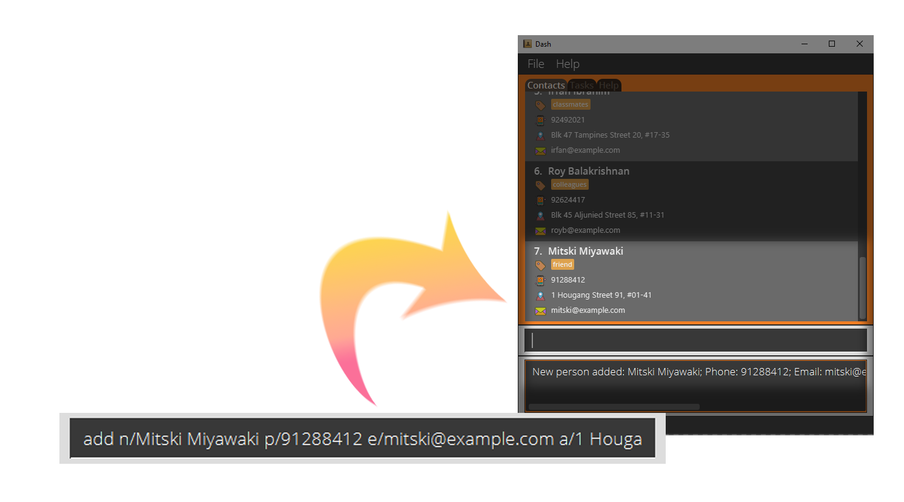
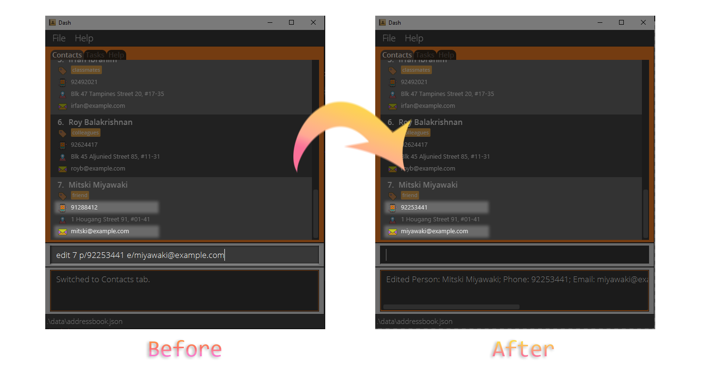
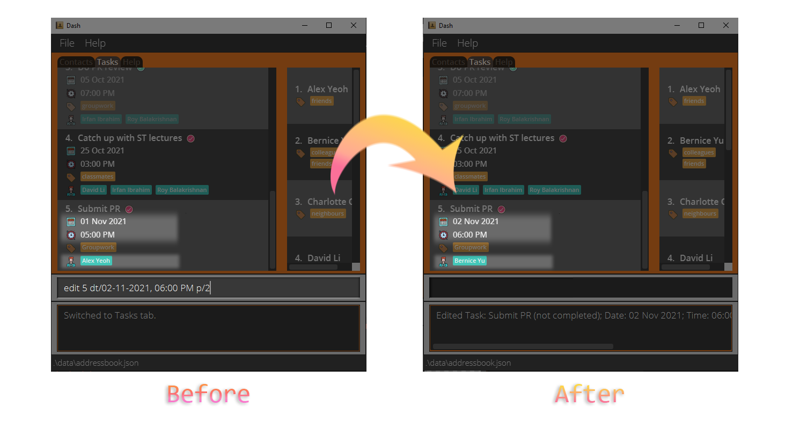

Dash is a personal planner app which offers unparalleled speed using text-based input. It supports both management of
tasks and contacts. Dash is tailored to the needs of university students, who must keep track of a slew of different 
deadlines and commitments. So long as you're a fast typist, Dash provides a blisteringly quick way to stay on top of 
your responsibilities using your keyboard.

This guide was written to help you set up and start using Dash. You can navigate by clicking the table of 
contents [below](#table-of-contents). If you're a new user, the Quick Start guide has all you need to get started. If 
you're an intermediate user looking to get more out of Dash, all supported commands are listed below.

--------------------------------------------------------------------------------------------------------------------

## Table of Contents

* Table of Contents
{:toc}

--------------------------------------------------------------------------------------------------------------------

## <u>Setting up Dash</u>

Whether you're using Windows or macOS, the steps for installation are the same.

1. Ensure you have Java `11` or above installed in your Computer. [Not sure what Java is? Click here!](https://java.com/en/download/help/download_options.html)

2. Download the latest `dash.jar` from [here](https://github.com/AY2122S1-CS2103T-W15-2/tp/releases/tag/v1.3.1).

3. Copy the file to the folder you want to use as the _home folder_ for Dash, which is where your data is stored.

:bulb: We suggest creating a folder called "Dash" and putting the `dash.jar` file inside it. You can place this 
folder wherever you want. Next, we recommend that you create a shortcut for Dash by right-clicking on the `dash.jar` 
file. On Windows, click on the `Create Shortcut` option while on macOS, click on `Make Alias`. You can then put this 
shortcut in a convenient place (such as your Desktop) for easy access.

4. Double-click the file to start the app. Here's what you should see in a few seconds: 
   
   
5. That's all you need to do for the setup. To get started writing commands, refer to the Getting Started section 
   [below](#getting-started).

--------------------------------------------------------------------------------------------------------------------
## <u>How to use this User Guide</u>

* Go to the [Getting Started](#getting-started) section for an overview of Dash.
* If you want to dive straight into features, you can check out our [Features](#features) section.
* For a quick recap of the commands, you can take a look at our [Command Summary](#command-summary) section.

   
**Here is the meaning of some icons used in the guide:** 

:information_source: Extra information about the specific section.

:warning: Important information to help you avoid errors.

:bulb: Tips to help you get the most out of Dash.
   

--------------------------------------------------------------------------------------------------------------------
   
## <u>Getting Started</u>

Dash supports contact and task management in several ways. 
In terms of contact management, Dash allows you to add contacts and fill in details such as their 
phone number, address, and email. 
It even allows you to group them using tags such as "Neighbour" or "Colleague", so you can look them up more easily. 
For task management, Dash allows you to add tasks, tag them, and set deadlines for them. 
Once you're done with a task, you can mark it as complete.

Dash uses a tab system to keep your contacts and tasks separate. 
To view and edit your contact list, you must switch to the contacts tab. 
Similarly, to view and edit your task list, you must switch to the tasks tab. 
Finally, the help tab provides you with a quick summary of Dash's features and how to use them.

Dash uses a Command Line Interface (CLI) to optimize speed. This means that you use mostly your keyboard to interact 
with Dash, instead of relying on your mouse to click on options.    

[//]: # (TODO: icons for notes abt cli here, talk about how you cant click on tabs here)

Type the command in the command box and press Enter to execute it. e.g. typing **`help`** and pressing Enter will open the help window. 
Some example commands you can try:

* **`contacts`** : Switches to the contacts tab

* **`tasks`** : Switches to the tasks tab

* **`add n/Joe`** : Adds a contact named Joe.

* **`clear`** : Deletes all contacts.

* **`exit`** : Exits the app.

:bulb: You can press the up and down arrow keys in the command box to retrieve your previous commands. This can save 
you a lot of time!

6. Refer to the [Features](#features) below for details of each command.

--------------------------------------------------------------------------------------------------------------------

## <u>Features</u>

**:information_source: Notes about the command format:** 

* Words in `UPPER_CASE` are the parameters to be supplied by the user. 
  e.g. in `add n/NAME`, `NAME` is a parameter which can be used as `add n/John Doe`.

* Items in square brackets are optional. 
  e.g. `n/NAME [t/TAG]` can be used as `n/John Doe t/friend` or as `n/John Doe`.

* Items with `…` after them can be used more than once. 
  e.g. `[t/TAG]…` can be used as ` ` (i.e. 0 times), `t/friend`, `t/friend t/family` etc.

* Parameters can be in any order. 
  e.g. if the command specifies `n/NAME p/PHONE_NUMBER`, `p/PHONE_NUMBER n/NAME` is also acceptable.

* If a parameter is expected only once in the command, but you specified it multiple times, only the last occurrence of the parameter will be taken. 
  e.g. if you specify `p/12341234 p/56785678`, only `p/56785678` will be taken.

* Extraneous parameters for commands that do not take in parameters (such as `help`, `contacts`, `tasks` and `clear`) will be ignored. 
  e.g. if the command specifies `help 123`, it will be interpreted as `help`.
  
* Here is the meaning of some icons used in this section:

:orange_book: _Description_: This is a brief description of what the command does.

:page_with_curl: _Format_: `This is how you're supposed to type the command into the command line` (Refer to the section below on notes
about the command format.)

:scroll: Notes: These are some notes on how the command can be used, along with any noteworthy examples or caveats.

### <u>General</u>

#### Switch Tabs: `contacts` or `tasks` or `help`

:orange_book: If you want to switch to a certain tab, you can do that by typing out the tab name.

:page_with_curl: Format: `contacts` or `tasks` or `help`

Alternatively, you can switch tabs using shortcuts to save time:

:page_with_curl: Format: `c` or `t` or `h`

--------------------------------------------------------------------------------------------------------------------

#### Exiting the program: `exit`

:orange_book: If you want to close the window and exit the program, you can use the _Exit_ command.

:page_with_curl: Format: `exit`

:bulb: You can exit the app at any time by using the exit command or by closing the window. Your progress will always
be saved.

--------------------------------------------------------------------------------------------------------------------

### <u>Contacts</u>

**:warning: Command behaviour:**
Make sure you switch to the Contacts tab before using these commands! They will not work otherwise.

#### Adding a person to the contact list: `add`

:orange_book: If you want to add a person to the contact list, you can use the _Add_ command. Only the contact's name 
is compulsory during creation. 

The above screenshot shows how you can use the _Add_ command to add a person with the following details to your contact 
list:

* Name: _Mitski Miyawaki_
* Phone number: _91288841_
* Email address: _mitski@example.com_
* Address: _1 Hougang Street 91, #01-41_
* Tag(s): _friend_

:page_with_curl: Format: `add n/NAME [p/PHONE_NUMBER] [e/EMAIL] [a/ADDRESS] [t/TAG]...`

**:information_source: Name limitations:** 
Names should be no longer than 20 characters.

--------------------------------------------------------------------------------------------------------------------

#### Editing contact details: `edit`

:orange_book: If you want to modify the details of a specific contact, you can use the _Edit_ command.

The above screenshot shows how the _Edit_ command can be used to edit the phone number and email of a contact.

:page_with_curl: Format: `edit INDEX [n/NAME] [p/PHONE_NUMBER] [e/EMAIL a/ADDRESS] [t/TAG]...`

:scroll: Notes:
* Edits the contact at the specified `INDEX`.
  * The `INDEX` refers to the position of the contact in the displayed contact list as indicated by the number next to 
    their name.
  * The `INDEX` must be a positive integer (1, 2, 3,...).
* At least one of the optional fields must be provided.
* Existing values will be updated to the input values.
* When editing tags, the existing tags of the contact will be removed i.e. adding of tags is not cumulative.
  * To add tags without removing existing tags, refer to the Tag command in the [next section](#tagging-a-contact-tag).

:bulb: You can remove all tags from a contact by typing `edit INDEX t/`.

--------------------------------------------------------------------------------------------------------------------
#### Tagging a contact: `tag`

:orange_book: If you want to add new tags to a contact without replacing the old ones, you can use the _Tag_ command.

:page_with_curl: Format: `tag INDEX t/TAG...`

:scroll: Notes:
* At least one tag must be provided.

**:information_source: Tag limitations:** 
Tags should be no longer than 15 characters.

--------------------------------------------------------------------------------------------------------------------

#### Deleting a contact: `delete`

:orange_book: If you want to delete a contact, you can use the _Delete_ command.

:page_with_curl: Format: `delete INDEX`

:scroll: Notes:
* Deletes the person at the specified `INDEX`.
  * The `INDEX` refers to the position of the contact in the displayed contact list as indicated by the number next to
    their name.
  * The `INDEX` must be a positive integer (1, 2, 3,...).

--------------------------------------------------------------------------------------------------------------------

#### Finding all contacts matching given details: `find`

:orange_book: If you want to filter your contacts by tags, names, or any other details, you can use the _Find_ command.

The above screenshot shows how the _Find_ command can be used to search for all contacts who are tagged as "friends".

:page_with_curl: Format: `find [n/NAME] [p/PHONE_NUMBER] [e/EMAIL] [a/ADDRESS] [t/TAG]...`

:scroll: Notes:
* The search is case-insensitive. e.g. `find e/hans@gmail.com` will match `Hans@gmail.com`.
* The order of the keywords does not matter. e.g. `find a/tampines 123` will match Blk 123 Tampines.
* Contacts matching all keywords will be returned (i.e. AND search). 
  * e.g. `find n/Hans Bo` will return only `Hans Bo` and `Hans Bo the Second`. It will not return `Hans Gruber` or
    `Bo Yang`.
  * e.g. `find p/86235343 t/CS2101` will return only contacts who both have the given phone number AND the tag `CS2101`.
    It will not return contacts with different phone numbers, even if they both contain the tag `CS2101`.

:bulb: For added convenience, you can find contacts by their names by typing just `find NAME` without the prefix `n/`.

--------------------------------------------------------------------------------------------------------------------

#### Listing all contacts: `list`

:orange_book: After you've filtered your contacts using [the _Find_ command](#Finding all contacts matching given details), 
if you want to view all of them again, you can use the _List_ command.

:page_with_curl: Format: `list`

--------------------------------------------------------------------------------------------------------------------

#### Clearing all contacts: `clear`

:orange_book: If you want to delete all of your contacts, you can use the _Clear_ command.

:page_with_curl: Format: `clear`

**:warning: Clearing all contacts:** 
This command is **irreversible** and your contact list will be **permanently** deleted.  

--------------------------------------------------------------------------------------------------------------------

### <u>Tasks (When on tasks tab)</u>

#### Adding a task: [add]

:orange_book: If you want to add a task to the task list, the _Add Command_ adds a task to the task list. Only task `DESCRIPTION` is 
compulsory during creation. 

The above screenshot shows an example of how you could use the _Add Command_ to add a task
titled _"Submit PR"_ that is due on _"1 Nov 2021, 5:00 PM"_, tagged with _"Groupwork"_ and assigned to _"Alex Yeoh"_.

:page_with_curl: Format: `add d/DESCRIPTION [dt/DATE] [dt/TIME] [dt/DATE, TIME] [p/PERSON INDEX]... [t/TAG]...`

:scroll: Notes:
* An explanation of how Date and Time formats work can be found [here.](#handling-date-and-time-of-tasks)
* Assigning people to a task uses the current index of the person on the contacts list, which is shown
  on the side panel to the right.

--------------------------------------------------------------------------------------------------------------------

#### Editing task details: [edit]

:orange_book: If you want to modify certain details about a task in your task list, you can use the _Edit Command_ to replace the 
details of the task at the given `INDEX` with the new details. 

The above screenshot shows the before and after of using 
an _Edit Command_ to edit a task's date/time and assignee.

:page_with_curl: Format: `edit INDEX [d/DESCRIPTION] [dt/DATE] [dt/TIME] [dt/DATE, TIME] [p/PERSON INDEX]... [t/TAG]...`

:scroll: Notes:
* Edits the specified task fields at the specified `INDEX`
  * The `INDEX` refers to the index number shown in the task list
  * The `INDEX` must be a positive integer i.e. 1, 2, 3, …
* At least one of the optional fields must be provided.
* Existing values will be updated to the input values.
* When editing tags, the existing tags of the task will be removed i.e. adding of tags is not cumulative.
  * To add tags without removing existing tags, refer to the Tag command in the [next section.](#tagging-a-task-tag)
* You can remove all the task’s tags by typing `t/` without specifying any tags after it.
* An explanation of how Date and Time formats work can be found [here.](#handling-date-and-time-of-tasks)
* Assigning people to a task uses the current index of the person on the contacts list, which is shown
  on the side panel to the right.

--------------------------------------------------------------------------------------------------------------------

#### Tagging a task: [tag]

:orange_book: The _Tag Command_ lets you add extra tags to a task without wiping/replacing the old tags.

:page_with_curl: Format: `tag INDEX [t/TAG]...`

**:warning: Tag Limitations:** 
Tag names are only limited to 20 characters!

--------------------------------------------------------------------------------------------------------------------

#### Assigning people to a task: [assign]

:orange_book: The _Assign Command_ lets you add extra assignees to a task without wiping/replacing the old assignees.

:page_with_curl: Format: `assign INDEX p/PERSON INDEX...`

:scroll: Notes:
* Assigning people to a task uses the current `INDEX` of the person on the contacts list, which is shown
  on the side panel to the right.

**:information_source: Notes about assigning people:** 

Think of assigning like tags but meant for people's names instead. Since assignees behave like tags, any changes to the 
person's name in contacts will not be reflected in the assignees of a task. If you would like to change the assignees 
names to a task, you can delete the task and re-add it with the updated details.

--------------------------------------------------------------------------------------------------------------------

#### Completing a task: [complete]

:orange_book: If you have completed a task on the task list, you can indicate that it is completed by using the _Complete Command_ and 
marking the task at the chosen index as complete. 

As per the above screenshot, completed tasks are greyed out and have
a green tick next to their description (as opposed to a red tick for incomplete tasks).

:page_with_curl: Format: `complete INDEX`

:scroll: Notes:
* Completes the task at the specified `INDEX`.
  * The `INDEX` refers to the index number shown in the task list.
  * The `INDEX` must be a positive integer i.e. 1, 2, 3, …

--------------------------------------------------------------------------------------------------------------------

#### Deleting a task: [delete]

:orange_book: Deletes the task at the chosen index.

:page_with_curl: Format: `delete INDEX`

:scroll: Notes:
* Deletes the task at the specified `INDEX`.
  * The `INDEX` refers to the index number shown in the task list.
  * The `INDEX` must be a positive integer i.e. 1, 2, 3, …

--------------------------------------------------------------------------------------------------------------------

#### Finding task through task description: [find]

:orange_book: If you want to find a task through its description, the _Find Command_ can find all tasks with descriptions that match the 
search term. 

The above screenshot demonstrates how you can use the _Find Command_ to find all tasks in your task list with 
the word "PR" in its task description.

:page_with_curl: Format: `find DESCRIPTION`

:scroll: Notes:
* The search is case-insensitive. e.g. `find job` will match `Job`.
* The order of the keywords does not matter. e.g. `find home work` will match `work home`
* Only the description field is searched.
* Task descriptions matching all keywords will be returned (i.e. AND search).
  e.g. `Math Quiz` will return only `Math Quiz` and `Math Quiz 8`.
  It will not return `Math Assignment`, `GEQ Quiz`, or `This doesn't matter`.

--------------------------------------------------------------------------------------------------------------------

#### Finding task through searching a specific field: [find]

:orange_book: Additionally, you can find tasks through other parameters with the _Find Command_ as it can also find all tasks whose 
parameter (date/time, people, etc) matches the search term. 

The above screenshot is an example of how you can use the
_Find Command_ to find for all tasks that occur on 07:00 PM.

:page_with_curl: Format: `find [d/DESCRIPTION] [dt/DATE] [dt/TIME] [dt/DATE, TIME] [p/PERSON INDEX]... [t/TAG]...`

:scroll: Notes:
* At least one of the fields must be present.
* The search is case-insensitive. e.g `find t/HOMEWORK` will match the `homework` tag.
* Tasks matching all keywords will be returned (i.e. AND search). e.g. `find dt/1900 t/homework` will return
  only tasks which both have time `1900` AND the tag `homework`.
  It will not return contacts with different times, even if they both contain the tag `homework`.

--------------------------------------------------------------------------------------------------------------------

#### Find all upcoming tasks: [upcoming]

:orange_book: Finds all incomplete tasks whose Date/Time are after the current Date/Time (as determined locally on your 
computer). These tasks will be sorted chronologically, with tasks that are closer to the current Date/Time first.

The above screenshot demonstrates how the _Upcoming Command_ will show incomplete tasks with a Date/Time that is after 
the current Date/Time on your computer. These tasks are sorted chronologically as described above.

:page_with_curl: Format: `upcoming`

:scroll: Notes:
* An explanation of how Date and Time formats work can be found [here.](#handling-date-and-time-of-tasks)

--------------------------------------------------------------------------------------------------------------------

#### Listing all tasks: [list]

:orange_book: Clears the search results of a find/upcoming command, showing all tasks.

:page_with_curl: Format: `list`

--------------------------------------------------------------------------------------------------------------------

#### Clearing completed tasks: [cleardone]

:orange_book: Deletes all completed tasks.

:page_with_curl: Format: `cleardone`

--------------------------------------------------------------------------------------------------------------------

#### Clearing all tasks: [clear]

:orange_book: Deletes all tasks.

:page_with_curl: Format: `clear`

**:warning: Clearing all tasks:** 
This command is irreversible and all tasks from the list will be deleted with no way of recovering them.

--------------------------------------------------------------------------------------------------------------------

#### <u>Handling Date and Time of tasks</u>

   
**:information_source: Notes about specifying date and time:** 
A task can optionally have a Date, or both a Date and a Time.

`add [dt/DATE] [dt/TIME] [dt/DATE, TIME]`

* When only Date is specified in the `add` command, a task will only have the specified Date.
* When only Time is specified in the `add` command, a task will have today's Date and the specified Time.
* When both Date and Time are specified in the `add` command, a task will have both of the specified Date and Time.

`edit [dt/DATE] [dt/TIME] [dt/DATE, TIME]`

* When only Date is specified in the `edit` command, a task will only have its Date changed to the specified Date.
* When only Time is specified in the `edit` command, a task will only have its Time changed to the specified Time.
* When both Date and Time are specified in the `edit` command, a task will have both of its Date and Time changed to the specified Date and Time.

**:warning: Multiple date and time parameters:** 
If a parameter is expected only once in the command, but you specified it multiple times, only the last occurrence of the parameter will be taken. 
e.g. if you specify `dt/12/02/2021 dt/1900`, only `dt/1900` will be taken.

#### Date Formats

Format | Example
--------|------------------
**dd/MM/yyyy** | `02/10/2021`
**dd-MM-yyyy** | `02-10-2021`
**yyyy/MM/dd** | `2021/10/02`
**yyyy-MM-dd** | `2021-10-02`
**dd MMM yyyy** | `02 Oct 2021` (First letter of Month must be capitalised)

#### Time Formats

Format | Example
--------|------------------
**HHmm** | `1300` (01:00 PM in 24-hour notation)
**hh:mm a** | `10:00 PM`, `02:00 AM` (AM and PM must be capitalised)

## <u>Command summary</u>

### General

Action | Format
--------|------------------
**Contacts** | `contacts` or `c`
**Tasks** | `tasks` or `t`
**Help** | `help` or `h`
**Exit** | `exit`

### Contact Tab

Action | Format
--------|------------------
**Add** | `add n/NAME [p/PHONE_NUMBER] [e/EMAIL] [a/ADDRESS] [t/TAG]...`
**Edit** | `edit INDEX [n/NAME] [p/PHONE_NUMBER] [e/EMAIL a/ADDRESS] [t/TAG]...`
**Tag** | `tag INDEX [t/TAG]...`
**Delete** | `delete INDEX`
**Find** | `find NAME`
**Find** | `find [p/PHONE_NUMBER] [e/EMAIL] [a/ADDRESS] [t/TAG]`
**List** | `list`
**Clear** | `clear`

### Tasks Tab

Action | Format
--------|------------------
**Add** | `add d/DESCRIPTION [dt/DATE] [dt/TIME] [dt/DATE, TIME] [p/PERSON INDEX]... [t/TAG]...`
**Edit** | `edit INDEX [d/DESCRIPTION] [dt/DATE] [dt/TIME] [dt/DATE, TIME] [p/PERSON INDEX]... [t/TAG]...`
**Tag** | `tag INDEX [t/TAG]...`
**Assign** | `assign INDEX [p/PERSON INDEX]...`
**Complete** | `complete INDEX`
**Delete** | `delete INDEX`
**Find** | `find DESCRIPTION`
**Find** | `find [dt/DATE] [dt/TIME] [dt/DATE, TIME] [p/PERSON INDEX]... [t/TAG]...`
**Upcoming** | `upcoming`
**List** | `list`
**Clear** | `clear`

