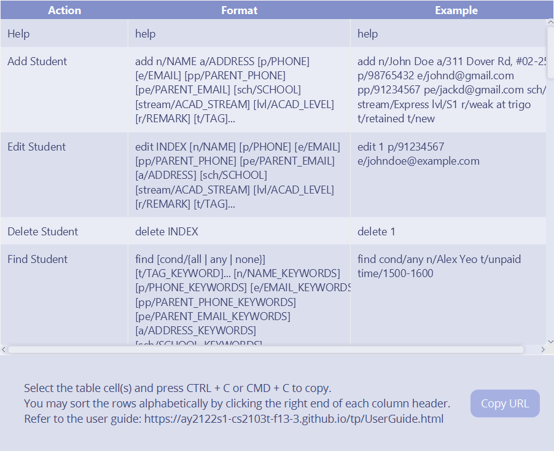
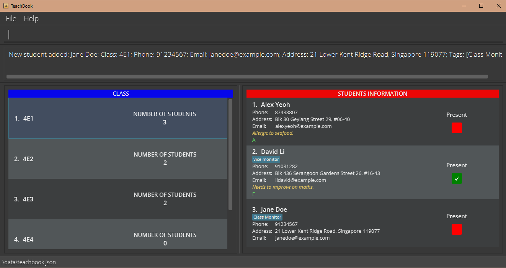
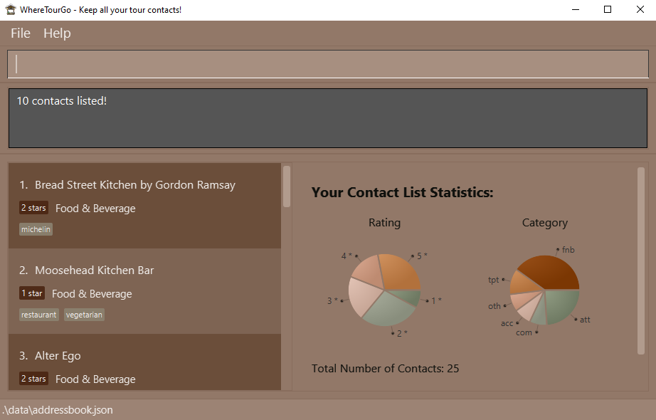

ProgrammerError (P|E) is a desktop app for managing students' information, optimized for use via a Command Line
Interface (CLI) while still having the benefits of a Graphical User Interface (GUI). Designed for CS2100 Lab TAs, this
application is optimized to track personal particulars, emails and attendance of your students across different classes.
If you are familiar with Unix commands, this is definitely for you!

## Table of Contents

- [Quick Start](#quick-start)
- [Features](#features)
    1. [View Sample Data](#view-sample-data)
    2. [Purge All Data: `purge`](#purge-all-data)
    3. [Fill Sample Data: `fill`](#fill-sample-data)
    4. [View Help: `help`](#view-help)
    5. [Add Student: `add`](#add-student)
    6. [Filter List: `filter`](#filter-student)
    7. [Edit Student Details: `edit`](#edit-student)
    8. [Delete Student: `delete`](#delete-student)
    9. [Add Lab: `addlab`](#add-lab)
    10. [Edit Lab: `editlab`](#edit-lab)
    11. [Delete Lab: `dellab`](#delete-lab)
    12. [Exit: `exit`](#exit)
    13. [Download data](#download-data)
- [Command Summary](#command-summary)

## Quick Start

1. Ensure you have Java `11` or above installed in your Computer.

2. Download the latest `programmerError.jar`
   from [here](https://github.com/se-edu/addressbook-level3/releases) [coming soon].

3. Copy the file to the folder you want to use as the _home folder_ for your ProgrammerError.

4. Double-click the file to start the app. The GUI similar to the below should appear in a few seconds. Note how the app
   contains some sample data. 
   

5. Type the command in the command box and press Enter to execute it. e.g. typing **`help`** and pressing Enter will
   open the help window. 
   Some example commands you can try:

    * **`add -n Sherwin -sid A1234567X -cid B01 -email e0523451@u.nus.edu`**: Adds a student named `Sherwin` to the PE with his Student ID, Class ID and Email.

    * **`filter -sid A1234567X`** Filters the list to display student(s) whose student ID contains `A1234567X'

    * **`edit 1 -n Sherwin`** Updates the name of the student at index 1 (1-indexed) with the `-n` flag

    * **`delete -sid A1234567X`**  : Deletes a student's record by the student ID

    * **`purge`**: Deletes all existing contacts

    * **`fill`**: Fills the app with sample data

    * **`exit`**: Exits the app.

6. Refer to the [Features](#features) below for details of each command.

## Features

**Notes about the command format (Unix Command Syntax):**

- Similar to Unix CLI, the up and down arrow keys can be used to navigate the history of commands executed.
- Flags will be used to specify different options for the commands. For example, the `-sid` flag can be used to specify
  a student's student ID.
- Parameters can be in any order.e.g. if the command specifies `-n NAME -sid STUDENT_ID`,
  `-sid STUDENT_ID -n NAME`is also acceptable.
- If a parameter is expected only once in the command, but you specified it multiple times, only the last occurrence of
  the parameter will be taken. e.g. if you specify `-n Allard -n Xian Yi` , only `-n Xian Yi` will be taken.
- Extraneous parameters for commands that do not take in parameters (such as `help`, `exit` and `purge`) will be
  ignored. e.g. if the command specifies `help 123`, it will be interpreted as `help`.

### 1. View sample data

Sample Data will be available on starting PE.

### 2. Purge all Data: `purge`

Purges all pre-existing sample data to start adding your own data or purge the user data. \
Clears all data in PE. \
Example: `purge`

### 3. Fill Sample Data: `fill`

If no data present, fills it with sample data. Otherwise, throws an error message. \
Example: `fill`

### 4. View Help: `help`

Shows a message explaining how to access the help page.

Example: `help`

### 5. Add Student: `add`

Adds a student to ProgrammerError with the his/her student ID and class ID.

Format: `add -n <NAME> -sid <STUDENT_ID> -cid <CLASS_ID> -email <EMAIL>`

Examples:

- `add -n Sherwin -sid A1234567X -cid B01 -email e0542421@u.nus.edu`: Adds the student called Sherwin with student ID A1234567X and class ID B01 and 
  email e0542421@u.nus.edu to ProgrammerError.

- `add -n Betsy -sid A2345678X -cid B02 -email e043245@u.nus.edu`: Adds the student called Betsy with student ID A2345678X and class ID B02 to and 
  email e043245@u.nus.edu ProgrammerError.

### 6. Filter List: `filter`

Filter the students in ProgrammerError based on the specified arguments provided (name, student ID, class ID and email).
Of the three arguments, at least one has to be provided. Arguments can be provided in any order and it is
case-insensitive. ProgrammerError will display the filtered list of students whose details matches all the specified
arguments.

Format: `filter -n <NAME> -sid <STUDENT_ID> -cid <CLASS_ID> -email <EMAIL>`

Examples:

- `filter -sid A1234567X` Lists all students whose student ID contains `A1234567X`.
- `filter -n abc` Lists all students whose name contains `abc`.
- `filter -cid B01` Lists all students whose class ID contains the character sequence `B01`.
- `filter -email e1234567` Lists all students whose email contains the character sequence `e1234567`.
- `filter -n Sherwin -cid B01` Lists all students whose name contains the character sequence `Sherwin` and belongs to a
  class with the class ID containing the character sequence `B01`.

### 7. Edit Student's Details or Grade : `edit`

Edits the details or grade of an existing student's in the PE. Take note that 1-indexing is used here as according to the displayed
list.

Format:`edit <INDEX_IN_LIST> -n <NAME> -sid <STUDENT_ID> -email <EMAIL>`
Format:`edit <INDEX_IN_LIST> -t <LAB_NUMBER> -s <ACTUAL_SCORE>`

- Updates the student with at the given `INDEX_IN_LIST' with the arguments provided.
- Existing values will be updated to the input values.

Examples:

- `edit 1 -sid A1234567X` Updates the student ID of the student at index 1 (1-indexed) to A1234567X.
- `edit 2 -grade 97.5` Updates the grade of the student at index 2 (1-indexed) to 97.5.

### 8. Delete Student: `delete`

Deletes the specified student from the PE.

Format: `delete -sid <STUDENT_ID>`

- Deletes the student with student ID of `<STUDENT_ID>`.

Examples:

- `delete -sid A1234567X` Deletes the data of the student with student ID A1234567X
- `delete -sid A2345678X` Deletes the data of the student with student ID A2345678X

### 9. Add Lab: `addlab`

Adds a lab to every student with the lab number and total score.

Format: `addlab -t <LAB_NUM> -ts <TOTAL_SCORE>`

Examples:

- `addlab -t 1 -ts 20`: Adds a lab with number 1 and total score 20 for all students.

- `addlab -t 2 -ts 30`: Adds a lab with number 2 and total score 30 for all students.

### 10. Edit Lab: `editlab`

Edits the details of an existing lab for every student.

Format: `editlab -t <LAB_NUM> -nt <NEW_LAB_NUM> -ts <NEW_LAB_SCORE>`

Examples:

- `editlab -t 1 -ts 30`: Changes the total score of lab 1 to 30 for all students.
  
- `editlab -t 1 -nt 2`: Changes the number of an existing lab from 1 to 2 for all students.

### 11. Delete Lab: `dellab`

Deletes an existing lab from every student in ProgrammerError.

Format: `dellab -t <LAB_NUM>`

Examples:

- `dellab -t 1`: Deletes lab 1 for all students if it exists.

ProgrammerError data can be downloaded to a CSV file by clicking the 'Download' button or the enter command `download`. The TA will need
to specify the directory to download the file to.

### 10. Upload Data

ProgrammerError data can be uploaded by a CSV file by clicking the 'Upload' button or enter the command `upload`. The TA will need
to specify the directory to upload the file from.

### 11. Exit: `exit`

Exits ProgrammerError and closes the GUI.

## Command Summary

Command | Format & Examples
--------| ----------------------
**Add** | `add -n <NAME> -sid <STUDENT_ID> -cid <CLASS_ID>`
**Add Lab** | `addlab -t <LAB_NUM> -ts <TOTAL_SCORE>`
**Delete** | `delete <INDEX_IN_LIST>`
**Download** | `download`
**Delete Lab** | `dellab -t <LAB_NUM>`
**Edit** | `edit <INDEX_IN_LIST> -n <NAME> -sid <STUDENT_ID> -grade <GRADE_SCORE>`
**Edit Lab** | `editlab -t <LAB_NUM> -nt <NEW_LAB_NUM> -ts <NEW_LAB_SCORE>`
**Exit** | `exit`
**Fill** | `fill`
**Filter** | `filter -n <NAME> -sid <STUDENT_ID> -cid <CLASS_ID> -email <EMAIL>`
**Help** | `help`
**Purge** | `purge`
**Upload** | `upload`

