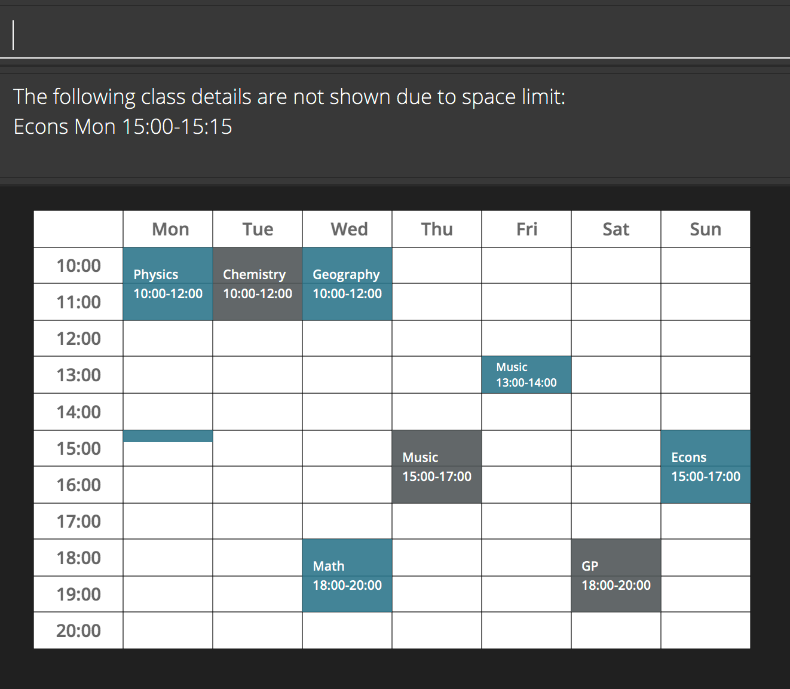

TutAssistor is a ***desktop app for private tutors to manage tuition class time slots, optimized for use via a Command Line Interface (CLI)***. It enables tutors to resolve conflicts in their tuition schedule and manage their students more efficiently.

* Table of Contents
{:toc}

--------------------------------------------------------------------------------------------------------------------

## Quick start

1. Download TutAssitor jar file.
2. Open by double-clicking.

--------------------------------------------------------------------------------------------------------------------

## Features

### Adding students/tuition classes
#### Adding a student: `add`

Command Shortcut: `a`

Adds a student’s information such as n/NAME, p/PHONE_NUMBER.

Format: `add n/NAME p/PHONE_NUMBER e/EMAIL a/ADDRESS [r/REMARK] [t/TAG]…`

Examples:

```
add n/John Doe p/98765432 e/johnd@example.com a/John street, block 123, #01-01
```
```
a n/Richard Ng p/97865342 e/richardng@example.com a/Yishun Ave 1 block 60, #07-12 r/Can only attend on even weeks t/paid
```

#### Adding a tuition class: `addclass`

Command Shortcut: `ac`


Adds a tuition class with a set l/LIMIT of students at specified ts/TIMESLOT.

The students to be added are optional. If the student the user intends to add is not present, or the class limit has
been exceeded, TutAssistor will alert names of these students. The time slot should follow the
format "Www hh:mm-hh:mm" to help TutAssistor check if the time slot is already taken or there is an overlap
on time slots. If there is any conflict or overlap, TutAssistor will alert the conflict.

Format: `addclass n/NAME l/LIMIT ts/TIMESLOT [s/NAME,NAME,NAME...] [r/REMARK]`

Examples:
```
addclass n/Chemistry l/16 ts/Thu 15:00-17:00 s/Bernice Yu,Richard Ng
```
```
ac n/Math l/8 ts/Mon 11:00-14:00 r/Quiz on final lesson
```

### Viewing students/tuition classes
Provides a view of a student or class if an INDEX is provided. Otherwise, a full list is provided.

#### Viewing a student: `student`

Command Shortcut: `vs`

Format: `student INDEX`

Example:
```
student 2
```
or
```
vs 2
```

#### Viewing a tuition class: `class`

Command Shortcut: `vc`

Format: `class INDEX`

Example:
```
class 3
```
or
```
vc 3
```

### Editing students/tuition classes
Edits a student’s information such as n/NAME, p/PHONE_NUMBER.
Edits a tuition class at specified t/TIME.

#### Editing a student: `edit`

Command Shortcut: `e`

Format: `edit INDEX [n/NAME] [p/PHONE] [e/EMAIL] [a/ADDRESS]`

Examples:
```
edit 1 n/Jason Tan a/221b Baker Street
```
```
e 2 p/62353535
```

#### Editing a class: `editclass`

Command Shortcut: `ec`

Format: `editclass INDEX [n/NAME] [l/LIMIT] [ts/TIMESLOT]`

Examples:
```
editclass 2 l/10
```
```
ec 3 n/Trigonometry ts/Sun 10:00-11:00
```

### Deleting students/tuition classes
Deletes a student or a tuition class of a given INDEX.

#### Deleting students: `delete`

Command Shortcut: `del`

Format: `delete STUDENT_INDEX [STUDENT_INDEX]...`

Example:
```
delete 1 2
```
```
del 1
```

#### Deleting tuition classes: `deleteclass`

Command Shortcut: `delc`

Format: `deleteclass CLASS_INDEX [CLASS_INDEX]...`

Example:
```
deleteclass 1 2
```
```
delc 4
```

### Adding/Removing an existing student from class
Move a student to/from classes by adding or removing them.

#### Adding existing students to a class: `addtoclass`

Command Shortcut: `atc`

Add one or more existing students to an existing class using student NAME or INDEX.
When the student to be added is already enrolled in the class or is not found in TutAssistor, TutAssistor will alert the
names of these students to the tutor.

When adding student names, using comma to separate names and there is no space around comma.
When adding student indexes, using space to separate indexes.

Format:

`addtoclass si/STUDENT_INDEX [STUDENT_INDEX]... tc/INDEX_CLASS`

or

`addtoclass s/NAME[,NAME,NAME...] tc/INDEX_CLASS`

Examples:
```
addtoclass si/1 tc/1
```
```
atc si/1 2 3 4 tc/1
```
```
addtoclass s/James,Felicia tc/2
```
```
atc s/James tc/3
```

#### Removing existing students from a class: `remove`

Command Shortcut: `rm`

Removes existing students from a tuition class using student INDEX.

Format: `remove si/INDEX_STUDENT INDEX_STUDENT tc/INDEX_CLASS`

Examples:
```
remove si/1 tc/1
```
```
rm si/1 2 3 4 tc/2
```

### Adding remarks to a student: `remark`

Command Shortcut: `re`

Adds a remark to the identified student.

Format: `remark STUDENT_INDEX r/REMARK`

Examples:
```
remark 1 r/Hasn't paid last week's fee
```
```
re 2 r/Exam on 28 Oct
```

#### Adding remarks to a tuition class: `remarkclass`

Command Shortcut: `rec`

Format: `remarkclass INDEX_CLASS r/REMARK`

Examples:
```
remarkclass 2 r/Math homework due Friday
```
```
rec 1 r/No class on week 7
```

### Finding students by name: `find`

Command Shortcut: `f`

Filters the list of students to only display all students whose names contain any of the given keywords (case-insensitive).

Format: `find NAME`

Example: 
```
find alice tan
```
or
```
f alice tan
```
TutAssitor will display a list of all students with `alice` or `tan` in their name.

#### Listing all students: `list`

Command Shortcut: `l`

Display list of all students after conducting a search with the `find` command.

### Finding classes by name: `findclass`

Command Shortcut: `fc`

Filters the list of classes to only display all classes whose names contain any of the given keywords (case-insensitive).

Format: `findclass NAME`

Example: 
```
findclass physics chemistry
```
or
```
fc physics chemistry
```
TutAssitor will display a list of all classes with `physics` or `chemistry` in their name.

#### Listing all classes: `listclass`

Command Shortcut: `lc`

Display list of all classes after conducting a search with the `findclass` command.

### Sorting tuition classes: `sort`

Command Shortcut: `s`

Permanently sorts tuition class list according to time or alphabetical order.

If the tutor does not exit TutAssistor, the list will be auto-sorted
when adding and editing classes after the tutor sorted the list.

Format: `sort [o/ORDER]`

Examples: (examples below are all possible usages of `sort`)
- `sort` (without order being specified, TutAssistor will sort the list by time)
- `sort o/asc`
- `sort o/desc`
- `sort o/time`

### View timetable: `timetable`

Command Shortcut: `tt`

Example:
- `timetable`
<br>

Shows lessons scheduled in this week in a timetable.<br>


### Viewing help: `help`

Command Shortcut: `h`

Shows a command summary and a link to the user guide. <br>


### Exiting the app: `exit`
Exits the program.<br>
Format: `exit`

## Command Summary

Action | Format | Shortcut
-------|--------|---------
***Add Student*** | `add n/NAME p/PHONE_NUMBER e/EMAIL a/ADDRESS [r/REMARK] [t/TAG]…` | `a`
***Add Class*** | `addclass l/limit t/time [s/NAME,NAME,NAME...] [r/REMARK] [t/TAG]…` | `ac`
***View Student*** | `student INDEX` | `vs`
***View Class*** | `class INDEX` | `vc`
***Edit Student*** | `editstudent INDEX [n/NAME] [p/PHONE] [e/EMAIL] [a/ADDRESS]  [t/TAG]…` | `e`
***Edit Class*** | `editclass INDEX [n/NAME] [p/PHONE] [e/EMAIL] [a/ADDRESS] [t/TAG]…` | `ec`
***Delete Student*** | `deletestudent INDEX_STUDENT INDEX_STUDENT` | `del`
***Delete Class*** | `deleteclass INDEX_CLASS INDEX_CLASS` | `delc`
***Add Student to Class*** | `addtoclass si/INDEX_STUDENT INDEX_STUDENT tc/INDEX_CLASS` <br /> or `addtoclass s/NAME,NAME... tc/INDEX_CLASS` | `atc`
***Remove Students from Class*** | `remove si/INDEX_STUDENT INDEX_STUDENT tc/INDEX_CLASS` | `rm`
***Add Remarks to Student*** | `remark INDEX_STUDENT r/REMARK` | `re`
***Add Remarks to Class*** | `remarkclass INDEX_CLASS r/REMARK` | `rec`
***Find Student by Name*** | `find NAME` | `f`
***List all Students*** | `list` | `l`
***Find Class by Name*** | `findclass NAME` | `fc`
***List all Classes*** | `listclass` | `lc`
***Sort Tuition Class*** | `sort [o/ORDER]` | `s`
***View Timetable*** | `timetable` | `tt`
***Help*** | `help` | `h`
***Exit*** | `exit` | -


