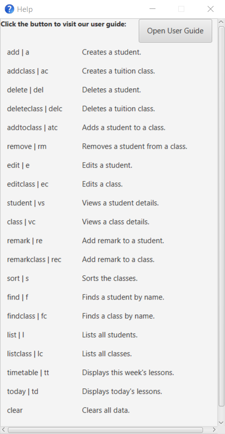
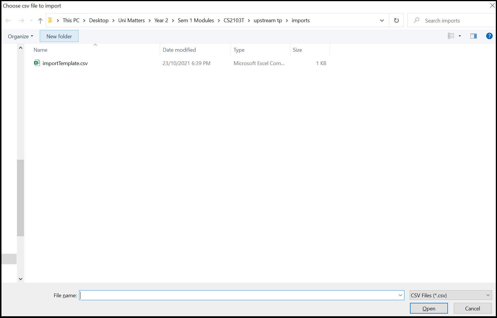

NUSpam is a desktop app for managing contacts **targeted at marketers who require fast manipulation and precise handling of contact data.** It enables marketers to more easily manage and make use of email and phone leads, and **minimise tedious and repetitive tasks** such as data entry, email blasts, and mail merge.

- [Quick start](#quick-start)
- [Features](#features)
  - [Viewing help: `help`](#viewing-help-help)
  - [Adding a person: `add`](#adding-a-person-add)
  - [Batch importing contacts: `import`](#batch-importing-contacts-import)
  - [Listing all persons: `list`](#listing-all-persons-list)
  - [Editing a person: `edit`](#editing-a-person-edit)
  - [Locating persons by name: `find`](#locating-persons-find)
  - [Deleting a person: `delete`](#deleting-a-person-delete)
  - [Clearing all entries: `clear`](#clearing-all-entries-clear)
  - [Exiting the program: `exit`](#exiting-the-program-exit)
  - [Saving the data](#saving-the-data)
  - [Editing the data file](#editing-the-data-file)
- [FAQ](#faq)
- [Command Summary](#command-summary)

---

## Quick start

1. Ensure you have Java `11` or above installed in your Computer.

1. Download the latest `NUSpam.jar` (Coming Soon).

1. Copy the file to the folder you want to use as the _home folder_ for your NUSpam.

1. Double-click the file to start the app. The GUI similar to the below should appear in a few seconds. Note how the app contains some sample data. 
   

1. Type the command in the command box and press Enter to execute it. e.g. typing **`help`** and pressing Enter will open the help window. 
   Some example commands you can try:

   - `list` : Lists all contacts.

   - `add -n "John Doe" -p "+659875432" -e "johnd@example.com"` : Adds a contact named `John Doe` to the Address Book.

   - `delete 3` : Deletes the 3rd contact shown in the current list.

   - `clear` : Deletes all contacts.

   - `exit` : Exits the app.

1. Refer to the [Features](#features) below for details of each command.

---

## Features

> **:information_source: Notes about the command format:** 
>
> All command inputs follows the following format:
>
> `<command> "<parameters>" <flag> "<flag parameters>" ...`
>
> > Examples:
> >
> > `clear`
> >
> > `find --name "John"`
> >
> > `edit "1" --phone "91234567" -e "johndoe@example.com"`
>
> > Note:
> >
> > All flags will have a long version and a short version that can be used. The long version will be prefixed with
> > `--` while the short versions will be prefixed with `-`. (Eg. `--phone` and `-p`)

### Viewing help: `help`

Displays a window containing documentation for command syntax and format.

_(Referenced from macOS Preview help window)_

Format: `help (--edit/-e) (--import/-i) (--add/-a) (--exit/-x) (--delete/-d) (--find/-f) (--clear/-c) (--list/-l)`

- The command can accept up to 1 optional argument.
- By supplying the optional argument, the program displays the relevant documentation for the command.
- Supplying 0 optional arguments will display the table of contents of the documentation with hyperlinks to the documentation of the commands.

### Adding a person: `add`

Adds a person to the address book.

Format: `add (-n/--name) "[NAME]" (-p/--phone) "[PHONE]" (-e/--email) "[EMAIL]" (-a/--address) "[ADDRESS]" (-t/--tag) "[TAG]"`

- At least the name field must be provided.

Examples:

- `add -n "John Doe" -p "+6501234567" -e "johndoe@example.com" -a "NUS School of Computing" -t "undergraduate,computer science"` adds a contact with name of `John Doe`, phone number `+6501234567`, email `johndoe@example.com`, address `NUS School of Computing`, tags `undergraduate` and `computer science`.
- `add -n "Jane Deer" -t "woman"` adds a contact with the name of `Jane Deer` and tag of `woman`.

### Batch importing contacts: `import`

Imports all contacts from a selected _csv_ file. Calling the command will open a file browser to help select the file.
  
Format: `import`

Example:

- Select `importTemplate.csv` file.
- Click open to import contacts.

Note:  
- `.csv` file must have corresponding **headers**:
  - name
  - phone
  - email
  - address
  - tags(optional)
- Addresses containing **commas (,)** should be wrapped in **"double quotes"**.
- Multiple tags should be seperated via **single whitespace**.
- Make sure to save the spreadsheet data as **`.csv`** and not **`.csv UTF-8`**.
- A template `importTemplate.csv` can be found in the default directory of the file browser.

Sneak peek:

  
### Listing all persons: `list`

Shows a list of all persons in the address book.

Format: `list`

### Editing a person: `edit`

Edits an existing person in the address book.

Format: `edit "[INDEX]" (-n/--name) "[NAME]" (-p/--phone) "[PHONE]" (-e/--email) "[EMAIL]" (-a/--address) "[ADDRESS]" (-t/--tag) "[TAG]"`

- Edits the person at the specified `INDEX`. The index refers to the index number shown in the displayed person list. The index **must be a positive integer** 1, 2, 3, …​
- At least one of the optional fields must be provided.
- Existing values will be updated to the input values.
- When editing tags, the existing tags of the person will be removed ie. adding of tags is not cumulative.
- You can remove all the person’s tags by typing `-t` without specifying any tags after it.

Examples:

- `edit "1" -p "91234567" -e "johndoe@example.com"` Edits the phone number and email address of the 1st person to be `91234567` and `johndoe@example.com` respectively.
- `edit "2" -n "Betsy Crower" -t ""` Edits the name of the 2nd person to be `Betsy Crower` and clears all existing tags.

### Locating persons: `find`

Finds persons whose name, phone number, email, address and/or tag contain contains any of the given keywords.

Format: `find (-n/--name) "[NAME]" (-p/--phone) "[PHONE]" (-e/--email) "[EMAIL]" (-a/--address) "[ADDRESS]" (-t/--tag) "[TAG]"`

- At least one of the optional fields must be provided.
- The search is case-insensitive. e.g `hans` will match `Hans`
- The order of the keywords does not matter. e.g. `Hans Bo` will match `Bo Hans`
- Only full words will be matched e.g. `Han` will not match `Hans`
- Persons matching at least one keyword will be returned (i.e. `OR` search).
  e.g. `Hans Bo` will return `Hans Gruber`, `Bo Yang`

Examples:

- `find John` returns `john` and `John Doe`
- `find alex david` returns `Alex Yeoh`, `David Li` 
  

### Deleting a person: `delete`

Deletes the person of choice from the address book.

Format: `delete "UID1,UID2,..."`

- Deletes a specific user(s) based on the User ID. ​
- The number of UID in the input is arbitrary.
- At least one User ID must be provided.​

Examples:

- `delete "1,2"` deletes two person with UID 1 and 2 in the address book.

Format: `delete -a"`

- Deletes ALL users in the current scope. ​
- A warning will pop up for further confirmation.

Examples:

- `find Betsy` followed by `delete -a` deletes ALL person in the results of the `find` command.

### Clearing all entries: `clear`

Clears all entries from the address book.

Format: `clear`

### Exiting the program: `exit`

Shuts down and exits the program.

Format: `exit`

### Saving the data

AddressBook data are saved in the hard disk automatically after any command that changes the data. There is no need to save manually.

### Editing the data file

AddressBook data are saved as a JSON file `[JAR file location]/data/addressbook.json`. Advanced users are welcome to update data directly by editing that data file.

:exclamation: **Caution:**
If your changes to the data file makes its format invalid, AddressBook will discard all data and start with an empty data file at the next run.

### Archiving data files `[coming in v2.0]`

_Details coming soon ..._

---

## FAQ

**Q**: How do I transfer my data to another Computer? 
**A**: Install the app in the other computer and overwrite the empty data file it creates with the file that contains the data of your previous AddressBook home folder.

---

## Command summary

| Action     | Format, Examples                                                                                                                                                       |
| ---------- | ---------------------------------------------------------------------------------------------------------------------------------------------------------------------- |
| **Add**    | `add (-n/--name) "[NAME]" (-p/--phone) "[PHONE]" ...`   e.g., `add -n "James Ho" -p "22224444" -e "jamesho@example.com" -a "123, Clementi Rd, 1234665" -t "friend"` |
| **Clear**  | `clear`                                                                                                                                                                |
| **Delete** | `delete "UID1,UID2,..."`  e.g., `delete "3,2,7"`                                                                                                                    |
| **Edit**   | `edit "[INDEX]" (-n/--name) "[NAME]" (-p/--phone) "[PHONE]"…​`  e.g., `edit "2" -n "James Lee" -e "jameslee@example.com"`                                           |
| **Exit**   | `exit`                                                                                                                                                                 |
| **Find**   | `find (-n/--name) "[NAME]" (-p/--phone) "[PHONE]" (-e/--email) "[EMAIL]" (-a/--address) "[ADDRESS]" (-t/--tag) "[TAG]"`  e.g., `find -n "James Jake"`               |
| **Help**   | `help (--edit/-e) (--import/-i) (--add/-a) (--exit/-x) (--delete/-d) (--find/-f) (--clear/-c) (--list/-l)`  e.g., `help -e`                                         |
| **Import** | `import`                                                                                                                                                               |
| **List**   | `list`                                                                                                                                                                 |
