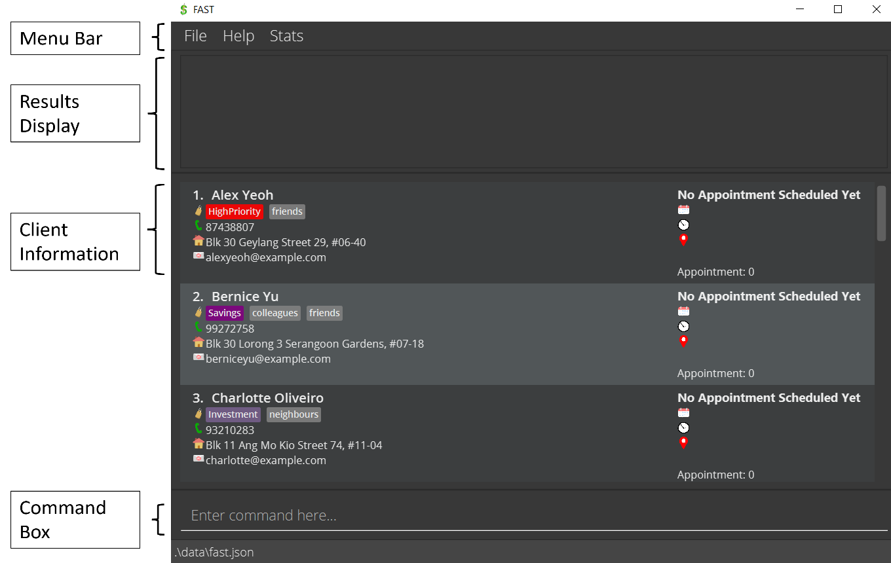
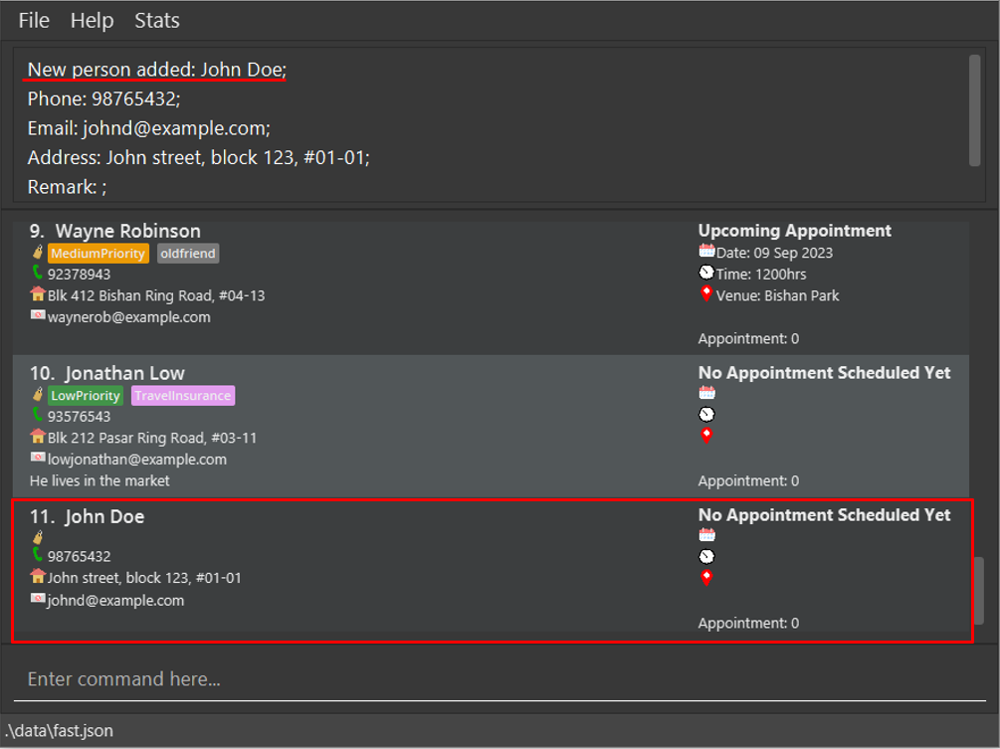
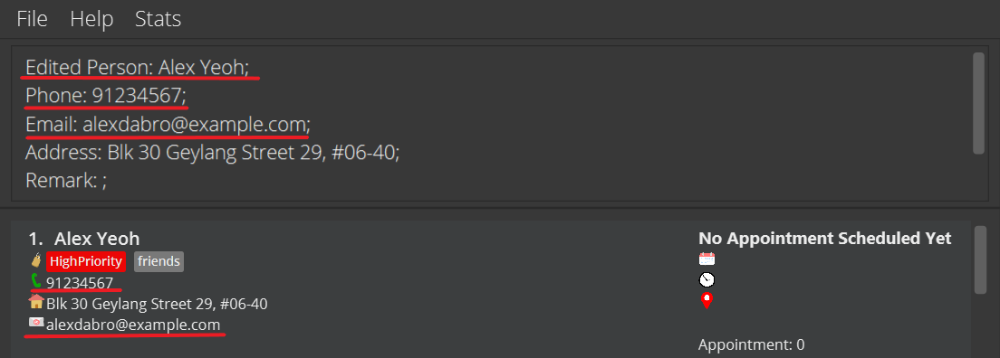
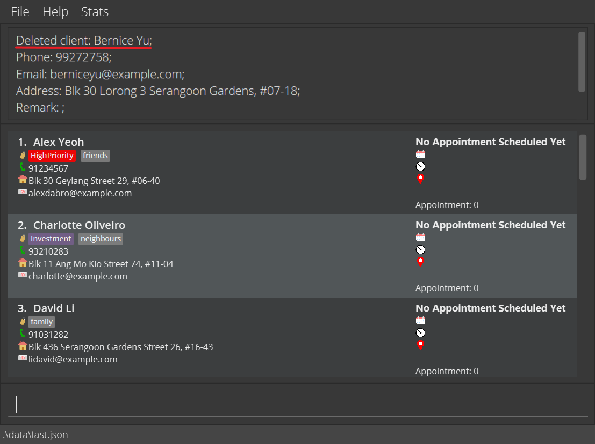
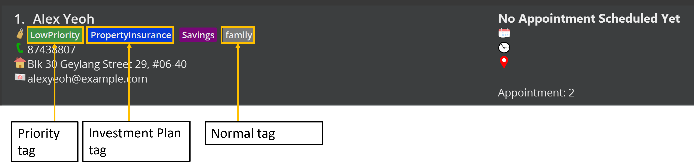
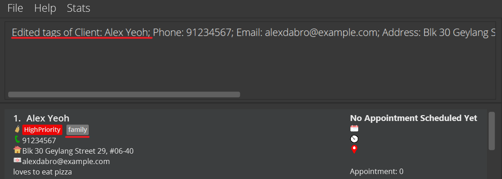
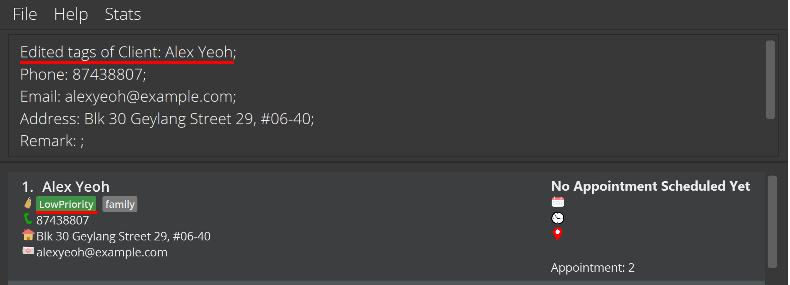
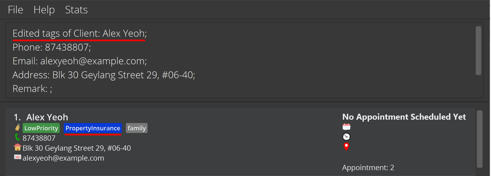
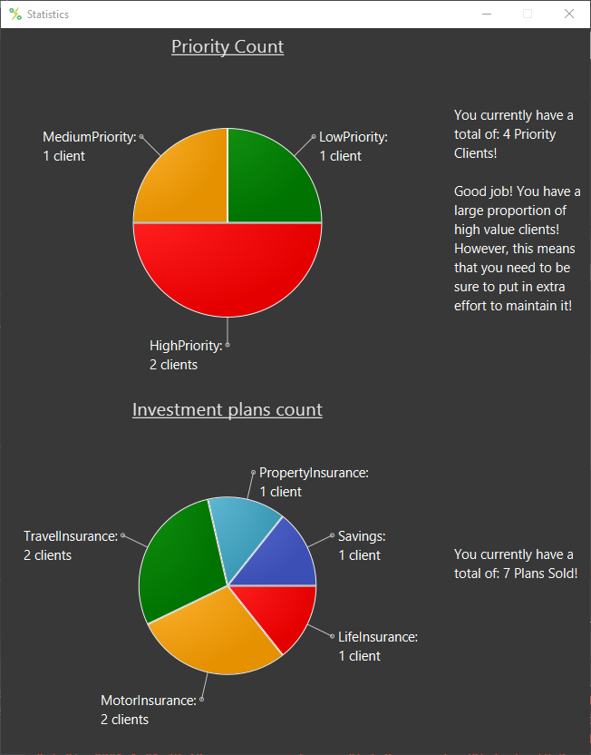

* Table of Contents
{:toc}

--------------------------------------------------------------------------------------------------------------------

## **Introduction**

  

Welcome and thank you for downloading **FAST**! Are you a financial advisor having troubles managing your contacts
on your phone? Do you find existing contact management software troublesome and not intuitive to use? Do you want
a free alternative compared to those paid contact management software? If you answered "YES!" to any those questions,
then FAST is for you!

FAST stands for Financial Advisor Smart Tracker (FAST), and as its name implies, we strive to be the fastest, and most
efficient when it comes to managing your contacts.
FAST is a **free and open-source desktop app for Financial Advisors to manage their contacts.**
More importantly, FAST is **optimized for those who prefer to work with a Command Line
Interface** (CLI) while still having the benefits of a Graphical User Interface (GUI).
If you are a Financial Advisor that can type fast, FAST will get your contact management tasks done faster than traditional GUI apps!

### Features overview
Here is an overview of the features FAST offers:
* Keep track of your client's [information](#managing-a-client) (i.e. Name, Phone number, Email address, Home address, and Remarks) in our
  all-in-one app!
* Record and keep track of your client's [appointment](#appointments) dates. Never miss another appointment date again!
* [Tag](#tags) your clients with the insurance plan they have purchased or are interested in.
* View built-in [analysis](#viewing-statistics) of your client base to better understand your portfolio.

### Purpose of this guide
This guide aims to help new users to be familiar with FAST. After reading this guide, new users will be more familiar with the different features available in FAST.
This guide also serves as a reminder for existing users to quickly search for specific information if they are unsure of how to use certain features, 
by clicking on the links, to jump to the section where the information which they are looking for exists.

--------------------------------------------------------------------------------------------------------------------

## **How to use this user guide**
We recommend first time users to read the user guide in the order that is written.
Throughout the user guide, we include links in blue like [this](#how-to-use-this-user-guide) which will jump to the 
corresponding section of the user guide. These links allow you to quickly navigate this document. 
This guide follows the structure as stated [here](#structure-of-this-document).

We also use special formats to highlight information that will be important or useful to you.
These include:

**Cautions**

:exclamation: **Caution** Example caution

Messages that appear in these boxes are important to take note of, as not knowing them might harm your user experience.

**Tips**

:bulb: **Tip:**
Example tip

Messages that appear in these boxes can help you to more effectively use FAST.

**Useful information**

:information_source: Example useful information

Messages that appear in these boxes will be useful in helping you to understand how to use FAST.

**Technical Information**

`Example technical information`

Messages that appear in these boxes indicate that the text is of a more technical nature, such as user input.

### Structure of this document
To help you make the most of your time, we have added a multitude of features to FAST, which will help you efficiently manage your contacts.
As such, this user guide has been structured to help you find what you are looking for.

In [How to use this user guide](#how-to-use-this-user-guide), you can learn how to most effectively read through this guide.

In [Quick start](#quick-start), you will find simple instructions on how to quickly begin using FAST.

In [Features](#features), you can find documentation on how to use the features available in FAST.

In [FAQs](#faqs), you may find answers to questions or problems you might have while using FAST.

In [Command summary](#command-summary), you will find a summary of the commands available in FAST.

In [Glossary](#glossary), you will find useful descriptions and meanings of terms used in this document.

--------------------------------------------------------------------------------------------------------------------

## **Quick start**

1. Ensure you have Java `11` or above installed in your Computer. FAST can be used 
on any operating system including Windows, macOS or Linux

1. Download the latest `FAST.jar` from [here](https://github.com/AY2122S1-CS2103T-T09-4/tp/releases).

1. Copy the file to the folder you want to use as the _home folder_ for your FAST.

1. Double-click the file to start the app. The GUI similar to the below should appear in a few seconds. 
   
   
   
   

   :information_source: More icons will be added in future iterations 
   

   
1. When you first start up, FAST will contain some sample data for you to explore the different features.
1. You are now ready to start managing your clients!

### User interface

  Referring to the image above, the _Menu bar_ at the top is where you can access the _Help page_, _Stats page_ and exit 
FAST.   
Next, the _Results display_ is where FAST gives you feedback to your commands. For example, if you make a typo
in your command, FAST will inform you here!   
Following that, we have the _Client information_ cards. Each client is represented by a card, which contains
all the information of that client.   
Lastly, the _Command box_ is where you can type in all your commands!

### Try it out!

We recommend that you play around with FAST to get a better idea of the features and their usages. Don't worry, these
are all sample data! Here are some commands you can try to see what they do:

    
1. Add a contact named "John Doe" to FAST
   * `add n/Matthew Shen p/91087657 e/matthew@example.com a/511 Seletar Road 12`
    
2. Delete the 3rd contact in FAST
    * `del 3`
    
3. View all your saved contacts
    *  `list`
    
4. Try searching for a high priority client!
    * `find pr/high`
    
5. Try setting an appointment for him.
    * `aa 1 d/2021-12-12 t/14:30 v/Buona Vista`
    

:information_source: When you are ready to use FAST to keep track of your own clients, you can use 
`clear` to delete this sample data.  

--------------------------------------------------------------------------------------------------------------------

## **Features**

### **Command Format**
*All* the commands used in FAST application follows these notations!

* Words in `UPPER_CASE` are the parameters to be added in by the user. 
  * e.g. for `add n/NAME`, `NAME` is where you would replace it with the actual client's name such as in `add n/John Doe`.

* Items in square brackets are optional. 
  * e.g. if you see `n/NAME [t/TAG]`, this can be used as `n/John Doe t/friend` or as `n/John Doe`.

* Items with `…`​ after them can be used zero or more times. 
  * e.g. if you see`[t/TAG]…​`, it can be `t/friend`, `t/friend t/family` or just left empty.

* Parameters can be in any order. (This excludes parameters without a prefix.)  
    * e.g. if the command uses this format: `n/NAME p/PHONE_NUMBER`, you can also input `p/PHONE_NUMBER n/NAME`.
  

**:information_source: Notes about the command format:** 
* Parameter without a prefix **must** be the **first** parameter in the command (when required).

* If a parameter is expected only once in the command, but you specified it multiple times, only the
  last occurrence of the parameter will be taken. 
    * e.g. if you specify `p/12341234 p/56785678`, only `p/56785678` will be taken.

* For commands that do not take in any parameter (such as  `list`, `exit` and `clear`), anything written after
  the command will be ignored. 
    * e.g. if you input `help 123`, it will simply be interpreted as `help`.

* If a command expects a specific set of parameters, and you entered *extra* parameter into the command (with unrecognised),
prefix, then FAST will assume it to be part of the previous parameter input, which may or may not be valid for certain commands.  
    * e.g. if a command expects this parameter `ea v/New York` but you enter `ea v/New York p/87657654`, 
  FAST will assume your input to `v/` to be `New York p/87657654`.

:bulb: **Tip:**
Parameters refer to the details that are to be included as an input to a command.  
Prefix refers to the word symbol used before the parameter. 

 

### **Command Parameters**
In this subsection, you can see all the parameters used in FAST at one place. These parameters are used for 
all our features usage.

:exclamation: **Caution:**
To achieve the best possible experience, avoid adding excessively long input to FAST.

 

#### `ADDRESS` 
* The address of your client
* Can take any value (should not be *blank*)
* Should not be more than **100** characters

#### `DATE`
* The date of an appointment with your client
* Should be in this format: `yyyy-mm-dd` 
  * e.g. `2023-05-15` 
* Should be a valid date (cannot be a date in the past) where:
  * `yyyy` (year): should be a positive 4-digit number 
  * `mm` (month): should be a valid calendar month between 01 and 12
  * `dd` (day): should be a valid calendar day between 01 - 31 (might be less than 31 depending on the month)

#### `EMAIL`
* The email address of your client
* Should not be more than **100** characters
* Should be in this format: `local-part@domain`
* `local-part`: 
  * should only contain *alphanumeric characters* and these *special characters* excluding parentheses (!#$%&'*+/=?\{\}\|~^.-`).
  * should not start and end with special characters,
* `domain`: 
  * must be at least **2** characters long. 
  * each domain label must start and end with alphanumeric characters
  * each domain label is separated using hyphens (if any)

  
#### `HELP_TOPIC`
* The Help topics available in FAST:
  * `Quick Start`
  * `Add`
  * `Appointment`
  * `Edit Appointment`
  * `Delete Appointment`
  * `Mark Appointment`
  * `Clear`
  * `Delete`
  * `Edit`
  * `Find`
  * `List`
  * `Help`
  * `Remark`
  * `Sort`
  * `Statistic`
  * `Tag`
  * `Investment Plan Tag`
  * `Priority Tag`
  * `Misc`

#### `INDEX`
* Refers to the number shown in the displayed client list
* **Must be a positive integer** 1, 2, 3, …​

#### `KEYWORD`
*   The condition to sort your client list
*   There are currently only 3 `KEYWORD` available: `name`, `appointment`, `priority`.
    * `name` will sort all clients in alphabetical order from A to Z.
    * `appointment` will sort all client by appointment date from the earliest date to latest.
    * `priority` will sort all client by `priority tag` from the highest to the lowest priority.

**:information_source: Notes about sorting by appointment** 

* For clients with the **same appointment date**, FAST will first show those *without appointment times*, followed by
the earliest time to the latest time.

 

#### `NAME`
* The name of your client
* Should not be more than **50** characters
* Should only contain alphanumeric characters and spaces (should not be blank)
   

   :information_source: FAST does not allow duplicate names, but you may use numbers to differentiate between 2 clients with
   the exact same name. 
   

#### `PHONE`
* The contact number of your client
* Should only contain numbers
  * for numbers with an area/country code e.g. +65 80081355, you can just enter 6580081355
* Should be at least **3** digits long and at most **20** digits long.

#### `QUERY`
* The term used to search for clients in FAST
* Can be any value
* Cannot be left blank

#### `REMARK`
* Extra notes given for your client
* Should not be more than **45** characters

#### `TAG`
* A label given to your client
* There are 3 types of `TAG` in FAST:
  1. Normal Tags: should not be longer than 20 characters
     * no prefix
  2. Priority Tag: either one of the 3 priorities (low, med, high)
     * prefix: pr/
  3. Investment Plan Tag: either one of the 7 plans (health, invest, life, motor, property, save or travel)
     * prefix: ip/
  
* To use Priority or Inventment Plan Tags, you need to specify the prefix, or it will be treated as a Normal Tag.
* Refer to [Tags](#tags) to find out more about each tag

#### `TIME`
* The time of an appointment with your client
* 24-hour format
* Should be in this format: `HH:mm` 
  * eg. `10:30` represents 10.30am
* Should be a valid time from 00:00 to 23:59 where:
  * `HH` (hour): should be between 00 and 23
  * `mm` (minute): should be between 00 and 59
    

#### `VENUE`
* The location of an appointment with your client
* Should not be longer than **20** characters long
   

### **Managing a client**

FAST allows you to easily manage your clients. Just like a contact in your phone's Contact Book, you can use
FAST to save your client's Name, Phone Number, Address, Email Address and Remarks. In addition, you can also add
in appointment dates and tag your clients all within FAST.

In this user guide, we will showcase commands related to Clients first followed by sections on [Appointment](#appointments)
and [Tags](#tags). After this section on clients, you can also learn more about [managing your client base](#managing-your-client-base),
or view our [other utility features](#others). 

 

#### Adding a client: `add`

You can use this command to add a client to FAST.

**Format**: `add n/NAME p/PHONE_NUMBER e/EMAIL a/ADDRESS [t/TAG]…​`

**Parameters**:
* [`NAME`](#name)
* [`PHONE_NUMBER`](#phone)
* [`EMAIL`](#email)
* [`ADDRESS`](#address)
* [`TAG`](#tag)

:bulb: **Tip:**
A client can have any number of [`TAG`](#tag) (including 0)

**Examples**:
* `add n/John Doe p/98765432 e/johnd@example.com a/John street, block 123, #01-01` will add a new client called 
  `John Doe`, who has phone number of `98765432`, has an email address `johnd@example.com` and stays at 
  `John street, block 123, #01-01`.
  
  
  
* `add n/Betsy Crowe t/friend e/betsycrowe@example.com a/Newgate Prison p/1234567 t/criminal` will add a new client 
   called `Betsy Crowe`, has a phone number of `1234567`, has an email address `betsycrowe@example.com`, 
  stays at `Newgate Prison` and is tagged as both a `friend` and `criminal`.

   

#### Editing a client: `edit`

You can edit an existing client in FAST. 
This can be used if the client's information has changed, or if you entered an incorrect entry previously.

**Format**: `edit INDEX [n/NAME] [p/PHONE] [e/EMAIL] [a/ADDRESS] [t/TAG]…​`

* Edits the client at the specified `INDEX`

 :information_source:

* Only the edited fields will be updated to the input values, while the unedited values are unchanged.
* You can remove all the client’s tags by typing `t/` without specifying any tags after it.
* For further information on the type of tags available and how to use them, refer to the [Tags](#tags) section.

 :exclamation:

* At least one of the optional fields must be provided.
* When editing tags, all existing tags of the client will be replaced with the new tags.

**Parameters**:
* [`INDEX`](#index)
* [`NAME`](#name)
* [`PHONE_NUMBER`](#phone)
* [`EMAIL`](#email)
* [`ADDRESS`](#address)
* [`TAG`](#tag)

**Examples**:
* `edit 1 p/91234567 e/alexdabro@example.com` Edits the phone number and email address of the first client to be `91234567` and `alexdabro@example.com` respectively.

* `edit 2 n/Betsy Crower t/` Edits the name of the second client to be `Betsy Crower` and clears all existing tags.

 

#### Deleting a client: `del`

You can delete the specified client from FAST. This is useful when a client has stopped using your services.

**Format 1**: `del INDEX...`
**Format 2**: `del INDEX-INDEX`

* Deletes the client(s) at the specified `INDEX`.

**Parameters**:
* [`INDEX`](#index)

**Examples**:
* `list` followed by `del 2` deletes the second client in FAST. If `Bernice Yu` is the second client on the list, his entry
will be deleted.

* `find Betsy` followed by `del 1` deletes the first client in the results of the `find` command.

:bulb: Tip:
Can be used to delete up to **10** contacts in a single `del` command by supplying more `INDEX`.

:exclamation: Warning:
If *Format 1* is used, there should be a space in between each `INDEX` if multiple `INDEX` are input.  
If *Format 2* is used, first `INDEX` should not be larger than second `INDEX`.

**Examples**:
* `del 2 4 6 8 10` deletes the 2nd, 4th, 6th, 8th and 10th person in FAST.
* `del 3-5` deletes the 3rd, 4th and 5th person in FAST.

:exclamation: **Caution:**
This CANNOT be undone!

 

#### Adding a remark to your client: `rmk`

You can add a remark to an existing client in FAST, or update the current remark if they already have one.  
This is useful for adding additional client notes such as their preferred meeting timing, allowing you to better serve your clients!

 :information_source: 
Remarks should be used to annotate contacts with longer and more specific things compared to tags,
which should mostly be one or two words. 

**Format**: `rmk INDEX [r/REMARK]`

* Adds a remark to the client at the specified `INDEX`

**Parameter**:
* [`INDEX`](#index)
* [`REMARK`](#remark)

:bulb: Tip:
To delete a remark, leave the remark parameter `[r/[`REMARK`](#REMARK)]` empty.

**Examples**:
* `rmk 1 r/loves to eat pizza` adds a remark `loves to eat pizza` to the first client.

* `rmk 1` removes the remark from the first client. 

:bulb: **Tip:**
Try to add remarks with specific keywords so that it is easier to [search](#searching-for-clients-find) for them.

:exclamation: **Caution:**
Adding a remark will overwrite any previous remarks that were made for the client!

#### Appointments

You can also store and keep track of appointments with your clients all within FAST! 
You may save the date, time and venue of an appointment.

 

##### Adding an appointment: `aa`
You can add a scheduled appointment with the client. An appointment includes a date, time and venue.
This allows you to keep track of all your clients' appointment dates all within the same app.
You can also [edit](#editing-an-appointment-ea), [delete](#deleting-an-appointment-da), 
[mark as completed](#updating-completed-appointment-ma), or [undo marking of completed appointment](#undo-marking-of-completed-appointment-ua) 
for an appointment.

**Format**: `aa INDEX d/DATE [t/TIME] [v/VENUE]`

**Parameter**:
* [`INDEX`](#index)
* [`DATE`](#date)
* [`TIME`](#time)
* [`VENUE`](#venue)

:warning:
The `DATE` of the appointment must at least be specified.

**Examples**:
* `aa 1 d/2022-03-27` adds an appointment with date `27 Mar 2022` to the first client in FAST.

* `aa 3 d/2022-03-27 t/18:00` adds an appointment with date `27 Mar 2022` and time `1800hrs` to the third client in FAST.
* `find Matthew John` followed by `aa 3 d/2022-03-27 t/18:00 v/Velocity` adds an appointment with date `27 Mar 2022`, 
  time `1800hrs` and venue `Velocity` to the third client in the results of the `find` command.
   

   :information_source: This command will not work if the client has already been assigned an appointment. You will have to
   use the [edit appointment](#editing-an-appointment-ea) command. 
   

 

##### Editing an appointment: `ea`

You can edit a scheduled appointment with your client. 
This command is useful when your appointment has been rescheduled or has a change in location.

**Format**: `ea INDEX [d/DATE] [t/TIME] [v/VENUE]`

* Edits a scheduled appointment with the client at the specified `INDEX` if the appointment exist.

 :information_source: 
Existing details will be updated with the input data.

 :exclamation: 
At least **one** of the optional fields must be present.

**Parameter**:
* [`INDEX`](#index)
* [`DATE`](#date)
* [`TIME`](#time)
* [`VENUE`](#venue)

**Examples**:
* `ea 1 d/2022-03-28` edits the appointment date to be `28 Mar 2022` of the first client.

* `ea 3 v/  t/18:00` edits the appointment time to be `1800hrs` and clears the appointment venue of the third client.

  

##### Deleting an appointment: `da`

You can delete a scheduled appointment with your client. 
This command should be used when the appointment has been cancelled with a client.

**Format**: `da INDEX`

* Deletes a scheduled appointment with the client at the specified `INDEX` if the appointment exist.
* Existing details will be deleted.

**Parameter**:
* [`INDEX`](#index)

**Examples**:
* `da 1` deletes the appointment of the first client.

* `find Ben` followed by `da 3` deletes the appointment the third client in the result of the `find` command.

:exclamation: **Caution:**
This CANNOT be undone!

 

##### Updating completed appointment: `ma`

You can mark the appointment with your client as completed.
This also allows you to keep track of the number of completed appointments with your client.

**Format**: `ma INDEX`
* Update the completed appointment count with the client at the specified `INDEX` if the appointment exist.
* The marked appointment will be deleted!

**Parameter**:
* [`INDEX`](#index)

**Examples**:
* `ma 1` updates the completed appointment counter of the first client.

* `find Matthew` followed by `ma 3` updates the completed appointment counter of the third client in the result of 
  the `find` command.
  

##### Undo marking of completed appointment: `ua`

You can reduce the appointment count of your client as needed.  

**Format**: `ua INDEX`
* Decreases the completed appointment count of the client at the specified `INDEX` by 1, if no appointment is 
  currently scheduled with the client.
* The current appointment count has to be greater than 0.

**Parameter**:
* [`INDEX`](#index)

**Examples**:

Before undo:

* `ua 1` decreases the completed appointment counter of the first client by 1.

* `find Matthew` followed by `ua 3` decreases the completed appointment counter of the third client in the result of
  the `find` command by 1.

:exclamation: **Caution:**
This CANNOT be undone!

 

#### Tags

You can use our Tagging system to label and categorise your clients.
Tags are a quick way for you to organise your contacts, and recall their key characteristics.
In FAST, we have three main types of tags:

1. Normal tags, which you can customise according to your needs.

    
:bulb: **Tip:**
    Tags should be used to categorise clients; use short names for normal tags that you may be able to use for other clients as well!
    

2. Priority tags, which have fixed names and help you to remember which contacts you need to focus on first.
   
    
:bulb: **Tip:**
    A client can **only have 1 priority tag** , but they can have other non-priority tags alongside the one priority tag.
    

3. Investment plan tags, which help you recall the plans that each contact has bought.
    
:bulb: **Tip:**
    A client can have more than 1 investment plan tag, but they may not have more than 1 of the same investment plan tag.
    
    For example, a client may have both Savings and Investment concurrently, but not 2 instances of Savings at the same time. 
    

 

##### Tag Naming Conventions

You can refer to the table below to quickly learn about how to use these three tags.

Tag type|Prefix|Term
--------|-------|-----
Normal|`No Prefix`| Your preferred tag name, that contains at most 20 alphanumeric characters and no spaces
Priority|`pr/`| `low`: Low Priority `med`:Medium Priority `high`:High Priority
Investment plan|`ip/`| `health`: Health Insurance `invest`: Investment `life`: Life Insurance `motor`: Motor Insurance `property`: Property Insurance  `save`: Savings  `travel`: Travel Insurance

In general, append the term to the prefix when referring to a priority or investment plan tag.
Normal tags do not have prefixes, so simply type in the desired tag name.

More examples of how to use these will be given in the following section.

 

##### Using tags: `tag`

You can add or delete the tags of a specified client. 

**Format**: `tag INDEX [a/TAG] [d/TAG]`
* Use `a/` to add a tag, and `d/` to delete a tag.
* To add Priority or Investment Plan Tags, remember to add their prefixes!
* Does not affect any unmentioned tags, unlike `edit`.
* Delete operations are performed first before add operations, regardless of their order in the input.

**Parameter**:
* [`INDEX`](#index)
* [`TAG`](#tag)

**Examples**: 
* `tag 1 a/family d/friends` will delete the `friends` tag before adding the `family` tag.

* `tag 1 d/pr/high a/pr/low` will delete the `HighPriority` tag before adding the `LowPriority` tag.

* `tag 1 a/ip/property` will add a `PropertyInsurance` tag to the contact.

 

### **Managing your client base**

In addition to changing individual [client's](#managing-a-client) details, you can also perform commands which affects your entire client list.
This allows you to easily navigate your client list and improve your efficiency!

 

#### Listing all clients: `list`

You can use this command to view your entire client list! This command is especially useful to return
to viewing your full client list after a
[find](#searching-for-clients-find) command has been executed.

**Format**: `list`

 

#### Sorting all clients: `sort`

You can sort all your clients by a given condition, allowing you to keep your clients list orderly and well-organised.
You also can use this command quickly sieve through large client lists.
Currently, you can sort by name, [appointment date](#appointments), and [priority tag](#tags).

**Format**: `sort KEYWORD`

**Parameter**
* [`KEYWORD`](#keyword)

**Example**:
* `sort priority` Sorts all existing clients by their priority tag, from the highest priority to the lowest priority.

 

#### Searching for clients: `find`

You can use this command to find clients by their name, [priority](#tags), [tags](#tags) or
[remarks](#adding-a-remark-to-your-client-rmk). This is useful if your have many clients in FAST and wish to quickly find a
specific client. To return to the full client list, you can use the [list](#listing-all-clients-list) command

**Format 1**: `find QUERY [MORE_QUERIES]`  
**Format 2**: `find pr/PRIORITY [MORE_PRIORITIES]` 
**Format 3**: `find t/TAG [MORE TAGS]` 
**Format 4**: `find r/REMARK [MORE REMARKS]` 

* The search is case-insensitive. e.g. `hans` will match `Hans`
* The order of the queries does not matter. e.g. `Hans Bo` will match `Bo Hans`
* You can search by name, priority, tags or remarks using the formats shown above.
* Names with words starting with the query will match. e.g. `Han` will match `Solo Hans`.
* Any remarks containing the searched remark will match. e.g. `r/piz` will match `likes pizza`.
* Clients matching at least one search query will be returned (i.e. `OR` search).
  e.g. `Hans Bo` will return `Hans Gruber`, `Bo Yang`

**Parameters**:
* [`QUERY`](#query)
* [`PRIORITY`](#tag)
* [`TAG`](#tag)
* [`REMARK`](#remark)

**Examples**:
* `find John` returns `john` and `John Doe`
* `find alex david` returns `Alex Yeoh`, `David Li` 
  
* `find pr/high med` returns all clients with `HighPriority` and `MediumPriority`.
* `find t/friends enemies` returns all clients tagged with `friends` or `enemies`.
* `find r/good` returns all clients with remarks containing `good`.

:bulb: **Tip:**
When searching for remarks, use more specific queries for better results.

 

#### Clearing all entries: `clear`

You can clear all clients from FAST. This command is useful to remove the default sample data in FAST.

**Format**: `clear`

:exclamation: **Caution:**
This CANNOT be undone! 

### **Others**

#### Viewing help: `help`

You can use the `help` command to open a new window that contains the command usage, and a quick start guide.
In the help window, you can view all the command usages built-in right into FAST using the dropdown menu.

**Format**: `help [HELP_TOPIC]`

**Parameters**:
* [`HELP_TOPIC`](#help-topics)

**Examples**:
* `help` will just open the default help window
* `help add` will open the help window and directly navigate to the `Add` command help page.

:bulb: **Tip:**
The help window can also be quickly accessed by entering using the F1 key on your keyboard!

#### Viewing statistics

You can view FAST's built-in statistics and see and overview of your client's data.
To view the statistics, simply click the "Stats" menu item on the top bar or press `F2`. You should see a window open
that looks like this:

Currently, FAST supports these statistics:
* Priority Tag Chart: View the breakdown of your client's priority.
* Insurance Plan Chart: View the distribution of your insurance plans sold.

 

#### Exiting the program: `exit`

You can exit the program using this command.

**Format**: `exit`

 

#### Saving the data

You do not have to worry about saving the data manually! FAST automatically saves your data after any changes are made.
This way, you can focus solely on serving your clients better!

 

#### Editing the data file

FAST data is saved as a JSON file. 
You can find this at `[JAR file location]/data/fast.json`. 
If you are an advanced user, feel free to update your data directly, by editing that data file.

:exclamation: **Caution:**
**Be extremely careful when making any changes to the data file!** 
If any of your changes to the data file causes FAST to be unable to read the data file, 
FAST will start with an empty data file on the next run!

--------------------------------------------------------------------------------------------------------------------

## **FAQs**

**Q**: How do I transfer my data to another Computer? 
**A**: Install the app in the other computer and move your previous FAST `data` folder into the new FAST home folder. The `data` folder is shown below.  

**Q**: How do I save my data? 
**A**: You do not need to manually save any data, FAST automatically saves all your data for you when you exit the application. 
**Q**: I edited my data file, and now when I start FAST all my contacts are gone! What happened? 
**A**: It is likely that some of your changes to your data file caused FAST to be unable to read your data file. Double-check the changes you made, or revert them if necessary. If FAST is able to read the data file after you made the changes, all your saved contacts will appear on the next start.

--------------------------------------------------------------------------------------------------------------------

## **Command summary**
The tables below provides you with a summary for **all** the available commands in FAST. You can use this section to quickly refresh your memory on the different command formats. 
The commands are categorised (based on their purpose) into 5 different categories:
* [Contact Management](#contact-management)
* [Appointment Management](#appointment-management)
* [Tag Management](#tag-management)
* [Navigation](#navigation)
* [Other Commands](#other-commands)

### Contact Management

Action | Format, Examples
--------|------------------
**Add Contact** | `add n/NAME p/PHONE_NUMBER e/EMAIL a/ADDRESS [t/TAG]…​`   e.g. `add n/James Ho p/22224444 e/jamesho@example.com a/123, Clementi Rd, 1234665 t/friend t/colleague`
**Delete Contact** | `del INDEX`  e.g. `del 3`
**Edit Contact** | `edit INDEX [n/NAME] [p/PHONE_NUMBER] [e/EMAIL] [a/ADDRESS] [t/TAG]…​`  e.g.`edit 2 n/James Lee e/jameslee@example.com`
**Add Remark** | `rmk INDEX [r/REMARK]`
**Edit Remark** | `rmk INDEX r/REMARK` OR `rmk INDEX`  e.g. `rmk 1 r/likes dogs`

### Appointment Management

Action | Format, Examples
--------|------------------
**Add appointment** |`aa INDEX d/DATE [t/TIME] [v/VENUE]`  e.g. `aa 3 d/2021-03-27 t/18:00 v/Clementi Park` 
**Delete Appointment** | `da INDEX`  e.g. `da 1` 
**Edit Appointment** | `ea INDEX [d/DATE] [t/TIME] [v/VENUE]`  e.g. `ea 3 v/Clementi Town d/2021-03-27 t/18:00` 
**Update Completed Appointment** | `ma INDEX`  e.g. `ma 5`
**Undo Marked Appointment** | `ua INDEX`   e.g. `ua 1`

### Tag Management

Action | Format, Examples
--------|------------------
**Edit Tag** |`tag INDEX a/[TAG] d/[TAG]`   e.g. `tag 1 a/friend d/ip/life`
**Investment Plan Tag** | Health Insurance: `ip/health` Investment: `ip/invest` Life Insurance: `ip/life` Motor Insurance: `ip/motor` Property Insurance: `ip/property` Savings: `ip/save` Travel Insurance: `ip/travel`  
**Priority Tag** | Low Priority: `pr/low` Medium Priority: `pr/med` High Priority: `pr/high`

### Navigation

Action | Format, Examples
--------|------------------
**Find** | `find QUERY [MORE_QUERIES]` OR `find pr/PRIORITY [MORE_PRIORITIES]` OR `find t/TAG [MORE TAGS]` OR `find r/REMARK [MORE REMARKS]`  e.g. `find James Jake`
**Sort** | `sort KEYWORD`
**List** | `list`

### Other Commands

Action|Format, Examples
--------|------------------
**Help** | `help [HELP_TOPIC]`   e.g. `help add`
**Clear** | `clear`
**Exit** | `exit`

--------------------------------------------------------------------------------------------------------------------

## **Glossary**

This section serves to provide a summary of descriptions and definitions of terms used throughout this User Guide. 
Familiarising yourself with this section will make the User Guide easier to read.

Term | Meaning
--------|------------------
**Graphical User Interface (GUI)** | A GUI allows users to use graphics to interact with a device.
**Command Line Interface (GUI)** | A CLI allows users to use commands in the form of text as input to a device.
**Java** | Java is a runtime environment that allows applications such as FAST to be run on your computer.
**Command** | An instruction typed by a user, to be executed by FAST.
**Parameter** | A section of a command that requires user input to be entered.
**Prefix** | An identifier for a parameter to be entered right before the actual parameter of a command. Prefix's end with a slash (/).
**Priority** | A label applied to clients, indicating the contact's value to the user.
**Tag** | A label used to describe clients.

