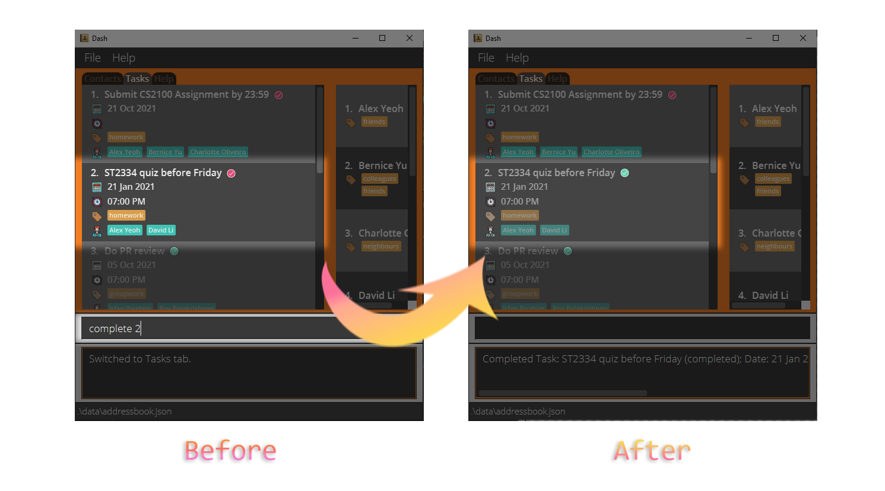

Dash is a personal planner app which offers unparalleled speed using text-based input. It supports both management of
tasks and contacts. Dash is tailored to the needs of university students, who must keep track of a slew of different 
deadlines and commitments. So long as you're a fast typist, Dash provides a blisteringly quick way to stay on top of 
your responsibilities using your keyboard.

This guide was written to help you set up and start using Dash. You can navigate by clicking the table of 
contents [below](#table-of-contents). If you're a new user, the Quick Start guide has all you need to get started. If 
you're an intermediate user looking to get more out of Dash, all supported commands are listed below.

--------------------------------------------------------------------------------------------------------------------

## Table of Contents

* Table of Contents
{:toc}

--------------------------------------------------------------------------------------------------------------------

## <u>Setting up Dash</u>

Whether you're using Windows or macOS, the steps for installation are the same.

video here

1. Ensure you have Java `11` or above installed in your Computer. [Not sure what Java is? Click here!](https://java.com/en/download/help/download_options.html)

2. Download the latest `dash.jar` from here (not available yet).

3. Copy the file to the folder you want to use as the _home folder_ for Dash, which is where your data is stored.

   icon and notes for shortcut here

4. Double-click the file to start the app. Here's what you should see in a few seconds:<br>
   
   
5. That's all you need to do for the setup. To get started writing commands, refer to the Getting Started section 
   [below](#ugetting-startedu).

--------------------------------------------------------------------------------------------------------------------
   
## <u>Getting Started</u>

Dash supports contact and task management in several ways. 
In terms of contact management, Dash allows you to add contacts and fill in details such as their 
phone number, address, and email. 
It even allows you to group them using tags such as "Neighbour" or "Colleague", so you can look them up more easily. 
For task management, Dash allows you to add tasks, tag them, and set deadlines for them. 
Once you're done with a task, you can mark it as complete.

Dash uses a tab system to keep your contacts and tasks separate. 
To view and edit your contact list, you must switch to the contacts tab. 
Similarly, to view and edit your task list, you must switch to the tasks tab. 
Finally, the help tab provides you with a quick summary of Dash's features and how to use them.


Dash uses a Command Line Interface (CLI) to optimize speed. This means that you use mostly your keyboard to interact 
with Dash, instead of relying on your mouse to click on options.    
   
   icons for notes abt cli here, talk about how you cant click on tabs here


Type the command in the command box and press Enter to execute it. e.g. typing **`help`** and pressing Enter will open the help window.<br>
Some example commands you can try:

* **`contacts`** : Switches to the contacts tab

* **`tasks`** : Switches to the tasks tab

* **`add n/Joe`** : Adds a contact named Joe.

* **`clear`** : Deletes all contacts.

* **`exit`** : Exits the app.

6. Refer to the [Features](#features) below for details of each command.

--------------------------------------------------------------------------------------------------------------------

## <u>Features</u>

<div markdown="block" class="alert alert-info">

**:information_source: Notes about the command format:**<br>

* Words in `UPPER_CASE` are the parameters to be supplied by the user.<br>
  e.g. in `add n/NAME`, `NAME` is a parameter which can be used as `add n/John Doe`.

* Items in square brackets are optional.<br>
  e.g. `n/NAME [t/TAG]` can be used as `n/John Doe t/friend` or as `n/John Doe`.

* Items with `…` after them can be used multiple times including zero times.<br>
  e.g. `[t/TAG]…` can be used as ` ` (i.e. 0 times), `t/friend`, `t/friend t/family` etc.

* Parameters can be in any order.<br>
  e.g. if the command specifies `n/NAME p/PHONE_NUMBER`, `p/PHONE_NUMBER n/NAME` is also acceptable.

* If a parameter is expected only once in the command, but you specified it multiple times, only the last occurrence of the parameter will be taken.<br>
  e.g. if you specify `p/12341234 p/56785678`, only `p/56785678` will be taken.

* Extraneous parameters for commands that do not take in parameters (such as `help`, `contacts`, `tasks` and `clear`) will be ignored.<br>
  e.g. if the command specifies `help 123`, it will be interpreted as `help`.

</div>

### <u>General</u>

#### Switch Tabs: [contacts] or [tasks] or [help]

Switches to the specified tab.

Format: ```contacts or tasks or help```

Alternatively, you can switch tabs using shortcuts to save time:

Format: ```c or t or h```

--------------------------------------------------------------------------------------------------------------------

#### Exiting the program: [exit]

Exits the program.

Format: ```exit```

--------------------------------------------------------------------------------------------------------------------

### <u>Contacts (When on contacts tab)</u>


#### Adding contact details of a person: [add]

Adds a contact to the address book. Only name is compulsory during creation.

Format: ```add n/NAME [p/PHONE_NUMBER] [e/EMAIL] [a/ADDRESS] [t/TAG]...```

--------------------------------------------------------------------------------------------------------------------


#### Editing contact details: [edit]

Replaces the contact details of the contact at the chosen index with the new details.

Format: ```edit INDEX [n/NAME] [p/PHONE_NUMBER] [e/EMAIL a/ADDRESS] [t/TAG]...```

* Edits the contact at the specified `INDEX`.
  * The `INDEX` refers to the index number shown in the displayed contact list.
  * The `INDEX` must be a positive integer 1, 2, 3, …​
* At least one of the optional fields must be provided.
* Existing values will be updated to the input values.
* When editing tags, the existing tags of the contact will be removed i.e. adding of tags is not cumulative.
  * To add tags without removing existing tags, refer to the Tag command in the [next section.](#tagging-a-contact-tag)
* You can remove all the contact’s tags by typing `t/` without specifying any tags after it.

--------------------------------------------------------------------------------------------------------------------

#### Tagging a contact: [tag]

Adds extra tags to a contact without wiping the old tags.

Format: ```tag INDEX [t/TAG]...```


--------------------------------------------------------------------------------------------------------------------

#### Deleting a contact: [delete]

Deletes the contact at the chosen index.

Format: ```delete INDEX```

* Deletes the person at the specified `INDEX`.
  * The `INDEX` refers to the index number shown in the contact list.
  * The `INDEX` must be a positive integer i.e. 1, 2, 3, …

--------------------------------------------------------------------------------------------------------------------


#### Finding contact through searching name: [find]

Finds all contacts whose name matches the search term.

Format: ```find NAME```

* The search is case-insensitive. e.g. `find hans` will match `Hans`.
* The order of the keywords does not matter. e.g. `find Hans Bo` will match `Bo Hans`.
* Only the name is searched.
* Contacts matching all keywords will be returned (i.e. AND search). e.g.
  `find Hans Bo` will return only `Hans Bo` and `Hans Bo the Second`. It will not return `Hans Gruber` or `Bo Yang`.

--------------------------------------------------------------------------------------------------------------------


#### Finding contact through searching a specific field: [find]

Finds all contacts whose parameter (number, email, etc) matches the search term.

Format: ```find [p/PHONE_NUMBER] [e/EMAIL] [a/ADDRESS] [t/TAG]...```

* The search is case-insensitive. e.g. `find e/hans@gmail.com` will match `Hans@gmail.com`.
* The order of the keywords does not matter. e.g. `find a/tampines 123` will match Blk 123 Tampines.
* Contacts matching all keywords will be returned (i.e. AND search). e.g. ```find p/86235343 t/CS2101``` will return
  only contacts who both have the given phone number AND the tag `CS2101`.
  It will not return contacts with different phone numbers, even if they both contain the tag `CS2101`.

--------------------------------------------------------------------------------------------------------------------

#### Listing all contacts: [list]

Clears the search results of a find command, showing all contacts.

Format: ```list```

--------------------------------------------------------------------------------------------------------------------

#### Clearing all contacts: [clear]

Deletes all contacts.

Format: ```clear```

--------------------------------------------------------------------------------------------------------------------

### <u>Tasks (When on tasks tab)</u>


#### Adding a task: [add]

Adds a task to the task list. Only task `DESCRIPTION` is compulsory during creation.

Format: ```add d/DESCRIPTION [dt/DATE] [dt/TIME] [dt/DATE, TIME] [p/PERSON INDEX]... [t/TAG]...```

* An explanation of how Date and Time formats work can be found [here.](#handling-date-and-time-of-tasks)
* Assigning people to a task uses the current index of the person on the contacts list, which is shown
  on the side panel to the right.

--------------------------------------------------------------------------------------------------------------------


#### Editing task details: [edit]

Replaces the details of the task at the given `INDEX` with the new details.

Format: ```edit INDEX [d/DESCRIPTION] [dt/DATE] [dt/TIME] [dt/DATE, TIME] [p/PERSON INDEX]... [t/TAG]...```

* Edits the specified task fields at the specified `INDEX`
  * The `INDEX` refers to the index number shown in the task list
  * The `INDEX` must be a positive integer i.e. 1, 2, 3, …
* At least one of the optional fields must be provided.
* Existing values will be updated to the input values.
* When editing tags, the existing tags of the task will be removed i.e. adding of tags is not cumulative.
  * To add tags without removing existing tags, refer to the Tag command in the [next section.](#tagging-a-task-tag)
* You can remove all the task’s tags by typing `t/` without specifying any tags after it.
* An explanation of how Date and Time formats work can be found [here.](#handling-date-and-time-of-tasks)
* Assigning people to a task uses the current index of the person on the contacts list, which is shown
  on the side panel to the right.

--------------------------------------------------------------------------------------------------------------------


#### Tagging a task: [tag]

Adds extra tags to a task without wiping the old tags.

Format: ```tag INDEX [t/TAG]...```

--------------------------------------------------------------------------------------------------------------------


#### Assigning people to a task: [assign]

Assigns extra people to a task without wiping people already assigned.

Format: ```assign INDEX [p/PERSON INDEX]...```

* Assigning people to a task uses the current `INDEX` of the person on the contacts list, which is shown
  on the side panel to the right.

--------------------------------------------------------------------------------------------------------------------


#### Completing a task: [complete]

Completes the task at the chosen index.

Format: ```complete INDEX```

* Completes the task at the specified `INDEX`.
  * The `INDEX` refers to the index number shown in the task list.
  * The `INDEX` must be a positive integer i.e. 1, 2, 3, …

--------------------------------------------------------------------------------------------------------------------

#### Deleting a task: [delete]

Deletes the task at the chosen index.

Format: ```delete INDEX```

* Deletes the task at the specified `INDEX`.
  * The `INDEX` refers to the index number shown in the task list.
  * The `INDEX` must be a positive integer i.e. 1, 2, 3, …

--------------------------------------------------------------------------------------------------------------------


#### Finding task through task description: [find]

Finds all tasks with descriptions that match the search term.

Format: ```find DESCRIPTION```

* The search is case-insensitive. e.g. `find job` will match `Job`.
* The order of the keywords does not matter. e.g. `find home work` will match `work home`
* Only the description field is searched.
* Task descriptions matching all keywords will be returned (i.e. AND search).
  e.g. ```Math Quiz``` will return only ```Math Quiz``` and ```Math Quiz 8```.
  It will not return ```Math Assignment```, ```GEQ Quiz```, or ```This doesn't matter```.

--------------------------------------------------------------------------------------------------------------------


#### Finding task through searching a specific field: [find]

Finds all tasks whose parameter (date/time, people, etc) matches the search term.

Format: ```find [dt/DATE] [dt/TIME] [dt/DATE, TIME] [p/PERSON INDEX]... [t/TAG]...```

* The search is case-insensitive. e.g `find t/HOMEWORK` will match the `homework` tag.
* Tasks matching all keywords will be returned (i.e. AND search). e.g. ```find dt/1900 t/homework``` will return
  only tasks which both have time `1900` AND the tag `homework`.
  It will not return contacts with different times, even if they both contain the tag `homework`.

--------------------------------------------------------------------------------------------------------------------


#### Find all upcoming tasks: [upcoming]

Finds all tasks whose Date/Time are after the current Date/Time.

Format: ```upcoming```

* An explanation of how Date and Time formats work can be found [here.](#handling-date-and-time-of-tasks)

--------------------------------------------------------------------------------------------------------------------

#### Listing all tasks: [list]

Clears the search results of a find/upcoming command, showing all tasks.

Format: ```list```

--------------------------------------------------------------------------------------------------------------------

#### Clearing all tasks: [clear]

Deletes all tasks.

Format: ```clear```

--------------------------------------------------------------------------------------------------------------------

#### <u>Handling Date and Time of tasks</u>

<div markdown="block" class="alert alert-info">
**:information_source: Notes about specifying date and time:**<br>
A task can optionally have a Date, or both a Date and a Time.

`add [dt/DATE] [dt/TIME] [dt/DATE, TIME]`

* When only Date is specified in the `add` command, a task will only have the specified Date.
* When only Time is specified in the `add` command, a task will have today's Date and the specified Time.
* When both Date and Time are specified in the `add` command, a task will have both of the specified Date and Time.

`edit [dt/DATE] [dt/TIME] [dt/DATE, TIME]`

* When only Date is specified in the `edit` command, a task will only have its Date changed to the specified Date.
* When only Time is specified in the `edit` command, a task will only have its Time changed to the specified Time.
* When both Date and Time are specified in the `edit` command, a task will have both of its Date and Time changed to the specified Date and Time.
</div>

#### Date Formats

Format | Example
--------|------------------
**dd/MM/yyyy** | `02/10/2021`
**dd-MM-yyyy** | `02-10-2021`
**yyyy/MM/dd** | `2021/10/02`
**yyyy-MM-dd** | `2021-10-02`
**dd MMM yyyy** | `02 Oct 2021`

#### Time Formats

Format | Example
--------|------------------
**HHmm** | `1300` (01:00 PM in 24-hour notation)
**hh:mm a** | `10:00 PM`, `02:00 AM`


## <u>Command summary</u>

### General

Action | Format
--------|------------------
**Contacts** | `contacts` or `c`
**Tasks** | `tasks` or `t`
**Help** | `help` or `h`
**Exit** | `exit`

### Contact Tab

Action | Format
--------|------------------
**Add** | `add n/NAME [p/PHONE_NUMBER] [e/EMAIL] [a/ADDRESS] [t/TAG]...`
**Edit** | `edit INDEX [n/NAME] [p/PHONE_NUMBER] [e/EMAIL a/ADDRESS] [t/TAG]...`
**Tag** | `tag INDEX [t/TAG]...`
**Delete** | `delete INDEX`
**Find** | `find NAME`
**Find** | `find [p/PHONE_NUMBER] [e/EMAIL] [a/ADDRESS] [t/TAG]`
**List** | `list`
**Clear** | `clear`

### Tasks Tab

Action | Format
--------|------------------
**Add** | `add d/DESCRIPTION [dt/DATE] [dt/TIME] [dt/DATE, TIME] [p/PERSON INDEX]... [t/TAG]...`
**Edit** | `edit INDEX [d/DESCRIPTION] [dt/DATE] [dt/TIME] [dt/DATE, TIME] [p/PERSON INDEX]... [t/TAG]...`
**Tag** | `tag INDEX [t/TAG]...`
**Assign** | `assign INDEX [p/PERSON INDEX]...`
**Complete** | `complete INDEX`
**Delete** | `delete INDEX`
**Find** | `find DESCRIPTION`
**Find** | `find [dt/DATE] [dt/TIME] [dt/DATE, TIME] [p/PERSON INDEX]... [t/TAG]...`
**Upcoming** | `upcoming`
**List** | `list`
**Clear** | `clear`

