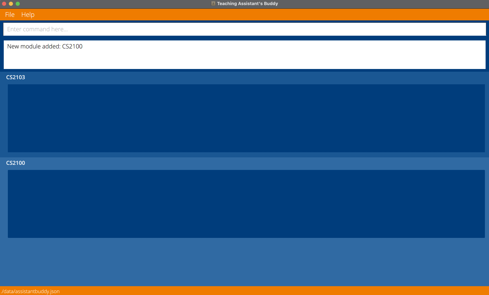
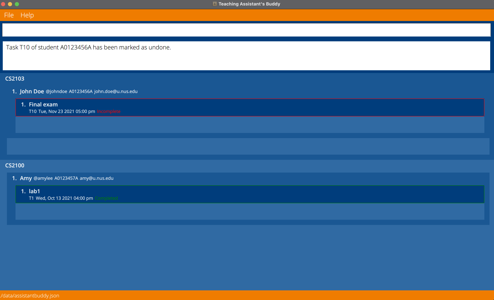
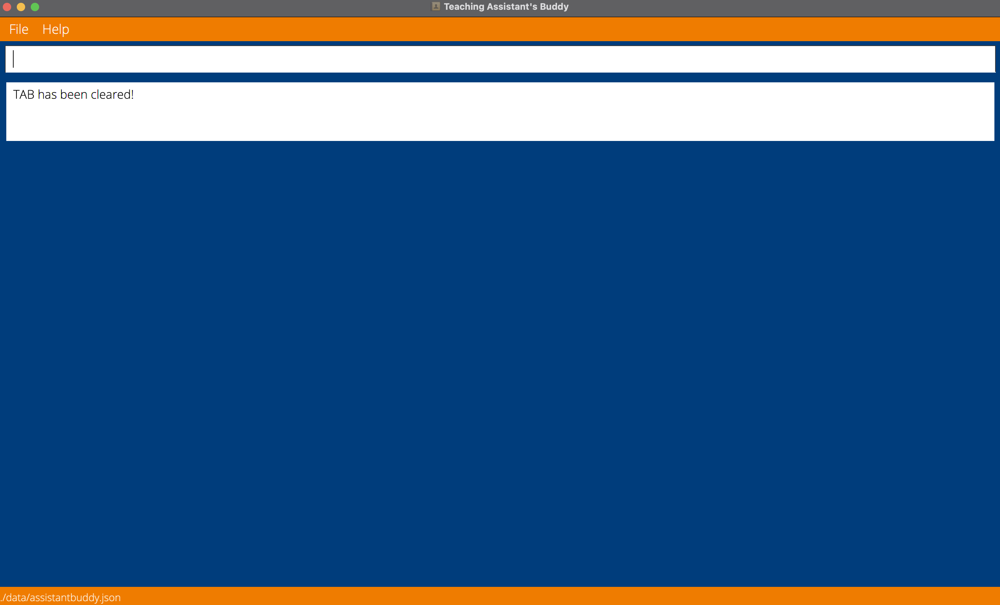

Teaching Assistant’s Buddy (TAB) is an **english-only desktop app for NUS Teaching Assistants to help them manage students, optimized for use via a Command Line Interface** (CLI) while still
having the benefits of a Graphical User Interface (GUI). If you can type fast, TAB can get your student management
tasks done faster than traditional GUI apps.

* Table of Contents
{:toc}

--------------------------------------------------------------------------------------------------------------------

## Quick start

1. Ensure you have Java `11` or above installed in your Computer.

2. Download the latest `tab-v1.4.0.jar` from [here](https://github.com/AY2122S1-CS2103-F09-1/tp/releases/tag/v1.4.0).

3. Copy the file to the folder you want to use as the _home folder_ for TAB.

4. Double-click the file to start the app. The GUI similar to the below should appear in a few seconds. Note how the app contains some sample data. 
   

5. Type the command in the command box and press Enter to execute it. e.g. typing **`add module m/CS2105`** and pressing Enter will add the module CS2105 to TAB. 
   Some example commands you can try:

   * **`add module m/CS2105`** : Adds the module CS2105 to TAB

   * **`add student m/CS2103 i/A1234567A n/John Doe t/@johndoe e/johnd@example.com`** : Adds student John Doe to module CS2105

6. Refer to the [Features](#features) below for details of each command.

7. Refer to the [Command summary](#command-summary) below for a quick table of reference to all valid commands.

8. Refer to the [Parameter summary](#parameter-summary-with-prefix-included) below for a quick table of reference to all valid parameters with their respective permitted characters.

9. Experienced users may choose to edit the saved `.json` data file directly. **However**, invalid/corrupted data files will result in the initialization of a new, blank TAB.

--------------------------------------------------------------------------------------------------------------------

## Features

**:information_source: Notes about the command format:** 

* Lowercase letter(s) followed by a slash are prefixes that prefix a parameter, to be supplied by the user. 
  e.g. in `add module m/<module name>`, `m/` is a prefix that prefixes the `<module name>` parameter.

* Words in `<angle brackets>` are the parameters prefixed by prefixes, to be supplied by the user. 
  e.g. in `add module m/<module name>`, `<module name>` is a parameter which can be used as `add module m/CS2105`.

* Parameters must be prefixed with their specific prefixes. 
  e.g. the command `add module m/CS2105` will add the module CS2105 to TAB, where the commands `add module i/CS2105` and `add module CS2105` will not work.

* Parameters must only contain permitted characters, as listed in the [Parameter summary](#parameter-summary-with-prefix-included) below.

* Optional parameters are denoted in this user guide using square brackets '[]', at least one optional parameter must be present when executing a command. 
  e.g. in `edit task m/<module name> ti/<task id> [a/<edited task name>] [d/<edited task deadline>]`, `a/<edited task name>` and `d/<edited task deadline>` are the optional parameters

* If duplicate parameters are provided, only the latest parameters will be processed.

* Students in different modules with the same student id are treated as different students.

* Tasks can be added to modules without students, but will only become visible after students have been added to the module.

### Add a new module: `add module`

Add a new module to TAB. 
Module name must be an NUS module code, which consists of 2-4 capital letters, followed by 4 numbers, followed by 0-4 capital letters.

Format: `add module m/<module name>`

Examples:
* `add module m/CS2103`: 
  * Add module CS2103 to TAB
* `add module m/CS2100`: 
  * Add module CS2100 to TAB

### Edit a module's name: `edit module`

Edit the name of the module. 
Module name must be an NUS module code, which consists of 2-4 capital letters, followed by 4 numbers, followed by 0-4 capital letters.
The new module name must not be identical to the old module name.

Format: `edit module m/<old module name> mn/<new module name>`

Examples:
* `edit module m/CS2103 mn/CS2105`:
  * Edit the module name of module "CS2103" to "CS2105"

### Delete a module from TAB: `delete module`

Delete the specified module from TAB.
Module name must be an NUS module code, which consists of 2-4 capital letters, followed by 4 numbers, followed by 0-4 capital letters.

Format: `delete module m/<module name>`

Examples:
* `delete module m/CS2103`:
  * Delete module CS2103 from TAB
* `delete module m/CS2100`:
  * Delete module CS2100 from TAB

### Add a student to a specific module: `add student`

Add a new student to the specified module by providing the module name, student id, student name, student tele handle, and the student email. 
Students in different modules with the same student id are treated as different students. 
Also automatically copies over the task list from the module to the student. 
Student id must be a valid NUS student id, which starts with the capital letter 'A', followed by 7 numbers and ends with a capital letter. 
Student name should only contain alphanumeric characters and spaces, and it should not be blank.  
Student tele handle must start with @, and followed by 5-32 characters containing only alphanumeric characters and the underscore '_'. 
Student email must follow the format specified in the [Parameter summary](#parameter-summary-with-prefix-included) section below. 
Student id, student tele handle, and student email must be unique for each student in the same module. 
Duplicate student names are allowed to cater for students who may have the same name.

Format: `add student m/<module name> i/<student id> n/<student name> t/<student tele handle> e/<student email>`

Examples:
* `add student m/CS2103 i/A0123456A n/John Doe t/@johndoe e/john.doe@u.nus.edu`:
  * Add student with id A0123456A to module CS2103
* `add student m/CS2100 i/A0123457A n/Amy t/@amylee e/amy@u.nus.edu`:
  * Add student with id A0123457A to module CS2100

### Edit a student's information: `edit student`

Edit a student's information. 
Students in different modules with the same student id are treated as different students. 
The identity parameter (student id) must be provided. 
At least one optional parameter (name/tele handle/email) must be provided, and only provided parameters will be changed. 
If the optional parameters contain the same information as is already present, the edit command will still be executed successfully. 
Student name should only contain alphanumeric characters and spaces, and it should not be blank.  
Student tele handle must start with @, and followed by 5-32 characters containing only alphanumeric characters and the underscore '_'. 
Student email must follow the format specified in the [Parameter summary](#parameter-summary-with-prefix-included) section below. 

Format: `edit student m/<module name> i/<student id> [n/<edited student name>] [t/<edited student tele handle>] [e/<edited student email>]`

Examples:
* `edit student m/CS2103 i/A0123456A n/John Doe`:
  * Edit the name of the student with id A0123456A in the module CS2103 to John Doe
* `edit student m/CS2100 i/A0123457A t/@amylee e/amy@u.nus.edu`:
  * Edit the tele handle and email of the student with id A0123457A in the module CS2100 to @amylee and amy@u.nus.edu respectively

### Delete a student from a specific module: `delete student`

Delete the specified student from the specified module by providing the module name and the student id.

Format: `delete student m/<module name> i/<student id>`

Examples:
* `delete student m/CS2103 i/A1234567A`:
  * Delete student with id A1234567A from module CS2103’s list of students
* `delete student m/CS2100 i/A7654321A`:
  * Delete student with id A7654321A from module CS2100’s list of students

### Add a new task to a module: `add task`

Add a new task to the specified module by providing the module name, task id, task name, and the task deadline. 
The new task will be added to all students in the module, as well as for future students who are not yet added.
Tasks can be added to modules without students, but will only become visible after student(s) have been added to the module. 
Task id must begin with a capital letter 'T', followed by a positive integer. 
Task name must only contain alphanumeric characters and spaces, and it must not be blank. 
Task deadline can contain either the date and time, or only the date, or only the time. 
Date must be in the form "YYYY-MM-DD". 
Time must be in the form "hh:mm" in 24-hrs format, and will appear in TAB in 12-hrs format.

Format: `add task m/<module name> ti/<task id> a/<task name> d/<task deadline>`

Examples:
* `add task m/CS2103 ti/T1 a/assignment1 d/2021-10-12`:
  * Add the task assignment1 with deadline 'Tue, Oct 12 2021' to module CS2103
* `add task m/CS2100 ti/T1 a/lab1 d/2021-10-13 16:00 `:
  * Add the task lab1 with deadline 'Wed, Oct 13 2021 04:00 pm' to module CS2100

### Edit a task's information: `edit task`

Edit a task's information. 
The task's information will be edited for all students in the module, as well as for future students who are not yet added.
The identity parameters (module name/task id) must be provided. 
At least one optional parameter (name/deadline) must be provided, and only provided parameters will be changed. 
If the optional parameters contain the same information as is already present, the edit command will still be executed successfully. 
Task name must only contain alphanumeric characters and spaces, and it must not be blank. 
Task deadline can contain either the date and time, or only the date, or only the time. 
Date must be in the form "YYYY-MM-DD". 
Time must be in the form "hh:mm" in 24-hrs format, and will appear in TAB in 12-hrs format.

Format: `edit task m/<module name> ti/<task id> [a/<edited task name>] [d/<edited task deadline>]`

Examples:
* `edit task m/CS2103 ti/T10 a/Final exam d/2021-11-23`: 
  * Edit the name and deadline of the task with task id 'T10' to 'Final exam' and 'Tue, Nov 23 2021' respectively
* `edit task m/CS2103 ti/T10 d/2021-11-23 17:00`: 
  * Edit only the deadline of the task with task id 'T10' to 'Tue, Nov 23 2021 5:00 pm'

### Delete a task from a module: `delete task`

Delete the specified task from the specified module by providing the module name and the task id. 
Also delete the task from all the students in that module.

Format: `delete task m/<module name> ti/<task id>`

Examples:
* `delete task m/CS2103 ti/T1`: 
  * Delete the task with task id T1 from CS2103
* `delete task m/CS2105 ti/T2`: 
  * Delete the task with task id T2 from CS2105

### Mark a task as done: `mark done`

Mark the specified task from the specified module under the specified student as done. 
This means that this student has completed this task of this module.

Format: `mark done m/<module name> i/<student id> ti/<task id>`

Examples:
* `mark done m/CS2103 i/A1234567A ti/T1`:
  * Mark the task with id T1 under student with id A1234567A of module CS2103 as done.
  * This means that student A1234567A has completed task T1 of module CS2103.

### Mark a task as undone: `mark undone`

Mark the specified task from the specified module under the specified student as undone. 
This means that this student has not completed this task of this module, possibly to correct a mistake by the TA.

Format: `mark undone m/<module name> i/<student id> ti/<task id>`

Examples:
* `mark undone m/CS2103 i/A1234567A ti/T1`:
  * Mark the task with id T1 under student with id A1234567A of module CS2103 as undone. 
  * Student A1234567A has not completed task T1 of module CS2103 yet. 
  * But for some reason (e.g. human error) the task is marked as done.

### Find a student: `find`

Find the student in the module specified along with the student's information.

Format: `find m/<module name> i/<student id>`

Examples:
* `find m/CS2103 i/A0123456A`: 
  * Find and show student with id A0123456A from module CS2103

### Go to homepage: `home`

Return to the homepage which shows the complete list of modules and students along with their tasks.

Format: `home`

### Clear all information: `clear`

Clear all information stored in the TAB application.

Format: `clear`

:warning: **Caution:** Clearing is irreversible, please use with caution.

### Exit the application: `exit`

Exit the TAB application.

Format: `exit`

### Saving the data

TAB data are saved in the hard disk automatically after any command that changes the data. There is no need to save manually.

### Editing the data file (JSON)

TAB data are saved as a JSON file `[JAR file location]/data/assistantbuddy.json`. Advanced users are welcome to update data directly by editing that data file.

:warning: **Caution:**
If your changes to the data file makes its format invalid, TAB will discard all data and start with an empty data file at the next run.

## FAQ

**Q**: How do I assign tasks to students? 
**A**: Adding the student to the module will automatically add the tasks in the module to the student. 
 
**Q**: How do I see the full TAB after executing the `find` command? 
**A**: Use the `home` command to return to the homepage showing the full TAB.  

--------------------------------------------------------------------------------------------------------------------
## Upcoming Features planned for Future iterations

1. Undo previous commands.
2. Navigate through command history.
3. Edit the information of a Student in multiple modules simultaneously.
4. Remind the user when a Task's deadline draws near.

--------------------------------------------------------------------------------------------------------------------
## Glossary

**Alphanumeric**: Any characters from [0-9], [a-z], or [A-Z]. 
**TAB**: Teaching Assistant's Buddy. 
**Tele handle**: A telegram user handle that must start with @, and followed by 5-32 characters containing only alphanumeric characters and the underscore '_'.

--------------------------------------------------------------------------------------------------------------------
## Command summary

**Optional parameters** are surrounded by square brackets '[]' in Format, and may be omitted from Examples to show they are optional. 

Action | Format, Examples
--------|------------------
**Add Module** | `add module m/<module name>`   e.g., `add module m/CS2103`
**Add Student** | `add student m/<module name> i/<student id> n/<student name> t/<student tele handle> e/<student email>`   e.g., `add student m/CS2103 i/A0123456A n/John Doe t/@johndoe e/john.doe@u.nus.edu`
**Add Task** | `add task m/<module name> ti/<task id> a/<task name> d/<task deadline>`   e.g., `add task m/CS2103 ti/T1 a/assignment1 d/2021-10-12 12:00`
**Clear** | `clear`   e.g., `clear`
**Delete Module** | `delete module m/<module name>`   e.g., `delete module m/CS2103`
**Delete Student** | `delete student m/<module name> i/<student id>`   e.g., `delete student m/CS2103 i/A1234567A`
**Delete Task** | `delete task m/<module name> ti/<task id>`   e.g., `delete task m/CS2103 ti/T1`
**Edit Module** | `edit module m/<old module name> mn/<new module name>`   e.g., `edit module m/CS2103 mn/CS2105`
**Edit Student** | `edit student m/<module name> i/<student id> [n/<edited student name>] [t/<edited student tele handle>] [e/<edited student email>]`   e.g., `edit student m/CS2103 i/A0123457A t/@amylee e/amy@u.nus.edu`
**Edit Task** | `edit task m/<module name> ti/<task id> [a/<edited task name>] [d/<edited task deadline>]`   e.g., `edit task m/CS2103 ti/T10 a/Final exam d/2021-11-23`
**Exit** | `exit`   e.g., `exit`
**Find** | `find m/<module name> i/<student id>`   e.g., `find m/CS2103 i/A0123456A`
**Home** | `home`   e.g., `home`
**Mark Done** | `mark done m/<module name> i/<student id> ti/<task id>`   e.g., `mark done m/CS2103 i/A1234567A ti/T1`
**Mark Undone** | `mark undone m/<module name> i/<student id> ti/<task id>`   e.g., `mark undone m/CS2103 i/A1234567A ti/T1`

--------------------------------------------------------------------------------------------------------------------

## Parameter summary with prefix included

Parameter with prefix | Permitted characters
--------|------------------
`m/<module name>`   `m/<old module name>`   `mn/<new module name>` | Module name must be an NUS module code, which consists of 2-4 capital letters, followed by 4 numbers, followed by 0-4 capital letters.
`i/<student id>` | Student id must be a valid NUS student id, which starts with the capital letter 'A', followed by 7 numbers and ends with a capital letter.
`n/<student name>`   `n/<edited student name>` | Student name should only contain alphanumeric characters and spaces, and it should not be blank. 
`t/<student tele handle>`   `t/<edited student tele handle>` | Student tele handle must start with @, and followed by 5-32 characters containing only alphanumeric characters and the underscore '_'.
`e/<student email>`   `e/<student email>` | Student email must follow the format specified in the [Email format](#email-format)) section below.
`ti/<task id>` | Task id must begin with a capital letter 'T', followed by a positive integer.
`a/<task name>`   `a/<edited task name>` | Task name must only contain alphanumeric characters and spaces, and it must not be blank.
`d/<task deadline>`   `d/<edited task deadline>` | Task deadline can contain either the date and time, or only the date, or only the time.  Date must be in the form "YYYY-MM-DD".  Time must be in the form "hh:mm" in 24-hrs format, and will appear in TAB in 12-hrs format.

### Email format
Emails should be of the format local-part@domain and adhere to the following constraints: 
1. The local-part should only contain alphanumeric characters and these special characters, excluding the parentheses, ( +_.- ). 
2. The local-part may not start or end with any special characters. 
3. This is followed by a '@' and then a domain name. 
4. The domain name is made up of domain labels separated by periods. 
5. The domain name must: 
   5.1. End with a domain label at least 2 characters long. 
   5.2. Have each domain label start and end with alphanumeric characters. 
   5.3. Have each domain label consist of alphanumeric characters, separated only by hyphens, if any.
