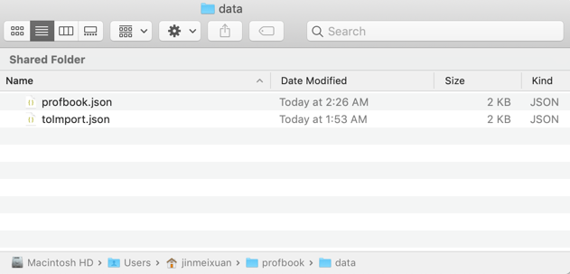
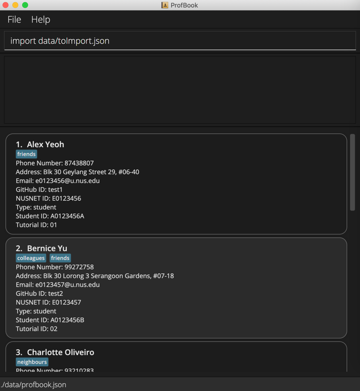

ProfBook is a desktop app for managing contacts, optimized for use via a Command Line Interface
(CLI) while still having the benefits of a Graphical User Interface (GUI). If you can type fast, ProfBook can get your
contact management tasks done faster than traditional GUI apps. ProfBook helps CS2103 Instructors manage both students
and TAs contacts within teams and tutorial groups. It is optimized for CLI users so that tasks can be done in bulk especially when dealing with huge number of contacts

* Table of Contents
{:toc}

--------------------------------------------------------------------------------------------------------------------

## Quick start

1. Ensure you have Java `11` or above installed in your Computer.

1. Download the latest `profbook.jar` from [here](https://github.com/AY2122S1-CS2103-T16-2/tp/releases).

1. Copy the file to the folder you want to use as the _home folder_ for your ProfBook.

1. Double-click the file to start the app. The GUI similar to the below should appear in a few seconds. Note how the app contains some sample data. 
   

1. Type the command in the command box and press Enter to execute it. e.g. typing **`help`** and pressing Enter will open the help window. 
   Some example commands you can try:

   * **`list`** : Lists all contacts.

   * **`add`**`add n/John Doe e/e0123456@u.nus.edu g/john-doe N/e0123456 r/student s/A0123456X T/11 p/98765432 a/311, Clementi Ave 2, #02-25 t/friends t/owesMoney` : Adds a Person with the given details.

   * **`delete`**`3` : Deletes the 3rd contact shown in the current list.

   * **`exit`** : Exits the app.

1. Refer to the [Features](#features) below for details of each command.

--------------------------------------------------------------------------------------------------------------------

## Features

**:information_source: Notes about the command format:** 

* Words in `UPPER_CASE` are the parameters to be supplied by the user. 
  e.g. in `add n/NAME`, `NAME` is a parameter which can be used as `add n/John Doe`.

* Items in square brackets are optional. 
  e.g `n/NAME [t/TAG]` can be used as `n/John Doe t/friend` or as `n/John Doe`.

* Items in curly brackets indicate that one of the items should be chosen, with each item option separated using `|`. 
e.g. `n/NAME {r/student|r/tutor}` can be used as `n/NAME r/student` or `n/NAME r/tutor`.

* Items with `…`​ after them can be used multiple times including zero times. 
  e.g. `[t/TAG]…​` can be used as ` ` (i.e. 0 times), `t/friend`, `t/friend t/family` etc.

* Parameters can be in any order. 
  e.g. if the command specifies `n/NAME p/PHONE_NUMBER`, `p/PHONE_NUMBER n/NAME` is also acceptable.

* If a parameter is expected only once in the command but you specified it multiple times, only the last occurrence of the parameter will be taken. 
  e.g. if you specify `p/12341234 p/56785678`, only `p/56785678` will be taken.

* Extraneous parameters for commands that do not take in parameters (such as `help`, `list`, `exit` and `undo`) will be ignored. 
  e.g. if the command specifies `help 123`, it will be interpreted as `help`.

### Viewing help : `help`

Shows a message explaining how to access the help page.

Format: `help`

### Attribute Summary:

Attribute | Prefix | Format 
------|---|---------------------------------------------------------
**Name** | `n/` | Names should only contain alphanumeric characters and spaces, and it should not be blank | `add n/NAME S/STUDENT_ID N/NUSNet_ID g/GITHUB_ID T/TUTORIAL_ID {r/student \| r/tutor} [p/PHONE_NUMBER] [a/ADDRESS] [t/TAG]...`   e.g., `add n/James Ho p/22224444 e/jamesho@example.com a/123, Clementi Rd, 1234665 t/friend t/colleague`
**Phone** | `p/` | Phone numbers should only contain numbers, and it should be at least 3 digits long
**Email** | `e/` | Emails should be of the format `NUS Network ID@u.nus.edu`
**Address** | `a/` | Addresses can take any values, and it should not be blank
**Tag** | `t/` | Tags names should be alphanumeric
**GITHUB_ID** | `g/` | GitHub ID must be valid ie alphanumeric separated by single dash and it should not start or end with a dash, and it should not be blank
**NUSNet_ID** | `N/` | NUS Network ID must be valid ie starting with e or E followed by 7 digits, and it should not be blank
**Type** | `r/` | Type must be valid ie `student` or `tutor`, and it should not be blank
**STUDENT_ID** | `S/` | Student ID must be valid ie starting with a or A followed by 7 digits and a single alphabet, and it should not be blank
**TUTORIAL_ID** | `T/ `| Tutorial ID must be valid ie a 2 digits, and it should not be blank

### Adding a person: `add`

Adds a person to the address book.

Format: `add n/NAME e/EMAIL s/STUDENT_ID N/NUSNet_ID g/GITHUB_ID T/TUTORIAL_ID {r/student|r/tutor} p/PHONE_NUMBER a/ADDRESS [t/TAG]…​`

* A person cannot be added if he or she already exists in ProfBook, i.e. they are the same person.
* 2 persons are considered similar if they share the exact same name, e.g. if John Doe already exists in ProfBook, `add n/John Doe s/A0222530X N/E0560062 g/meixuanjin T/01 p/98159386 a/John Street, block 456, #01-01` would not add a new John Doe to ProfBook.

:bulb: **Tip:**
A person can have any number of tags (including 0)
Also two persons are same if their names are equal with case sensitivity taken into consideration

Examples:
* `add n/Siddharth Srivastava e/e0638874@u.nus.edu s/A0226588N N/E0638874 g/Siddharth-Sid T/16 r/student p/98765432 a/John street, block 123, #01-01 t/incompleteIp`
* `add n/Rachel Cheah e/e0987654@u.nus.edu s/A0894765F N/E0987654 g/RachelCheah T/16 r/student p/12345678 a/123, Jurong West Ave 6, #08-111`

### Listing all persons : `list`

Shows a list of all persons in the address book.

Format: `list`

### View Statistics of last searched list : `stat`

Shows a count of the tags, type and tutorial ID of the last searched list

Format: `stat`

### Editing a person : `edit`

Edits an existing person in the address book.

Format: `edit INDEX [n/NAME] [e/Email] [s/STUDENT_ID] [N/NUSNet_ID] [g/GITHUB_ID] [T/TUTORIAL_ID] [{r/student|r/tutor}] [p/PHONE_NUMBER] [a/ADDRESS] [t/TAG]…​`

* Edits the person at the specified `INDEX`. The index refers to the index number shown in the displayed person list. The index **must be a positive integer** 1, 2, 3, …​
* At least one of the optional fields must be provided.
* When editing tags, the existing tags of the person will be removed and new tags will be added i.e adding of tags is not cumulative.
* You can remove all the person’s tags by typing `t/` without
    specifying any tags after it.

Examples:
* `edit 1 p/91234567 e/e0123456@u.nus.edu` Edits the phone number and email address of the 1st person to be `91234567` and `e0123456@u.nus.edu` respectively.
* `edit 2 n/Betsy Crower t/` Edits the name of the 2nd person to be `Betsy Crower` and clears all existing tags.
* `edit 1 n/Siddharth Srivastava t/IncompleteIP` Edits the name of the 1st person to be `Siddharth Srivastava` and replaces all existing tags with the tag `IncompleteIP`.

### Locating persons by name: `find`

Finds persons with the given search criteria and value.

Format: `find {n/|s/|N/|g/|T/|r/|p/|a/|t/full/|t/}KEYWORD [MORE_KEYWORDS]`

* The search is case-insensitive. e.g friend will also match Friend or FrIend or FRIEND.
* The order of the keywords does not matter. e.g. `Hans Bo` will match `Bo Hans`.
* All attributes can be searched, by specifying the prefix before the keyword.
* Partial matching can be done for all attributes except Tutorial ID and Role e.g. for name, Han will match Hans.
* Partial matching is performed from the first letter of each value, i.e. `find n/o` will return Charlotte Oliveiro since Oliveiro starts with 'o', but will not return Alex Yeoh or Roy Balakrishnan since they do not contain values starting with the specified key.
* Tags can be searched either using full or partial matching, using `t/full/` for full keyword matching and `t/` for partial matching. The first key to be searched should appear right after the prefix, e.g. `find t/full/friends`.
* Persons matching at least one keyword will be returned (i.e. `OR` search).
 e.g. `Hans Bo` will return `Hans Gruber`, `Bo Yang`

Examples:
* `find n/Hans Bo` will return `Hans Gruber`, and `Bo Yang`
* `find t/friend` will return all the contacts with the tag `friend`
* `find T/01` returns `Alex Yeoh`
* `find t/frien` returns `Alex Yeoh`, `Bernice Yu`
* `find n/alex david` returns `Alex Yeoh`, `David Li` 
  

### Deleting a person : `delete`

Deletes a person or multiple contacts from the address book.

Format: `delete {INDEX | -a | -f}`

* Deletes the person at the specified `INDEX`.
* The index refers to the index number shown in the displayed person list.
* The index **must be a positive integer** 1, 2, 3, …​
* You can use the optional -f argument to clear all contacts from a previous find queries.
* The -a argument deletes all contacts unless specified by the [-f] argument to delete only the previous find query.

Examples:
* `list` followed by `delete 2` deletes the 2nd person in the address book.
* `find n/ Betsy` followed by `delete 1` deletes the 1st person in the results of the `find` command.
* `find n/ Betsy` followed by `delete -f` deletes all the entries of the results of the `find` command.
* `delete -a` deletes all entries in the address book.

### Bulk Tag Persons : `bulk_tag`

Adds a tag to the filtered list of Persons.

Format: `bulk_tag t/TAGNAME [t/TAGNAME…​]`

Examples:
* `find Alice` followed by `bulk_tag t/friends` adds the tag `friends` to all the persons in the filtered person list.
* `bulk_tag t/friends` adds the tag `friends` in the filtered person list.

### Sort contacts by attribute: `sort`

Sort all the contacts in the ProfBook in ascending order.

Format: `sort [ATTRIBUTE] [-r]`

* Contacts will be sorted by the attribute specified, then by name in the case of ties.
* If no attribute is specified, contacts will be sorted by name by default.
* The -r argument sorts the contacts in descending order.
* Sorting by tags will sort by the number of tags attached to the contact.
* Sorting by address is not supported.

Examples:
* `sort` sorts the contacts by name.
* `sort n/` also sorts the contacts by name.
* `sort -r` sorts the contacts by name in descending order.
* `sort T/` sorts the contacts by Tutorial ID.

### Import existing contacts from JSON: `import`

Merges all contacts in a JSON file with the existing contacts in ProfBook.

Format: `import FILENAME`

* Reads the contacts in `FILENAME` and merges them into the existing ProfBook.
* `FILENAME` should refer to the relative filepath from the jar file.

Example:

Step 1: Store the file you wish to import into the data folder of your ProfBook folder.

Step 2: type `import data/FILENAME` into the command line.

Step 3: Done! Now all your imported contacts will appear at the bottom of ProfBook.

### Export filtered contacts to JSON: `export`

Exports all current filtered contacts into a JSON file.

Format: `export FILENAME`

Example:
    `export t01students.json`

* Takes the current filtered list of contacts and writes them into `FILENAME`

### Export emails of filtered contacts to txt: `export email`

Exports the list of contacts of all current filtered contacts into a txt file. This can then be used to create a group of contacts in outlook to mass send emails to.

Format: `exportemail FILENAME`

* Takes the current filtered list of contacts and writes the emails into `FILENAME`

### Undoing a command: `undo`

Undoes a previously executed command. `undo` can reverse any commands executed after the program was last started (except `undo`, `export`, and `exit`).

After executing the `undo` command, the remaining number of commands that can be undid is displayed. For example, the following output shows that there are 2 more commands that can be undid; the `undo` command can be executed 2 more times.

> Undo successful
> Remaining undo count: 2

Format: `undo`

### Redoing a command: `redo`

Re-performs a command that was undone. `redo` can redo any undone command up to the last executed command; executing a command that is not `undo` or `redo` will clear the redo history.

After executing the `redo` command, the remaining number of commands that can be redone is displayed. For example, the following output shows that there are 3 more commands that can be redone.

> Undo successful
> Remaining undo count: 3

Format: `redo`

### Exiting the program : `exit`

Exits the program.

Format: `exit`

### Saving the data

ProfBook data are saved in the hard disk automatically after any command that changes the data. There is no need to save
manually.

### Editing the data file

ProfBook data is saved as a JSON file `[JAR file location]/data/profbook.json`. Advanced users are welcome to update
data directly by editing that data file.

:exclamation: **Caution:**
If your changes to the data file makes its format invalid, ProfBook will discard all data and start with an empty data
file at the next run.

--------------------------------------------------------------------------------------------------------------------

## FAQ

**Q**: How do I transfer my data to another Computer? 
**A**: Install the app in the other computer and overwrite the empty data file it creates with the file that
contains the data of your previous ProfBook home folder.

--------------------------------------------------------------------------------------------------------------------

## Command summary

Action | Format, Examples
--------|------------------
**Add** | `add n/NAME S/STUDENT_ID N/NUSNet_ID g/GITHUB_ID T/TUTORIAL_ID {r/student \| r/tutor} [p/PHONE_NUMBER] [a/ADDRESS] [t/TAG]...`   e.g., `add n/James Ho p/22224444 e/jamesho@example.com a/123, Clementi Rd, 1234665 t/friend t/colleague`
**Delete** | `delete {INDEX \| -a \| -f}`    e.g., `delete 3`
**Edit** | `edit INDEX [n/NAME] [s/STUDENT_ID] [e/EMAIL] [a/ADDRESS] [t/TAG]…​`  e.g.,`edit 2 n/James Lee e/jameslee@example.com`
**Find** | `find FIELD KEYWORD`  e.g., `find name James`
**List** | `list`
**Import** | `import FILENAME`   e.g., `import tutors.json`
**Export** | `export FILENAME`   e.g., `export t01students.json`
**Export Email** | `exportemail FILENAME`   e.g., `exportemail email.txt`
**Undo** | `undo`
**Redo** | `redo`
**Statistics** | `stat`
**Help** | `help`
