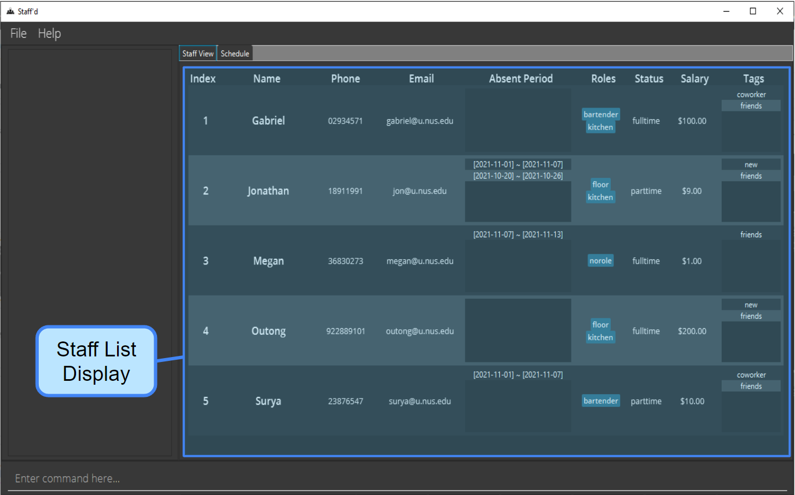

# Introduction to Staff'd
## Overview
Staff’d is a **consolidated staff management platform** designed for **Food & Beverage store managers**, to aid them with the **management of staff details and schedules**. Staff'd is designed for stores with two shifts - a morning shift and afternoon shift, centrally supervised by one manager.

As former or present part-timers in the F&B industry, we understand that managers have a high administrative workload on top of their existing store duties. On top of that, any administrative mistakes or oversights can increase that workload exponentially. To address the aforementioned issues, Staff'd was designed as a consolidated staff management system which can **dramatically decrease administrative mistakes and workload**.

Staff'd is optimized for use via a [**Command Line Interface (CLI)**](#glossary):mag:, and is best suited for users who are adept at typing. A [**Graphical User Interface (GUI)**](#glossary):mag: is also available for ease of visualization and usage. For fast typists, Staff'd can **improve the efficiency of staff management and the ease of handling administrative duties**. After all, any task would be one [Command](#staffd-commands) away! Additionally, the usage of Staff'd requires **no former technical background**, and is **simple to learn**!

The purpose of this User Guide is to aid Staff'd users **optimize their utilizisation of the Staff'd application** and **improve their Staff'd experience**.

 

## Features Overview
### Staff Information Management
Staff'd aids with the **management of staff information**. The basic functions such as the [_adding_](#adding-a-staff--add), [_editing_](#editing-a-staff--edit), and [_deleting_](#deleting-a-staff--delete) of a staff member and their information are easy to implement. In addition, Staff'd supports the **management of additional information** such as their _status_ as a part-time or full-time worker, _salaries_, and [_roles in the store_](#glossary):mag:. Managers can also _tag_ the Staff members with short descriptions if desired. The information is consolidated and displayed in the Staff Tab of Staff'd as shown below.

### Staff Schedule Management
Staff'd also supports the management of **staff schedules**. [_Adding_](#adding-a-shift-to-a-staffs-schedule--addshift), [_swapping_](#swapping-shifts--swapshift), or [_deleting_](#deleting-a-shift-from-a-staff--deleteshift) a shift from a staff's schedule can easily be done. Staff'd consolidates these schedules and displays them in an intuitive manner in the Schedule Tab for ease fo reference, as shown below.

### Staff Salary Calculation
Staff'd supports **salary calculation of staff**. By inputting the salaries and shifts of each staff member, their salaries for the month can be calculated. Staff'd calculates [individual staff statistics](#viewing-individual-staff-statistics--istaff) as well as [overall statistics](#viewing-overall-staff-statistics--stats).

 
    
--------------------------------------------------------------------------------------------------------------------
# Table of Contents

* Table of Contents
{:toc}

 

--------------------------------------------------------------------------------------------------------------------

# Quick Start

## Firing up Staff'd

1. Ensure you have [Java 11](https://java.com/en/download/help/download_options.html) or above installed in your Computer.

1. Download the latest **staffd.jar** from [here](https://github.com/AY2122S1-CS2103T-W11-2/tp/releases).

1. Copy the file to the folder you want to use as the [**home folder**](#glossary):mag: for your Staff’d.

1. Double-click the file to start the app. The GUI similar to the below should appear in a few seconds. If there are any issues opening the file, refer to our [FAQ](#faq). Note how the app contains some sample data.

1. Opening the application creates a [**data folder**](#glossary):mag: inside the home folder. This will contained a **staffd.json** file which is the save file of Staff'd.

 

## Staff'd Commands
A Staff'd Command is an **instruction** that signals Staff’d to perform an operation. It consists of a [Command Word](#glossary):mag: and [Parameters](#glossary):mag:.

**:exclamation: Notes about the command format:** 

* Words in `UPPER_CASE` are the **parameters to be supplied**.
  e.g. in `add n/NAME`, `NAME` is a parameter which can be replaced with a name, such as `add n/John Doe`.

* Items in **square brackets** are **optional**.
  e.g `n/NAME [t/TAG]` can be inputted as `n/John Doe t/friend` or as `n/John Doe`.

* Items with `…` can be used **multiple times**.
  e.g. `[t/TAG]…` can be used as ` ` (i.e. 0 times), `t/friend` (i.e 1 times), `t/friend t/family` etc.

* Parameters can be inputted in **any order**.
  e.g. if the command specifies `n/NAME p/PHONE_NUMBER`, `p/PHONE_NUMBER n/NAME` is also acceptable.

* Parameters must be **inputted with a space** before them.
  e.g. `add n/NAME p/PHONE_NUMBER` is accepted, but `addn/NAME p/PHONE_NUMBER` and `add n/NAMEp/PHONE_NUMBER` will not be accepted.

* If a parameter is expected only once in the command but you specified it multiple times, only the **last occurrence** of the parameter will be used.
  e.g. if you specify `p/12341234 p/56785678`, only `p/56785678` will be used.

* **Extra parameters will be ignored** for commands that do not take in parameters (such as `help`, `list`, `exit` and `clear`).
  e.g. If the command specifies `help 123`, it will be interpreted as `help`.

* Some parameters have additional conditions that must be met when inputted. More information can be found from the [Flag Legend](#flag-legend):triangular_flag_on_post:.

 

## Example Usage of Staff'd
The following is an example of usage of Staff'd by a manager who wishes to **add a new staff member**, and **assign them to the first shift on Monday**.

:information_source: Example Usage of **Adding a Staff** to the Restaurant
 
1. Joe wants to join your restaurant. Joe has the following information:
- Name: Joe
- Phone Number: 98765432
- Email: Joe@example.com
- Status: Full-time worker
- Role: Kitchen staff
1. Add Joe and his information using the [`add`](#adding-a-staff--add) command. `add n/Joe s/fulltime r/kitchen p/98765432 $/1234789 e/Joe@example.com`
1. Type the command in the command box and press Enter to execute it.

   

:information_source: Example Usage of **Adding a Shift** to a Staff
 
1. Joe is going to work the first shift this Monday.
1. Use the [`addShift`](#adding-a-shift-to-a-staffs-schedule--addshift) command to add the staff to the morning shift.   `addShift -n Joe d/monday-0`
1. Type the command in the command box and press Enter to execute it.
1. Enter [`tab`](#changing-tabs--tab) into the command box and press Enter to change tabs to the Schedule Tab.

Refer to the [Features](#features) section for more details of each command.

 

## User Guide Usage

### User Guide Formatting

Formatting Item|Description
---------------|-----------
**Bold** | Emphasizes key points
_Italics_ | Examples to complement descrptions
[Blue Words](#user-guide-formatting) | Links to relevant information
`Code Block` | [Commands](#staffd-commands), Command Parameters, or Command Examples
:information_source: | Extra Information or Usage Examples
:exclamation: | Important information
:triangular_flag_on_post: | Links to [Flag Legend](#flag-legend):triangular_flag_on_post:
:mag: | Links to [Glossary](#glossary):mag:

 

### User Guide Navigation

Item to Clarify | Section in User Guide
--------------- | ---------------------
Navigation | [Table of Contents](#table-of-contents)
Staff'd Command Format | [Staff'd Commands](#staffd-commands)
[GUI](#glossary):mag: | [GUI Breakdown](#gui-breakdown)
Staff'd Command Flags | [Flag Legend](#flag-legend):triangular_flag_on_post:
Technical Terms | [Glossary](#glossary):mag:

 

### User Guide Example Usage
The following is an example of how a user can refer to the User Guide to **learn how to add a new staff member**.

:information_source: Example User Guide Usage on **Adding a New Staff**
 
1. Let's say you want to learn more about how to use Staff'd, and thus you read the [Introduction](#introduction-to-staffd) and [Quick Start Guide](#quick-start) of the User Guide.
1. After opening the app, you want to know how to **add a staff member** into the Staff List. Hence, you refer to the [_**Add Staff Command**_](#adding-a-staff--add) section for more information.
1. You now want to know how to **interpret the format of the command**, and thus you refer to the [**Staff'd Commands**](#staffd-commands) section for more information.
1. You are  still unsure of what the **flags** in the command mean and refer to the [**Flag Legend**](#flag-legend):triangular_flag_on_post: for more information.
1. After understanding the command and flags, you return to the [_Add Staff Command_](#adding-a-staff--add) section. You read through the description of the command and the extra important information on how to use the command.
1. For a clearer understanding on how to use the command, you can **read through the examples** provided.
1. After fully understanding the command, you input the command into the command box of Staff'd, and check the result message in the output box.
  - If the command is successful, a success message will be displayed.
  - If the command is unsuccessful, a help message will be displayed, which the you can use to understand where the error is.
1. At any point, if you want to **clarify any technical terms**, you can refer to the [**Glossary**](#glossary):mag:.

[Return to Table of Contents](#table-of-contents)

 

## GUI Breakdown
### GUI Overview

_Staff’d User Interface - Staff Display_

 

_Staff’d User Interface - Schedule Display_

GUI Component | Description
------------- | -----------
Menu Bar | Contains the **File** and **Help** buttons which contains an Exit button and Staff'd's User Guide respectively.
Tabs | The two tabs are **Staff View** and **Schedule**. Clicking on the desired tab name navigates to that tab.
Output Box | **Displays output messages** from Staff'd. These can be **success messages** indicating an operation has succeeded, or **help messages** to assist in understanding how to use Staff'd.
Command Box | Box where users **type in their inputs**. To submit an input, click the **Enter** button.
Staff Display | **Displays** the **staff information** or **schedule information** depending on which tab you are in.

### Staff Display

_Staff Display Breakdown_

Staff Field | Description
----------- | -----------
Index | The index in the displayed staff list
Name | Staff Name
Phone | Staff Phone Number
Email | Staff Email Address
Absent Period | Periods that a staff will be absent from work
Roles | Staff Roles (Available Roles: `bartender`, `floor`, `kitchen`)
Status | Staff Employment Status (Either `fulltime`, `parttime` and `nostatus`)
Salary | Staff Hourly Pay (in Dollars)
Tags | Additional Staff Information that can be used to reference staff.

For commands relevant to staff details management, refer to [these features](#basic-management-of-staff-details).

 

### Schedule Display

_Schedule Display Breakdown_

For commands relevant to staff schedule management, refer to [these features](#basic-management-of-staff-schedules).

[Return to Table of Contents](#table-of-contents)

 

--------------------------------------------------------------------------------------------------------------------

# Features

## Utility Features

### Viewing help : `help`
Opens a **help window** which contains a link to Staff'd information page.

**Format:** `help`

**Go to:**  
[Table of Contents](#table-of-contents)

 

### Changing tabs : `tab`
Switches between the tabs: **Staff View** and **Schedule View**. Reference images for these tabs can be seen [here](#gui-breakdown).

**Format:** `tab`

**Go to:**  
[Table of Contents](#table-of-contents)

 

### Listing all staffs : `list`

This **resets the displayed staff list** in both the staff view and schedule view to shows all of the current staffs. Also resets the schedule view to show the schedule for all the staffs to the period set by the [`Change`](#viewing-schedule-for-the-week-change) Command.

**Format:** `list`

**Output**:

_Full Staff List is displayed._

**See Also:**[`setRoleReq` Command](#setting-role-requirements--setrolereq)

**Go to:**  
[Table of Contents](#table-of-contents)

 

### Clearing all entries : `clear`

**Clears all staff information** from the Staff List. The [role requirements](#glossary):mag: are also reset.

**Format:** `clear`

**See Also:** [`setRoleReq` Command](#setting-role-requirements--setrolereq)

**Go to:**  
[Table of Contents](#table-of-contents)

 

### Setting Role Requirements : `setRoleReq`

**Sets the role requirements**, which is the minimum number of staff required for each [role](#glossary):mag: in all shifts.
* The role "norole" cannot be set.
* The default role requirements are 0 for all three roles.
* The [Clear Command](#clearing-all-entries--clear) also resets the role requirements to the default.
* Refer to the [Flag Legend](#flag-legend):triangular_flag_on_post: for more information on how to format the input for role requirements.
* The number inputted must be between 0 and 2147483647 (inclusive).
* Multiple roles can be set in the same command, but if the same role is set multiple times in a command, the last instance would be the one set.
* Staff with multiple roles are considered to be fulfilling all of their roles for a shift. For example, if there is one staff working on a shift with the roles _bartender_ and _floor_, and the requirements are 1 for both of those roles, the program considers both roles as fulfilled.

**Format:**

`setRoleReq rr/ROLE-NUMBER_REQUIRED...`

**Examples:**

`setRoleReq rr/floor-3`\
`setRoleReq rr/kitchen-4 rr/bartender-2`

**Output**:

_After changing role requirements: `viewShift` Command notifies if there is a staff shortage for the viewed shift._

**See Also:** [Clear Command](#clearing-all-entries--clear)

**Go to:**  
[Table of Contents](#table-of-contents)  
[Flag Legend](#flag-legend):triangular_flag_on_post:

 

### Saving the data

Staff'd data are saved in the hard disk **automatically** after any command that changes the data. There is no need to save manually.

**Go to:**  
[Table of Contents](#table-of-contents)

 

### Editing the data file

In the [data folder](#glossary):mag:, staff data and [role requirements](#glossary):mag: data is stored. Advanced users can update data directly by **editing that data file**. More information can be found in the [FAQ](#faq).

:exclamation: **Caution:**

If your changes to the data file makes its format invalid, Staff'd will discard all data and start with an empty data file at the next run.

**Go to:**  
[Table of Contents](#table-of-contents)

 

### Exiting the program : `exit`

**Exits** the program.

**Format:** `exit`

**Go to:**  
[Table of Contents](#table-of-contents)

 

## Basic management of Staff Details

### Adding a staff : `add`

**Adds** a staff to the system.

* Upon the addition of a staff, the system provides an `index` for them in the [Staff List](#glossary):mag:, which can be use in other commands, to refer to them.

**Format:** \
`add n/NAME p/PHONE_NUMBER e/EMAIL $/SALARY [s/STATUS] [r/ROLE]... [t/TAG]...`

**Examples:** \
`add n/Joe s/fulltime r/kitchen p/98765432 $/1234789 e/Joe@example.com`  
`add n/Candice s/parttime p/91234567 $/2 e/candice@example.com`

**See Also:**
[`delete` Command](#deleting-a-staff--delete)

**Go to:**  
[Table of Contents](#table-of-contents)
[Flag Legend](#flag-legend):triangular_flag_on_post:

 

### Editing a staff : `edit`

**Edits** an existing staff in the Staff List.

* Edits the staff of the specified `NAME` or `INDEX`.
* At least one of the optional parameters must be provided.
* Existing values will be replaced with the input values. For the role and tag parameters, if an empty parameter (i.e. `r/` or `t/`) is provided, the roles and tags will be cleared respectively.

**Formats:**  
`edit -n NAME [n/NAME] [p/PHONE_NUMBER] [e/EMAIL] [$/SALARY] [s/STATUS] [r/ROLE]... [t/TAG]...`  
`edit -i INDEX [n/NAME] [p/PHONE_NUMBER] [e/EMAIL] [$/SALARY] [s/STATUS] [r/ROLE]... [t/TAG]...`

**Examples:**  
`edit -i 1 p/91234567 e/johndoe@example.com`  
`edit -n Bob p/69696969 e/candicepleasedateme@tinder.com`  
`edit -n Candice r/cook`

**Go to:**  
[Table of Contents](#table-of-contents)  
[Flag Legend](#flag-legend):triangular_flag_on_post:

 

### Deleting a Staff : `delete`

**Deletes** all the specified staff from the Stafflist.

* Requires exactly one of the following [fields](#flag-legend):triangular_flag_on_post:: `NAME`, `ROLE`, `STATUS`, `INDEX`.
* Deletes all the staff that have the provided field.

**Formats:**  
`delete -n NAME`  \
`delete -i INDEX`  
`delete -r ROLE`  
`delete -s STATUS`

**Examples:**  
`delete -n Candice`  
`delete -i 2`  
`delete -r floor`  
`delete -s fulltime`

**See Also:** [`add` Command](#adding-a-staff--add)

**Go to:**  
[Table of Contents](#table-of-contents)  
[Flag Legend](#flag-legend):triangular_flag_on_post:

 

### Finding staff : `find`

**Searches for staff** by the input [fields](#flag-legend):triangular_flag_on_post:.

Searches can be conducted by `Name`, `Index`, or other fields. The search also filters the [displayed Staff List](#glossary):mag: and schedule display to only display the staff that meet the requirements.

**Index Search:**

* Searches for staff by their **index in the staff list**.
* This search is performed on the displayed Staff List.
* Additional fields can be added to search for a more specific staff.
* This search will take priority over the the Name Search if it is present.
* Only single search is supported, and this search will return only the specific Staff at that index.
* If the staff at the index does not satisfy the other conditions, nothing will be done.
* Cannot be done in conjunction with **Name Search**.

**Name Search:**

* Searches for staff whose **names contain any of the given keywords**.
* This search is performed on the overall Staff List.
* Additional fields can be added to search for a more specific staff.
* The search is case-insensitive. (e.g `bob` will match `Bob`).
* The order of the keywords does not matter (e.g. `Candice Dee` will match `Dee Candice`).
* Only full words will be matched (e.g. `Bob` will not match `Boba`).
* Staff matching at least one keyword will be returned (e.g. `John Nathan` will return `John Wick`, `Nathan Tan`).

**Field Search:**

* Searches for staff based on the **provided fields**. At least one field must be provided.
* This search is performed on the overall Staff List.
* Can perform field search alone **or** combined with a name search.
* Staff who have fields that exactly match all the provided fields will be displayed.
* Note that the field search (apart from the Name Field) is case sensitive.

**Format:**  
`find -i INDEX [-p PHONE] [-e EMAIL] [-$ SALARY] [-s STATUS] [-r ROLE...] [-t TAG...]`  
`find [-n NAME_KEYWORDS...] [-p PHONE] [-e EMAIL] [-$ SALARY] [-s STATUS] [-r ROLE...] [-t TAG...]`

**Examples:**  
`find -n John`  
`find -n alex david`  
`find -i 3`  
`find -t Friend`  
`find -t fren -n john`  
`find -n John -t friend` or `find -t friend -n John`

**Output:**

_Only staff matching the fields inputted are displayed in the Staff Display_

_Only staff matching the fields inputted are displayed in the Schedule Display_

**Go to:**  
[Table of Contents](#table-of-contents)  
[Flag Legend](#flag-legend):triangular_flag_on_post:

 

### Marking a staff as absent : `mark`

Marks a specified staff as not working for a specified date.

* The salary for that date will not be included in calculation, depending on the staff's status. By default, the staff is recorded as present for all shifts.
* The format of the input date is in: `YYYY-MM-DD`.
* Takes [0, 1 or 2 date inputs](#flag-legend):triangular_flag_on_post: representing the period to to mark the staff absent.
* Regardless of the presence of shifts, the staff will be marked absent for that period. Staff'd will not indicate any existing shifts in the period provided.
* If a period has previously been marked, it cannot be marked again. However, the absent period can be extended. For instance, if a staff has an absent period from `2021-11-01` to `2021-11-07`, and `mark [staff] da/2021-11-06` is called, the absent period will be extended to be `2021-11-01` to `2021-11-12`.
* If multiple staffs are called in a `mark` command, none of the staff should have an existing overlapping absent period previously marked.

**Formats:**  
Marking a period:

`mark [-i INDEX] [-n NAME] [-p PHONE] [-e EMAIL] [-$ SALARY] [-s STATUS] [-r ROLE]... [da/DATE] [da/END DATE]`

Marking a single date:

`mark -t TAG da/DATE`  
`mark -n NAME da/DATE`

**Examples:**  
`mark -i 1 da/2020-01-03 da/2021-01-03`  
`mark -n Alex Yeoh da/2020-01-03`

**See Also:** [`unmark` Command](#removing-the-absent-mark--unmark)

**Output:**

_Staff’s absent periods updated in Staff View_

_Staff marked as absent in Schedule View_

**Go to:**  
[Table of Contents](#table-of-contents)  
[Flag Legend](#flag-legend):triangular_flag_on_post:

 

### Removing the absent mark : `unmark`

Removes the period that was marked by the [`mark`](#marking-a-staff-as-absent--mark) command.

The format of the input date is in: `YYYY-MM-DD`.

* Takes [0, 1 or 2 date inputs](#flag-legend):triangular_flag_on_post: representing the period to to remove the [`marks`](#marking-a-staff-as-absent--mark).
* If only one date input is provided, the next occurrence of that shift, after the provided date is unmarked. For instance, if the shift is on Monday 1/11/2021, with da/2021-10-27 as the date input, the shift on 1/10/2021 would be unmarked.
* If multiple staffs are called in an `unmark` command, if one of the staff does not have a mark in the period provided, none of the markings will be removed.

**Format:**  
`unmark [-i INDEX] [-n NAME] [-p PHONE] [-e EMAIL] [-$ SALARY] [-s STATUS] [-r ROLE]... [da/DATE] [da/END DATE]`

**Examples:**  
`unmark -i 1 da/2020-01-03 da/2021-01-03`  
`unmark -t friends da/2020-01-03`

**See Also:** [`mark` Command](#marking-a-staff-as-absent--mark)

**Output:**

_Staff’s absent periods updated in Staff View_

_Staff marked as present in Schedule View_

**Go to:**  
[Table of Contents](#table-of-contents)  
[Flag Legend](#flag-legend):triangular_flag_on_post:

 

## Basic Management of Staff Schedules

### Adding a shift to a staff's schedule : `addShift`

Adds a [shift](#flag-legend):triangular_flag_on_post: to a specified staff's schedule.

* Takes [0, 1, or 2 date inputs](#flag-legend):triangular_flag_on_post:. Shifts would be added to all occurances in the period.
* The start time and end time will be set to the [default shift timings](#glossary):mag:

**Formats:**  
`addShift -n NAME d/DAYOFWEEK-SHIFTNUMBER [da/START_DATE] [da/END_DATE]`\
`addShift -i INDEX d/DAYOFWEEK-SHIFTNUMBER [da/START_DATE] [da/END_DATE]`

**Examples:**  
`addShift -n Candice d/Monday-1 da/2021-10-01`\
`addShift -i 1234 d/tuesday-0`

**Notes:**

* The start date and the end date are included in the period.
* The `DAYOFWEEK` stands for the day in the week, such as `monday`, `sunday` etc.
* Field required to specify shifts are not case-sensitive, but must be full.

**See Also:** [`deleteShift` Command](#deleting-a-shift-from-a-staff--deleteshift)

**Go to:**  
[Table of Contents](#table-of-contents)  
[Flag Legend](#flag-legend):triangular_flag_on_post:

 

### Swapping shifts : `swapShift`
Swaps a shift between two staff.

* The two staff are only identified using their [names](#flag-legend):triangular_flag_on_post:. The name provided has to exactly match the name of the staff to swapped.
* Takes [0, 1 or 2 date inputs](#flag-legend):triangular_flag_on_post: representing the period to swap.
* The staff identified using the first name provided, is associated with the first shift. The staff identified using the second name provided, is associated with the second shift.
* This command resets any changes in shift timing done using the [setShiftTime](#updating-the-start-time-and-end-time-for-a-shift--setshifttime) command.

**Formats:**  
`swapShift -n NAME -n NAME d/DAYOFWEEK-SHIFT_NUMBER d/DAYOFWEEK-SHIFT_NUMBER [da/START_DATE] [da/END_DATE]`\
`swapShift -n NAME d/day-shift_number -n NAME d/day-shift_number [da/START_DATE] [da/END_DATE]`

**Examples:**  
`swapShift -n Candice -n Bob d/monday-0 d/tuesday-1 da/2021-10-01`\
`swapShift -n Candice d/monday-0 -n Bob d/tuesday-1`

**See Also:** [`setShiftTime` Command](#updating-the-start-time-and-end-time-for-a-shift--setshifttime)

**Go to:**  
[Table of Contents](#table-of-contents)  
[Flag Legend](#flag-legend):triangular_flag_on_post:

 

### Deleting a shift from a staff : `deleteShift`

Deletes a shift from the staff's schedule.

* The staff can be indicated by their [name or index](#flag-legend):triangular_flag_on_post:.
* Takes [0, 1 or 2 date inputs](#flag-legend):triangular_flag_on_post:. Shifts would be deleted from all occurances in the period.

**Formats:**\
`deleteShift -n NAME d/DAYOFWEEK-shiftNumber [da/START_DATE] [da/END_DATE]`\
`deleteShift -i INDEX d/DAYOFWEEK-shiftNumber [da/START_DATE] [da/END_DATE]`

**Examples:**\
`deleteShift -n Joe d/tuesday-1 da/2021-10-01`\
`deleteShift -i 1278 d/friday-1`

**See Also:** [`addShift` Command](#adding-a-shift-to-a-staffs-schedule--addshift)

**Go to:**  
[Table of Contents](#table-of-contents)  
[Flag Legend](#flag-legend):triangular_flag_on_post:

 

### Viewing all the staff working a shift : `viewShift`

Finds all the staff working at a particular shift.

* The shift can be specified by indicating the day of the week, and either the time or the slot number.
* Takes [0, 1 or 2 date inputs](#flag-legend):triangular_flag_on_post:. Only the first occurance of the shift in the period would be displayed.
* If no date or day input is provided, the current shift is displayed along with a help message of the format of `viewShift`.
* This command filters the [displayed Staff List](#glossary):mag: to only display the staff that are scheduled to work on the shift.
* This command also filters the schedule display to show only the staff that have been assigned to work on the shift.
* Additionally, it filters the schedule display to only show those staff. To return to the full schedule display, use the [`list` command](#listing-all-staffs--list).

**Formats:**  
`viewShift -d DAYOFWEEK-SHIFT_NUMBER [da/START_DATE] [da/END_DATE]`\
`viewShift -ti DAYOFWEEK-TIME [da/START_DATE] [da/END_DATE]`

Note that day refers to the day of the week, and it is case-insensitive. However, it should be spelt in full (e.g. MONDAY instead of Mon).

**Examples:**  
`viewShift -d monday-1 da/2021-10-01`\
`viewShift -d TUESDAY-0`\
`viewShift -ti wednesday-12:00`\
`viewShift -ti THURSDAY-16:30`

**Output:**

_Staff working at the specified shift are displayed in Staff View_

_Staff working at the specified shift are displayed in Schedule View_

**Go to:**  
[Table of Contents](#table-of-contents)  
[Flag Legend](#flag-legend):triangular_flag_on_post:

 

### Viewing schedule for the week: `change`

The change command changes the default period for shift-related commands, when no date(s) are provided.

* This command also changes the days displayed in the [Schedule Display](#glossary):mag: in the schedule tab.
* The default period is the next 7 days inclusive of today.
* Takes only [1 date input](#flag-legend):triangular_flag_on_post:, and displays the next 7 days, inclusive of the date provided.

**Format:**  
`change da/DATE`

**Examples:**  
`change da/2021-12-28`

**Output:**

_Schedule View shows the new specified period._

_Shift-related commands such as `addShift` will be now be added to the new period._

**Go to:**  
[Table of Contents](#table-of-contents)  
[Flag Legend](#flag-legend):triangular_flag_on_post:

 

### Updating the start time and end time for a shift : `setShiftTime`

Updates the start time and end time of a specific shift of a specific staff.

* Time inputs should follow the requirements specified in the Flag Legend: [Shift Time](#flag-legend):triangular_flag_on_post:.
* Takes [0, 1 or 2 date inputs](#flag-legend):triangular_flag_on_post:. The specified shift times would be set for all occurances of the shift in the period would be displayed.
* If the shift does not exist in the staff's schedule, it will be added.

**Formats:**  
`setShiftTime -n NAME d/DAYOFWEEK-SHIFTNUMBER st/START_TIME-END_TIME [da/START_DATE] [da/END_DATE]`\
`setShiftTime -i INDEX d/DAYOFWEEK-SHIFTNUMBER st/START_TIME-END_TIME [da/START_DATE] [da/END_DATE]`

**Examples:**   
`setShiftTime -i 12 d/tuesday-1 st/17:00-21:30`
`setShiftTime -n Candice d/Monday-0 st/10:30-12:30 da/2021-10-01`\
`setShiftTime -i 1 d/wednesday-1 st/17:00-21:30 da/2021-10-01 da/2021-11-01`

**Go to:**  
[Table of Contents](#table-of-contents)  
[Flag Legend](#flag-legend):triangular_flag_on_post:

 

### Viewing individual staff statistics : `istaff`

Displays the staff statistics for an individual staff or a group of staff for the current month.

**Format:**
`istaff [-i INDEX] [-n NAME] [-p PHONE] [-e EMAIL] [-a ADDRESS] [-$ SALARY] [-s STATUS] [-r ROLE]...`

**Examples:**
`istaff -i 1`
`istaff -p 999`
`istaff -n Joe`

**Output:**

_Statistics of the specified staff for the current month of November._

**Go to:**  
[Table of Contents](#table-of-contents)  
[Flag Legend](#flag-legend):triangular_flag_on_post:

 

### Viewing overall staff statistics : `stats`

Displays the staff statistics for all the staff: the total working hours and total salary for this month.

**Format:**
`stats`

**Output:**

_Statistics all the staff for the current month of November._

**Go to:**  
[Table of Contents](#table-of-contents)  
[Flag Legend](#flag-legend):triangular_flag_on_post:

 

--------------------------------------------------------------------------------------------------------------------

# Command summary

Action | Format, Examples
--------|------------------
[**Help**](#viewing-help--help) | `help`
[**Tab**](#changing-tabs--tab) | `tab`
[**List**](#listing-all-staffs--list) | `list`
[**Clear**](#clearing-all-entries--clear) | `clear`
[**Set role requirements**](#setting-role-requirements--setrolereq) | `setRoleReq r/ROLE-NUMBER_REQUIRED...`
[**Exit**](#exiting-the-program--exit) | `exit`
[**Add**](#adding-a-staff--add) | `add n/NAME p/PHONE_NUMBER e/EMAIL $/SALARY [s/STATUS] [r/ROLE]... [t/TAG]...`
[**Edit**](#editing-a-staff--edit) | `edit -n NAME [n/NAME] [p/PHONE_NUMBER] [e/EMAIL] [$/SALARY] [s/STATUS] [r/ROLE]... [t/TAG]...`   `edit -i INDEX [n/NAME] [p/PHONE_NUMBER] [e/EMAIL] [$/SALARY] [s/STATUS] [r/ROLE]... [t/TAG]...`
[**Delete**](#deleting-a-staff--delete) | `delete -n NAME`   `delete -i INDEX`   `delete -r role`   `delete -s STATUS`
[**Find**](#finding-staff--find) | `find -i INDEX [-p PHONE] [-e EMAIL] [-$ SALARY] [-s STATUS] [-r ROLE...] [-t TAG...]` `find [-n NAME_KEYWORDS...] [-p PHONE] [-e EMAIL] [-$ SALARY] [-s STATUS] [-r ROLE...] [-t TAG...]`
[**Mark absent**](#marking-a-staff-as-absent--mark) | `mark [-i INDEX] [-n NAME] [-p PHONE] [-e EMAIL] [-$ SALARY] [-s STATUS] [-r ROLE]... [da/START_DATE] [da/END_DATE]`
[**Remove mark**](#removing-the-absent-mark--unmark) | `unmark [-i INDEX] [-n NAME] [-p PHONE] [-e EMAIL] [-$ SALARY] [-s STATUS] [-r ROLE]... [da/START_DATE] [da/END_DATE]`
[**Add shift to staff**](#adding-a-shift-to-a-staffs-schedule--addshift) | `addShift -n NAME d/DAYOFWEEK-SHIFTNUMBER [da/START_DATE] [da/END_DATE]`   `addShift -i INDEX d/DAYOFWEEK-SHIFTNUMBER [da/START_DATE] [da/END_DATE]`
[**Swap shifts**](#swapping-shifts--swapshift) | `swapShift -n NAME -n NAME d/day-shift_number d/day-shift_number [da/START_DATE] [da/END_DATE]`   `swapShift -n NAME d/day-shift_number -n NAME d/day-shift_number [da/START_DATE] [da/END_DATE]`
[**Delete staff shift**](#deleting-a-shift-from-a-staff--deleteshift) | `deleteShift -n NAME d/DAY-SHIFTNUMBER [da/START_DATE] [da/END_DATE]`   `deleteShift -i INDEX d/DAY-SHIFTNUMBER [da/START_DATE] [da/END_DATE]`
[**View shift**](#viewing-all-the-staff-working-a-shift--viewshift) | `viewShift -d DAY-SHIFTNUMBER [da/START_DATE] [da/END_DATE]`   `viewShift -ti DAY-HH:mm [da/START_DATE] [da/END_DATE]`
[**Change schedule**](#viewing-schedule-for-the-week-change) | `change da/START_DATE`
[**Set shift time**](#updating-the-start-time-and-end-time-for-a-shift--setshifttime) | `setShiftTime -n NAME d/DAYOFWEEK-SHIFTNUMBER st/hh:mm-hh:mm [da/START_DATE] [da/END_DATE]`   `setShiftTime -i INDEX d/DAYOFWEEK-SHIFTNUMBER st/hh:mm-hh:mm [da/START_DATE] [da/END_DATE]`
[**Individual staff statistics**](#viewing-individual-staff-statistics--istaff) | `istaff [-i INDEX] [-n NAME] [-p PHONE] [-e EMAIL] [-$ SALARY] [-s STATUS] [-r ROLE]...`
[**Total staff statistics**](#viewing-overall-staff-statistics--stats) | `stats`

 

--------------------------------------------------------------------------------------------------------------------
# Flag Legend
These flags are used for identifying fields and parameters in a command. The tables below are provided for reference

Flags for Specific Fields|Flags for Lookup|Name|Description/Conditions
-----|-----|-----|----------
i/|-i|Index|{::nomarkdown}<ul><li>Represents the corresponding staff index in the displayed staff list.{:/}
n/|-n|Name|{::nomarkdown}<ul><li>Represents the name of the staff.<li><b>Compulsory</b> field. <li>Names are case sensitive, so _john_ and _John_ are regarded as two different people.<li>Duplicate names are not accepted.{:/}
p/|-p|Phone Number|{::nomarkdown}<ul><li>Represents the <b>phone number</b> of the staff.<li><b>Compulsory</b> field. <li>Phone number must be longer than 3 digits, containing only numeric characters.{:/}
e/|-e|Email|{::nomarkdown}<ul><li>Represents the <b>email</b> of a staff. <li><b>Compulsory</b> field. <li>Must be of format <code>local-part@domain</code>. <li>The <code>local-part</code> must only contain alphanumeric characters, excluding and the special characters "<code>+ _ . -</code>", but cannot start or end with any special character. <li>The <code>domain</code> is made up of <code>domain labels</code>  separated by periods. It must end with a <code>domain label</code> which is at least 2 characters long. <li>The <code>domain labels</code> must consist of alphanumeric characters, separated only by hyphens, if any, and they must start and end with alphanumeric characters.{:/}
r/|-r|Role|{::nomarkdown}<ul><li>Represents the <b>responsibilities</b> that a staff member has in the store.<li>The accepted roles are: <code>floor</code>, <code>kitchen</code>, or <code>bartender</code>. <li>The absence of a role would be denoted as "norole".{:/}
t/|-t|Tags|{::nomarkdown}<ul><li>Tags are used to <b>store additional information</b> about staff, and can be used to <b>reference staff</b>.<li>Tags are sorted in alphabetical order.{:/}
s/|-s|Status|{::nomarkdown}<ul><li>Represents the <b>employment status</b> of a staff.<li>The accepted statuses are: <code>fulltime</code>, <code>partime</code> or <code>nostatus</code>.{:/}
$/|-$|Salary (per hour)|{::nomarkdown}<ul><li>Represents the <b>salary</b> of a staff.<li><b>Compulsory</b> field. <li>Must be a non-negative number representing the <b>staff's pay in dollars</b>. <li>Cents can be added, by adding a period, followed by the cents, which then also has to be a positive number of either 1 or 2 digits. <li>The maximum salary that can be set is $9999.99.{:/}
d/|-d|Shift (for shift related commands)|{::nomarkdown}<ul><li>Represents a <b>shift</b> of a staff.<li>Represented as a <code>DAYOFWEEK-SLOT_NUMBER</code>. <li><code>DAYOFWEEK</code> refers to the <b>day of the week</b>, such as _monday_ or _saturday_. The <code>DAYOFWEEK</code> is case insensitive.<li><code>SLOT_NUMBER</code> refers to either the first or second shift. The first shift (morning) is represented with <code>0</code>, and the second shift (afternoon) is represented with <code>1</code>.<li>Example: <code>TUESDAY-0</code> and <code>wednesday-1</code> are valid shifts.{:/}
rr/|NA|Role Requirements|{::nomarkdown}<ul><li>Represents the <b>requirements of each role</b>. <li>When  used as an input, it is represented as <code>ROLE-REQUIRED_NUMBER</code>. <li> The required number refers to the number of staff of that role required per shift.{:/}
da/|NA|Date|{::nomarkdown}<ul><li>Dates must be of format <code>YYYY-MM-DD</code> when provided.</li><li><b>When no dates are provided:</b> the resultant period for the command is the next 7 days, inclusive of the current one.</li><li><b>When one date is provided:</b> the resultant period for the command is the next following the one provided, inclusive.</li><li><b>When two dates are provided:</b> the resultant period for the command is between the first and the second date provided, inclusive. The first date provided has to be before or equal to the second date.</li><li>To specify a single date, provide two dates representing same date.</li>{:/}
st/|NA| Shift Time |{::nomarkdown}<ul><li>Shift time must have start and end time.</li><li>Time is in the format of HH:mm. (e.g. 10:30 represents 10.30 am) </li><li>Start and end time must have a dash to delimit the two. (e.g. 10:30-11:30 represents 10.30 am to 11.30 a.m)</li>{:/}
NA |-ti|Shift (by Time)|{::nomarkdown}<ul><li>Represents in the format <code>DAYOFWEEK-TIME</code> <li>The time must be of format <code>HH:mm</code>, and follows the 24hr format.{:/}

:exclamation: Note: "NA" means that the tag does not exist.

 

--------------------------------------------------------------------------------------------------------------------

# FAQ

**Q**: What do I do if double-clicking isn’t opening the app?
**A**: Open your [Command Prompt](#glossary):mag: (Windows) or your [Terminal](#glossary):mag: (MacOS, Linux) and navigate to the folder containing the **staff'd.jar** file. Run the file by using the command `java -jar staffd.jar`. On an Linux Operating System, it might be necessary to run `chmod +x staffd.jar` on Terminal so that double-clicking opens the application.

**Q**: Why is the staff information being truncated in the staff list?
**A**: The staff information exceeded the character limit of that field! To access the full information, the [`find` command](#finding-staff--find) can be used.

**Q**: How do I transfer my data to another Computer?
**A**: Install the app in the other computer and overwrite the empty data file it creates with the save file that contains the data of your previous Staff'd.

**Q**: Where is the save file located?
**A**: In the [**data folder**](#glossary):mag: located in the [**home folder**](#glossary):mag: called **staffd.json**. The save file for the [**role requirements**](#glossary):mag: is also located in the data folder, and is called **RoleReq.txt**.

[Return to Table of Contents](#table-of-contents)

 

--------------------------------------------------------------------------------------------------------------------

# Glossary

Name | Explanation
--------|------------------
**Command** | In Staff'd, it is an instruction that signals Staff'd to perform a function. It consists of a **Command Word** and **Parameters**. Refer [here](#staffd-commands) for more examples on Staff'd commands.
**Command Line Interface (CLI)** | A **text-based user interface** where users interact with the software by typing in text commands.
**Command Prompt** | A **text-based user interface** for **Windows**. It can be used to execute text commands. To open the Command Prompt, navigate to the Start Menu's Search Bar, and search `cmd`. The first option is the Command Prompt, and should be clicked to open it.
**Command Word** | A **word** used in a Staff'd Command to **identify the type of operation** being conducted. It is commonly used with Parameters.
**Data Folder** | The **folder** containing the **save file** of Staff'd (which is the **staffd.json** file).
**Field**| The **information categories** of a Staff saved in the Staff List.
**Home Folder** | The **folder** containing the **application** (which is the **staffd.jar** file).
**Index** | The **number corresponding to a staff** in the **displayed staff list**.
**Graphical User Interface (GUI)** | A **visual-based user interface** where users interact with the software through graphical icons and pictures.
**Parameters** | **Additional information** to supplement a Command Word in a **Command**. For example, `n/NAME` is a name parameter.
**Staff Role Requirements** | The **minimum number of staff required** for **each role** for a shift.
**Staff List** | The **list of staff members**. Staff'd has an **overall list** with all the members, and a **displayed staff list** which can be filtered by other commands.
**Terminal** | A **text-based user interface** for **Linux Operating Systems**. It can be used to execute text commands.
**User Interface** | The use of **input devices and software** by which a **user and computer interacts**.
**Default shift timings** | The default shift timings are from 10:00 to 16:00 for morning shift and 16:00 to 22:00 for afternoon shift.

 

[Return to Table of Contents](#table-of-contents)
