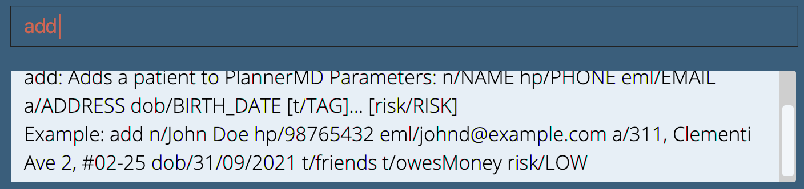
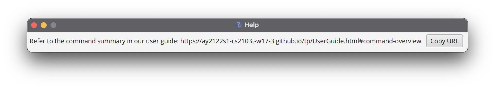

PlannerMD is an easy-to-use command-line interface (CLI) application that helps clinic receptionists seamlessly integrate the daily appointments and the unique requirements of each patient into a single application. PlannerMD expedites the manual processes found in a clinic and saves clinics receptionists plenty of time while also reducing human error.

If you are new, this guide is meant to introduce you to PlannerMD as well as guide you through our features and how to use them. If you are already 
experienced with PlannerMD, we hope that our comprehensive user guide will help clarify any queries you have! Refer to our [table of contents](#toc) to see what
we have to offer!

## Common Syntax
Take note of some syntax we will frequently use throughout the User Guide:

| Syntax | Description |
|--------|------------|
| **Bold** | keywords |
| :bulb: **Tip:** | Useful tips |
| :exclamation: **Caution:** | Possible pitfalls |
| :information_source: **Note:** | Noteworthy information |
| `markdown` | Commands or examples |
| Format: | the format to write the commands in the application|

## Table Of Contents 
* [Quick start](#quick-start)
* [What is Command-line Interface (CLI)?](#what-is-cli)
* [Features](#features)
  * [General](#general)
    * [help](#help)
    * [toggle](#toggle)
    * [clear](#clear)
    * [exit](#exit)
  * [Managing Patients](#managing-patients)
    * [add](#add-patient)
    * [list](#list-patient)
    * [edit](#edit-patient)
    * [remark](#remark-patient)
    * [find](#find-patient)
    * [delete](#delete-patient)
    * [Managing Tags](#managing-patient-tag)
        * [add](#add-patient-tag)
        * [delete](#delete-patient-tag)
  * [Managing Doctors](#managing-doctors)
      * [add](#add-doctor)
      * [list](#list-doctor)
      * [edit](#edit-doctor)
      * [remark](#remark-doctor)
      * [find](#find-doctor)
      * [delete](#delete-doctor)
      * [Managing Tags](#managing-doctor-tag)
          * [add](#add-doctor-tag)
          * [delete](#delete-doctor-tag)
  * [Managing Appointments](#managing-appointments)
    * [add](#add-appointment)
    * [edit](#edit-appointment)
    * [delete](#delete-appointment)
    * [filter](#find-appointments)
    * [filtering upcoming](#upcoming-appointments)
    * [list](#list-appointments)
* [Save data](#save-data)
* [Edit data](#edit-data)
* [FAQs](#faq)
* [Command Summary](#command-summary)

--------------------------------------------------------------------------------------------------------------------

## Quick start 

1. Ensure you have Java `11` or above installed in your Computer. If you haven't installed, refer to these guides based on your operating software: \
   [Windows](https://www.codejava.net/java-se/download-and-install-java-11-openjdk-and-oracle-jdk) \
   [macOS](https://docs.oracle.com/en/java/javase/11/install/installation-jdk-macos.html#GUID-F575EB4A-70D3-4AB4-A20E-DBE95171AB5F)

2. Download the latest `plannermd.jar` from [here](https://github.com/AY2122S1-CS2103T-T11-3/tp/releases).

3. Copy the file to the folder you want to use as the _home folder_ for plannerMD.

4. Double-click the file to start the app. The GUI similar to the image displayed below should appear in a few seconds. Note how the app contains some sample data. 

    
 
5. Type the command in the command box and press Enter to execute it. e.g. typing **`help`** and pressing Enter will open the help window. 
   Some example commands you can try:

   * **`list`** : Lists all patients.

   * **`add`**`n/John Doe hp/98765432 eml/johnd@example.com a/John street, block 123, #01-01 dob/25/12/1999` : Adds a patient named `John Doe` to the application.

   * **`edit`**`3 a/Bob street, block 123, #01-01 dob/25/12/1964` : Edits 3rd patient's address and date of birth.

   * **`delete`**`2` : Deletes the 2nd patient as shown in the current list.

   * **`IWANTTOCLEAREVERYTHING`** : Deletes all patients, doctors and appointments.
   
   * **`toggle`** : Toggles between the patients and doctors tabs.

   * **`exit`** : Exits the app.

6. Refer to the [Features](#features) below for details of each command.

--------------------------------------------------------------------------------------------------------------------
## What is Command-line Interface (CLI?) 
A Command-line interface helps process commands that you enter through text. Instead of clicking buttons, to execute a certain command,
you would type the command in text in the command box, and the programme will execute your command, and reflect its response in the response box.

### Why CLI?
We want to give you an experience that is as similar as writing with pen-and-paper, to help you clinic receptionists adapt easily. With a CLI,
you can imagine the keyboard as your pen, and a command box as your paper. To clinic receptionists who are already using a different application
with a Graphical User Interface (GUI), our application removes the need to constantly access your mouse and speed up your arduous process of managing
patients, doctors and appointments.

### How to use a CLI?
Just type your command in the command box with the format we have provided. Simple as that!

:bulb: **Tip:**
You can type the command keyword and leave the details blank and click enter to access the template so you don't have to remember
all the details! 

--------------------------------------------------------------------------------------------------------------------

## Features <a name="features"/>

**Notes about the command format** 
* `Format:` shows the format to type the respective commands

* Words in `UPPER_CASE` are the parameters to be supplied by the user. 
  e.g. in `add n/NAME`, `NAME` is a parameter which can be used as `add n/John Doe`.

* Items in square brackets are optional. 
  e.g `n/NAME [t/TAG]` can be used as `n/John Doe t/friend` or as `n/John Doe`.

* Items with `…`​ after them can be used multiple times including zero times. 
  e.g. `[t/TAG]…​` can be used as ` ` (i.e. 0 times), `t/friend`, `t/friend t/family` etc.

* Parameters can be in any order. 
  e.g. if the command specifies `n/NAME hp/PHONE_NUMBER`, `hp/PHONE_NUMBER n/NAME` is also acceptable.

* If a parameter is expected only once in the command, but you specified it multiple times, only the last occurrence of the parameter will be taken. 
  e.g. if you specify `hp/12341234 hp/56785678`, only `hp/56785678` will be taken.

* Extraneous parameters for commands that do not take in parameters (such as `help`, `list`, `exit` and `IWANTTOCLEAREVERYTHING`) will be ignored. 
  e.g. if the command specifies `help 123`, it will be interpreted as `help`.

### Viewing help : `help` <a name="help"/>

Shows a message explaining how to access the help page.

Alternatively, you can click on the help button in the top left
corner.

Format: `help`

---

### Toggling between tabs: `toggle` <a name="toggle"/>

Toggles between `Patients` and `Doctors` tab. 
Commands enters only applies on the currently displayed tab. (eg. If the currently displayed tab is the patient tab, the `add` command will add a patient to the records.)

Format: `toggle`
* toggles to the other tab (eg. if the currently displayed tab is the patient tab, `toggle` switches the displayed tab to the doctor tab)

### Clearing all entries : `IWANTTOCLEAREVERYTHING` <a name="clear"/>

Clears all patient, doctor and appointment entries.

Format: `IWANTTOCLEAREVERYTHING`

:exclamation: **Caution:**
This command clears ALL patient, doctor and appointment records that you have on the application.
Remember to do a backup in case you may need the data again. 

Examples:
Typing `IWANTTOCLEAREVERYTHING` removes all patient, doctor and appointment entries.

### Exiting the program : `exit` <a name="exit"/>

Exits the program.

Format: `exit`

---

## Managing Patients <a name="managing-patients"/>

:information_source: **Note:**
To use commands for managing patients, toggle the displayed list to the patient list using the toggle command.

More information about the `toggle` command [here](#toggle).

### Adding a patient: `add` <a name="add-patient"/>

Adds a patient to the patient records.

Format: `add n/NAME hp/PHONE_NUMBER eml/EMAIL a/ADDRESS dob/DATE_OF_BIRTH [t/TAG]…​ [risk/RISK]`

:exclamation: **Caution:**
Duplicate patients cannot be added! A duplicate patient is one with the same name, phone number and email as an existing patient.

:bulb: **Tip:**
A patient can have any number of tags (including 0) 
:bulb: **Tip:**
The risk is optional and should be either HIGH, MEDIUM or LOW.

Examples:
* `add n/John Doe hp/98765432 eml/johnd@example.com a/John street, block 123, #01-01 dob/20/07/1964`
* `add n/Betsy Crowe t/friend eml/betsycrowe@example.com a/Bukit Merah hp/1234567 dob/20/07/1964 t/COVID risk/HIGH` 

### Listing all patients : `list` <a name="list-patient"/>

Shows a list of all patients in the patient records.

Format: `list`

### Editing a patient's information : `edit` <a name="edit-patient"/>

Edits an existing patient in the patient records.

Format: `edit INDEX [n/NAME] [hp/PHONE] [eml/EMAIL] [a/ADDRESS] [dob/DATE_OF_BIRTH] [t/TAG]…​ [risk/RISK]`

* Edits the patient at the specified `INDEX`. The index refers to the index number shown in the displayed patient list.
* The index **must be a positive integer** 1, 2, 3, …​
* At least one of the optional fields must be provided.
* Existing values will be updated to the input values.
* When editing tags, the existing tags of the patient will be removed i.e adding of tags is not cumulative.
* You can remove all the patient’s tags by typing `t/` without
  specifying any tags after it.
* The risk should be either `HIGH`, `MEDIUM`, or `LOW`. If an empty risk is provided, eg. `risk/`, the risk of the patient will be removed.

Examples:
*  `edit 1 hp/91234567 eml/johndoe@example.com` Edits the phone number and email address of the 1st patient to be `91234567` and `johndoe@example.com` respectively.
*  `edit 2 n/Betsy Crower dob/20/07/1964 risk/ t/` Edits the name and date of birth of the 2nd patient to be `Betsy Crower` and `20/07/1964` respectively, and clears all existing tags and risk.

### Adding a remark to a patient's information : `remark` <a name="remark-patient"/>

Adds a remark to an existing patient in the patient records.

Format: `remark INDEX r/REMARK`

* Edits the patient at the specified `INDEX`. The index refers to the index number shown in the displayed patient list.
* The index **must be a positive integer** 1, 2, 3, …​
* Existing remark will be updated to the input remark.

Examples:
*  `remark 1 r/` edits the remark of the 1st patient to be blank.
*  `remark 2 r/Chronic diabetic, monthly insulin pick up` edits the remark of the 2nd patient to be `Chronic diabetic, monthly insulin pick up`.

### Locating patients by name: `find` <a name="find-patient"/>

Finds patients whose names contain any of the given keywords

Format: `find KEYWORD [MORE_KEYWORDS]`

* The search is case-insensitive. e.g `john` will match `John`
* The order of the keywords does not matter. e.g. `John Lee` will match `Lee
  John`
* Only the name is searched.
* Only full words will be matched e.g. `Han` will not match `Hans`
* Patients matching at least one keyword will be returned (i.e. `OR` search).
  e.g. `John` will return `John Lee`, `John Tan`

Examples:
* `find John` returns `john` and `John Doe`
* `find alex david` returns `Alex Yeoh`, `David Li` 
  

### Deleting a patient : `delete` <a name="delete-patient"/>

Deletes a patient record from the list.

Format: `delete INDEX`

* Deletes the patient at the specified `INDEX`.
* The index refers to the index number shown in the displayed patient list.
* The index **must be a positive integer** 1, 2, 3, …​

Examples:
* `list` followed by `delete 2` deletes the 2nd patient in the patient records.
* `find Betsy` followed by `delete 1` deletes the 1st patient in the results of the `find` command.

### Managing Tags `tag` <a name="managing-patient-tag"/>

### Adding tags to a patient: `tag -a` <a name="add-patient-tag"/>

Adds a new tag to a patient’s record.

Format: `tag -a INDEX t/TAG`

* Adds a `TAG` to the patient at the specified `INDEX`. The index refers to the index number shown in the displayed patient list.
* The index must be a **positive integer** 1, 2, 3, ...
* Tags must be alphanumeric. Whitespace and special characters are not allowed (eg. `t/covid!`, `t/covid 19` are invalid tags).
* Adding a tag will not overwrite existing tags.

Examples:
`tag -a 1 t/Covid` tags the first patient with a *Covid* tag.

### Deleting a patient's tags : `tag -d` <a name="delete-patient-tag"/>

Deletes a tag from a patient's record.

Format: `tag -d INDEX t/TAG`

* Deletes the `TAG` from the patient at the specified `INDEX`.
* The `TAG` must match one of the patient's existing tags.
* Deleting non-existent tags would not be allowed.

Examples:
* `tag -d 1 t/Covid` deletes the *Covid* tag from first patient.

---

## Managing Doctors <a name="managing-doctors"/>

:information_source: **Note:**
To use commands for managing doctors, toggle the displayed list to the doctor list using the toggle command.

More information about the `toggle` command [here](#toggle).

### Adding a doctor: `add` <a name="add-doctor"/>

Adds a doctor to the doctor records.

Format: `add n/NAME hp/PHONE_NUMBER eml/EMAIL a/ADDRESS dob/DATE_OF_BIRTH [t/TAG]…​`

:exclamation: **Caution:**
Duplicate doctors cannot be added! A duplicate doctor is one with the same name, phone number and email as an existing doctor.

:bulb: **Tip:**
A doctor can have any number of tags (including 0).

Examples:
* `add n/John Doe hp/98765432 eml/johnd@example.com a/John street, block 123, #01-01 dob/20/07/1964`
* `add n/Betsy Crowe t/friend eml/betsycrowe@example.com a/Bukit Merah hp/1234567 dob/20/07/1964 t/experienced`

### Listing all doctors : `list` <a name="list-doctor"/>

Shows a list of all doctors in the doctor records.

Format: `list`

### Editing a doctor's information : `edit` <a name="edit-doctor"/>

Edits an existing doctor in the doctor records.

Format: `edit INDEX [n/NAME] [hp/PHONE] [eml/EMAIL] [a/ADDRESS] [dob/DATE_OF_BIRTH] [t/TAG]…​`

* Edits the doctor at the specified `INDEX`. The index refers to the index number shown in the displayed doctor list.
* The index **must be a positive integer** 1, 2, 3, …​
* At least one of the optional fields must be provided.
* Existing values will be updated to the input values.
* When editing tags, the existing tags of the doctor will be removed i.e adding of tags is not cumulative.
* You can remove all the doctor’s tags by typing `t/` without
  specifying any tags after it.

Examples:
* `edit 1 hp/91234567 eml/johndoe@example.com` Edits the phone number and email address of the 1st doctor to be `91234567` and `johndoe@example.com` respectively.
* `edit 2 n/Betsy Crower dob/20/07/1964 t/` Edits the name and date of birth of the 2nd doctor to be `Betsy Crower` and `20/07/1964` respectively, and clears all existing tags.
* After executing `edit 2 n/Betsy Crower dob/20/07/1964 t/`:

### Adding a remark to a doctor's information : `remark` <a name="remark-doctor"/>

Adds a remark to an existing doctor in the doctor records.

Format: `remark INDEX r/REMARK`

* Edits the doctor at the specified `INDEX`. The index refers to the index number shown in the displayed doctor list.
* The index **must be a positive integer** 1, 2, 3, …​
* Existing remark will be updated to the input remark.

Examples:
*  `remark 1 r/` Edits the remark of the 1st doctor to be blank.
*  `remark 2 r/Comes at 8am` Edits the remark of the 2nd doctor to be `Comes at 8am`.

### Locating doctors by name: `find` <a name="find-doctor"/>

Finds doctors whose names contain any of the given keywords

Format: `find KEYWORD [MORE_KEYWORDS]`

* The search is case-insensitive. e.g `john` will match `John`
* The order of the keywords does not matter. e.g. `John Lee` will match `Lee
  John`
* Only the name is searched.
* Only full words will be matched e.g. `Han` will not match `Hans`
* Doctors matching at least one keyword will be returned (i.e. `OR` search).
  e.g. `John` will return `John Lee`, `John Tan`

Examples:
* `find John` returns `john` and `John Doe`
* `find alex david` returns `Alex Yeoh`, `David Li` 

### Deleting a doctor : `delete` <a name="delete-doctor"/>

Deletes a doctor record from the list.

Format: `delete INDEX`

* Deletes the doctor at the specified `INDEX`.
* The index refers to the index number shown in the displayed doctor list.
* The index **must be a positive integer** 1, 2, 3, …​

Examples:
* `list` followed by `delete 2` deletes the 2nd doctor in the doctor records.
* `find Betsy` followed by `delete 1` deletes the 1st doctor in the results of the `find` command.

### Managing Tags `tag` <a name="managing-doctor-tag"/>

### Adding tags to a doctor: `tag -a` <a name="add-doctor-tag"/>

Adds a new tag to a doctor’s record.

Format: `tag -a INDEX t/TAG`

* Adds a `TAG` to the doctor at the specified `INDEX`. The index refers to the index number shown in the displayed doctor list.
* The index must be a **positive integer** 1, 2, 3, ...
* Tags must be alphanumeric. Whitespace and special characters are not allowed (eg. `t/covid!`, `t/covid 19` are invalid tags).
* Adding a tag will not overwrite existing tags.

Examples:
`tag -a 1 t/Pediatrician` tags the first doctor with a *Pediatrician* tag.

### Deleting a doctor's tags : `tag -d` <a name="delete-doctor-tag"/>

Deletes a tag from a doctor's record.

Format: `tag -d INDEX t/TAG`

* Deletes the `TAG` from the doctor at the specified `INDEX`.
* The `TAG` must match one of the doctor's existing tags.
* Deleting non-existent tags would not be allowed.

Examples:
`tag -d 1 t/Pediatrician` deletes the *Pediatrician* tag from the first doctor.

---

## Managing Appointments `appt` <a name="managing-appointments"/>

### Adding an appointment: `appt -a` <a name="add-appointment"/>
Creates an appointment and adds it to the appointment list. 

Format: `appt -a p/INDEX_OF_PATIENT d/INDEX_OF_DOCTOR s/DATE_AND_TIME [dur/DURATION]
 [r/REMARK]`

* Both patient's and doctor's index **must be a positive integer** 1, 2, 3, …
* Duration has to be an integer between 1 and 120 (minutes).
* `DATE_AND_TIME` accepts the format `DD/MM/YYYY HH:MM` e.g. `12/11/2021 20:00`.
* If you did not include the duration, it will be automatically be set to **10** minutes.

:bulb: **Tip:**
You can find the PATIENT_INDEX or DOCTOR_INDEX by toggling to the patient/doctor tab using the `toggle` command.

:bulb: **Tip:**
You can also add appointments that have happened already! This is especially useful if you just started using PlannerMD
and would like to store your entire history of appointments!

:bulb: **Tip:**
After adding an appointment, the appointment list is updated to show all appointments on the date of the added appointment. To go back to the default appointment view which shows appointments for the current day, enter `appt -l`

Examples: `appt -a p/1 d/2 s/12/11/2021 20:00 dur/20 r/Patient wants a blood test` creates an appointment with the
**first patient** in the patient list, and the **second doctor** in the doctor list, at 12 November 2021, 8pm, with the remark that the patient
wants a blood test

### Editing an appointment: `appt -e` <a name="edit-appointment"/>

Edits an existing appointment in the appointment list.

Format: `appt -e INDEX [p/PATIENT_INDEX] [d/DOCTOR_INDEX] [s/START_DATE_TIME] [dur/MINUTES] [r/REMARK]`

* Edits the appointment at the specified `INDEX`. The index refers to the index number shown in the displayed appointment list.
* The index **must be a positive integer** 1, 2, 3, …​
* At least one of the optional fields must be provided.
* Existing values will be updated to the input values.
* `PATIENT_INDEX` refers to the index of the patient in the displayed patient list.
* `DOCTOR_INDEX` refers to the index of the doctor in the displayed doctor list.
* `START_DATE_TIME` accepts a format of `DD/MM/YYYY HH:MM` e.g. `20/07/2022 12:00`.

:bulb: **Tip:**
You can find the PATIENT_INDEX or DOCTOR_INDEX by toggling to the patient/doctor tab using the `toggle` command.

Examples:
* `appt -e 1 p/2 r/Blood test` edits the patient and remark of the 1st appointment to be the **second patient** in the patient list and **Blood test** respectively.

### Filtering all appointments: `appt -f` <a name="find-appointments"/>
Searches and lists all appointments in the appointment records that match the given filter conditions.

Format: `appt -f [p/PATIENT_KEYWORD] [d/DOCTOR_KEYWORD] [s/START_DATE] [e/END_DATE]`

* `PATIENT_KEYWORDS` and `DOCTOR_KEYWORDS` can be 1 or more words. 
* Keyword search behave similarly to that of [FindCommand](#find-patient).
* The `START_DATE` and `END_DATE` should be entered with the format `dd/mm/yyyy`.
* The `START_DATE` and `END_DATE` filters are inclusive of the entered date.
* Entering the command with no filter parameters will list all appointments from the appointment records.

Examples:
* `appt -f` will list all appointments in the appointment records
* `appt -f s/24/08/2021 e/24/09/2021` will list all appointments in the appointment records that has a starting date between 24 Aug 2021(inclusive) and 24 Sep 2021(inclusive).
* `appt -f s/24/08/2021 e/24/09/2021 p/Alice d/Carl` will list all appointments in the appointment records which contains patients with the name `Alice`, doctors with the name `Carl` and has a starting date between 24 Aug 2021(inclusive) and 24 Sep 2021(inclusive).

### Filtering upcoming appointments: `appt -u` <a name="upcoming-appointments"/>

Searches and lists all upcoming appointments in the appointment records that match the given filter conditions.

Format: `appt -u [p/PATIENT_KEYWORD] [d/DOCTOR_KEYWORD]`

* An appointment is considered upcoming if its starting date and time is after the current date and time. eg. If the current time is 18:00, any appointment today that starts at 18:00 or later is considered upcoming while earlier appointments on the same day are not.
* `PATIENT_KEYWORDS` and `DOCTOR_KEYWORDS` can be 1 or more words.
* Keyword search behave similarly to that of [FindCommand](#find-patient).
* Entering the command with no filter parameters will list all upcoming appointments from the appointment records.

Examples:
* `appt -u` will list all upcoming appointments in the appointment records
* `appt -u p/Alice d/Carl` will list all upcoming appointments in the appointment records which contains patients with the name `Alice`and doctors with the name `Carl`.

### Listing appointments today: `appt -l` <a name="list-appointments"/>

Show all of today's appointments.

Format: `appt -l`

### Deleting an appointment: `appt -d` <a name="delete-appointment"/>
Deletes an appointment from the list.

Format: `appt -d INDEX`

* Deletes the appointment at the specified `INDEX`
* The index refers to the index number shown in the displayed appointment list.
* The index **must be a positive integer** 1, 2, 3, …​

Examples:
* `appt -l` followed by `appt -d 2` deletes the 2nd appointment in the appointment list.
* `appt -f p/Betsy` followed by `appt -d 1` deletes the 1st appointment in the results of the filter command.

---

### Saving the data <a name="save-data"/>

PlannerMD data are saved in the hard disk automatically after any command that changes the data. There is no need to save manually.

### Editing the data file <a name="edit-data"/>

PlannerMD data are saved as a JSON file `[JAR file location]/data/plannermd.json`. Advanced users are welcome to update data directly by editing that data file.

:exclamation: **Caution:**
If your changes to the data file makes its format invalid, PlannerMD will discard all data and start with an empty data file at the next run.

--------------------------------------------------------------------------------------------------------------------

## FAQ <a name="faq"/>

**Q**: How do I transfer my data to another Computer? 
**A**: Install the app in the other computer and overwrite the empty data file it creates with the file that contains the data of your previous PlannerMD home folder.

--------------------------------------------------------------------------------------------------------------------

## Command summary <a name="command-summary"/>

Action | Format, Examples
--------|------------------
**Add appointment** | `appt -a p/INDEX_OF_PATIENT d/INDEX_OF_DOCTOR s/DATE_AND_TIME [dur/DURATION] [r/REMARK]`   e.g., `appt -a p/1 d/2 s/12/11/2021 20:00 dur/20 r/Patient wants a blood test`|
**Add doctor** | `add n/NAME hp/PHONE_NUMBER eml/EMAIL a/ADDRESS dob/DATE_OF_BIRTH [t/TAG]…​`  e.g., `add n/John Doe hp/98765432 eml/johnd@example.com a/John street, block 123, #01-01 dob/20/07/1964`
**Add tag** | `tag -a INDEX t/TAG`  e.g, `tag -a 1 t/Unvaccinated`
**Add patient** | `add n/NAME hp/PHONE_NUMBER eml/EMAIL a/ADDRESS dob/DATE_OF_BIRTH [t/TAG]…​ [risk/RISK]`   e.g., `add n/James Ho hp/98989898 eml/jamesho@example.com a/123, Clementi Rd, 123466 dob/20/07/1964 t/vaccinated t/diabetic risk/LOW`
**Clear** | `IWANTTOCLEAREVERYTHING`
**Delete appointment** | `appt -d INDEX`  e.g., `appt -d 3`
**Delete patient/doctor** | `delete INDEX`  e.g., `delete 3`
**Delete tag** | `tag -d INDEX t/TAG`  e.g, `tag -d 1 t/Unvaccinated`
**Edit appointment** | `appt -e INDEX [p/PATIENT_INDEX] [d/DOCTOR_INDEX] [s/START_DATE_TIME] [dur/MINUTES] [r/REMARK]`  e.g., `appt -e 1 p/2 r/Blood test`
**Edit doctor** | `edit INDEX [n/NAME] [hp/PHONE] [eml/EMAIL] [a/ADDRESS] [dob/DATE_OF_BIRTH] [t/TAG]…​`  e.g., `edit 2 hp/98989898 eml/john@example.com`
**Edit patient** | `edit INDEX [n/NAME] [hp/PHONE_NUMBER] [eml/EMAIL] [a/ADDRESS] [dob/DATE_OF_BIRTH] [t/TAG]…​ [risk/RISK]`  e.g.,`edit 2 n/James Lee eml/jameslee@example.com`
**Exit** | `exit`
**Filter all appointments** | `appt -f [p/PATIENT_KEYWORDS] [d/DOCTOR_KEYWORDS] [s/START_DATE] [e/END_DATE]`   e.g., `appt -f s/24/08/2021 e/24/09/2021 p/Alice d/Carl`
**Filter upcoming appointments** | `appt -u [p/PATIENT_KEYWORDS] [d/DOCTOR_KEYWORDS]`   e.g., `appt -u p/Alice d/Carl`
**Find** | `find KEYWORD [MORE_KEYWORDS]`  e.g., `find James Jake`
**Help** | `help`
**List appointments today** | `appt -l`
**List patients/doctors** | `list`
**Remark** | `remark INDEX r/REMARK`  e.g.,`remark 2 r/Chronic diabetic, monthly insulin pick up`
**Toggle between patients and doctors** | `toggle`
