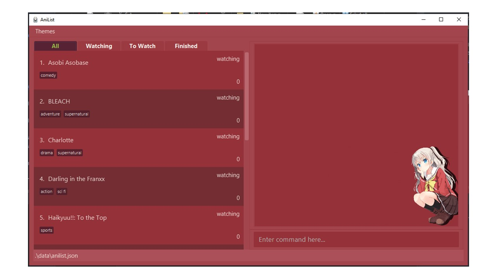

AniList is a desktop application made to be a single centralized location for anime lovers to keep track of all the animes they are interested in. In AniList, users will be able to keep track of animes that they are watching, wanting to watch or even animes that they have finished. Users will also be able to get statistics on their watching habits such as number of episodes watched and the genre distribution of their current list of animes.

AniList is optimized for use via a Command Line Interface (CLI) while still having the benefits of a customizable Graphical User Interface (GUI). If you are a fast typist, AniList can get your anime management tasks done FASTER than traditional GUI applications!

* If you are interested in using AniList, head over to the [_Quick Start_ section of the **User Guide**](UserGuide.html#quick-start).
* If you are interested about developing AniList, the [**Developer Guide**](DeveloperGuide.html) is a good place to start.

**Acknowledgements**

* Libraries used: [JavaFX](https://openjfx.io/), [Jackson](https://github.com/FasterXML/jackson), [JUnit5](https://github.com/junit-team/junit5)
