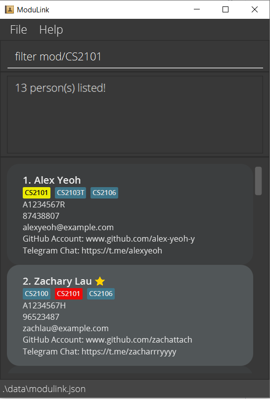

**ModuLink is a desktop-based application for Computer Science (CS) students at NUS to facilitate finding teammates for group-based modules.** While it has a GUI, most of the user interactions happen using a CLI (Command Line Interface).

* If you are interested in using ModuLink, head over to the [**User Guide**](UserGuide.html).
* If you are interested in learning how we developed ModuLink, the [**Developer Guide**](DeveloperGuide.html) is a good place to start.

**Acknowledgements**

* Libraries used: [JavaFX](https://openjfx.io/), [Jackson](https://github.com/FasterXML/jackson), [JUnit5](https://github.com/junit-team/junit5)
