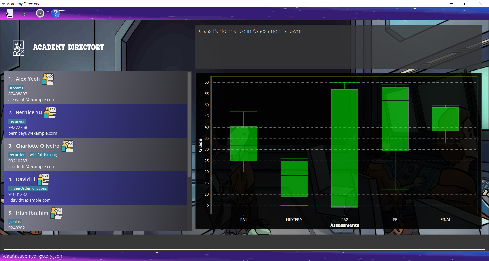

**Academy Directory is a desktop app for CS1101S tutors to manage their students.** Its main features are as follows:
- Manage students’ personal details
- Track students' grades, Studio attendance, and participation
- Visualize data in Academy Directory

Academy Directory runs on all major operating systems! It is optimized for use via a Command Line Interface (CLI) while still having the benefits of a Graphical User Interface (GUI).

## Site Map
* If you are interested in using AcademyDirectory, head over to our [**User Guide**](UserGuide.html).
* If you are interested in developing Academy Directory further, the [**Developer Guide**](DeveloperGuide.html) is a good place to start.

## Acknowledgements
- This project is based on the AddressBook-Level3 project created by the [SE-EDU initiative](https://se-education.org/).
- The formatting and content of the User Guide and Developer Guide is referenced from [AY2122S1-CS2103T-w17-1/tp](https://ay2122s1-cs2103t-w17-1.github.io/tp/).
- Design of the internal version control system is heavily inspired by [Git](https://github.com/git/git).
- Certain code implementations may have been inspired by [Baeldung tutorials](https://www.baeldung.com/) or [StackOverflow answers](https://stackoverflow.com)
- Application logo were designed with the assistance of [Tailor Brand](https://studio.tailorbrands.com/brands/6276554147/downloads) and [Adobe Spark](https://spark.adobe.com/express-apps/logo-maker/preview)
- Libraries used:
  - [JavaFX](https://openjfx.io/) for the amazing GUI
  - [Jackson](https://github.com/FasterXML/jackson) to save your data
  - [JUnit5](https://github.com/junit-team/junit5) so that we can deliver to you bug-free!
  - [MDFX](https://github.com/JPro-one/markdown-javafx-renderer) so that you can see User Guide in help without internet
- Background and icons used:
  - Source Academy classroom front page, taken from the [Asset page in Source Academy front-end](https://github.com/source-academy/frontend/tree/master/src/assets)
    License for reuse and distribution [here](https://github.com/source-academy/frontend/blob/master/LICENSE)
  - Slides Carnival background [here](https://www.slidescarnival.com/iris-free-presentation-template/3923)
  - External icons used on the UI
    - [Student icon](https://icons8.com/icon/iZBBn0SF22gW/programmer) taken from IconS8
    - [Grade icon](https://pngtree.com/freepng/test-papers-stationery-illustration_4652639.html) taken from PNGTree
    - [Statistic icon](https://pngtree.com/freepng/vector-statistics-icon_3782961.html) taken from PNGTree
