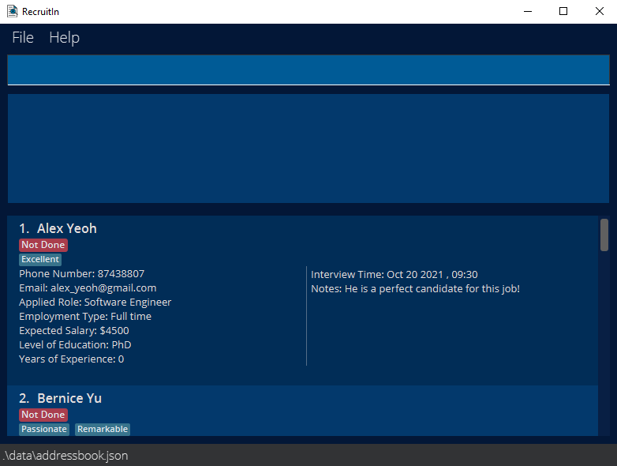

**RecruitIn is a desktop application created for tech savvy recruiters in Singapore who are looking to manage potential job candidates as contacts.** While it has a GUI, most of the user interactions happen using a CLI (Command Line Interface).

* If you are interested in using RecruitIn, head over to the [_Quick Start_ section of the **User Guide**](https://ay2122s1-cs2103t-f11-2.github.io/tp/UserGuide.html#quick-start).
* If you are interested about developing RecruitIn, the [**Developer Guide**](https://ay2122s1-cs2103t-f11-2.github.io/tp/DeveloperGuide.html) is a good place to start.

**Acknowledgements**

* Libraries used: [JavaFX](https://openjfx.io/), [Jackson](https://github.com/FasterXML/jackson), [JUnit5](https://github.com/junit-team/junit5)
