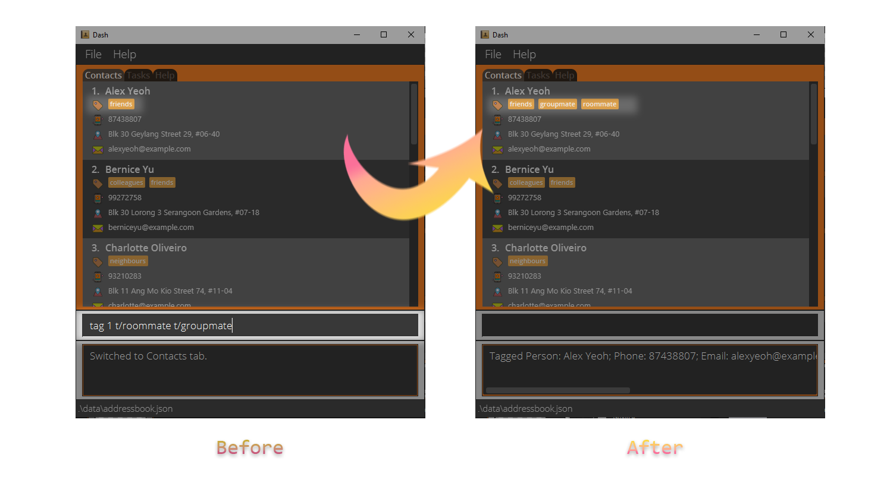

### Project: Dash

Dash is a desktop application that acts as a Dashboard for managing your contacts and tasks.
Dash operates using a CLI (Command Line Interface) but has a GUI made with JavaFX. 
It is written in Java, and has about 11 kLoC.

Given below are my contributions to the project.

* **Code contributed**: [RepoSense link](https://nus-cs2103-ay2122s1.github.io/tp-dashboard/?search=W15&sort=groupTitle&sortWithin=title&timeframe=commit&mergegroup=&groupSelect=groupByRepos&breakdown=true&checkedFileTypes=docs~functional-code~test-code~other&since=2021-09-17&tabOpen=true&tabType=authorship&tabAuthor=e0543860&tabRepo=AY2122S1-CS2103T-W15-2%2Ftp%5Bmaster%5D&authorshipIsMergeGroup=false&authorshipFileTypes=docs~functional-code~test-code&authorshipIsBinaryFileTypeChecked=false)


* **Enhancements implemented**:
  * Tab System
    * To facilitate handling a contacts and a task list, the app needed a way to display them separately
      to give the user a cleaner user experience.
    * Implemented using JavaFX's TabPane class. Each tab hosts one GridPane which then stores the tab's respective UI 
      components within the grid, maintaining encapsulation. GridPanes are utilised to ensure the width ratio of multiple lists remains constant
      regardless of resizing of the window.
    * Implemented minimised contacts list next to the task list to support the assign command.
    * A decision was made to disable navigation of the TabPane's tabs by disabling clicking and up/down arrow keys as it
      difficult to register the clicks/arrow keys and funnel them as commands without breaking the structure of the
      project. In the end however, our group thought this was a reasonable compromise as our app was meant to be used as
      a CLI application and one-letter shortcuts to change tabs were added to compensate.
    * Currently, it has 3 tabs but can be scaled up to support more tabs if necessary by simply adding more tabs to the 
      current TabPane.
    
  * Enhanced Find Command (for both contacts and task list)
    * Improved on the default AB3 find command to find for keywords for specific fields (eg. phone number, email, etc). 
    * The AB3 implementation of Find was only limited to the Name only so only one field needed to be checked. To support
      multiple fields being checked, we adopted the descriptor subclass used for the Edit command and repurposed it to fit 
      the Find command. 
    * Instead of collating the edited fields and replacing them in the contact/task, the specified 
      fields in the Find command will be converted into a predicate, and multiple predicates will then be combined into 
      a singular predicate which will be applied onto the filtered list of persons/tasks.
    * For fields that require a reference to the contact list such as assign, an integer will be parsed and referenced to
      the contacts list, and the contact's name as a string will be used as the keyword to compare against the list of assignees.

  * UI enhancements within the app
    * Added icons beside each field and changed color scheme.
    * Tasks marked as complete are greyed out visually and this was achieved by using the Image and ImageView classes of 
      JavaFX to change the icons to a desaturated version when a task is marked as complete.
    * Created scrollable list on the Help Tab to view available commands.


* **Contributions to team-based tasks**:
  * Contributed to discussion and finalising of user stories and use cases.
  * Created app logo and app banner that is displayed in the user guide.
  * Took screenshots of app for showcase.


* **Reviewing/Mentoring Contributions**:
  * Reviewed and contributed bug reports to group T13-3: [GitHub link](https://github.com/e0543860/ped/issues)

<div style="page-break-after: always;"></div>

* **Documentation**:
  * User Guide:
    * Added all of the diagrams illustrating the features. Some examples are shown below:
    
    
    * Contributed to the write-ups of the Find commands for contacts and tasks. Excerpt shown below:
      
      #### Finding task through task description: [find]

       :orange_book: If you want to find a task through its description, the _Find Command_ can find all tasks with descriptions that match the
       search term.

       The above screenshot demonstrates how you can use the _Find Command_ to find all tasks in your task list with
       the word "PR" in its task description.

       :page_with_curl: Format: ```find DESCRIPTION```

       :grey_question:
      * The search is case-insensitive. e.g. `find job` will match `Job`.
      * The order of the keywords does not matter. e.g. `find home work` will match `work home`
      * Only the description field is searched.
      * Task descriptions matching all keywords will be returned (i.e. AND search).
        e.g. ```Math Quiz``` will return only ```Math Quiz``` and ```Math Quiz 8```.
        It will not return ```Math Assignment```, ```GEQ Quiz```, or ```This doesn't matter```.

<div style="page-break-after: always;"></div>

* Developer Guide:
  * Updated the Ui class diagram:
    
  * Completed the write-up for how tab changing works.
  * Added sequence and activity diagrams for changing of tabs:
    
    
    * Below is an excerpt from the write-up: 

The tab system is implemented using the JavaFX `javafx.scene.control.Tab` class. It is
encapsulated in its own class `TabMenu` within the `dash.ui` package as a UI component.

Additionally, it expands the number of parsers from `ContactsTabParser` to have a `TasksTabParser`
and `HelpTabParser` to allow for a different list of commands to be parsed per tab/page.

The following commands are implemented:
* `SwitchTabContactsCommand`
  * `SwitchTabTasksCommand`
  * `SwitchTabHelpCommand`

The following operations are implemented:
* `MainWindow#handleHelp()`
  * `MainWindow#handleSwitchContactsTab()`
  * `MainWindow#handleSwitchTasksTab()`
    These operations handle the switching of tabs within the MainWindow class.

Here is an example of how the tab system works:

Step 1: The user launches the application. By default, the contacts
tab will be shown.

Step 2: The user adds a contact by using the `add` command. The `LogicManager` object is passed the command and
parses the command using the `ContactsTabParser` since it is on the contacts page and hence uses the contacts parser.

Step 3: The user decides to switch to the task tab by entering the command: `task`. The command follows a similar
path like in Step 2.

Step 4: The commandResult object returned after execution indicates that the user wants to switch to the Task tab and
the method `handleSwitchTasksTab()` is called.

Step 5: The method first calls the `switchTab()` method within `TabMenu`, which directs the UI
to switch to the selected tab index (1 for the Tasks tab). Then, it calls `setTabNumber` within `LogicManager` so
the `LogicManager` can keep track of the current tab, and use 1 out of the 3 parsers to fit the tab the user is on.

Step 6: The user attempts to add a contact by using the same `add` command. However, since Step 5 has recorded the tab
number inside `LogicManager` to be 1, the `LogicManager` detects that the user is still on the Task tab and hence uses
the `TaskTabParser` to parse the `add` command.

Step 7: The `TaskTabParser` returns an `AddTaskCommand` instead of an `AddPersonCommand`.
