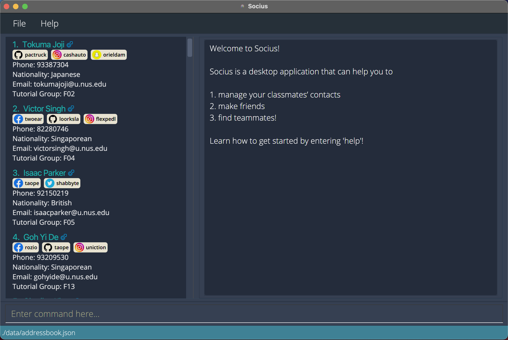

## Project: Socius

### 1 About the project

Socius is a contact management desktop application used for CS2103T module takers. Socius is a platform to help students
find potential project group mates for CS2103T. The user interacts with it using a CLI, and it has a GUI created with
JavaFX. Socius is written in Java, and has about 12 kLoC.

A screenshot of Socius is shown below:

### 2 Code contributed

Click on the following link to view the code that I have contributed to the project:

* [RepoSense](https://nus-cs2103-ay2122s1.github.io/tp-dashboard/?search=&sort=groupTitle&sortWithin=title&since=2021-09-17&timeframe=commit&mergegroup=&groupSelect=groupByRepos&breakdown=false&tabOpen=true&tabType=authorship&tabAuthor=bklimey&tabRepo=AY2122S1-CS2103T-W08-4%2Ftp%5Bmaster%5D&authorshipIsMergeGroup=false&authorshipFileTypes=docs~functional-code~test-code~other&authorshipIsBinaryFileTypeChecked=false)

### 3 New features and enhancements added

The following describes the enhancements and new features that I have added to the project.

#### 3.1 Add gender field to a person (Feature)
* What it does: allows the user to view the gender of a person.
* Justification: The product is catered towards CS2103T students for finding group members and having a good mix of gender is encouraged in the course. Having a good mix of gender could also enhance group dynamics. Therefore, gender is an important piece of information for students.
* Highlights: This enhancement affects existing commands and commands to be added in the future. The implementation was challenging as it required changes to the core Person model which lead to many changes to other classes that relied on the Person model, such as commands and GUI. Test cases and test data also have to be updated accordingly.

#### 3.2 Add social handles field to a person (Feature)
* What it does: allows the user to view the social handles (e.g. Telegram handle) of a person.
* Justification: This allows user to contact and know more about a person via different social platforms. For example, if a user wants to know about a person's coding style, he/she may go to the person's GitHub portfolio. If a user wants to know about a person's lifestyle, he/she could visit the person's Facebook or Instagram page.
* Highlights: This enhancement was done in two iterations, where the first iteration only supports a single social handle and second iteration added support for more social handles. Editing social handle is cumulative, so that users will not have to retype all the social handles everytime they are edited.

#### 3.3 Add icons for both gender and social handles (Feature)
* What it does: displays the gender and social handle platform as icons instead of text.
* Justification: This feature improves the user experience of the product as user can see the gender and social handle platform more easily.
* Highlights: This enhancement required knowledge how the GUI works.

### 4 Contributions to Documentations

#### 4.1 About Us
* Draft up the documentations for AboutUs, including roles and responsibilities of each member.

#### 4.2 User Guide (UG)
* Drafted introduction message
* Added symbol table for showing meaning of each symbol
* Added Parameter Constraints section [\#152](https://github.com/AY2122S1-CS2103T-W08-4/tp/commit/8cf9d1bac3b303969c6add98268416a866e8eefc)
* Formatted Command Summary
* Add `Command History` section [\#257](https://github.com/AY2122S1-CS2103T-W08-4/tp/commit/99bcf580e1b4907e9f4ac7ca0d3dd11ea1e5cacf)

#### 4.3 Developer Guide (DG)
* Added implementation details and UML diagrams for the `Support for more social handle` section. [\#272](https://github.com/AY2122S1-CS2103T-W08-4/tp/pull/272)
* Formatted User Stories [\#48](https://github.com/AY2122S1-CS2103T-W08-4/tp/commit/69ecc51961c28884426f7df9819f3cb4b75ad5dc)

### 5 Contributions to team-based tasks
* Help to create and publish releases `v1.3` - `v1.4` (5 releases) on GitHub.
* Help to create demo screenshots and videos of features for `Socius v1.2` and `Socius v1.3`.
* Help to create minutes for team meetings .
* Help to create sample data (~50 entries) that is used to test the program, and create screenshots for demo and documentation.

### 6 Other contributions
* PRs reviewed (with non-trivial review comments): [\#51](https://github.com/AY2122S1-CS2103T-W08-4/tp/pull/51), [/#124](https://github.com/AY2122S1-CS2103T-W08-4/tp/pull/124)
