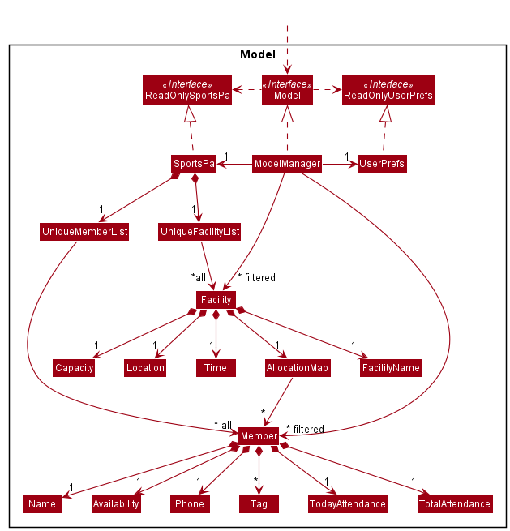
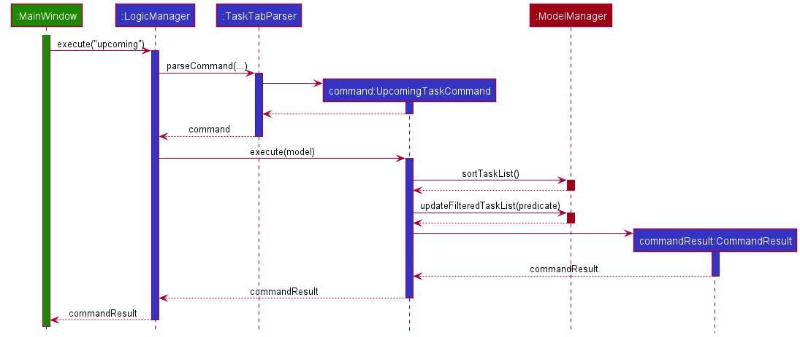

### Project: Dash

Dash is a desktop application that acts as a Dashboard for managing your contacts and tasks.
Dash operates using a CLI (Command Line Interface) but has a GUI made with JavaFX.
It is written in Java, and has about 11 kLoC.

Given below are my contributions to the project.

* **Code contributed**: [RepoSense link](https://nus-cs2103-ay2122s1.github.io/tp-dashboard/?search=&sort=groupTitle&sortWithin=title&timeframe=commit&mergegroup=&groupSelect=groupByRepos&breakdown=true&checkedFileTypes=docs~functional-code~test-code~other&since=2021-09-17&tabOpen=true&tabType=authorship&tabAuthor=hanif-kamal&tabRepo=AY2122S1-CS2103T-W15-2%2Ftp%5Bmaster%5D&authorshipIsMergeGroup=false&authorshipFileTypes=docs~functional-code~test-code&authorshipIsBinaryFileTypeChecked=false)

* **Project management**:
  - Code Quality
    - Ensured that code is readable
    - Ensured that code follows the given
      [coding standard](https://se-education.org/guides/conventions/java/intermediate.html)
    - Ensured that variables and methods are named appropriately
  - Documentation
    - Ensured that public methods have JavaDoc comments and that these comments are readable.
    - Ensured that the User Guide and Developer Guide are up to standard

* **New Feature**: Added the ability to complete tasks
* **New Feature**: Added the ability to [view upcoming tasks](https://ay2122s1-cs2103t-w15-2.github.io/tp/DeveloperGuide.html#implemented-listing-upcoming-tasks)
    - **What it does**: Allows the user to view all incomplete tasks that are upcoming, in chronological
      order
    - **Justification**: This feature greatly improves the user's task management because they are able to conveniently
      view exactly what they need to get done, and since the tasks are ordered in terms of urgency, it helps them decide
      much faster too.
    - **Highlights**: This feature involved a bit of design consideration in deciding the logic for the chronological 
      ordering of tasks dictated in `TaskDateAfterCurrentDatePredicate.java` and the `Comparator` in 
      `TaskList#sortTasks()`. It was not straightforward because of the design of `TaskDate.java`, which 
      simultaneously allows for tasks to have no date/time, a date but no time, and both date and time.
  
* **Enhancements to existing features**:
  - Laid early groundwork for Dash to accept task functionality
    - Adapted `UniquePersonList.java` to create `TaskList.java`
    - Adapted `Person.java` to create `Task.java`
    - Added tags to tasks
  - Created `CompletionStatus.java` to keep track of task completion 

* **Team-based Tasks**
  - Set up the GitHub team org
    - Added team members to developers team
  - Set up the GitHub repo
    - Enabled issue tracker
    - Enabled GitHub Actions
    - Set up codecov  
    - Set up project website
    - Created team PR [#99](https://github.com/nus-cs2103-AY2122S1/tp/pull/99)
    - Protected master branch
    - Updated CI status badge
  - Refactored a large portion of AB-3 code to fit Dash [#120](https://github.com/AY2122S1-CS2103T-W15-2/tp/pull/120/)
  - Wrote test code to increase coverage
    - Changed `CommandTestUtil.java` and created `EditTaskDescriptorBuilder.java` to accommodate tasks
    - Wrote JUnit tests for various classes [#147](https://github.com/AY2122S1-CS2103T-W15-2/tp/pull/147),
      [#154](https://github.com/AY2122S1-CS2103T-W15-2/tp/pull/154)
  
      
* **Documentation**:
  * User Guide:
    - Rewrote the Tasks section under Features to be more user-friendly 
    - Vetted the Features section to ensure that documented behaviour is accurate
    - Ensured consistency between sections
    
  * Example extract:
    
>#### Viewing all upcoming tasks: `upcoming`
>
>:orange_book: If you want to view all of your upcoming tasks, you can use the _Upcoming_ command. Upcoming tasks are
incomplete tasks whose Date/Time are after the current Date/Time.
>
>:camera: The above screenshot shows how the _Upcoming_ command is used to view all incomplete tasks after the current
>Date/Time. In this example, it was 25 October 2021, 09:16 PM.
>
>
>:page_with_curl: Format: `upcoming`
>
>:scroll: Notes:
>
>* Filters your task list so that upcoming tasks will be listed in chronological order.
>* The current Date/Time is determined locally by your system clock.
>
>

>
>:bulb: This command will reorder your task list, even after you remove the filter with
>the _List_ command.
>Completed tasks will appear first, so it's convenient to use
>the _Cleardone_ command next!
>
>
 

  * Developer Guide:
    - Updated Requirements section
      - Product Scope, User Stories, Use Cases, NFRs
    - Updated implementation of Model section, including the Model class diagram 
      
    - Added implementation details of `upcoming` command
  * Example extract:
>### \[Implemented\] Viewing all Upcoming Tasks
>
>With the implementation of `TaskDate.java`, we can easily look up upcoming tasks by comparing dates and times.
>
>#### Implementation
>
>In `UpcomingTaskCommand.java`, a field of type `Predicate<Task>` named `TaskDateAfterCurrentDatePredicate` is used to
>encapsulate the logic of determining whether or not a task is upcoming. It contains fields that store the current date
>and time via `LocalDateTime.now()`, and the current date via `LocalDate.now()`. The overridden
>`Predicate#test(Task task)` method first filters out completed tasks. It then checks if the `task.TaskDate` object has
>a date, then if it has a date but no time, and finally whether it has both date and time.
>
>When `UpcomingTaskCommand.execute(Model model)` is called by `LogicManager`,
>`Model#sortTaskList()` is called which sorts the task list chronologically, with the use of a `Comparator` to define
>an ordering between tasks by comparing `TaskDates`. `UpcomingTaskCommand` then calls
>`Model#updateFilteredTaskList(Predicate<Task> predicate)`, which filters out the upcoming tasks and updates the viewable
>`ObservableList<Task>`.
>
>The user is then able to view their upcoming tasks, in chronological order.
>
>A sequence diagram is provided below:
>
>
>#### Alternative Considered and Design Considerations
>* Changing the syntax of the `upcoming` command to include a number i.e. `upcoming 7` to indicate upcoming tasks in the
>  next 7 days.
>  * Pros: More specific, limits the scope of viewable tasks which would help usability.
>  * Cons: Not immediately clear what unit of time the number would represent.
>    On one hand, it would be too limiting if we as developers decided the unit of time, and on the other hand it would
>    be too clunky to have the user define it themselves.
>
>  * Conclusion: It was decided that implementing sort functionality into the `upcoming` command would sufficiently
>    improve its usability, without imposing unnecessarily longer syntax upon the user, which would decrease the speed at
>    which they would be able to operate. This would go against Dash's primary design goal of prioritizing speed.
* **Community**:
  - Reported bugs and suggestions for other teams in the class (examples: 
    [1](https://github.com/AY2122S1-CS2103-F09-4/tp/issues/170), 
    [2](https://github.com/AY2122S1-CS2103-F09-4/tp/issues/164),
    [3](https://github.com/AY2122S1-CS2103-F09-4/tp/issues/145))

