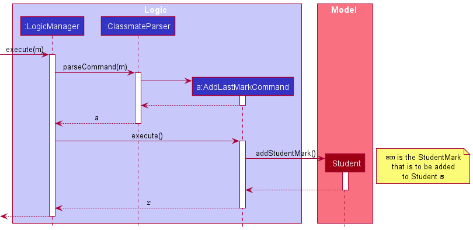
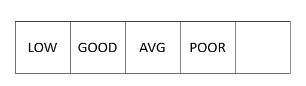

### Project: ClassMATE

ClassMATE is a desktop application designed for instructors of the CS2101 Module in NUS to easily store class and student details. The user interacts with it using a CLI, and it has a GUI created with JavaFX. It is written in Java, and has about 10 kLoC.

Given below are my contributions to the project.

* **Code contributed**: [RepoSense link](https://nus-cs2103-ay2122s1.github.io/tp-dashboard/#breakdown=true&search=juliussneezer04)
* **Enhancements Implemented**:
  * Allowing TutorialClasses to be stored easily in memory as a JSON list
    * Creating UniqueTutorialClassList.
    * Modifying JSON file storage structure to accommodate the list of Tutorial Classes.
    * Modifying all relevant test cases and test case data accordingly.
* **New Features Implemented**:
  * Adding Student Marks functionality
    * Creating Enumeration of Student Marks.
    * Adding a special list of student marks to each Student.
    * Allowing addition at end-of-list, deletion at end-of-list, and deletion of all marks in list operations.
    * Changed 26 files in the process (adding Test Case Classes for each command).
    * Displaying marks for each student in decreasing order in `viewstu` window.
      * Challenge was in increasing `viewstu` window size and decorating the marks in order.
* **Documentation**:
  * Contributions to User Guide:
    * Added documentation for the features `save` and `find` [\#74]([Adding extra pictures and changing names. by juliussneezer04 · Pull Request #74 · AY2122S1-CS2103T-W15-1/tp (github.com)](https://github.com/AY2122S1-CS2103T-W15-1/tp/pull/74))
    * Modifying Quick Start in UG [\#139]([Improving User Guide by juliussneezer04 · Pull Request #139 · AY2122S1-CS2103T-W15-1/tp (github.com)](https://github.com/AY2122S1-CS2103T-W15-1/tp/pull/139))
    * Adding screenshots and explanations of icons to UG [\#144](https://github.com/AY2122S1-CS2103T-W15-1/tp/pull/144)
    * Added documentation for student marks commands in UG [\#153](https://github.com/AY2122S1-CS2103T-W15-1/tp/pull/153)
  * Developer Guide:
    * Documentation regarding Student Marks functionality implementation. [\#127](https://github.com/AY2122S1-CS2103T-W15-1/tp/pull/127), [\#146](https://github.com/AY2122S1-CS2103T-W15-1/tp/pull/146)
    * Adding Diagrams for Student Marks functionality. [\#127](https://github.com/AY2122S1-CS2103T-W15-1/tp/pull/127), [\#133](https://github.com/AY2122S1-CS2103T-W15-1/tp/pull/133) (Sequence Diagram Shown in Appendix A)
    * Adding Use Cases for Student Marks functionality. [\#132](https://github.com/AY2122S1-CS2103T-W15-1/tp/pull/132)
* **Team-based Tasks**:
  * Set up the GitHub Team organisation and repo
    * Added master branch protection.
    * Created Developers' organisation for team.
  * Managing scheduling & tracking for upcoming releases `v1.1` - `v1.4` (4 releases) on GitHub
  * Assigning Issues and Tasks to team members in Repo's Projects
  * Released v1.2 and v1.3 JAR releases.
  * Set up all Repo Projects for each iteration.
  * Set up and tracked Milestones 1.1, 1.2, 1.3, 1.4
  * Recorded Demo Videos for ClassMATE Demos.
* **Review Contributions**:
  * PRs reviewed (with non-trivial reviews) [\#155]([Update User Guide by GabrielWLM · Pull Request #155 · AY2122S1-CS2103T-W15-1/tp (github.com)](https://github.com/AY2122S1-CS2103T-W15-1/tp/pull/155)),

#### Appendix A (Contributions to the Developer Guide)

Sequence Diagram added to Developers' Guide:

Student Marks State Diagram before/after operation `deletelm`:

*Before* :

*After* :

