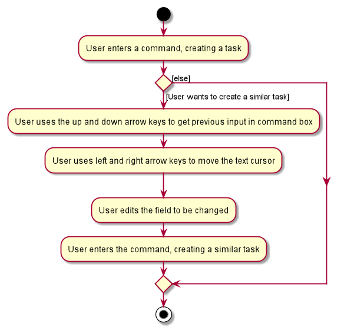
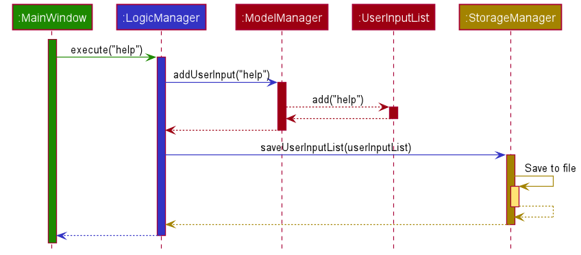

### Project: Dash

Dash is a desktop application that acts as a Dashboard for managing your contacts and tasks. 
Dash operates using a CLI (Command Line Interface) but has a GUI made with JavaFX. 
It is written in Java, and has about 11 kLoC.

Given below are my contributions to the project.

* **Code contributed**: [RepoSense link](https://nus-cs2103-ay2122s1.github.io/tp-dashboard/?search=&sort=groupTitle&sortWithin=title&since=2021-09-17&timeframe=commit&mergegroup=&groupSelect=groupByRepos&breakdown=false&tabOpen=true&tabType=authorship&tabAuthor=jyrw&tabRepo=AY2122S1-CS2103T-W15-2%2Ftp%5Bmaster%5D&authorshipIsMergeGroup=false&authorshipFileTypes=docs~functional-code~test-code&authorshipIsBinaryFileTypeChecked=false)

* **Project management**
  - Code Quality
    - Ensured that code is readable
    - Ensured that code follows the given 
      [coding standard](https://se-education.org/guides/conventions/java/intermediate.html)
    - Ensured that variables and methods are named appropriately
  - Documentation
    - Ensured that public methods have JavaDoc comments and that these comments are readable.
    - Ensured that the User Guide and Developer Guide are up to standard

* **New Features**:
  - Implemented editing of tasks
    - Adapted EditPersonCommandParser into EditTaskCommandParser to parse edit commands on the task tab
    - Adapted EditPersonCommand into EditTaskCommand
  - Implemented using the up/down arrow keys to select previous user inputs
    - Updated `LogicManager` to update the `Model` with the user input when the input results in a valid command
    - Added `UserInputList` in `Model` to store and maintain user input data.
    - Added various classes and interfaces to `Storage` to facilitate saving user inputs between sessions.
  
* **Documentation**:
    * User Guide: 
      - Handled front matters for User Guide such as the Introduction and Quick Start sections 
      - Added icons to increase readability
      - Rewrote the Contacts section under Features to be more user-friendly
      - Vetted the Features section to ensure that documented behaviour is accurate
      - Ensured consistency between sections and made other cosmetic improvements
      
      Example extract:
>     
> Editing contact details: `edit`
>
> :orange_book: If you want to modify the details of a specific contact, you can use the _Edit_ command.
>
>:camera: The above screenshot shows how the _Edit_ command can be used to edit the phone number and email of a contact.
>
>:page_with_curl: Format: `edit INDEX [n/NAME] [p/PHONE_NUMBER] [e/EMAIL] [a/ADDRESS] [t/TAG]...`
>
>:scroll: Notes:
>
>* Edits the contact at the specified `INDEX`.
>  * The `INDEX` refers to the position of the contact in the displayed contact list as indicated by the number next to
>    their name.
>  * The `INDEX` must be a positive integer (1, 2, 3,...).
>* At least one of the optional fields must be provided.
>* Existing values will be updated to the input values.
>* When editing tags, the existing tags of the contact will be removed i.e. adding of tags is not cumulative.
>  * To add tags without removing existing tags, refer to the Tag command in the [next section](#tagging-a-contact-tag).
>
>

>
>:bulb: You can remove all tags from a contact by typing `edit INDEX t/`.
>
>

  * Developer Guide:
    - Updated Acknowledgements section
    - Updated implementation of Storage section, including the Storage class diagram 
      
    - Added implementation details of using up/down arrow keys to select previous user inputs
  
    Example extract:
> ### \[Implemented\] Using the Up/Down Arrow Keys to Select Previous User Inputs
>
>An implemented improvement to the text-based input method is to allow users to easily reenter previously inputted
>commands by retrieving their past inputs to the CLI using the up and down arrow keys. We feel that this is a subtle
>feature which greatly improves the speed and usability of the app.
>
>Suppose the user is on the Tasks tab. The following activity diagram illustrates a possible workflow for a user
>entering tasks, and shows how the workflow is enhanced by this feature.
>
>
>
>A concrete example would be when a user wants to add two tasks with descriptions "CS2100 Tutorial 7" and "CS2100
>Tutorial 8" to their task List. Instead of typing out a near-identical command for the second task, they could press
>the up arrow key, access their previously entered commmand and change '7' to '8'.
>
>Another example use case would be when a user accidentally deletes an entry in Dash by entering the wrong index. As
>long as the entry was added within the past 10 commands, the user can press the up arrow key until the command that
>corresponds to adding that entry is set in the command box. The user can then simply press enter to add the entry again.
>
>#### Implementation
>
>The implementation involves adding a new class `UserInputList` to `Model`. When a user enters an input in the command
>box, the `UserInputList` is updated in `LogicManager` if this user input results in a valid command execution. The
>following sequence diagram shows how the `UserInputList` is updated when the valid input `help` is entered while not
>already on the help tab. It also shows how `Storage` is updated. Details related to command parsing and execution are
>omitted.
>
>
>
>Since the storage of the`UserInputList` is very similar to the storage of the `TaskList` and `AddressBook`,
>implementation details are not shown above. In summary, when the app is started, a `UserInputList` is constructed using
>the `userinputlist.json` file in the `data` folder. Conversely, when the app is closed, the `userinputlist.json` file
>is updated using the `UserInputList`.
>
>On startup and after any successful command execution, the `CommandBox` is reinitialised with an updated list of user
>input strings from the `Model`.
>
>In order to allow the user to look through their past inputs to select a particular one, we must keep track of which
>input string the CLI is currently displaying. This is implemented in `CommandBox` by keeping track of the index of the
>string being displayed within the list of input strings. When the up or down arrow keys are pressed, `CommandBox`
>increments or decrements the index, retrieves the new string corresponding to it, and displays it.
>
>#### Alternatives Considered and Design Considerations
>
>- Keeping track of different lists of user inputs for different tabs
>
>We decided against keeping track of different lists of user inputs corresponding to commands on different tabs. We
>judged the benefits of this feature to be minimal and not worth the extra complexity in `Model` and `Storage`.
>Moreover, we would have to make an arbitrary decision on where to store the user inputs corresponding to switching
>tabs.
>
>- Storing the index of the list in `Model`
>
>Due to the fact that the index should reset between uses of the app, we decided that there is not need to store the
>index of the currently in-focus user input in `Model` or `Storage`. The index can safely be reset to 0 upon input of a
>command or upon opening the app.
>
>- Storing user inputs that are invalid
>
>We decided not to store user inputs that are invalid due to the current behaviour of the text box: when an invalid
>input is entered, the input remains in the text box with a red font. In the case of a typo, since the user can easily
>modify this previous input, there seems to be no need to store it.
>
>- Storing more user inputs
>
>The current implementation only stores 10 past user inputs. We decided to put a cap on the number of inputs stored due
>to concerns about performance when the user input list is updated. This cap is set in `UserInputList` as
>`LIST_MAX_LENGTH`. If, in testing, we find that a higher cap could be more convenient for users, this value can easily
>be changed.

* **Community**:
  - Reported bugs and suggestions for other teams in the class (examples: 
    [1](https://github.com/AY2122S1-CS2103T-W08-2/tp/issues/221), 
    [2](https://github.com/AY2122S1-CS2103T-W08-2/tp/issues/215),
    [3](https://github.com/AY2122S1-CS2103T-W08-2/tp/issues/206))
