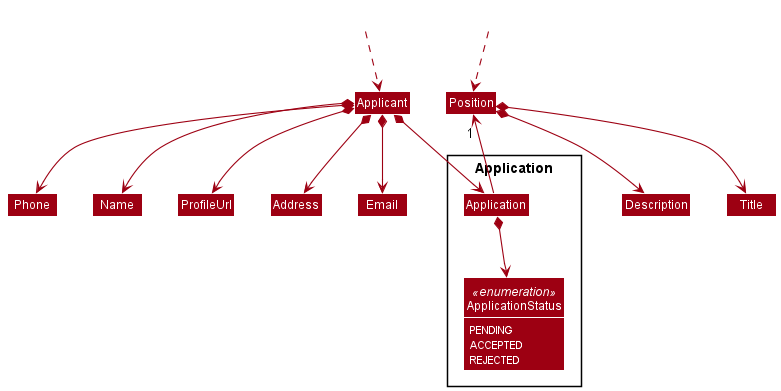
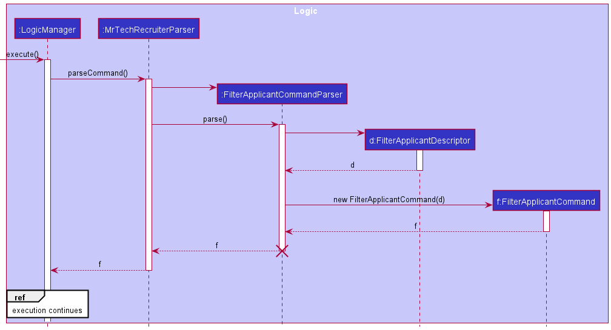
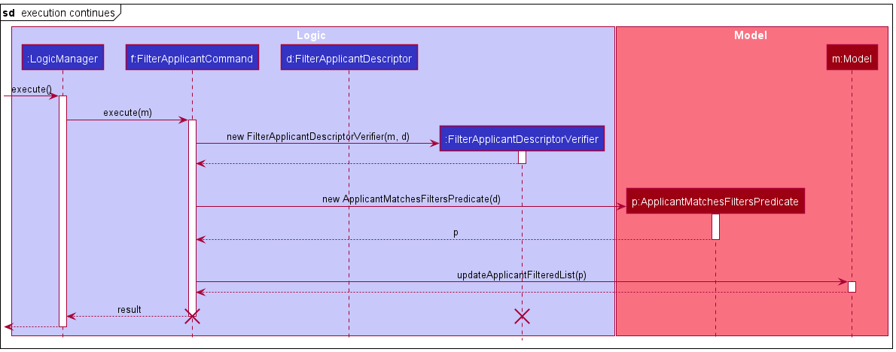
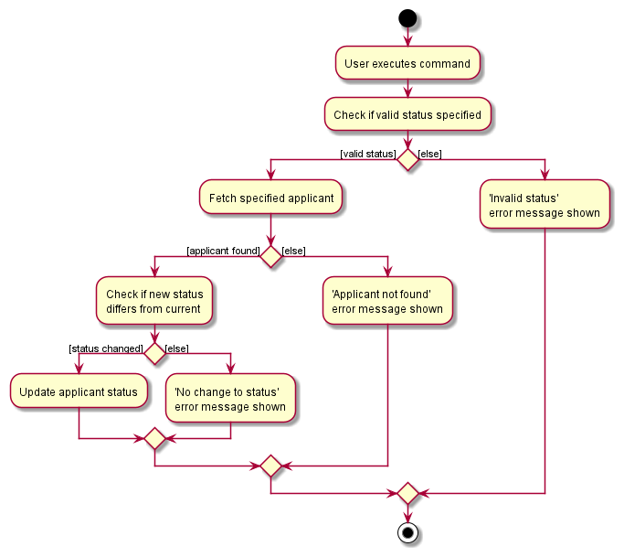
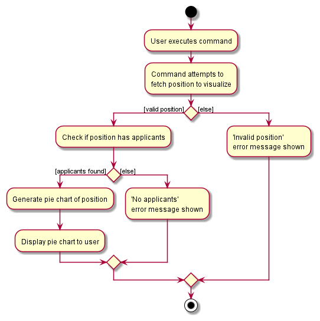
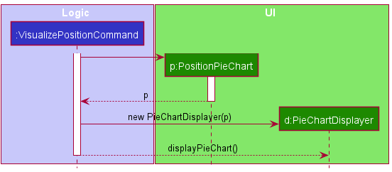

## Project: MrTechRecruiter

### **Overview**
MrTechRecruiter (MTR) is a desktop applicant management application designed for tech companies to keep track of job applicants.
The user interacts with it using a CLI, and it has a GUI created with JavaFX. It is written in Java, and has about 10 kLoC.

### **Summary of Contributions**

#### **Code contributed**: [RepoSense link](https://nus-cs2103-ay2122s1.github.io/tp-dashboard/?search=LMAOboxhack&sort=groupTitle&sortWithin=title&since=2021-09-17&timeframe=commit&mergegroup=&groupSelect=groupByRepos&breakdown=false&tabOpen=true&tabType=authorship&tabAuthor=LMAOboxhack&tabRepo=AY2122S1-CS2103-F10-1%2Ftp%5Bmaster%5D&authorshipIsMergeGroup=false&authorshipFileTypes=docs~functional-code~test-code~other&authorshipIsBinaryFileTypeChecked=false)

#### **Enhancements implemented**
* Added the feature to filter applicants [PR: [\#83](https://github.com/AY2122S1-CS2103-F10-1/tp/pull/83)]
  * **What it does**: Allows the user to filter applicants in the system based on various criteria.
  * **Justification**: A filter feature is essential in helping the user in identifying suitable applicants that match certain criteria, especially when dealing with a high volume of applicants.
  * **Highlights**:
    * Making the feature scalable so that future developers can easily add more filter criteria with minimal additions to the code.
    * Parsing a variable number of filtering criteria from the user into a single, unified condition.

* Added the feature to visualize job positions with a pie chart [PR: [\#106](https://github.com/AY2122S1-CS2103-F10-1/tp/pull/106)]
  * **What it does**: Allows the user to a position & its applicants' statuses as a pie chart.
  * **Justification**: Gives the user a quick, visual overview of a position, which is crucial when dealing with large volumes of applicants/positions, as it is hard to get an overall sense from the detailed list view alone.
  * **Highlights**:
    * Processing MTR data into the format required by the PieChart API.
    * Created a lightweight component used to display a pie chart on the UI, written with *reusability* (extensible to future iterations of the feature, e.g. pie chart of all applicants) and *maintainability* (minimal dependencies, no separate FXML file) in mind.

* Added the feature to update applicant's application statuses [PR: [\#108](https://github.com/AY2122S1-CS2103-F10-1/tp/pull/108)]
  * **What it does**: Allows the user to easily update applicants' statuses.
  * **Justification**: As users are likely to frequently update applicant statuses, providing a dedicated command for this (separate from the 'edit' command) helps streamline user workflow.
  * **Highlight**: Multiple levels of input validation (e.g. specified applicant exists, specified status is valid, specified status is different from current status)

* Added `Application` class to model the relationship between applicants and positions [PRs: [\#81](https://github.com/AY2122S1-CS2103-F10-1/tp/pull/81), [\#92](https://github.com/AY2122S1-CS2103-F10-1/tp/pull/92)]
  * **Highlights**: 
    * Modeling the complex relationship between applicants and positions & preserving immutability of all classes involved.
    * Added the `ApplicationStatus` enum to reflect an applicant's status & associated methods for serialization & deserialization.

* Added logic to the model for interactions between applicants and positions [PRs: [\#53](https://github.com/AY2122S1-CS2103-F10-1/tp/pull/53), [\#67](https://github.com/AY2122S1-CS2103-F10-1/tp/pull/67), [\#194](https://github.com/AY2122S1-CS2103-F10-1/tp/pull/194)]
  * **Highlight**: Capturing the interactions that arise from having two interdependent entities in the model (e.g. when a position is deleted, additional steps need to be taken to delete the applicants to that position, to avoid applicants to an already-deleted position).

* Wrote tests for existing features to increase coverage [PRs: [\#81](https://github.com/AY2122S1-CS2103-F10-1/tp/pull/81), [\#92](https://github.com/AY2122S1-CS2103-F10-1/tp/pull/92), [\#194](https://github.com/AY2122S1-CS2103-F10-1/tp/pull/194)]

#### **Contributions to the UG**
* Added initial UG skeleton [PR: [\#24](https://github.com/AY2122S1-CS2103-F10-1/tp/pull/24)]
* Updated quick start screenshot, added documentation for `filter-applicant`, `visualize` and `mark` commands to the 'Features' and 'Command Summary' sections [PRs: [\#108](https://github.com/AY2122S1-CS2103-F10-1/tp/pull/108), [\#118](https://github.com/AY2122S1-CS2103-F10-1/tp/pull/118)]

#### **Contributions to the DG**
* Added product scope, NFRs, glossary, contributed to user stories, use cases [PR: [\#24](https://github.com/AY2122S1-CS2103-F10-1/tp/pull/24)]
* Added `Applicant` and `Position` classes to the 'Design' section [PR: [\#200](https://github.com/AY2122S1-CS2103-F10-1/tp/pull/200)]
* For the `filter-applicant`, `visualize` and  `mark` commands: [PR: [\#200](https://github.com/AY2122S1-CS2103-F10-1/tp/pull/200)]
  * Added explanations & UML diagrams (of different types) to the 'Implementation' section
  * Added to the 'Instructions for manual testing'

#### **Contributions to team-based tasks**
* Setup of GitHub team org & repo
* Repo maintenance (Proper tagging of issues, milestone management, linking issues to PRs, etc.)
* Renaming of packages [PR: [\#59](https://github.com/AY2122S1-CS2103-F10-1/tp/pull/59)] (Scrapped due to potential complications)
* Setup of tools: GitHub Pages (for product website), GitHub Actions (for CI), Gradle

#### **Review contributions**
* Significant PR reviews: [Review of \#50](https://github.com/AY2122S1-CS2103-F10-1/tp/pull/50#pullrequestreview-785391113), [Review of \#81](https://github.com/AY2122S1-CS2103-F10-1/tp/pull/81#pullrequestreview-783478563), [Review of \#111](https://github.com/AY2122S1-CS2103-F10-1/tp/pull/111#pullrequestreview-790827571)

### **Contributions to the Developer Guide (Extracts)**:
  

### **Contributions to the User Guide (Extracts)**:

---

### Visualizing a position with a pie chart: `visualize`

Displays a pie chart breakdown of a position and the statuses of its applicants.
Hovering over a pie chart slice will display its percentage value.

Format: `visualize POSITION_TITLE​`

* `POSITION_TITLE` is case-insensitive. e.g. `visualize software engineer` will display the pie chart for the position `SOFTWARE ENGINEER`.

---

### Filtering applicants: `filter-applicant`

Filter the list of applicants by specific criteria.

Format: `filter-applicant [pos/POSITION] [status/STATUS]​`

* The position filter is case-sensitive. e.g. `software engineer` will not match `Software Engineer`
* The status filter is case-insensitive. e.g. `accepted` or `ACCEPTED` will both match the `"Accepted"` application status.
* A variable number of filters can be specified, but at least one must be present.
* The filtering uses a logical `AND`. e.g. `filter-applicant pos/software engineer status/accepted` will match all applicants applying to the `software engineer` position AND with application status `"Accepted"`.
* Consecutive calls are independent of one another (i.e. the filters do not stack).

Examples:
* `filter-applicant status/rejected` displays a list of all rejected applicants.
* `filter-applicant pos/database administrator status/accepted` displays a list of all applicants to the `database administrator` position, that have been accepted.

---

### Updating an applicant's status: `mark`

Updates an applicant's status as specified.

Format: `mark NAME status/STATUS`

* `NAME` is case-sensitive. e.g. `john doe` and `John Doe` will update separate applicants' statuses.
* `STATUS` is case-insensitive. e.g. `accepted` and `ACCEPTED` will both update the applicant's status to `"Accepted"`.
* Note: Possible statuses are `ACCEPTED`, `REJECTED` or `PENDING`.

Examples:
* `mark john doe status/rejected` marks the applicant `John Doe` with status `"Accepted"`.

---

## Command summary

| Action                      | Format, Examples                                                                                                      |
| --------------------------- | --------------------------------------------------------------------------------------------------------------------- |
| **Filter Applicants**       | `filter-applicant [pos/POSITION] [status/STATUS]​`  e.g., `filter-applicant pos/software engineer status/accepted` |
| **Update Applicant status** | `mark NAME status/STATUS`   e.g.,  `mark john doe status/accepted`                                                 |
| **Visualize Positions**     | `visualize POSITION_TITLE​`  e.g., `visualize database administrator`                                              |
