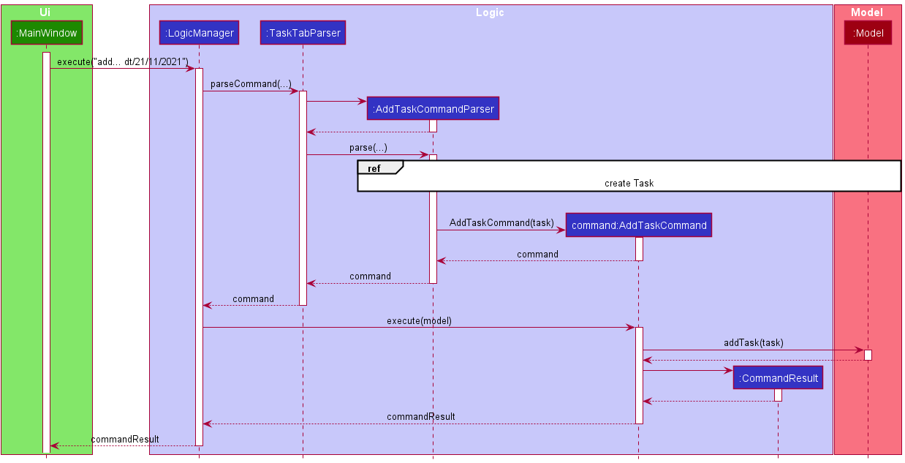
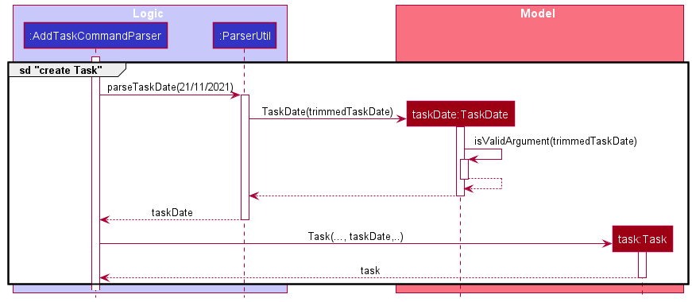

### Project: Dash

Dash is a desktop application that acts as a Dashboard for managing your contacts and tasks.
Dash operates using a CLI (Command Line Interface) but has a GUI made with JavaFX.
It is written in Java, and has about 11 kLoC.

Given below are my contributions to the project.

* **Code contributed**: [RepoSense link](https://nus-cs2103-ay2122s1.github.io/tp-dashboard/?search=myat&sort=groupTitle&sortWithin=title&since=2021-09-17&timeframe=commit&mergegroup=&groupSelect=groupByRepos&breakdown=false&tabOpen=true&tabType=authorship&tabAuthor=NUSmhk&tabRepo=AY2122S1-CS2103T-W15-2%2Ftp%5Bmaster%5D&authorshipIsMergeGroup=false&authorshipFileTypes=docs~functional-code~test-code&authorshipIsBinaryFileTypeChecked=false)

* **Project management**:
  - Testing
    - Responsible for ensuring testing of project is done properly and on time.
    - Ensure additional test cases are added and automated tests work as intended.
    - Manual testing of app thoroughly.
        - Detected important dependency-related bugs and reported to the Team Lead for assigning.
        - Determined the cause of various bugs and update findings to all team members.
        
* **New Feature**:
  - Implemented the ability to add Tasks and save them onto hard drive.
    - Adapted AddPersonCommand into AddTaskCommand.
    - Adapted AddPersonCommandParser into AddTaskCommandParser.
    - Implemented saving Task List to Storage as an additional .json file which involves making changes to Storage class.
  - Implemented Date/Time system.
    - A Task can either have a Date, a Date and Time or none.
    - Implemented TaskDate class to allow storing Date and Time inside individual tasks. It can also have
      none of the two through the use of Java Class Optional<T>.
    - Implemented parsing of user input Date and Time string into TaskDate objects. It is implemented in a way
      that allows users to input several stated formats of Date and Time according to user's preference. Proper
      error handling is input to reject invalid Dates and Times, including invalid Dates due to leap year. If only
      Time is stated by user, current Date is added in.
    - Enhanced EditTaskCommand to allow editing of Date and Time where user can edit Date and Time individually
      or both at once.
  - Implemented the ability to clear all completed Tasks.
    - Implemented ClearDoneTaskCommand.
    
* **Documentation**:
  - User Guide:
    - Added `cleardone` command usage.
    - Updated existing commands that involves usage of Date/Time.
    - Added section explaining the handling of Date and Time of tasks with different available formats
    
    Example Extract:
>#### <u>Handling Date and Time of tasks</u>
>
>

>
>**:information_source: Notes about specifying date and time:** 
>A task can optionally have a Date, or both a Date and a Time.
>
>`add [dt/DATE] [dt/TIME] [dt/DATE, TIME]`
>
>* When only Date is specified in the `add` command, a task will only have the specified Date.
>* When only Time is specified in the `add` command, a task will have today's Date and the specified Time.
>* When both Date and Time are specified in the `add` command, a task will have both of the specified Date and Time.
>
>`edit [dt/DATE] [dt/TIME] [dt/DATE, TIME]`
>
>* When only Date is specified in the `edit` command, a task will only have its Date changed to the specified Date.
>* When only Time is specified in the `edit` command, a task will only have its Time changed to the specified Time.
>* When both Date and Time are specified in the `edit` command, a task will have both of its Date and Time changed to the specified Date and Time.
>
>**:warning: Multiple date and time parameters:** 
>If a parameter is expected only once in the command, but you specified it multiple times, only the last occurrence of the parameter will be taken. 
>e.g. if you specify `dt/12/02/2021 dt/1900`, only `dt/1900` will be taken.
>
>

>
>#### Date Formats
>
>Format | Example
>--------|------------------
>**dd/MM/yyyy** | `02/10/2021`
>**dd-MM-yyyy** | `02-10-2021`
>**yyyy/MM/dd** | `2021/10/02`
>**yyyy-MM-dd** | `2021-10-02`
>**dd MMM yyyy** | `02 Oct 2021` (First letter of Month must be capitalised)
>
>#### Time Formats
>
>Format | Example
>--------|------------------
>**HHmm** | `1300` (01:00 PM in 24-hour notation)
>**hh:mm a** | `10:00 PM`, `02:00 AM` (AM and PM must be capitalised)

  - Developer Guide:
    - Added implementation details of Date/Time system
    - Updated Instructions for Manual Testing section

    Example Extract: 
>### \[Implemented\] Adding Date/Time to Tasks
>
>To add onto our new task list system, just like how the address book allows storing of additional information like
>phone number and email, the user can now add in a task's date with an optional time information. The addition of
>date/time as a new type of information to be stored opens the door to more functionalities such as listing upcoming
>tasks and finding tasks based on date/time.
>
>Possible use cases:
>- Adding date/time of a task that is due at the specified date and time.
>- Adding date/time of a task that the user wants to start working on at the specified date and time.
>
>#### Implementation
>
>The `TaskDate.java` class is created to represent a date/time object of a task, which is stored inside a `Task` object
>upon creating a `Task` through an `add` command. Inside `TaskDate.java` class, date and time are represented by Java
>class objects `LocalDate` and `LocalTime`. As the user can choose to either omit both date and time or have time as optional
>information, both of these objects are wrapped in Java `Optional` objects as `Optional<LocalDate>` and `Optional<LocalTime>`.
>This makes handling of a `TaskDate` object safer as the date and time objects do not exist in a `Task` which the user adds
>in without stating date/time information.
>
>The user is also required to follow a specific date and time format which the validity is checked by `DateTask#isValidTaskDate`.
>Java `LocalDate#parse` and `LocalTime#parse` are used to help verify validity of the format keyed in by the user.
>
>Example usage of `add` command to add date/time is as follows:
>- `add d/Homework dt/21/11/2021` - Adds a task "Homework" that is due on 21/11/2021 at an unspecified time.
>- `add d/Tutorial dt/1600` - Adds a task "Tutorial" that starts at 4:00 PM with date as that current day.
>- `add d/Event dt/25/10/2021, 10:00 AM` - Adds a task "Event" that starts at the given date and time.
>
>A sequence diagram is provided below that shows how TaskDate class works when the command "add d/Homework dt/21/11/2021"
>is entered. The details of the **create Task** interactions have been omitted from the diagram for clarity:
>
>
>The omitted details are shown below in a separate sequence diagram:
>
>
>The following activity diagram summarises what happens when a user executes an add command with date and/or time:
>
>
>#### Design considerations:
>
>**Aspect: How to store date and time in TaskDate:**
>
>* **Alternative 1 (current choice):** Uses `LocalDate` and `LocalTime` to store date and time respectively.
>    * Pros: More flexibility and better abstraction as both can be handled separately. Less complex to implement.
>    * Cons: More methods and code are needed to handle the different types of Object separately which results in
>      methods with similar code.
>
>* **Alternative 2:** Uses `LocalDateTime` to store date and time together.
>    * Pros: Less code and methods to handle one Object type and it also results in easier implementation of
>      comparison methods between two `LocalDateTime` objects.
>    * Cons: Less flexibility and more tedious to check different combinations of DateTime formats.
>
* **Community**:
  * Assisted other team in finding bugs and suggesting alternatives (examples: [1](https://github.com/AY2122S1-CS2103T-T11-4/tp/issues/152),
  [2](https://github.com/AY2122S1-CS2103T-T11-4/tp/issues/133), [3](https://github.com/AY2122S1-CS2103T-T11-4/tp/issues/125))

